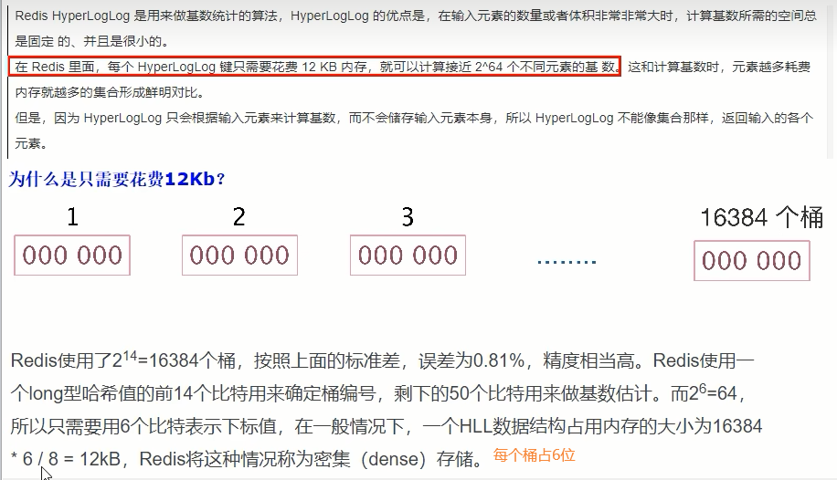
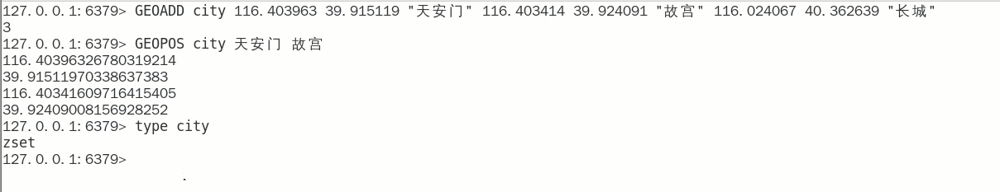
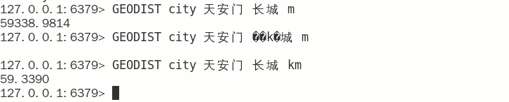

# 第5章-案例落地实战bitmap、hyperloglog、GEO
## 5.1 面试题

1. 抖音电商直播，主播介绍的商品有评论，1个商品对应了一系列的评论，排序+展现+取前10条记录

2. 用户在手机APP上的签到打卡信息：1天对应一系列用户的签到记录，新浪微博、钉钉打卡签到，来没来如何统计

3. 应用网站上的网页访问信息：一个网页对应一系列的访问点击，淘宝网首页，每天有多少人浏览首页

4. 公司系统上线后，说一下UV、PV、DAU分别是多少？

<font color = 'red'>记录对集合中的数据进行统计</font>

在移动应用中，需要统计每天的新增用户数和第2天的留存用户数；

在电商网站的商品评论中，需要统计评论列表中的最新评论；

在签到打卡中，需要统计一个月内连续打卡的用户数；

<font color = 'blue'>在网页访问记录中，需要统计独立访客（Unique Visitor. uV）量。</font>

痛点：

类似今日头条、抖音、淘宝这样的额用户访问级别都是亿级的，请问如何处理?

<font color = 'red'>需求痛点</font>

亿级数据的收集+清洗+统计+展现

一句话：存的进+取得快+多维度展现

真正有价值的是统计

## 5.2 统计的类型

### 5.2.1 亿级系统中，常见的四种统计

- 聚合统计

  - 统计多个集合元素的聚合结果，就是前面讲解过的<font color='red'>交差并等集合统计</font>

  - 复习命令

    

  - 交差并集和聚合函数的应用

- 排序统计

  抖音短视频最新评论留言的场景，请你设计一个展现列表。（考察数据结构和设计思路）

  设计案例和回答思路：

  <font color='blue'>以抖音vcr最新的留言评价为案例，所有评论需要两个功能，按照时间排序(正序、反序)+分页显示能够排序+分页显示的redis数据结构是什么合适?</font>

  zset

  

  在面对需要展示最新列表、排行榜等场景时，如果数据更新频繁或者需要分页显示，建议使用ZSet

- 二值统计

  集合元素的取值就只有0和1两种。在钉钉上签到打卡的场景中，我们只用记录有签到(1)或没有签单(0)

  见bitmap

- 基数统计

  指统计一个集合中<font color='red'>不重复的元素个数</font>

  见HyperLogLog


## 5.3 HyperLogLog

### 5.3.1 名词、行话谈资

- 什么是UV

  Unique Visitor，独立访客，一般理解为客户端IP

  <font color='red'>需要去重考虑</font>

- 什么是PV

  Page View，页面浏览量

  不用去重

- 什么是DAU

  Daily Active User，日活跃量用户，<font color='red'>登录或者使用了某个产品的用户数（去重复登录的用户）</font>

  常用于反映网站、互联网应用或者网络游戏的运营情况

- 什么是MAU

  Monthly Active User，月活跃用户量

### <font color='red'>5.3.2 看需求</font>

* 很多计数类场景，比如每日注册IP数、每日访问IP数、页面实时访问数PV、访问用户数UV等。

* 因为主要的目标高效、巨量地进行计数，所以对存储的数据的内容并不太关心。也就是说它只能用于统计巨量数量，不太涉及具体的统计对象的内容和精准性。

* 统计单日一个页面的访问量(PV)，单次访问就算一次。

* 统计单日一个页面的用户访问量(UV)，即按照用户为维度计算，单个用户一天内多次访问也只算一次。

* 多个key的合并统计，某个门户网站的所有模块的PV聚合统计就是整个网站的总PV。

### 5.3.2 是什么(基础篇写过)

- 基数：是一种数据集，去重复后的真实个数

  案例

  

- 取重复统计功能的基数估算算法-就是HyperLogLog

  

- 基数统计

  用于统计一个集合中不重复的元素个数，就是对集合去重复后剩余元素的计算

- 一句话：脱水后的真实数据

### 5.3.3 HyperLogLog如何做的，如何演化出来的？

**基数统计就是HyperLogLog**

**去重复统计你先会想到哪些方式？**

- HashSet

- bitmap

  如果数据是较大亿级统计,使用bitmaps同样会有这个问题。

  bitmap是通过用位bit数组来表示各元素是否出现，每个元素对应一位，所需的总内存为N个bit。

  基数计数则将每一个元素对应到bit数组中的其中一位，比如bit数组010010101(按照从零开始下标，有的就是1、4、6、8)。新进入的元素只需要将已经有的bit数组和新加入的元素进行按位或计算就行。这个方式能大大减少内存占用且位操作迅速。

  But，假设一个样本案例就是一亿个基数位值数据，一个样本就是一亿
  如果要统计1亿个数据的基数位值，<font color='red'>大约需要内存100000000/8/1024/1024约等于12M,内存减少占用的效果显著。这样得到统计一个对象样本的基数值需要12M</font>。

  如果统计1000个对象样本(1w个亿级),就需要117.1875G将近120G，可见使用bitmaps还是不适用大数据量下(亿级)的基数计数场景，<font color='red'>但是bitmaps方法是精确计算的。</font>

- 结论

  样本元素越多内存消耗急剧增大，难以管控+各种慢，对于亿级统计不太合适，量变引起质变

- 办法

  概率算法：

  <font color='red'>通过牺牲准确率来换取空间</font>，对于不要求<font color='blue'>绝对准确率</font>的场景下可以使用，因为<font color='red'>概率算法不直接存储数据本身</font>，通过一定的概率统计方法预估基数值，同时保证误差在一定范围内，由于又不储存数据故此可以大大节约内存.
  <font color='red'>HyperLogLog就是一种概率算法的实现。</font>

**原理说明**

- <font color='red'>只是进行不重复的基数统计，不是集合也不保存数据，只记录数量而不是具体内容</font>

- 有误差

  HyperLogLog提供不精确的去重计数方案

  <font color='red'>只牺牲准确率来换取空间，误差仅仅只是0.81%左右</font>

- 这个误差率如何来的？

  http://antirez.com/news/75

  Redis之父安特雷兹回答：

  


### 5.3.4 首页亿级UV的Redis设计方案

**需求**

UV的统计需要去重，一个用户一天内的多次访问只能算作一次

淘宝、天猫首页的UV，平均每天是1~1.5个亿

每天存1.5个亿的IP，访问者来了后先去查是否存在，不存在就加入

**方案讨论**

- 用MySQL，一个亿的数据，扛不住啊。。。高并发下，3000万的数据就需要分库分表了

- 用redis的hash结构存储

  

  redis——hash = <keyDay,<ip,1> >
  按照ipv4的结构来说明，每个ipv4的地址最多是15个字节(ip = "192.168.111.1"，最多XXX.XXX.XXX.XXX)
  某一天的1.5亿*15个字节=2G，一个月60G， redis死定了。太占内存了

- HyperLogLog

  

**代码**

确实有误差，反复写入，执行两遍，直接变成了402总数

```java
 public static  void initIp(){
        new Thread(()->{
            String ip = null;
            Random random = new Random();
            for (int i=0;i<200;i++){
                ip = random.nextInt(256)+"."+
                        random.nextInt(256)+"."+
                        random.nextInt(256)+"."+
                        random.nextInt(256)+".";
                try {
                    Jedis jedis = getJedis();
                    Long h11 = jedis.pfadd("h12", ip);
                    System.out.println("ip="+ip+",该ip地址访问首页的次数="+h11);
                    jedis.close();
                } catch (Exception e) {
                    e.printStackTrace();
                }
            }
            try {
                Jedis jedis = getJedis();
                System.out.println(getJedis().pfcount("h12"));
                jedis.close();
            } catch (Exception e) {
                e.printStackTrace();
            }
        }).start();
    }
```

## 5.4 GEO

### 5.4.1 Redis之GEO

#### 5.4.1.1 面试题简介


#### 5.4.1.2 地理知识

* 经纬度
  * 经度与纬度的合称组成一个坐标系统。又称为地理坐标系统，它是一种利用三度空间的球面来定义地球上的空间的球面坐标系统，能够标示地球上的任何一个位置。
* 经线和纬线
  * 是人们为了在地球上确定位置和方向的，在地球仪和地图上画出来的，地面上并线。
  * 和经线相垂直的线叫做纬线（纬线指示东西方向）。纬线是一条条长度不等的圆圈。最长的纬线就是赤道。
  * 因为经线指示南北方向，所以经线又叫子午线。国际上规定，把通过英国格林尼治天文台原址的经线叫做0°所以经线也叫本初子午线。在地球上经线指示南北方向，纬线指示东西方向。
  * 东西半球分界线：东经160°西经20°
* 经度和维度
  * 经度（longitude):东经为正数，西经为负数。东西经
  * 纬度（latitude):北纬为正数，南纬为负数。南北纬

#### 5.4.1.3 如何获取地址的经纬度

#### https://api.map.baidu.com/lbsapi/getpoint/index.html

#### 5.4.1.4 命令复习

- GEOADD 添加经纬度坐标

  

- GEOPOS返回经纬度

  

- GEOHASH返回坐标的geohash表示

  geohash算法生成的base32编码值，3维变2维变1维

  

- GEODIST两个位置之间的距离

  

- GEORADIUS

  以半径为中心，查找附近的XXX

  

- GEORADIUSBYMEMBE

  

### 5.4.2 附近酒店的推送

#### 5.4.2.1 需求分析

推送当前位置，指定范围内的酒店信息

#### 5.4.2.2 架构设计

Redis的新类型GEO


http://www.redis.cn/commands/geoadd.html

#### 5.4.2.3 编码实现

关键点：GEORADIUS，以给定的经纬度为中心，找出某一半径内的元素

```java
public string geoAdd() {
    Map<String，point> map = new HashMap<>();
    map.put("天安门", new Point( x: 116.403963, y: 39.915119));
    map.put("故宫", new point( x: 116.403414, y: 39.924091));
    map.put("长城", new Point( x: 116.024067, y: 40.362639));
    redisTemplate.opsForGeo().add(CITY,map);
    return map.tostring();
}

public Point position(string member){
    // 获取经纬度坐标,这里的member可以有多个，返回的list也可以有多个
    list<Point> list = redisTemplate.opsForGeo().position(CITY, member);
    return list.get(0);
}

public string hash(string member) {
    //geohash算法生成的base32编码值,这里的member可以有多个，返回的list也可以有多个
    List<string> list = redisTemplate.opsForGeo().hash(CITY,member);
    return list.get(o);
}

public Distance distance( string member1，string member2) {
    //获取两个给定位置之间的距离
    Distance distance = redisTemplate.opsForGeo().distance(CITY,member1,member2,RedisGeoCommands.DistanceUnit.KILOMETERS);
    return distance;
}

public GeoResults radiusByxy() {
    //通过经度，纬度查找附近的，北京王府井位置116.418017, 39.914402
    Circle circle = new Circle(116. 418017, 39 .914402, Metrics . KILOMETERS . getMultiplier());
    //返@50条:
    RedisGeoCommands.GeoRadiusCommandArgs args =
RedisGeoCommands.GeoRadiusCommandArgs.newGeoRadiusArgs().includeDistance().includeCoordinates().sortAscending().limit(50);
    GeoResults<RedisGeoCommands.GeoLocation<String>> geoResults=
this.redisTemplate.opsForGeo().radius(CITY, circle, args);
    return geoResults;
}

public GeoResults radiusByMember() {
    //通过地方查找附近
    String member="天安门";
    //返回50条
    RedisGeoCommands.GeoRadiusCommandArgs args = RedisGeoCommands.GeoRadiusCommandArgs.newGeoRadiusArgs().includeDistance().includeCoordinates( ).sortAscending().limit(5e) ;
    //半径10公里内
    Distance distance=new Distance(10，Metrics.KILOMETERS);
    GeoResults<RedisbeoCommands.GeoLocation<String>> geoResults= this.redisTemplate.opsForbeol().radius(CITY,member,distance,angs);
    return geoResults;
}
```

## 5.5 Bitmap
### 5.5.1 大厂真实案例

日活统计

连续签到打卡

最近一周的活跃用户

统计指定用户一年之中的登录天数

某用户按照一年365天，哪几天登陆过，哪几天没有登录？

### 5.5.2 是什么

由0和1状态表现的二进制位的bit数组


### 5.5.3 能干嘛

用于状态统计，Y、N类似AtomicBoolean

 **看需求：**

- 用户是否登录过Y、N，比如京东每日签到送京豆

- 电影、广告是否被点击播放过

- 钉钉打卡上下班，签到统计

### 5.5.4 京东签到领取京豆

- 需求说明

  ```tex
  签到日历仅展示当月签到数据
  签到日历需展示最近连续签到天数
  假设当前日期是20210618，且20210616未签到
  
  若20210617已签到且0618未签到，则连续签到天数为1
  
  若20210617已签到且0618已签到，则连续签到天数为2
  
  连续签到天数越多，奖励越大
  所有用户均可签到
  截至2020年3月31日的12个月，京东年度活跃用户数3.87亿，同比增长24.8%，环比增长超2500万，此外，2020年3月移动端日均活跃用户数同比增长46%假设10%左右的用户参与签到，签到用户也高达3千万。。。
  ```

- 小厂方法，传统MySQL方式

  - 建表语句

  ```sql
  CREATE TABLE user_sign
  keyid BIGINT NOT NULL PRIMARY KEY AUTO INCREMENT,
  user_key VARCHAR(200), #京东用户ID
  sign_date DATETIME,#签到日期(20220618)
  sign_count INT #连续签到天数
  
  INSERT INTO user_sign(user_key,sign_date,sign_count)
  VALUES ('28216618-XXXX-XXXX-XXXX-XXXXXXXXXXXX','2022-06-18 15:11:12',1);
          
  SELECT
  	sign_count
  FROM
  	user_sign
  WHERE 
  	user_key =20216618-XXXX-XXXX-XXXX-XXXXXXXXXXXX 
  	AND sign date BETWEEN '2020-06-17 00:00:00' AND '2020-06-18 23:59:59'
  ORDER BY
  	sign_date DESC
  	LIMIT 1;
  ```

  - 困难和解决思路

    方法正确但是难以落地实现。
    签到用户量较小时这么设计能行，但京东这个体量的用户(估算3000W签到用户，一天一条数据，一个月就是9亿数据)对于京东这样的体量，如果一条签到记录对应着当日签到记录，那会很恐怖......

    <font color='red'> 如何解决这个痛点?</font>

    1. 一条签到记录对应一条记录，会占据越来越大的空间。
    2. 一个月最多31天，刚好我们的int类型是32位，那这样一个int类型就可以搞定一个月，32位大于31天，当天来了就是1没来就是0。
    3. 一条数据直接存储一个月的签到记录，不再是存储一天的签到记录。

- 大厂方法，基于Redis的Bitmap实现签到日历

  建表-按位-redis-bitmap

  在签到统计时，每个用户一天的签到用1个bit位就能表示

  一个月(假设是31天)的签到情况用31个bit位就可以，一年的签到也只需要用365个bit位，根本不用太复杂的集合类型

### 5.5.5 命令复习


具体使用见基础篇

### 5.5.6 案例结合Bitmap类型签到+结合布隆过滤器实现


