# 第6章-布隆过滤器BloomFilter
## 6.1 面试总结

* 现有50亿个电话号码，给你10万个电话号码，如何要快速准确的判断这些电话号码是否已经存在？
* 判断是否存在，布隆过滤器了解过吗？
* 安全连接网址，全球数10亿的网址判断
* 黑名单校验，识别垃圾邮件
* 白名单校验，识别出合法用户进行后续处理

## 6.2 是什么

* 由一个初值都为零的bit数组和多个哈希函数构成，用来快速判断集合中是否存在某个元素

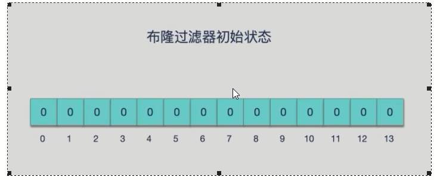

* 设计思想

  * 目的：减少内存占用；
  * 方式：不保存数据信息，只是在内存中做一个是否存在的标记flag
  * 本质就是判断具体数据是否存在于一个大的集合中

备注：布隆过滤器是一种<font color = 'red'>类似set的</font>数据结构，只是统计结果在<font color = 'green'>巨量数据下有点小瑕疵，不够完美</font>

* 布隆过滤器(英语: Bloom Filter) 是 1970 年由布隆提出的。
* 它实际上是一个很长的二进制数组(00000000)+一系列随机hash算法映射函数，主要用于判断一个元素是否在集合中。
* 通常我们会遇到很多要判断一个元素是否在某个集合中的业条场景，一般想到的是将集合中所有元素保存起来，然后通过比较确定。链表、树、哈希表等等数据结构都是这种思路。但是随着集合中元素的增加，我们需要的存储空间也会呈现线性增长，最终达到瓶颈。同时检索速度也越来越慢，上述三种结构的检索时间复杂度分别为O(n),0(logn),0(1)。这个时候隆过滤器 (Bloom Filter)就应运而生

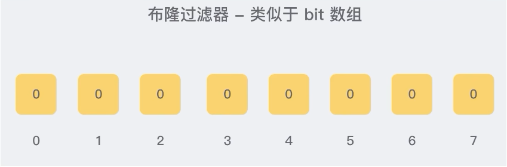

## 6.3 能干嘛-特点考点

* 高效地插入和查询，占用空间少，返回的结果是不确定性+不够完美

* 重点：<font color = 'red'>一个元素如果判断结果：存在时，元素不一定存在，但是判断结果为不存在时，则一定不存在。</font>

* 布隆过滤器可以添加元素，但是<font color = 'red'>不能删除元素，</font>由于涉及hashcode判断依据，删除元素会导致误判率增加。

* 小总结：有，是可能有；无，是肯定无；（可以保证的是，如果布隆过滤器判断一个元素不在一个集合中，那这个元素一定不会在集合中）

## 6.4 布隆过滤器原理

### 6.4.1 布隆过滤器原理和数据结构

- 原理

  * 布隆过滤器(Bloom Filter) 是一种专门用来解决去重问题的高级数据结构。

  * 实质就是<font color = 'red'>一个大型位数组和几个不同的无偏hash函数</font>(无偏表示分布均匀)。由一个初值都为零的bit数组和多个哈希函数构成，用来快速判断某个数据是否存在。但是跟 HyperLogLog 一样，它也一样有那么一点点不精确，也存在一定的误判概率

  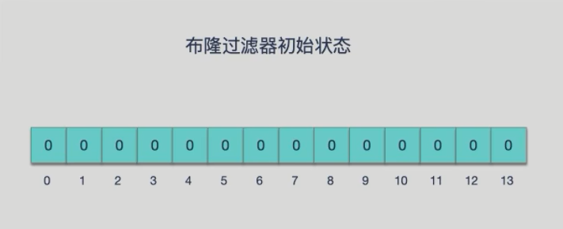

- 添加key、查询key

  * <font color = 'blue'>添加key时</font>
    使用多个hash函数对key进行hash运算得到一个整数索引值，对位数组长度进行取模运算得到一个位置，每个hash函数都会得到一个不同的位置，将这几个位置都置1就完成了add操作。

  * <font color = 'blue'>查询key时</font>
    只要有其中一位是零就表示这个key不存在，但如果都是1，则不一定存在对应的<font color = 'red'>key.结论:有，是可能有无，是肯定无</font>

- hash冲突导致数据不精准

  * 当有变量被加入集合时，通过N个映射函数将这个变量映射成位图中的N个点,把它们置为 1(假定有两个变量都通过 3 个映射函数)。

  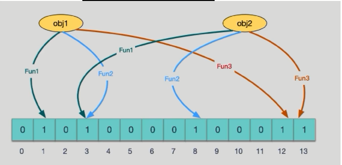

  * 查询某个变量的时候我们只要看看这些点是不是都是 1，就可以大概率知道集合中有没有它了

  * 如果这些点，<font color = 'red'>有任何一个为零则被查询变量一定不在，</font>
    如果都是 1，则被查询变量很<font color = 'red'>可能存在</font>，
    <font color = 'red'>为什么说是可能存在，而不是一定存在呢?那是因为映射函数本身就是散列函数，散列函数是会有碰撞的。 (见上图3号坑两个对象都1)</font>

  * 正是基于布隆过滤器的快速检测特性，我们可以在把数据写入数据库时，使用布隆过滤器做个标记。当缓布缺失后，应用查询数据库时，可以通过查询布隆过滤器快速判断数据是否存在。如果不存在，就不用再去据库中查询了。这样一来，即使发生缓存穿透了，大量请求只会查询Redis和布隆过滤器，而不会积压到数据库，也就不会影响数据库的正常运行。布隆过滤器可以使用Redis实现，本身就能承担较大的并发访问压力
  
- hash冲突导致数据不精准2

  ##### 哈希函数

  * 哈希函数的概念是：将任意大小的输入数据转换成特定大小的输出数据的函数，转换后的数据称为哈希值或哈希编码，也叫散列值

  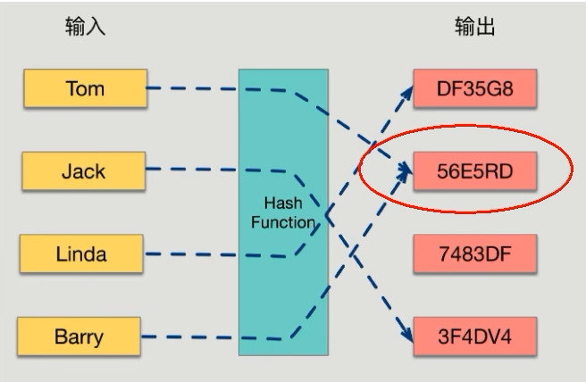

  * 如果两个散列值是不相同的(根据同一函数)那么这两个散列值的原始输入也是不相同的。这个特性是散列函数具有确定性的结果，具有这种性质的散列函数称为单向散列函数。

  * 散列函数的输入和输出不是唯一对应关系的，<font color = 'red'>如果两个散列值相同，两个输入值很可能是相同的，但也可能不同，</font>这种情况称为“散列碰撞 (collision)”。

  * 用 hash表存储大数据量时，空间效率还是很低，当只有一个 hash 函数时，还很容易发生哈希碰撞。

  ##### Java中hash冲突Java案例

  ```java
  public static void main(String[] args) {
      System.out.println("Aa".hashCode()); 
      System.out.println("BB".hashCode());
      
      System.out.println("柳柴".hashCode());
      System.out.println("柴柕".hashCode());
      
      Set<Integer> sets = new HashSet<>();
      int hashCode;
      for(int i = 0; i < 200000; i++) {
          hashCode = new Object().hashCode();
          if(sets.contains(hashCode)) {
              System.out.println("运行到第:"+i+"次出现hash冲突,hashcode: " + hashCode);
              continue;
          } 
          sets.add(hashCode);
      }
  }
  
  /**
  * 2112
  * 2112
  * 851553
  * 851553
  * 运行到第: 103993 次出现hash冲突,hashcode: 213440190
  * 运行到第: 109440 次出现hash冲突,nashcode: 651156501
  * 运行到第: 143624 次出现hash冲突,hashcode: 2038112324
  * 运行到第: 144557 次出现hash冲突,hashcode: 1164664992
  * 运行到第: 150537 次出现hash冲突,hashcode: 273791087
  * 运行到第: 179149 次出现hash冲突,hashcode: 996371445
  * 运行到第: 182462 次出现hash冲突,hashcode: 254720071
  * 运行到第: 185099 次出现hash冲突,hashcode: 1872358815
  */
  ```

### 6.4.2 使用3步骤

- 初始化bitmap

  * 布隆过滤器 本质上是由长度为 m 的位向量或位列表(仅包含 0或 1 位值的列表)组成，最初所有的值均设置为0

  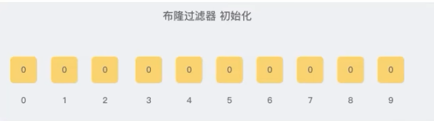

- 添加数据

  * 当我们向布降过滤器中添加数据时，为了尽量地址不冲突，<font color = 'red'>会使用多个 hash 函数对 key 进行运算</font>，算得一个下标索引值，然后对位数组长度进行<font color = 'red'>取模运算</font>得到一个位置，每个 hash 函数都会算得一个不同的位置。再把位数组的这几个位置都置为 1 就* 完成了 add 操作。

  * 例如，我们添加一个字符串wmyskxz，对字符串进行多次hash(key) -> 取模运行 -> 得到坑位

  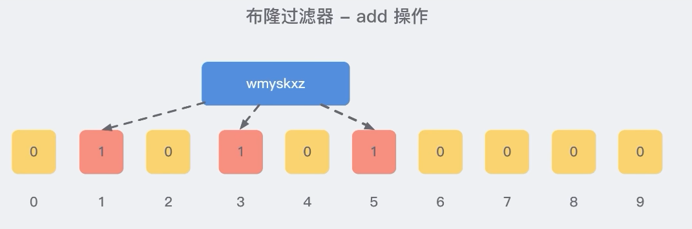

- 判断是否存在

  * 向布隆过滤器查询某个key是否存在时，先把这个 key 通过相同的<font color = 'red'>多个 hash 函数进行运算</font>，查看对应的位置是否都为 1，<font color = 'red'>只要有一个位为零，那么说明布隆过滤器中这个 key 不存在；</font>

  * <font color = 'red'>如果这几个位置全都是 1，那么说明极有可能存在；</font>

  * 因为这些位置的 1 可能是因为其他的 key 存在导致的，也就是前面说过的hash冲突。。。。。

  * 就比如我们在 add了字符串wmyskxz数据之后，很明显下面1/3/5 这几个位置的 1 是因为第一次添加的 wmyskxz 而导致的；

  * 此时我们查询一个没添加过的不存在的字符串inexistent-key，它有可能计算后坑位也是1/3/5，这就是误判了

  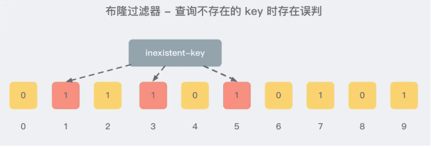

### 6.4.3 布隆过滤器误判率，为什么不要删除

* 布隆过滤器的误判是指多个输入经过哈希之后在相同的bit位置变成1了，这样就无法判断究竟是哪个输入产生的，因此误判的根源在于相同的 bit 位被多次映射且置 1。

* 这种情况也造成了布隆过滤器的删除问题，因为布隆过滤器的每一个 bit 并不是独占的，很有可能多个元素共享了某一位。如果我们直接删除这一位的话，会影响其他的元素

* 特性：布隆过滤器可以添加元素，但是不能删除元素。因为删掉元素会导致误判率增加。

### 6.4.4 小总结

- 是否存在：有，很很可能有；无是肯定无，100%无
- 使用时最好不要让实际元素数量远大于初始化数量，一次给够避免扩容
- 当实际元素数量超过初始化数量时，应该对布隆过滤器进行重建，重新分配一个size 更大的过滤器，再将所有的历史元素批量add进行

## 6.5 布隆过滤器的使用场景

### 6.5.1 解决缓存穿透的问题，和redis结合bitmap使用

* <font color = 'blue'>缓存穿透是什么</font>
  * 一般情况下，先查询缓存redis是否有该条数据，缓存中没有时，再查询数据库。
  * 当数据库也不存在该条数据时，每次查询都要访问数据库，这就是缓存穿透。
  * 缓存穿透带来的问题是，当有大量请求查询数据库不存在的数据时，就会给数据库带来压力，甚至会拖垮数据库。

* <font color = 'blue'>可以使用布隆过滤器解决缓存穿透的问题</font>
  * 把已存在数据的key存在布隆过滤器中，相当于redis前面挡着一个布隆过滤器。
  * 当有新的请求时，先到布隆过滤器中查询是否存在:
  * 如果布隆过滤器中不存在该条数据则直接返回;
  * 如果布隆过滤器中已存在，才去查询缓存redis，如果redis里没查询到则再查询Mysql数据库

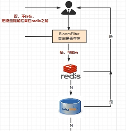

### 6.5.2 黑名单校验，识别垃圾邮件

* 发现存在黑名单中的，就执行特定操作。比如:识别垃圾邮件，只要是邮箱在黑名单中的邮件，就识别为垃圾邮件。

* 假设黑名单的数量是数以亿计的，存放起来就是非常耗费存储空间的，布隆过滤器则是一个较好的解决方案。

* 把所有黑名单都放在布隆过滤器中，在收到邮件时，判断邮件地址是否在布隆过滤器中即可。

### 6.5.3  安全连接网站，全球上10亿的网址判断。

## 6.6 手写布隆过滤器

### 6.6.1 <font color = 'red'> 结合bitmap类型手写一个简单的布隆过滤器，体会设计思想</font>

### 6.6.2 整体架构

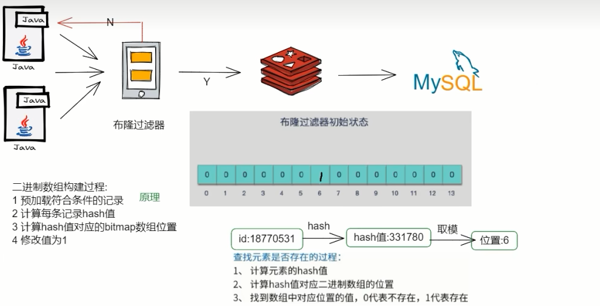

### 6.6.3 步骤设计

* redis的setbit/getbit

  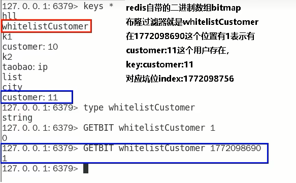

* setBit的构建过程
  * @PostConstruct初始化白名单数据
  * 计算元素的hash值
  * 通过上一步hash值算出对应的二进制数据的坑位
  * 将对应坑位的值修改为数字1，表示存在

* getbit查询是否存在
  * 计算元素的hash值
  * 通过上一步hash值算出对应的二进制数组的坑位
  * 返回对应坑位的值，零表示无，1表示存在

### 6.6.4 SpringBoot+Redis+mybatis案例基础与一键编码环境整合

* MyBatis通用Mapper4
  * mybatis-generator ： http://mybatis.org/generator/

  * MyBatis通用Mapper4官网 ： https://github.com/abel533/Mapper

  * 一键生成

    * t_customer用户表SQL

      ```sql
      CREATE TABLE `t_customer` (
        `id` int(20) NOT NULL AUTO_INCREMENT,
        `cname` varchar(50) NOT NULL,
        `age` int(10) NOT NULL,
        `phone` varchar(20) NOT NULL,
        `sex` tinyint(4) NOT NULL,
        `birth` timestamp NOT NULL DEFAULT CURRENT_TIMESTAMP ON UPDATE CURRENT_TIMESTAMP,
        PRIMARY KEY (`id`),
        KEY `idx_cname` (`cname`)
      ) ENGINE=InnoDB AUTO_INCREMENT=10 DEFAULT CHARSET=utf8mb4;
      ```

    * 建SpringBoot的module  mybatis_generator

    * 改pom

      ```xml
      <?xml version="1.0" encoding="UTF-8"?>
      <project xmlns="http://maven.apache.org/POM/4.0.0" xmlns:xsi="http://www.w3.org/2001/XMLSchema-instance"
      	xsi:schemaLocation="http://maven.apache.org/POM/4.0.0 https://maven.apache.org/xsd/maven-4.0.0.xsd">
      	<modelVersion>4.0.0</modelVersion>
      	<parent>
      		<groupId>org.springframework.boot</groupId>
      		<artifactId>spring-boot-starter-parent</artifactId>
      		<version>2.6.10</version>
      		<relativePath/> <!-- lookup parent from repository -->
      	</parent>
      
      	<groupId>com.luojia</groupId>
      	<artifactId>mybatis_generator</artifactId>
      	<version>0.0.1-SNAPSHOT</version>
      	<name>mybatis_generator</name>
      	<description>Demo project for Spring Boot</description>
      
      	<properties>
      		<project.build.sourceEncoding>UTF-8</project.build.sourceEncoding>
      		<maven.compiler.source>1.8</maven.compiler.source>
      		<maven.compiler.target>1.8</maven.compiler.target>
      		<java.version>1.8</java.version>
      		<hutool.version>5.5.8</hutool.version>
      		<druid.version>1.1.18</druid.version>
      		<mapper.version>4.1.5</mapper.version>
      		<pagehelper.version>5.1.4</pagehelper.version>
      		<mysql.version>5.1.39</mysql.version>
      		<swagger2.version>2.9.2</swagger2.version>
      		<swagger-ui.version>2.9.2</swagger-ui.version>
      		<mybatis.spring.version>2.1.3</mybatis.spring.version>
      	</properties>
      
      	<dependencies>
      		<dependency>
      			<groupId>org.springframework.boot</groupId>
      			<artifactId>spring-boot-starter-web</artifactId>
      		</dependency>
      		<!-- mybatis 通用mapper tk单独使用，自己到这版本号 -->
      		<dependency>
      			<groupId>org.mybatis</groupId>
      			<artifactId>mybatis</artifactId>
      			<version>3.4.6</version>
      		</dependency>
      		<!-- mybatis-spring -->
      		<dependency>
      			<groupId>org.mybatis.spring.boot</groupId>
      			<artifactId>mybatis-spring-boot-starter</artifactId>
      			<version>${mybatis.spring.version}</version>
      		</dependency>
      		<!-- mybatis Generator -->
      		<dependency>
      			<groupId>org.mybatis.generator</groupId>
      			<artifactId>mybatis-generator-core</artifactId>
      			<version>1.4.0</version>
      			<scope>compile</scope>
      			<optional>true</optional>
      		</dependency>
      		<!-- 通用mapper -->
      		<dependency>
      			<groupId>tk.mybatis</groupId>
      			<artifactId>mapper</artifactId>
      			<version>${mapper.version}</version>
      		</dependency>
      		<!-- persistence -->
      		<dependency>
      			<groupId>javax.persistence</groupId>
      			<artifactId>persistence-api</artifactId>
      			<version>1.0.2</version>
      		</dependency>
      		<dependency>
      			<groupId>org.projectlombok</groupId>
      			<artifactId>lombok</artifactId>
      			<optional>true</optional>
      		</dependency>
      		<dependency>
      			<groupId>org.springframework.boot</groupId>
      			<artifactId>spring-boot-starter-test</artifactId>
      			<scope>test</scope>
      			<exclusions>
      				<exclusion>
      					<groupId>org.junit.vintage</groupId>
      					<artifactId>junit-vintage-engine</artifactId>
      				</exclusion>
      			</exclusions>
      		</dependency>
      	</dependencies>
      
      	<build>
      		<resources>
      			<resource>
      				<directory>${basedir}/src/main/java</directory>
      				<includes>
      					<include>**/*.xml</include>
      				</includes>
      			</resource>
      			<resource>
      				<directory>${basedir}/src/main/resources</directory>
      			</resource>
      		</resources>
      		<plugins>
      			<plugin>
      				<groupId>org.springframework.boot</groupId>
      				<artifactId>spring-boot-maven-plugin</artifactId>
      				<configuration>
      					<excludes>
      						<exclude>
      							<groupId>org.projectlombok</groupId>
      							<artifactId>lombok</artifactId>
      						</exclude>
      					</excludes>
      				</configuration>
      			</plugin>
      			<plugin>
      				<groupId>org.mybatis.generator</groupId>
      				<artifactId>mybatis-generator-maven-plugin</artifactId>
      				<version>1.3.6</version>
      				<configuration>
      					<configurationFile>${basedir}/src/main/resources/generatorConfig.xml</configurationFile>
      					<overwrite>true</overwrite>
      					<verbose>true</verbose>
      				</configuration>
      				<dependencies>
      					<dependency>
      						<groupId>mysql</groupId>
      						<artifactId>mysql-connector-java</artifactId>
      						<version>${mysql.version}</version>
      					</dependency>
      					<dependency>
      						<groupId>tk.mybatis</groupId>
      						<artifactId>mapper</artifactId>
      						<version>${mapper.version}</version>
      					</dependency>
      				</dependencies>
      			</plugin>
      		</plugins>
      	</build>
      </project>
      ```

    * 写YML，本次不需要

  * mgb配置相关src/main/resource路径下新建

  config.properties

  ```properties
  # t_customer 表包名
  package.name=com.luojia.redis7
  
  jdbc.driverClass = com.mysql.jdbc.Driver
  jdbc.url = jdbc:mysql://localhost:3306/jmall
  jdbc.user = root
  jdbc.password = 123
  ```

  ```xml
  <?xml version="1.0" encoding="UTF-8"?>
  <!DOCTYPE generatorConfiguration
          PUBLIC "-//mybatis.org//DTD MyBatis Generator Configuration 1.0//EN"
          "http://mybatis.org/dtd/mybatis-generator-config_1_0.dtd">
  
  <generatorConfiguration>
      <properties resource="config.properties"/>
  
      <context id= "Mysql" targetRuntime="MyBatis3Simple" defaultModelType="flat" >
          <property name="beginningDelimiter" value="`" />
          <property name="endingDelimiter" value="`" />
  
          <plugin type="tk.mybatis.mapper.generator.MapperPlugin">
              <property name="mappers" value= "tk.mybatis.mapper.common.Mapper" />
              <property name="caseSensitive" value="true" />
          </plugin>
  
          <jdbcConnection driverClass="${jdbc.driverClass}"
                          connectionURL="${jdbc.url}"
                          userId="${jdbc.user}"
                          password="${jdbc.password}">
          </jdbcConnection>
  
          <javaModelGenerator targetPackage="${package.name}.entities" targetProject="src/main/java" />
          <sqlMapGenerator targetPackage="${package.name}.mapper" targetProject="src/main/java" />
          <javaClientGenerator targetPackage="${package.name}.mapper" targetProject="src/main/java" type="XMLMAPPER" />
  
          <table tableName="t_customer" domainObjectName="Customer">
              <generatedKey column="id" sqlStatement="JDBC"/>
          </table>
      </context>
  </generatorConfiguration>
  ```

* 一键生成

  双击插件mybatis- generator:generate，生成entity+mapper接口+xml实现SQL

  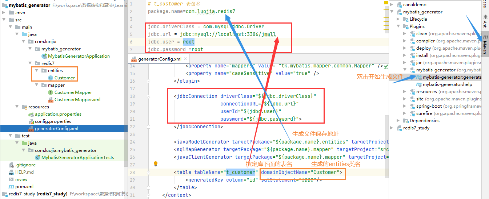

SpringBoot+MyBatis+Redis缓存实战编码

改造之前的Redis_study

改pom

```xml
<?xml version="1.0" encoding="UTF-8"?>
<project xmlns="http://maven.apache.org/POM/4.0.0" xmlns:xsi="http://www.w3.org/2001/XMLSchema-instance"
         xsi:schemaLocation="http://maven.apache.org/POM/4.0.0 https://maven.apache.org/xsd/maven-4.0.0.xsd">
    <modelVersion>4.0.0</modelVersion>
    <parent>
        <groupId>org.springframework.boot</groupId>
        <artifactId>spring-boot-starter-parent</artifactId>
        <version>2.7.11</version>
        <relativePath/> <!-- lookup parent from repository -->
    </parent>
    <groupId>com.luojia</groupId>
    <artifactId>redis7_study</artifactId>
    <version>0.0.1-SNAPSHOT</version>
    <name>redis7_study</name>
    <description>Demo project for Spring Boot</description>
    <properties>
        <project.build.sourceEncoding>UTF-8</project.build.sourceEncoding>
        <java.version>1.8</java.version>
        <maven.compiler.source>1.8</maven.compiler.source>
        <maven.compiler.target>1.8</maven.compiler.target>
        <junit.version>4.12</junit.version>
        <log4j.version>1.2.17</log4j.version>
        <lombok.version>1.16.18</lombok.version>
        <mapper.version>4.1.5</mapper.version>
        <mysql.version>5.1.47</mysql.version>
        <druid.version>1.1.16</druid.version>
        <mybatis.spring.boot.version>1.3.0</mybatis.spring.boot.version>
    </properties>

    <dependencies>
        <!--SpringBoot 通用依赖模块-->
        <dependency>
            <groupId>org.springframework.boot</groupId>
            <artifactId>spring-boot-starter-web</artifactId>
        </dependency>
        <!-- jedis -->
        <dependency>
            <groupId>redis.clients</groupId>
            <artifactId>jedis</artifactId>
            <version>4.3.1</version>
        </dependency>
        <!-- lettuce -->
        <!--<dependency>
            <groupId>io.lettuce</groupId>
            <artifactId>lettuce-core</artifactId>
            <version>6.2.1.RELEASE</version>
        </dependency>-->

        <!-- SpringBoot 与Redis整合依赖 -->
        <dependency>
            <groupId>org.springframework.boot</groupId>
            <artifactId>spring-boot-starter-data-redis</artifactId>
        </dependency>
        <dependency>
            <groupId>org.apache.commons</groupId>
            <artifactId>commons-pool2</artifactId>
        </dependency>
        <!-- swagger2 -->
        <dependency>
            <groupId>io.springfox</groupId>
            <artifactId>springfox-swagger2</artifactId>
            <version>2.9.2</version>
        </dependency>
        <dependency>
            <groupId>io.springfox</groupId>
            <artifactId>springfox-swagger-ui</artifactId>
            <version>2.9.2</version>
        </dependency>
        <!-- Mysql 数据库驱动 -->
        <dependency>
            <groupId>mysql</groupId>
            <artifactId>mysql-connector-java</artifactId>
            <version>${mysql.version}</version>
        </dependency>
        <!-- springboot集成druid连接池-->
        <dependency>
            <groupId>com.alibaba</groupId>
            <artifactId>druid-spring-boot-starter</artifactId>
            <version>1.1.10</version>
        </dependency>
        <dependency>
            <groupId>com.alibaba</groupId>
            <artifactId>druid</artifactId>
            <version>${druid.version}</version>
        </dependency>
        <!-- mybatis和SpringBoot整合 -->
        <dependency>
            <groupId>org.mybatis.spring.boot</groupId>
            <artifactId>mybatis-spring-boot-starter</artifactId>
            <version>${mybatis.spring.boot.version}</version>
        </dependency>
        <dependency>
            <groupId>cn.hutool</groupId>
            <artifactId>hutool-all</artifactId>
            <version>5.2.3</version>
        </dependency>
        <dependency>
            <groupId>org.springframework.boot</groupId>
            <artifactId>spring-boot-starter-jdbc</artifactId>
        </dependency>
        <!-- persistence -->
        <dependency>
            <groupId>javax.persistence</groupId>
            <artifactId>persistence-api</artifactId>
            <version>1.0.2</version>
        </dependency>
        <!-- 通用Mapper -->
        <dependency>
            <groupId>tk.mybatis</groupId>
            <artifactId>mapper</artifactId>
            <version>${mapper.version}</version>
        </dependency>
        <dependency>
            <groupId>org.springframework.boot</groupId>
            <artifactId>spring-boot-autoconfigure</artifactId>
        </dependency>

        <!-- 通用基础配置 -->
        <dependency>
            <groupId>junit</groupId>
            <artifactId>junit</artifactId>
            <version>${junit.version}</version>
        </dependency>
        <dependency>
            <groupId>log4j</groupId>
            <artifactId>log4j</artifactId>
            <version>${log4j.version}</version>
        </dependency>
        <dependency>
            <groupId>org.slf4j</groupId>
            <artifactId>slf4j-api</artifactId>
            <version>1.7.26</version>
        </dependency>
        <dependency>
            <groupId>org.slf4j</groupId>
            <artifactId>slf4j-log4j12</artifactId>
            <version>1.7.26</version>
        </dependency>
        <dependency>
            <groupId>org.projectlombok</groupId>
            <artifactId>lombok</artifactId>
            <version>${lombok.version}</version>
        </dependency>

        <dependency>
            <groupId>org.springframework.boot</groupId>
            <artifactId>spring-boot-starter-test</artifactId>
            <scope>test</scope>
        </dependency>
    </dependencies>

    <build>
        <plugins>
            <plugin>
                <groupId>org.springframework.boot</groupId>
                <artifactId>spring-boot-maven-plugin</artifactId>
            </plugin>
        </plugins>
    </build>

</project>
```

YML：在src/main/resources/目录下新建mapper文件夹，并拷贝CustomerMapper.xml

主启动

```java
package com.luojia.redis7_study;

import org.springframework.boot.SpringApplication;
import org.springframework.boot.autoconfigure.SpringBootApplication;
import tk.mybatis.spring.annotation.MapperScan;

@SpringBootApplication
@MapperScan("com.luojia.redis7_study.mapper")
public class Redis7StudyApplication {

    public static void main(String[] args) {
        SpringApplication.run(Redis7StudyApplication.class, args);
    }
}
```

业务类

CustomerService

```java
package com.luojia.redis7_study.service;

import com.luojia.redis7_study.entities.Customer;
import com.luojia.redis7_study.mapper.CustomerMapper;
import lombok.extern.slf4j.Slf4j;
import org.springframework.beans.factory.annotation.Autowired;
import org.springframework.data.redis.core.RedisTemplate;
import org.springframework.stereotype.Service;

import javax.annotation.Resource;
import java.util.concurrent.TimeUnit;

@Service
@Slf4j
public class CustomerService {

    public static final String CACHE_KEY_CUSTOMER = "customer:";

    @Resource
    private CustomerMapper customerMapper;
    @Autowired
    private RedisTemplate redisTemplate;

    public void addCustomer(Customer customer) {
        int i = customerMapper.insertSelective(customer);
        if (i > 0) {
            // mysql插入成功，需要重新查询一次将数据捞出来，写进Redis
            Customer result = customerMapper.selectByPrimaryKey(customer.getId());
            // redis 缓存key
            String key = CACHE_KEY_CUSTOMER + result.getId();
            redisTemplate.opsForValue().set(key, result);
        }
    }

    public Customer findCustomerById(Integer customerId) {
        Customer customer = null;
        // 缓存redis的key名称
        String key = CACHE_KEY_CUSTOMER + customerId;
        // 查看redis是否存在
        customer = (Customer) redisTemplate.opsForValue().get(key);

        // redis 不存在，取MySQL中查找
        if (null == customer) {
            // 双端加锁策略
            synchronized (CustomerService.class) {
                customer = (Customer) redisTemplate.opsForValue().get(key);
                if (null == customer) {
                    customer = customerMapper.selectByPrimaryKey(customerId);
                    if (null == customer) {
                        // 数据库没有放入redis设置缓存过期时间
                        redisTemplate.opsForValue().set(key, customer, 60, TimeUnit.SECONDS);
                    } else {
                        redisTemplate.opsForValue().set(key, customer);
                    }
                }
            }

        }

        return customer;
    }
}
```

CustomerController

```java
package com.luojia.redis7_study.controller;

import com.luojia.redis7_study.entities.Customer;
import com.luojia.redis7_study.service.CustomerService;
import io.swagger.annotations.Api;
import io.swagger.annotations.ApiOperation;
import lombok.extern.slf4j.Slf4j;
import org.springframework.beans.factory.annotation.Autowired;
import org.springframework.web.bind.annotation.PathVariable;
import org.springframework.web.bind.annotation.PostMapping;
import org.springframework.web.bind.annotation.RestController;

import java.time.LocalDateTime;
import java.time.ZoneId;
import java.util.Date;
import java.util.Random;

@Api(tags = "客户Customer接口+布隆过滤器讲解")
@RestController
@Slf4j
public class CustomerController {

    @Autowired
    private CustomerService customerService;

    @ApiOperation("数据库初始化两条Customer记录")
    @PostMapping(value = "/customer/add")
    public void addCustomer() {
        for (int i = 0; i < 2; i++) {
            Customer customer = new Customer();
            customer.setCname("customer" + i);
            customer.setAge(new Random().nextInt(30) + 1);
            customer.setPhone("139546556");
            customer.setSex((byte)new Random().nextInt(2));
            customer.setBirth(Date.from(LocalDateTime.now().atZone(ZoneId.systemDefault()).toInstant()));

            customerService.addCustomer(customer);
        }
    }

    @ApiOperation("单个customer查询操作")
    @PostMapping(value = "/customer/{id}")
    public Customer findCustomerById(@PathVariable int id) {
        return customerService.findCustomerById(id);
    }

}

```


### 6.6.5 新增布隆过滤器

BloomFilterInit（白名单）：@PostConstruct初始化白名单数据

```java
package com.luojia.redis7_study.filter;

import lombok.extern.slf4j.Slf4j;
import org.springframework.beans.factory.annotation.Autowired;
import org.springframework.data.redis.core.RedisTemplate;
import org.springframework.stereotype.Component;

import javax.annotation.PostConstruct;

/**
 * 布隆过滤器白名单初始化工具类，又开始就设置一部分数据为白名单所有
 * 白名单业务默认规定：布隆过滤器有，Redis是极大可能有
 * 白名单：whitelistCustomer
 */
@Component
@Slf4j
public class BloomFilterInit {

    @Autowired
    private RedisTemplate redisTemplate;

    @PostConstruct
    public void init() {
        // 1 白名单客户加载到布隆过滤器
        String key = "customer:12";
        // 2 计算hashvalue，由于存在计算出来负数的可能，需要取绝对值
        int hashValue = Math.abs(key.hashCode());
        // 3 通过hashValue和2^32取余，获得对应的下标坑位
        long index = (long) (hashValue % Math.pow(2, 32));
        log.info(key + "对应的坑位index：{}", index);
        // 4 设置Redis 里面的bitmap对应白名单类型的坑位，并设置为1
        redisTemplate.opsForValue().setBit("whitelistCustomer", index, true);
    }
}
```

CheckUtils

```java
package com.luojia.redis7_study.utils;

import lombok.extern.slf4j.Slf4j;
import org.springframework.beans.factory.annotation.Autowired;
import org.springframework.data.redis.core.RedisTemplate;
import org.springframework.stereotype.Component;

@Component
@Slf4j
public class CheckUtils {

    @Autowired
    private RedisTemplate redisTemplate;
    
    public boolean checkWithBloomFilter(String checkItem, String key) {
        int hashValue = Math.abs(key.hashCode());
        long index = (long) (hashValue % Math.pow(2, 32));
        Boolean exitOk = redisTemplate.opsForValue().getBit(checkItem, index);
        log.info("---> key：{}对应坑位下标index：{}是否存在：{}", key, index, exitOk);
        return exitOk;
    }
}
```

CustomerController

```java
@ApiOperation("BloomFilter, 单个customer查询操作")
@PostMapping(value = "/customerBloomFilter/{id}")
public Customer findCustomerByIdWithBloomFilter(@PathVariable int id) {
    return customerService.findCustomerByIdWithBloomFilter(id);
}
```

CustomerService

```java
/**
     * BloomFilter -> redis -> mysql
     * @param customerId
     * @return
     */
public Customer findCustomerByIdWithBloomFilter(Integer customerId) {
    Customer customer = null;
    // 缓存redis的key名称
    String key = CACHE_KEY_CUSTOMER + customerId;

    // 布隆过滤器check
    if (!checkUtils.checkWithBloomFilter("whitelistCustomer", key)) {
        log.info("白名单无此顾客，不可以访问，{}", key);
        return null;
    }

    // 查看redis是否存在
    customer = (Customer) redisTemplate.opsForValue().get(key);
    // redis 不存在，取MySQL中查找
    if (null == customer) {
        // 双端加锁策略
        synchronized (CustomerService.class) {
            customer = (Customer) redisTemplate.opsForValue().get(key);
            if (null == customer) {
                customer = customerMapper.selectByPrimaryKey(customerId);
                if (null == customer) {
                    // 数据库没有放入redis设置缓存过期时间
                    redisTemplate.opsForValue().set(key, customer, 60, TimeUnit.SECONDS);
                } else {
                    redisTemplate.opsForValue().set(key, customer);
                }
            }
        }

    }
    return customer;
}
```

测试说明

- 布隆过滤器有，Redis有，一切都能正常访问
- 布隆过滤器有，Redis无，可以正常访问并会写Redis
- 布隆过滤器无，直接返回数据，不再继续走下去


# 6.7 布隆过滤器优缺点

### 优点

高效地插入和查询，内存中占用bit空间小

### 缺点

不能删除元素。因为删除元素会导致误判率增加，因为hash冲突同一个位置可能存的东西是多个共有的，你删除一个的同事可能也把其他的删除了

存在误判，不能精准过滤；有，是很有可能有；无，是肯定无


## 6.8 布谷鸟过滤器（了解）

为了解决布隆过滤器不能删除元素的问题，布谷鸟过滤器横空出世。

https://www.cs.cmu.edu/~binfan/papers/conext14_cuckoofilter.pdf
