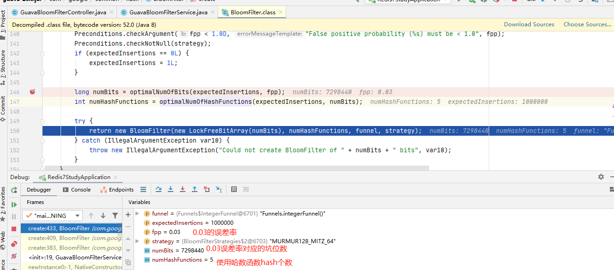
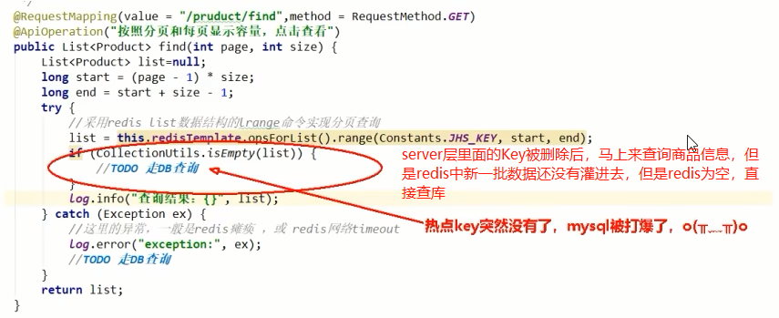

# 第7章-缓存预热+缓存雪崩+缓存穿透+缓存击穿

## 7.1 先看看大厂真实需求+面试题反馈

- 缓存预热、雪崩、穿透、击穿分别是什么？遇到过哪几种情况？
  - 预热：预先加载热点数据
  - 雪崩：redis宕机，服务崩溃；redis大面积过期失效
  - 穿透：本来就没有的数据，即redis，mysql都没有的数据，每次都会请求到redis和mysql，把数据打到mysql上去
  - 击穿：大量请求同时查询一个key时，此时这个key正好失效了，就会导致大量的请求都打到数据库简单点就是热点key突然失效了，暴打MySQL
- 缓存预热是怎么做的？
- 如何避免或者减少缓存雪崩？
- 穿透和击穿有什么区别？他俩是一个意思还是截然不同？
- 穿透和击穿你有什么解决方案？如何避免？
- 假如出现了缓存不一致，你有哪些修补方案？

## 7.2 缓存预热

- 将热点数据提前加载到redis缓存中，可以通过@PostConstruct提前运行某个程序，将其加载到redis中
- 实现方案：通过中间件或者程序自行完成。不要查询到一条才回写到redis，我们自己要提前完成，不把问题留给客户。

## 7.3 缓存雪崩

### 7.3.1 发生

- Redis主机挂了，Redis全盘崩溃，偏硬件运维

- Redis中有大量key同时过期大面积失效，偏软件开发

### 7.3.2 预防 + 解决

- Redis中key设置为永不过期或者过期时间为指定时间+随机时间，错开同时过期的概率

- Redis缓存集群实现高可用

  * 主从+哨兵
* Redis Cluster
  * 开启Redis持久化机制AOF/RDB，尽快恢复缓存集群

- 多缓存结合预防雪崩

  - ehcache本地缓存 + Redis缓存

- 服务降级

  - Hystrix或者阿里sentinel限流&降级

- 人民币玩家

  阿里云-云数据库Redis版：https://www.aliyun.com/product/kvstore?spm=5176.54432.J_3207526240.15.2a3818a5iG191E

## 7.3 缓存穿透

### 7.3.1 是什么

* 请求去查询一条记录，先查redis无，后查mysql无，都查询不到该条记录但是请求每次都会打到数据库上面去，导致后台数据库压力暴增，这种现象我们称为缓存穿透，这个redis变成了一个摆设。

* 简单说就是本来无一物，两库都没有，既不在Redis缓存库，也不在mysql，数据库存在被多次暴击风险

### 7.3.2 解决

缓存穿透 -> 恶意攻击 -> 可以空对象缓存或者使用布隆过滤器


#### 7.3.2.1 方案1：空对象缓存或者缺省值

* 一般情况都是OK的
  * 第一种解决方案，回写增强
    * 如果发生了缓存穿透，我们可以针对要查询的数据，在Redis里存一个和业务部门商量后确定的缺省值(比如,零、负数、defaultNull等)比如，键uid;abcdxxx，值defaultNull作为案例的key和value
    * 先去redis查键uid:abcdxxx没有，再去mysql查没有获得，这就发生了一次穿透现象。
  * but，可以增强回写机制
    * mysql也查不到的话也让redis存入刚刚查不到的key并保护mysql。
    * 第一次来查询uid:abcdxxx，redis和mysql都没有，返回nul给调用者，但是增强回写后第二次来查uid:abcdxxx，此时redis就有值了。
    * 可以直接从Redis中读取default缺省值返回给业务应用程序，避免了把大量请求发送给mysql处理，打爆mysql。
  * 但是，此方法架不住黑客的恶意攻击，有缺陷......，只能解决key相同的情况

* 但是会有黑客或者恶意攻击
  * 黑客会对你的系统进行攻击，拿一个不存在的id去查询数据，会产生大量的请求到数据库去查询。可能会导致你的数据库由于压力过大而宕掉
  * key相同打你系统
    * 第一次打到mysql，空对象缓存后第二次就返回defaultNull缺省值，避免mysql被攻击，不用再到数据库中去走一圈了

  * <font color ='red'>key不同打你系统</font>
    * 由于存在空对象缓存和缓存回写(看自己业务不限死)，redis中的无关紧要的key也会越写越多<font color ='red'>(记得设置redis过期时间)</font>

#### 7.3.2.2 方案2：Google布隆过滤器Guava解决缓存穿透

* Guava中布隆过滤器的实现算是比较权威的，所以实际项目中我们可以直接使用Guava布隆过滤器

* Guava's  BloomFilter 源码出处：https://github.com/google/guava/blob/master/guava/src/com/google/common/hash/BloomFilter.java

* 案例：白名单过滤器
  * 白名单架构说明

  

  * 误判问题，但是概率小可以接受，不能从布隆过滤器删除

  * 全部合法的key都需要放入Guava版布隆过滤器+redis里面，不然数据就是返回null

  * 代码编写

  建model -> 还是使用redis7-study

  改pom

  ```xml
  <!--guava Google 开源的 Guava 中带的布隆过德器-->
  <dependency>
      <groupId>com.google.guava</groupId>
      <artifactId>guava</artifactId>
      <version>23.0</version>
  </dependency>
  ```

  写YML -> 无变化

  主启动 -> 无变化

  业务类

  ​	新建入门测试案例

  ```java
  @Test
  public void testGuava() {
    // 1 创建Guava 版本布隆过滤器
      BloomFilter<Integer> bloomFilter = BloomFilter.create(Funnels.integerFunnel(), 100);
      // 2 判断指定的元素是否存在
      System.out.println(bloomFilter.mightContain(1));// false
      System.out.println(bloomFilter.mightContain(2));// false
      System.out.println();
      // 3 将元素新增进入布隆过滤器
      bloomFilter.put(1);
      bloomFilter.put(2);
      System.out.println(bloomFilter.mightContain(1));// true
      System.out.println(bloomFilter.mightContain(2));// true
  }
  ```

  ​	新建Guava案例

  GuavaBloomFilterController

  ```java
  package com.luojia.redis7_study.controller;
  
  import com.luojia.redis7_study.service.GuavaBloomFilterService;
  import io.swagger.annotations.Api;
  import io.swagger.annotations.ApiOperation;
  import lombok.extern.slf4j.Slf4j;
  import org.springframework.beans.factory.annotation.Autowired;
  import org.springframework.web.bind.annotation.GetMapping;
  import org.springframework.web.bind.annotation.RestController;
  
  @Api(tags = "google工具Guava处理布隆过滤器")
  @RestController
  @Slf4j
  public class GuavaBloomFilterController {
  
      @Autowired
      private GuavaBloomFilterService guavaBloomFilterService;
  
      @ApiOperation("guava布隆过滤器插入100万样本数据并额外10万测试是否存在")
      @GetMapping("/guavafilter")
      public void guavaBloomFIlterService() {
          guavaBloomFilterService.guavaBloomFilterService();
      }
  }
  ```

  GuavaBloomFilterService

  ```java
  package com.luojia.redis7_study.service;
  
  import com.google.common.hash.BloomFilter;
  import com.google.common.hash.Funnels;
  import lombok.extern.slf4j.Slf4j;
  import org.springframework.stereotype.Service;
  
  import java.util.ArrayList;
  
  @Service
  @Slf4j
  public class GuavaBloomFilterService {
  
      public static final int _1w = 10000;
      public static final int SIZE = 100 * _1w;
      // 误判率，它越小误判的个数也就越少
      public static double fpp = 0.03;
      // 创建Guava 版本布隆过滤器
      BloomFilter<Integer> bloomFilter = BloomFilter.create(Funnels.integerFunnel(), SIZE, fpp);
  
      public void guavaBloomFilterService() {
          // 1 先让bloomFilter加入100w白名单数据
          for (int i = 0; i < SIZE; i++) {
              bloomFilter.put(i);
          }
          // 2 故意去10w不在合法范围内的数据，来进行误判率演示
          ArrayList<Integer> list = new ArrayList<>(10 * _1w);
          // 3 验证
          for (int i = SIZE; i < SIZE + (10 * _1w); i++) {
              if(bloomFilter.mightContain(i)) {
                  log.info("被误判了：{}", i);
                  list.add(i);
              }
          }
          log.info("误判的总数量：{}", list.size());
      }
  }
  // 运行之后，结果为： 误判的总数量：3033
  ```

  运行结论：

  ```text
  现在总共有10万数据是不存在的，误判了3033次，
  原始样本:100W
  不存在数据:1000001---1100000
  3033 / 100000 = 0.03033,和我们的误判率对得上
  ```

  debug源码看看

  

  

  

  布隆过滤器说明

  

  

## 7.4 缓存击穿

### 7.4.1 是什么

* 大量请求同时查询一个key时，此时这个key正好失效了，就会导致大量的请求都打到数据库
* <font color = 'red'>简单点就是热点key突然失效了，暴打MySQL</font>

* <font color = 'gren'>缓存穿透和缓存击穿是完全不同的东西</font>

  

### 7.4.2 危害

* 会造成某一时刻数据库请求量过大，压力剧增；一般技术部门需要知道热点key是哪些，做到心里有数防止击穿。

### 7.4.3 解决

* 缓存击穿 -> 热点key失效-> 今天互斥更新、随机退避、差异失效时间

* 热点key失效：时间到了自然清除但还是被访问到，delete掉的key，刚好又被访问到

* 方案一：差异失效时间，对于访问频繁的热点key，干脆就不设置过期时间

* <font color = 'red'>方案二：互斥更新，采用双检加锁策略</font>

  * 多个线程同时去查询数据库的这条数据，那么我们可以在第一个查询数据的请求上使用一个互斥锁来锁住它。其他的线程走到这一步拿不到锁就等着，等第一个线程查询到了数据，然后做缓存。后面的线程进来发现已经有缓存了，就直接走缓存

    

### 7.4.4 案例

模拟高并发的天猫聚划算案例code 

分析过程

| 步骤 | 说明                                                         |
| ---- | ------------------------------------------------------------ |
| 1    | 100%高并发，绝对不可以用MySQL实现                            |
| 2    | 先把MySQL里面参加活动的数据抽取进redis，一般采用定时器扫描来决定上线活动还是下线取消。 |
| 3    | 支持分页功能，一页20条数据                                   |
|      | 思考：什么样的数据类型支持上述功能？                         |


<font color = 'red'>高并发+定时任务+分页显示</font>

redis数据类型选型


springboot+redis实现高并发的聚划算业务

创建entity对象

```java
package com.luojia.redis7_study.entities;

import io.swagger.annotations.ApiModel;
import lombok.AllArgsConstructor;
import lombok.Data;
import lombok.NoArgsConstructor;

@Data
@AllArgsConstructor
@NoArgsConstructor
@ApiModel(value="聚划算活动Product信息")
public class Product {

    // 产品id
    private Long id;
    // 产品名称
    private String name;
    // 产品价格
    private Integer price;
    // 产品详情
    private String detail;

}
```

JHSTaskService：采用定时器将参与聚划算活动的特价商品新增进入redis中

```java
package com.luojia.redis7_study.service;

import com.luojia.redis7_study.entities.Product;
import lombok.extern.slf4j.Slf4j;
import org.springframework.beans.factory.annotation.Autowired;
import org.springframework.data.redis.core.RedisTemplate;
import org.springframework.stereotype.Service;

import javax.annotation.PostConstruct;
import java.util.ArrayList;
import java.util.List;
import java.util.Random;

@Service
@Slf4j
public class JHSTaskService {

    public static final String JHS_KEY = "jhs";
    public static final String JHS_KEY_A = "jhs:a";
    public static final String JHS_KEY_B = "jhs:b";

    @Autowired
    private RedisTemplate redisTemplate;

    /**
     * 假设此处是从数据库读取，然后加载到redis
     * @return
     */
    private List<Product> getProductsFromMysql() {
        ArrayList<Product> list = new ArrayList<>();
        for (int i = 0; i < 20; i++) {
            Random random = new Random();
            int id = random.nextInt(10000);
            Product product = new Product((long) id, "product" + i, i, "detail");
            list.add(product);
        }
        return list;
    }

    @PostConstruct
    public void initJHS() {
        log.info("模拟定时任务从数据库中不断获取参加聚划算的商品");
        // 1 用多线程模拟定时任务，将商品从数据库刷新到redis
        new Thread(() -> {
            while(true) {
                // 2 模拟从数据库查询数据
                List<Product> list = this.getProductsFromMysql();
                // 3 删除原来的数据
                redisTemplate.delete(JHS_KEY);
                // 4 加入最新的数据给Redis参加活动
                redisTemplate.opsForList().leftPushAll(JHS_KEY, list);
                // 5 暂停1分钟，模拟聚划算参加商品下架上新等操作
                try {
                    Thread.sleep(60000);
                } catch (InterruptedException e) {
                    e.printStackTrace();
                }
            }
        }, "t1").start();
    }
}
```

JHSTaskController

```java
package com.luojia.redis7_study.controller;

import com.luojia.redis7_study.entities.Product;
import io.swagger.annotations.Api;
import io.swagger.annotations.ApiOperation;
import lombok.extern.slf4j.Slf4j;
import org.springframework.beans.factory.annotation.Autowired;
import org.springframework.data.redis.core.RedisTemplate;
import org.springframework.util.CollectionUtils;
import org.springframework.web.bind.annotation.GetMapping;
import org.springframework.web.bind.annotation.RestController;

import java.util.List;

@Api(tags = "模拟聚划算商品上下架")
@RestController
@Slf4j
public class JHSTaskController {

    public static final String JHS_KEY = "jhs";
    public static final String JHS_KEY_A = "jhs:a";
    public static final String JHS_KEY_B = "jhs:b";

    @Autowired
    private RedisTemplate redisTemplate;

    @ApiOperation("聚划算案例，每次1页，每页5条数据")
    @GetMapping("/product/find")
    public List<Product> find(int page, int size) {
        long start = (page - 1) * size;
        long end = start + size - 1;
        List list = redisTemplate.opsForList().range(JHS_KEY, start, end);
        if (CollectionUtils.isEmpty(list)) {
            // todo Redis找不到，去数据库中查询
        }
        log.info("参加活动的商家: {}", list);
        return list;
    }
}
```

**至此步骤，上述聚划算的功能算是完成，请思考在高并发下有什么经典生产问题?**

异常问题：热点缓存Key突然失效导致可怕的缓存击穿




delete命令执行的一瞬间有空隙，其他请求线程继续找redis，但是结果为null，请求直接打到redis，暴击数据库

最终目的：2条命令原子性还是其次，<font color='red'>主要是要防止热key突然失效</font>


进一步升级加固案例

- 互斥跟新，采用双检加锁策略

- 差异失效时间

  

- 代码更新

  JHSTaskService

  ```java
  // 双缓存
  @PostConstruct
  public void initJHSAB() {
      log.info("模拟定时任务从数据库中不断获取参加聚划算的商品");
      // 1 用多线程模拟定时任务，将商品从数据库刷新到redis
      new Thread(() -> {
          while(true) {
              // 2 模拟从数据库查询数据
              List<Product> list = this.getProductsFromMysql();
              // 3 先更新B缓存且让B缓存过期时间超过A缓存，如果突然失效还有B兜底，防止击穿
              redisTemplate.delete(JHS_KEY_B);
              redisTemplate.opsForList().leftPushAll(JHS_KEY_B, list);
              // 设置过期时间为1天+10秒
              redisTemplate.expire(JHS_KEY_B, 86410L, TimeUnit.SECONDS);
              // 4 在更新缓存A
              redisTemplate.delete(JHS_KEY_A);
              redisTemplate.opsForList().leftPushAll(JHS_KEY_A, list);
              redisTemplate.expire(JHS_KEY_A, 86400L, TimeUnit.SECONDS);
              // 5 暂停1分钟，模拟聚划算参加商品下架上新等操作
              try {
                  Thread.sleep(60000);
              } catch (InterruptedException e) {
                  e.printStackTrace();
              }
          }
      }, "t1").start();
  }
  ```

  JHSTaskController

  ```java
  @ApiOperation("聚划算案例，AB双缓存，防止热key突然失效")
  @GetMapping("/product/findab")
  public List<Product> findAB(int page, int size) {
      List<Product> list = null;
      long start = (page - 1) * size;
      long end = start + size - 1;
      list = redisTemplate.opsForList().range(JHS_KEY_A, start, end);
      if (CollectionUtils.isEmpty(list)) {
          //  Redis找不到，去数据库中查询
          log.info("A缓存已经失效或活动已经结束");
          list = redisTemplate.opsForList().range(JHS_KEY_B, start, end);
          if (CollectionUtils.isEmpty(list)) {
              // todo Redis找不到，去数据库中查询
          }
      }
      log.info("参加活动的商家: {}", list);
      return list;
  }
  ```

  


