# 第8章-手写Redis分布式锁

## 8.1 粉丝反馈回来的题目

* Redis除了拿来做缓存，还有基于Redis的其他用法吗
  * 数据共享，分布式Session
  * 分布式锁
  * 全局ID
  * 计算器、点赞
  * 位统计
  * 购物车
  * 轻量级消息队列
    * list -> stream

  * 抽奖

  * 点赞、签到、打卡

  * 交集差集并集，用户关注，可能认识的人，推荐模型

  * 热点新闻、热搜排行

* Redis做分布式的时候需要注意什么问题？
  * lock/unlock
* 你们公司自己实现的分布式锁是否用的setnx命令实现?这个是最合适的吗?你如何考虑分布式锁的可重入问题?
* 如果Redis是单点部署的，会带来什么问题？准备怎么解决单点问题呢？
* Redis集群模式下，比如主从模式下，CAP方面有没有什么问题？
  * Redis集群是AP，高可用；Redis单机是C，数据一致性

* 简单介绍一下RedLock，谈谈Redisson
* Redis分布式锁如何续期，看门狗是什么？


## 8.2 锁的种类

### 8.2.1 <font color='red'>单机版同一个虚拟机内，</font>synchronized或者Lock接口。

### 8.2.2 <font color='red'>分布式多个不同jvm虚拟机，</font>单机的线程锁机制不再起作用，资源类在不同的服务器之间共享了。

## 8.3 一个靠谱的分布式锁需要具备的条件和刚需

- 独占性

  任何时刻有且只能有一个线程持有

- 高可用

  若为redis集群环境下，不能因为某一个节点挂了而出现获取锁和释放锁失败的情况

  高并发请求下，依旧性能OK好使

- 防死锁

  杜绝死锁，必须有超时控制机制或者撤销操作，有个兜底终止跳出方案

- 不乱抢

  防止张冠李戴，不能私底下unlock别人的锁，只能自己加锁自己释放

- 重入性

  同一个节点的同一个线程如果获得锁之后，它也可以再次获取这个锁


## 8.4 分布式锁

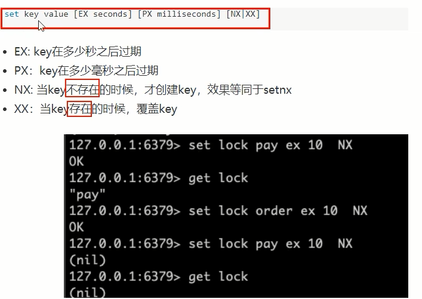

setnx key value

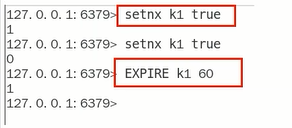

<font color ='red' >setnx+expire不安全，两条命令为非原子性命令</font>

set key value[EX seconds] \[PX milliseconds] \[NX|XX]

## 8.5 重点

JUC中AQS锁的规范落地参考+可重入锁+Lua脚本+Redis命令一步步实现分布式锁

## 8.6 Base案例(boot+redis)

### 8.6.1 使用场景

多个服务间保证同一时间段内同一用户只能有一个请求（防止关键业务出现并发攻击）

### 8.6.2 建Module

​	redis_distributed_lock2

​    redis_distributed_lock3

### 8.6.3 写POM

```xml
<?xml version="1.0" encoding="UTF-8"?>
<project xmlns="http://maven.apache.org/POM/4.0.0" xmlns:xsi="http://www.w3.org/2001/XMLSchema-instance"
         xsi:schemaLocation="http://maven.apache.org/POM/4.0.0 https://maven.apache.org/xsd/maven-4.0.0.xsd">
    <modelVersion>4.0.0</modelVersion>
    <parent>
        <groupId>org.springframework.boot</groupId>
        <artifactId>spring-boot-starter-parent</artifactId>
        <version>2.7.11</version>
        <relativePath/> <!-- lookup parent from repository -->
    </parent>
    <groupId>com.luojia</groupId>
    <artifactId>redis_distributed_lock2</artifactId>
    <version>0.0.1-SNAPSHOT</version>
    <name>redis_distributed_lock2</name>
    <description>Demo project for Spring Boot</description>
    <properties>
        <project.build.sourceEncoding>UTF-8</project.build.sourceEncoding>
        <java.version>1.8</java.version>
        <maven.compiler.source>1.8</maven.compiler.source>
        <maven.compiler.target>1.8</maven.compiler.target>
        <lombok.version>1.16.18</lombok.version>
    </properties>

    <dependencies>
        <!--SpringBoot 通用依赖模块-->
        <dependency>
            <groupId>org.springframework.boot</groupId>
            <artifactId>spring-boot-starter-web</artifactId>
        </dependency>
        <!-- SpringBoot 与Redis整合依赖 -->
        <dependency>
            <groupId>org.springframework.boot</groupId>
            <artifactId>spring-boot-starter-data-redis</artifactId>
        </dependency>
        <dependency>
            <groupId>org.apache.commons</groupId>
            <artifactId>commons-pool2</artifactId>
        </dependency>
        <!-- swagger2 -->
        <dependency>
            <groupId>io.springfox</groupId>
            <artifactId>springfox-swagger2</artifactId>
            <version>2.9.2</version>
        </dependency>
        <dependency>
            <groupId>io.springfox</groupId>
            <artifactId>springfox-swagger-ui</artifactId>
            <version>2.9.2</version>
        </dependency>

        <dependency>
            <groupId>cn.hutool</groupId>
            <artifactId>hutool-all</artifactId>
            <version>5.2.3</version>
        </dependency>

        <!-- 通用基础配置 -->
        <dependency>
            <groupId>org.projectlombok</groupId>
            <artifactId>lombok</artifactId>
            <version>${lombok.version}</version>
            <optional>true</optional>
        </dependency>

        <dependency>
            <groupId>org.springframework.boot</groupId>
            <artifactId>spring-boot-starter-test</artifactId>
            <scope>test</scope>
        </dependency>
    </dependencies>

    <build>
        <plugins>
            <plugin>
                <groupId>org.springframework.boot</groupId>
                <artifactId>spring-boot-maven-plugin</artifactId>
            </plugin>
        </plugins>
    </build>
</project>
```

### 8.6.4 改YML

```yaml
server.port=7777
spring.application.name=redis_distributed_lock2
# =====================swaqqer2=====================
# http://localhost:7777/swagger-ui.html
swagger2.enabled=true
spring.mvc.pathmatch.matching-strategy=ant_path_matcher
# =====================redis单机=====================
spring.redis.database=0
#修改为自己真实IP
spring.redis.host=127.0.0.1
spring.redis.port=6379
spring.redis.password=123456
spring.redis.lettuce.pool.max-active=8
spring.redis.1ettuce.pool.max-wait=-1ms
spring.redis.1ettuce.pool.max-idle=8
spring.redis.lettuce.pool.min-idle=0
```

### 8.6.5 主启动

### 8.6.6 业务类

InventoryService

```java
package com.luojia.redislock.service;

import lombok.extern.slf4j.Slf4j;
import org.springframework.beans.factory.annotation.Autowired;
import org.springframework.beans.factory.annotation.Value;
import org.springframework.data.redis.core.StringRedisTemplate;
import org.springframework.stereotype.Service;

import java.util.concurrent.locks.Lock;
import java.util.concurrent.locks.ReentrantLock;

@Service
@Slf4j
public class InventoryService {
    
    @Autowired
    private StringRedisTemplate stringRedisTemplate;
    @Value("${server.port}")
    private String port;

    private Lock lock = new ReentrantLock();

    public String sale() {
        String resMessgae = "";
        lock.lock();
        try {
            // 1 查询库存信息
            String result = stringRedisTemplate.opsForValue().get("inventory01");
            // 2 判断库存书否足够
            Integer inventoryNum = result == null ? 0 : Integer.parseInt(result);
            // 3 扣减库存，每次减少一个库存
            if (inventoryNum > 0) {
                stringRedisTemplate.opsForValue().set("inventory01", String.valueOf(--inventoryNum));
                resMessgae = "成功卖出一个商品，库存剩余：" + inventoryNum;
                log.info(resMessgae + "\t" + "，服务端口号：" + port);
            } else {
                resMessgae = "商品已售罄。";
                log.info(resMessgae + "\t" + "，服务端口号：" + port);
            }
        } finally {
            lock.unlock();
        }
        return resMessgae;
    }
}
```

InventoryController

```java
package com.luojia.redislock.controller;

import com.luojia.redislock.service.InventoryService;
import io.swagger.annotations.Api;
import io.swagger.annotations.ApiOperation;
import org.springframework.beans.factory.annotation.Autowired;
import org.springframework.web.bind.annotation.GetMapping;
import org.springframework.web.bind.annotation.RestController;

@RestController
@Api(tags = "redis分布式锁测试")
public class InventoryController {
    @Autowired
    private InventoryService inventoryService;

    @GetMapping("/inventory/sale")
    @ApiOperation("扣减库存，一次卖一个")
    public void sale() {
        inventoryService.sale();
    }
}
```

### 8.6.7 丝袜哥

http://localhost:7777/swagger-ui.html#/

## 8.7 手写分布式锁思路分析2023

<font color = 'red'>上述笔记代码的不足
</font>

1. 初始化版本简单添加

   业务类，将上面7777的业务逻辑代码原样拷贝到8888，加上synchronized或者Lock

2. nginx分布式微服务架构

   - v2.0版本代码分布式部署后，单机锁还是出现超卖现象，需要分布式锁

     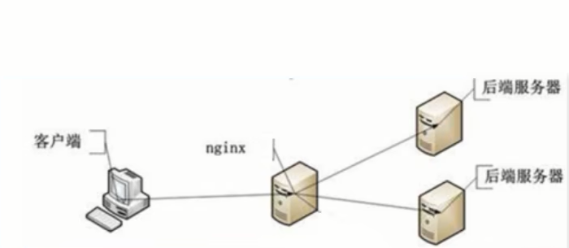

   - Nginx配置负载均衡

     - 命令地址+配置地址

       命令地址：/usr/local/nginx/sbin

       配置地址：/usr/local/nginx/conf

     - 启动

       /usr/local/nginx/sbin	执行./nginx

       启动Nginx并测试通过，浏览器看到Nginx欢迎welcome页面

     - /usr/local/nginx/conf目录下修改配置文件nginx.conf新增反向代理和负载均衡配置

       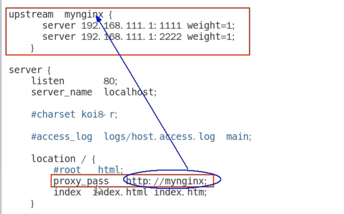

     - 关闭

       /usr/local/nginx/sbin  执行./nginx -s stop

     - 指定配置启动

       在/usr/local/nginx/sbin 路径下执行命令 ./nginx -c nginx.conf全路径

       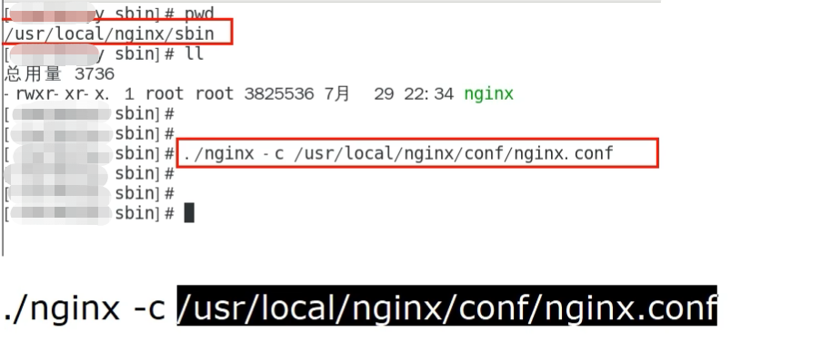

     - 重启

       在/usr/local/nginx/sbin  执行./nginx -s reload

   - v2.0版本代码修改+启动两个微服务

     ​	通过Nginx访问，自己Linux服务器IP地址，反向代理+负载均衡
     
     ​	可以点击查看效果，可以看到一边一个，通过配置的权重来轮询
     
     ​    http://1270.0.1/inventory/sale
     
   - 上面纯手工点击验证OK，下面高并发模拟

     - 使用jmeter进行压测
     
     - 创建线程组Redis
     
       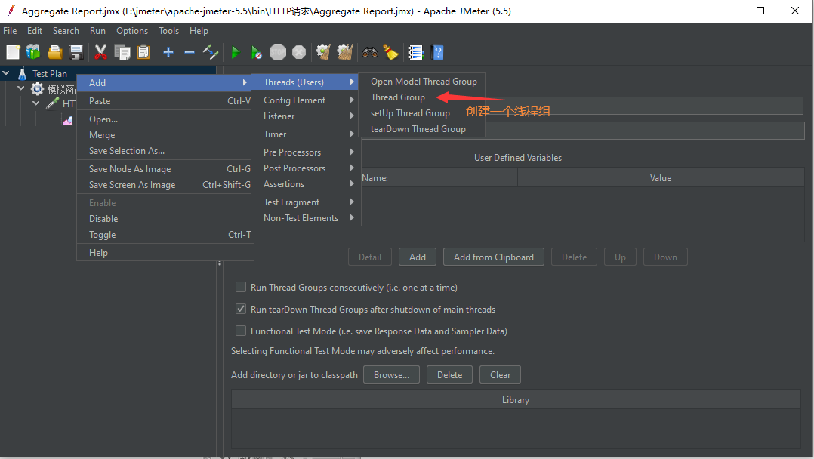
     
       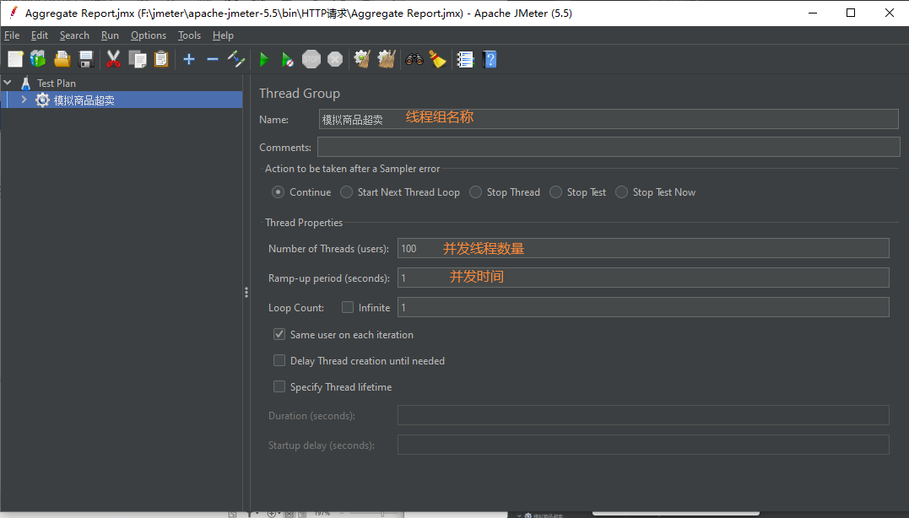
     
     - 创建一个http请求
     
       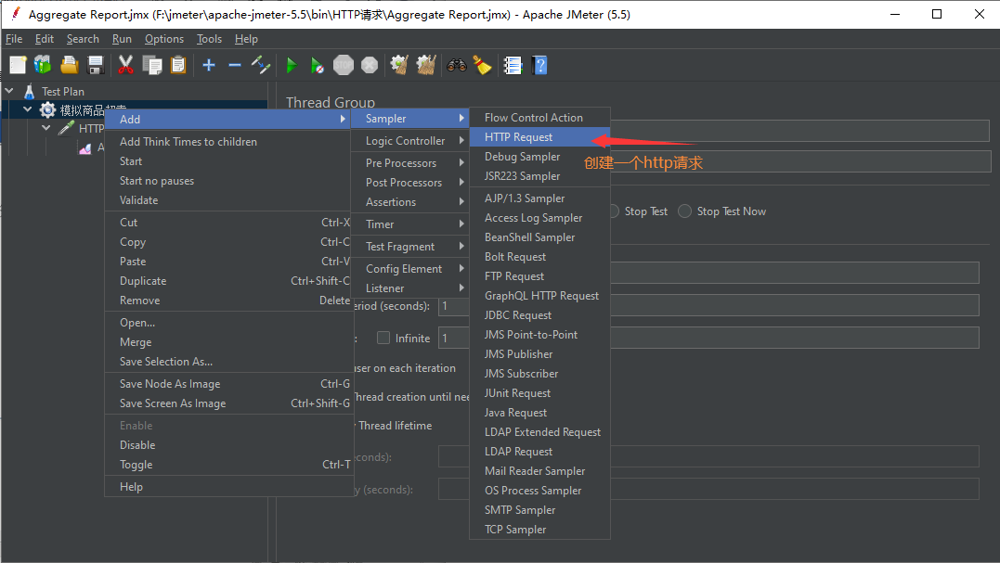
     
       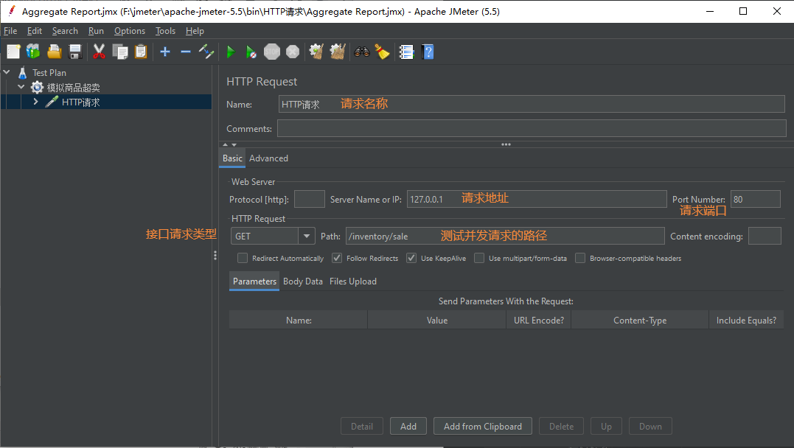
     
       
     
     - jmeter压测
     
       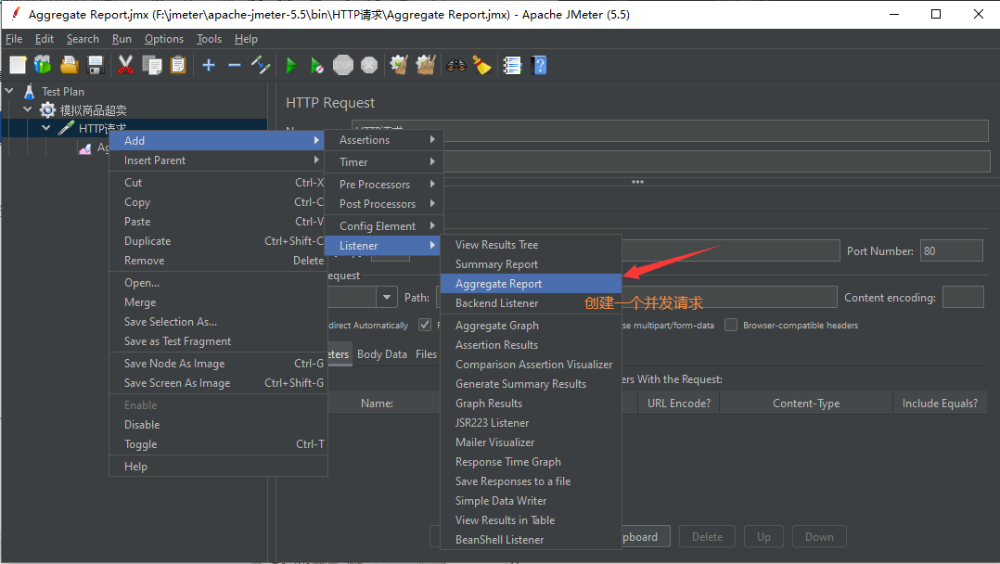
     
       查看报告
     
       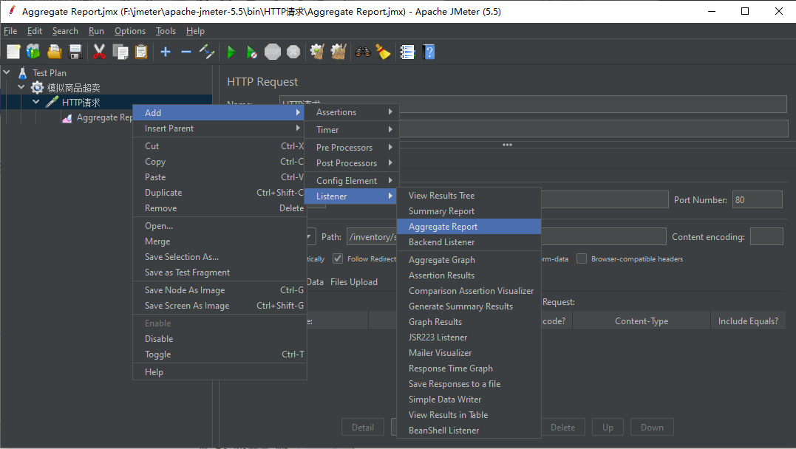
     
       执行绿色执行按钮，开始并发请求程序
     
     - 发现商品出现超卖
     
       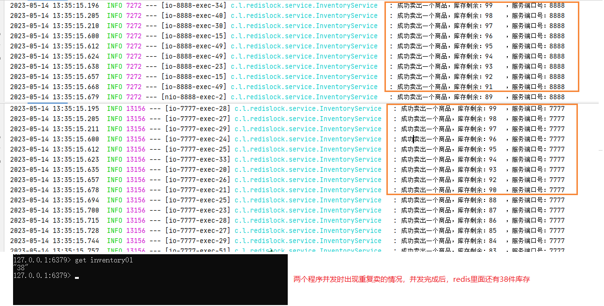
     
   - Bug？why？

     synchronized和ReentrantLock是单机锁，只能管住当前自己的jvm。
     
     在<font color='red'>单机环境</font>下，可以使用synchronized或Lock来实现
     
     但是在分布式系统中，因为竞争的线程可能不在同一个节点上(同一个jvm中)，所以需要一个让所有进程都能访问到的锁来实现<font color='red'>(比如redis或者zookeeper来构建)</font>
     
     不同进程ivm层面的锁就不管用了，那么可以利用第三方的一个组件，来获取锁，未获取到锁，则阻塞当前想要运行的线程
     
   - 分布式锁出现

     跨进程+跨服务
     
     解决超卖
     
     防止缓存击穿

3. 解决

   上Redis分布式锁setnx；Redis具有极高的性能,且其命令对分布式锁支持友好,借助SET 命令即可实现加锁处理。

   


### 代码改造为3.1版

```java
public String sale() {
    String resMessgae = "";
    String key = "luojiaRedisLocak";
    String uuidValue = IdUtil.simpleUUID() + ":" + Thread.currentThread().getId();

    Boolean flag = stringRedisTemplate.opsForValue().setIfAbsent(key, uuidValue);
    // 抢不到的线程继续重试
    if (!flag) {
        // 线程休眠20毫秒，进行递归重试
        try {
            TimeUnit.MILLISECONDS.sleep(20);
        } catch (InterruptedException e) {
            e.printStackTrace();
        }
        sale();
    } else {
        try {
            // 1 抢锁成功，查询库存信息
            String result = stringRedisTemplate.opsForValue().get("inventory01");
            // 2 判断库存书否足够
            Integer inventoryNum = result == null ? 0 : Integer.parseInt(result);
            // 3 扣减库存，每次减少一个库存
            if (inventoryNum > 0) {
                stringRedisTemplate.opsForValue().set("inventory01", String.valueOf(--inventoryNum));
                resMessgae = "成功卖出一个商品，库存剩余：" + inventoryNum + "\t" + "，服务端口号：" + port;
                log.info(resMessgae);
            } else {
                resMessgae = "商品已售罄。" + "\t" + "，服务端口号：" + port;
                log.info(resMessgae);
            }
        } finally {
            stringRedisTemplate.delete(key);
        }
    }
    return resMessgae;
}
```

通过递归的方式来完成重试，不断获取锁

<font color ='red'>但是依旧有问题：手工设置5000个线程来抢占锁，压测OK，但是容易导致StackOverflowError，不推荐，需要进一步完善</font>

### 修改为3.2版

多线程判断想想JUC里面说过的虚假唤醒，用while替代if，用自旋锁代替递归重试

```java
public String sale() {
    String resMessgae = "";
    String key = "luojiaRedisLocak";
    String uuidValue = IdUtil.simpleUUID() + ":" + Thread.currentThread().getId();

    // 不用递归了，高并发容易出错，我们用自旋代替递归方法重试调用；也不用if，用while代替
    while (!stringRedisTemplate.opsForValue().setIfAbsent(key, uuidValue)) {
        // 线程休眠20毫秒，进行递归重试
        try {TimeUnit.MILLISECONDS.sleep(20);} catch (InterruptedException e) {e.printStackTrace();}
    }

    try {
        // 1 抢锁成功，查询库存信息
        String result = stringRedisTemplate.opsForValue().get("inventory01");
        // 2 判断库存书否足够
        Integer inventoryNum = result == null ? 0 : Integer.parseInt(result);
        // 3 扣减库存，每次减少一个库存
        if (inventoryNum > 0) {
            stringRedisTemplate.opsForValue().set("inventory01", String.valueOf(--inventoryNum));
            resMessgae = "成功卖出一个商品，库存剩余：" + inventoryNum + "\t" + "，服务端口号：" + port;
            log.info(resMessgae);
        } else {
            resMessgae = "商品已售罄。" + "\t" + "，服务端口号：" + port;
            log.info(resMessgae);
        }
    } finally {
        stringRedisTemplate.delete(key);
    }
    return resMessgae;
}
```


### 需要防止服务器突然宕机导致程序死锁

V3.2代码存在的问题

部署了微服务的Java程序机器挂了，代码层面根本没有走到finally这块，没办法保证解锁(无过期时间该key一直存在)，这个key没有被删除，需要加入一个过期时间限定key

### 解决

- 修改代码为v4.1版

  ```java
  while (!stringRedisTemplate.opsForValue().setIfAbsent(key, uuidValue)) {
              // 线程休眠20毫秒，进行递归重试
              try {TimeUnit.MILLISECONDS.sleep(20);} catch (InterruptedException e) {e.printStackTrace();}
          }
  
          // 设置过期时间
          stringRedisTemplate.expire(key, 30L, TimeUnit.SECONDS);
  ```

- 4.1版本结论

  不可行，设置的key+过期时间分开了，必须要合并成一行使其具备原子性

- 修改为4.2版

  ```java
  while (!stringRedisTemplate.opsForValue().setIfAbsent(key, uuidValue, 30L, TimeUnit.SECONDS)) {
              // 线程休眠20毫秒，进行递归重试
              try {TimeUnit.MILLISECONDS.sleep(20);} catch (InterruptedException e) {e.printStackTrace();}
          }
  ```

- 4.2版本结论

  加锁和过期时间设置必须同一行，保证原子性


### v4.2版本代码问题

实际业务中，如果处理时间超过了设置的key的过期时间，那删除key的时候岂不是<font color='blue'>张冠李戴，删除了别人的锁</font>

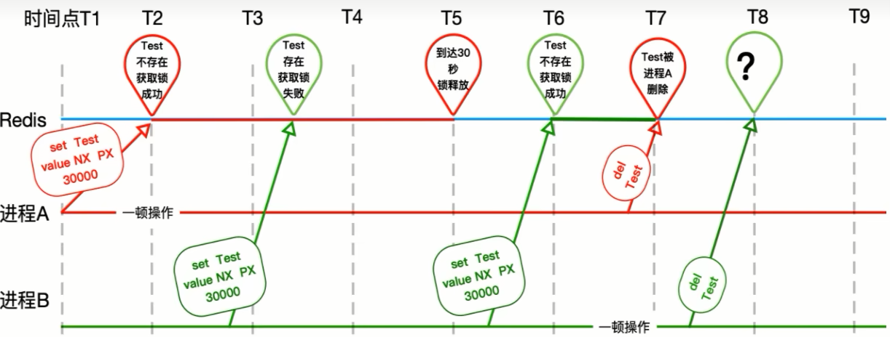


### 解决

只能自己删除自己的，不允许删除别人的说，修改代码为5.0版本

```java
// v5.0 版本
public String sale() {
    String resMessgae = "";
    String key = "luojiaRedisLocak";
    String uuidValue = IdUtil.simpleUUID() + ":" + Thread.currentThread().getId();

    // 不用递归了，高并发容易出错，我们用自旋代替递归方法重试调用；也不用if，用while代替
    while (!stringRedisTemplate.opsForValue().setIfAbsent(key, uuidValue, 30L, TimeUnit.SECONDS)) {
        // 线程休眠20毫秒，进行递归重试
        try {TimeUnit.MILLISECONDS.sleep(20);} catch (InterruptedException e) {e.printStackTrace();}
    }

    try {
        // 1 抢锁成功，查询库存信息
        String result = stringRedisTemplate.opsForValue().get("inventory01");
        // 2 判断库存书否足够
        Integer inventoryNum = result == null ? 0 : Integer.parseInt(result);
        // 3 扣减库存，每次减少一个库存
        if (inventoryNum > 0) {
            stringRedisTemplate.opsForValue().set("inventory01", String.valueOf(--inventoryNum));
            resMessgae = "成功卖出一个商品，库存剩余：" + inventoryNum + "\t" + "，服务端口号：" + port;
            log.info(resMessgae);
        } else {
            resMessgae = "商品已售罄。" + "\t" + "，服务端口号：" + port;
            log.info(resMessgae);
        }
    } finally {
        // v5.0 改进点，判断加锁与解锁是不同客户端，自己只能删除自己的锁，不误删别人的锁
        if (stringRedisTemplate.opsForValue().get(key).equalsIgnoreCase(uuidValue)) {
            stringRedisTemplate.delete(key);
        }
    }
    return resMessgae;
}
```


### v5.0依旧存在问题

finally代码块的判断+del删除不是原子性的

### <font color='red'>启用Lua脚本编写redis分布式锁判断+删除判断代码</font>

lua脚本

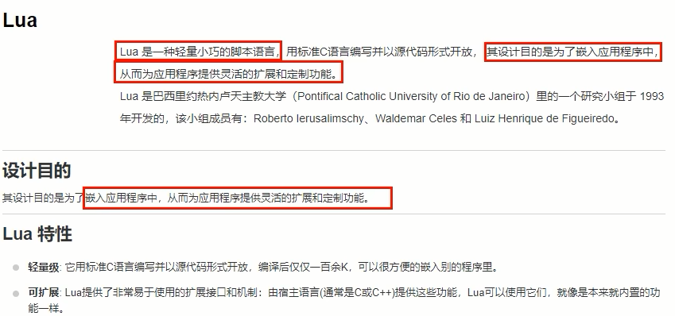

官网解释：https://redis.io/docs/manual/patterns/distributed-locks/

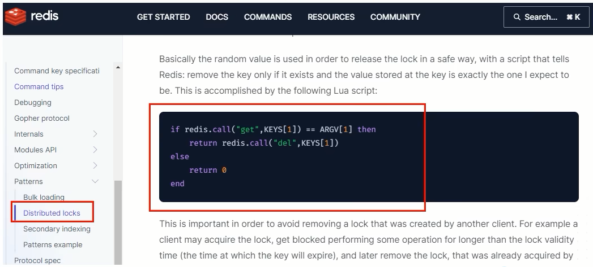

### Lua脚本浅谈

- Lua脚本初识

  Redis调用Lua脚本通过eval命令保证代码执行的原子性，直接用return返回脚本执行后的结果值

  eval luascript numkeys [key [key ...]] [arg [arg ...]]

  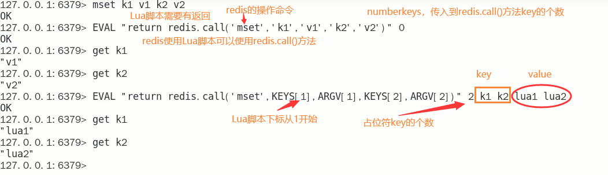

- Lua脚本进一步

  Redis分布式锁Lua脚本官网练习

  ```lua
  eval "if redis.call('get',KEYS[1]) == ARGV[1] then return redis.call('del',KEYS[1]) else return 0 end" 1 luojiaRedisLock 1111
  ```

  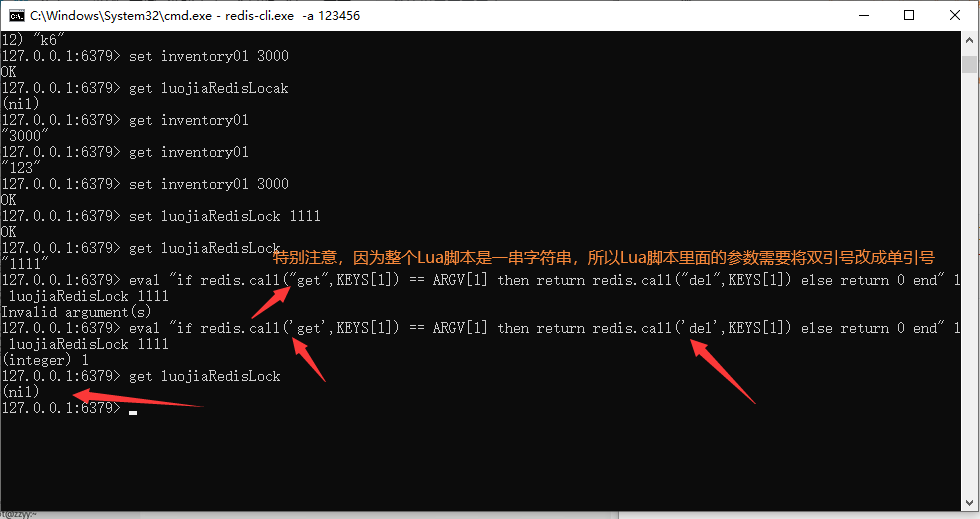

  条件语法判断

  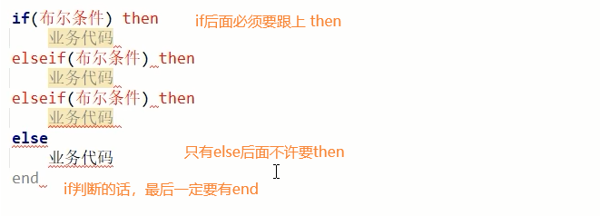

  条件判断案例

  ```lua
  if KEYS[1] > KEYS[2] then return ARGV[1] elseif KEYS[1] < KEYS[2] then return ARGV[2] else return ARGV[3] end
  ```

  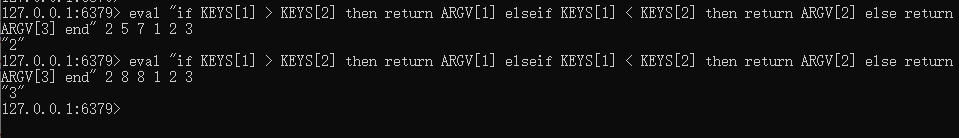

  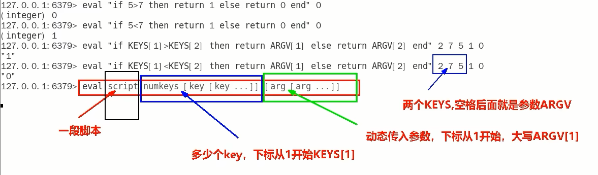

### 通过Lua脚本解决v5.0版本Bug

```java
public String sale() {
    String resMessgae = "";
    String key = "luojiaRedisLocak";
    String uuidValue = IdUtil.simpleUUID() + ":" + Thread.currentThread().getId();

    // 不用递归了，高并发容易出错，我们用自旋代替递归方法重试调用；也不用if，用while代替
    while (!stringRedisTemplate.opsForValue().setIfAbsent(key, uuidValue, 30L, TimeUnit.SECONDS)) {
        // 线程休眠20毫秒，进行递归重试
        try {TimeUnit.MILLISECONDS.sleep(20);} catch (InterruptedException e) {e.printStackTrace();}
    }

    try {
        // 1 抢锁成功，查询库存信息
        String result = stringRedisTemplate.opsForValue().get("inventory01");
        // 2 判断库存书否足够
        Integer inventoryNum = result == null ? 0 : Integer.parseInt(result);
        // 3 扣减库存，每次减少一个库存
        if (inventoryNum > 0) {
            stringRedisTemplate.opsForValue().set("inventory01", String.valueOf(--inventoryNum));
            resMessgae = "成功卖出一个商品，库存剩余：" + inventoryNum + "\t" + "，服务端口号：" + port;
            log.info(resMessgae);
        } else {
            resMessgae = "商品已售罄。" + "\t" + "，服务端口号：" + port;
            log.info(resMessgae);
        }
    } finally {
        // 改进点，修改为Lua脚本的Redis分布式锁调用，必须保证原子性，参考官网脚本案例
        String luaScript =
            "if redis.call('get',KEYS[1]) == ARGV[1] then " +
            "return redis.call('del',KEYS[1]) " +
            "else " +
            "return 0 " +
            "end";
        stringRedisTemplate.execute(new DefaultRedisScript(luaScript, Boolean.class), Arrays.asList(key), uuidValue);

    }
    return resMessgae;
}
```


### 可重入锁又名递归锁

说明：

```text
可重入锁又名递归锁

是指在同一个线程在外层方法获取锁的时候，再进入该线程的内层方法会自动获取锁(前提，锁对象得是同一个对象)，不会因为之前已经获取过还没释放而阻塞。

如果是1个有synchronized修饰的递归调用方法，程序第2次进入被自己阻塞了岂不是天大的笑话，出现了作茧自缚。
所以Java中ReentrantLock和synchronized都是可重入锁，可重入锁的一个优点是可以一定程度避免死锁。
```

可重入锁这四个字分开来解释：

可：可以

重：再次

入：进入

锁：同步锁

进入什么：进入同步域（即同步代码块/方法或显示锁锁定的代码）

一句话：一个线程中的多个流程可以获取同一把锁，持有这把同步锁可以再次进入。自己可以获取自己的内部锁

### 可重入锁种类

- 隐式锁(即synchronized关键字使用的锁) 默认是可重入锁

  ```text
  指的是可重复可递归调用的锁，在外层使用锁之后。在内层仍然可以使用，并目不发生死锁，这样的锁就叫做可重入锁。简单的来说就是:在一个synchronied修饰的方法或代码块的内部调用本类的其他synchronized修饰的方法或代码块时，是永远可以得到锁的。
  与可重入锁相反，不可重入锁不可递归调用，递归调用就发生死锁。
  ```

- Synchronized的重入的实现机理

  ```java
      每个锁对象拥有一个锁计数器和一个指向持有该锁的线程的指针。
  
      当执行monitorenter时，如果目标锁对象的计数器为零，那么说明它没有被其他线程所持有，Java虚拟机会将该锁对象的持有线程设置为当前线程，并且将其计数器加1。
  
      在目标锁对象的计数器不为零的情况下，如果锁对象的持有线程是当前线程，那么 Java 虚拟机可以将其计数器加1，否则需要等待直至持有线程释放该锁。
      当执行monitorexit时，Java虚拟机则需将锁对象的计数器减1。计数器为零代表锁已被释放。
  ```

- 显式锁(即Lock)也有ReentrantLock这样的可重入锁

  ```text
  一个Synchronized修饰的方法或代码块的内部调用本类的其他Synchronized修饰的方法或代码块时，是永远可以得到锁
  ```

### lock/unlock配合可重入锁进行AQS源码分析讲解

切记，一般而言，你Lock了几次就要unlock几次；

可以分析new ReentrantLock();查看


上述可重入锁的计数问题，redis中哪个数据类型可以替代

K K V 数据结构

```java
hset luojiaRedisLock 0c90d37cb6ec42268861b3d739f8b3a8:1 11
    
type luojiaRedisLock -> hash
```

Map<String, Map<Object, Object>>

小总结

setnx只能解决有无的问题，够用但是不完美

hset，不但解决有无，还能解决可重入问题

<font color='red'>设计重点（一横一纵）</font>

目前两个分支，目的是保证同一个时候只能有一个线程持有锁进去redis做扣减库存动作

一个分支保证加锁/解锁，lock/unlock;

另一个分支扣减库存，redis命令的原子性

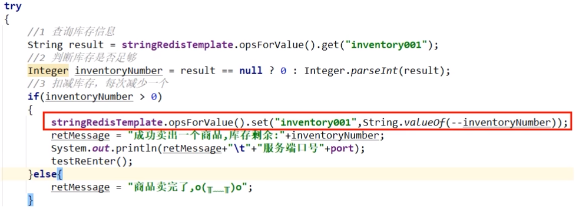

加锁Lua脚本lock

- 先判断redis分布式锁这个key是否存在

  EXISTS key：

  ​	返回零说明不存在，hset新建当前线程属于自己的锁，field key格式为UUID:ThreadID，value为加锁次数；

  ​	返回壹说明已经有锁，需进一步判断是不是当前线程自己的 -> 

  ​	HEXISTS key uuid:ThreadID：返回0说明不是自己的锁；返回1说明是自己的锁，自增1次表示重入

  ​	HINCRBY key UUID:ThreadID 1

- 上述设计修改为Lua脚本

  **V1版本**

  ```lua
  // 加锁的Lua脚本，对标我们的lock方法
  if redis.call('exists', 'key') == 0 then
  	redis.call('hset', 'key', 'uuid:threadid', 1)
  	redis.call('expire', 'key', 50)
  	return 1
  elseif redis.call('hexists', 'key', 'uuid:threadid') == 1 then
  	redis.call('hincrby', 'key', 'uuid:threadid', 1)
  	redis.call('expire', 'key', 50)
  	return 1
  else
  	return 0
  end
  ```

  **V2版本**

  当key不存在的时候，hincrby可以自动创建这个key并且自增

  ```lua
  // V2 合并相同的代码，用hincrby替代hset，精简代码
  if redis.call('exists', 'key') == 0 or redis.call('hexists', 'key', 'uuid:threadid') == 1 then
  	redis.call('hincrby', 'key', 'uuid:threadid', 1)
  	redis.call('expire', 'key', 50)
  	return 1
  else
  	return 0
  end
  ```

  **V3版本**

  ```lua
  // V3 脚本OK，换上参数来替代写死的key，value
  if redis.call('exists', KEYS[1]) == 0 or redis.call('hexists', KEYS[1], ARGV[1]) == 1 then
  	redis.call('hincrby', KEYS[1], ARGV[1], 1)
  	redis.call('expire', KEYS[1], ARGV[2])
  	return 1
  else
  	return 0
  end
  ```

- 测试

  ```lua
  -- 已完成验证
  if redis.call('exists', KEYS[1]) == 0 or redis.call('hexists', KEYS[1], ARGV[1]) == 1 then redis.call('hincrby', KEYS[1], ARGV[1], 1) redis.call('expire', KEYS[1], ARGV[2]) return 1 else return 0 end
  
  eval "if redis.call('exists', KEYS[1]) == 0 or redis.call('hexists', KEYS[1], ARGV[1]) == 1 then redis.call('hincrby', KEYS[1], ARGV[1], 1) redis.call('expire', KEYS[1], ARGV[2]) return 1 else return 0 end" 1 luojiaRedisLock 001122:1 50
  ```


解锁LUA脚本unlock

- 设计思路：有锁且还是自己的锁 -> HEXISTS key uuid:ThreadID

  返回零，说明根本没有锁，程序块返回nil

  不是零，说明有锁且是自己的锁，<font color='red'>直接调用HINCRBY负一</font>，表示每次减一，解锁一次直到它变成零表示可以删除该锁Key，del锁

- 上述设计修改为Lua脚本

  **V1版本**

  ```lua
    // 解锁的Lua脚本，对标我们的lock方法
    if redis.call('hexists', 'key', uuid:threadid) == 0 then
    	return nil
    elseif redis.call('hincrby', key, uuid:threadid, -1) == 0 then
        return redis.call('del', key)
    else 
        return 0
    end
  ```

- **V2版本**

  ```lua
  if redis.call('hexists', KEYS[1], ARGV[1]) == 0 then
  	return nil
  elseif redis.call('hincrby', KEYS[1], ARGV[1], -1) == 0 then
      return redis.call('del', KEYS[1])
  else 
      return 0
  end
  ```

- 测试验证

  ```lua
  if redis.call('hexists', KEYS[1], ARGV[1]) == 0 then return nil elseif redis.call('hincrby', KEYS[1], ARGV[1], -1) == 0 then return redis.call('del', KEYS[1]) else return 0 end
  
  eval "if redis.call('hexists', KEYS[1], ARGV[1]) == 0 then return nil elseif redis.call('hincrby', KEYS[1], ARGV[1], -1) == 0 then return redis.call('del', KEYS[1]) else return 0 end " 1 luojiaRedisLock 001122:1
  ```

  


步骤一：<font color='gree'>复原程序为初识无锁版本</font>

```java
public String sale() {
    String resMessgae = "";

    try {
        // 1 抢锁成功，查询库存信息
        String result = stringRedisTemplate.opsForValue().get("inventory01");
        // 2 判断库存书否足够
        Integer inventoryNum = result == null ? 0 : Integer.parseInt(result);
        // 3 扣减库存，每次减少一个库存
        if (inventoryNum > 0) {
            stringRedisTemplate.opsForValue().set("inventory01", String.valueOf(--inventoryNum));
            resMessgae = "成功卖出一个商品，库存剩余：" + inventoryNum + "\t" + "，服务端口号：" + port;
            log.info(resMessgae);
        } else {
            resMessgae = "商品已售罄。" + "\t" + "，服务端口号：" + port;
            log.info(resMessgae);
        }
    } finally {

    }
    return resMessgae;
}
```

步骤二：新建RedisDistributedLock类实现JUC里面的Lock接口


步骤三：满足JUC里面AQS对Lock锁的接口规范定义来进行实现落地代码


步骤四：结合设计模式开发属于自己的Redis分布式锁工具类

lua脚本加锁

```lua
if redis.call('exists', KEYS[1]) == 0 or redis.call('hexists', KEYS[1], ARGV[1]) == 1 then
	redis.call('hincrby', KEYS[1], ARGV[1], 1)
	redis.call('expire', KEYS[1], ARGV[2])
	return 1
else
	return 0
end
```

lua脚本解锁

```lua
if redis.call('hexists', KEYS[1], ARGV[1]) == 0 then
	return nil
elseif redis.call('hincrby', KEYS[1], ARGV[1], -1) == 0 then
    return redis.call('del', KEYS[1])
else 
    return 0
end
```

工厂设计模式引入

- 通过实现JUC里面的Lock接口，实现Redis分布式锁RedisDistributedLock

  ```java
  package com.luojia.redislock.mylock;
  
  import cn.hutool.core.util.IdUtil;
  import org.springframework.data.redis.core.StringRedisTemplate;
  import org.springframework.data.redis.core.script.DefaultRedisScript;
  
  import java.util.Arrays;
  import java.util.concurrent.TimeUnit;
  import java.util.concurrent.locks.Condition;
  import java.util.concurrent.locks.Lock;
  
  /**
   * 自研的分布式锁，实现了Lock接口
   */
  public class RedisDistributedLock implements Lock {
  
      private StringRedisTemplate stringRedisTemplate;
  
      private String lockName; // KEYS[1]
      private String uuidValule; // ARGV[1]
      private long expireTime; // ARGV[2]
  
      public RedisDistributedLock(StringRedisTemplate stringRedisTemplate, String lockName) {
          this.stringRedisTemplate = stringRedisTemplate;
          this.lockName = lockName;
          this.uuidValule = IdUtil.simpleUUID() + ":" + Thread.currentThread().getId();
          this.expireTime = 50L;
      }
  
      @Override
      public void lock() {
          tryLock();
      }
  
      @Override
      public boolean tryLock() {
          try {
              tryLock(-1L, TimeUnit.SECONDS);
          } catch (InterruptedException e) {
              e.printStackTrace();
          }
          return false;
      }
  
      @Override
      public boolean tryLock(long time, TimeUnit unit) throws InterruptedException {
          if (-1 == time) {
              String script =
                      "if redis.call('exists', KEYS[1]) == 0 or redis.call('hexists', KEYS[1], ARGV[1]) == 1 then " +
                          "redis.call('hincrby', KEYS[1], ARGV[1], 1) " +
                          "redis.call('expire', KEYS[1], ARGV[2]) " +
                          "return 1 " +
                      "else " +
                           "return 0 " +
                      "end";
              System.out.println("lockName:" + lockName + "\t" + "uuidValue:" + uuidValule);
  
              // 加锁失败需要自旋一直获取锁
              while (!stringRedisTemplate.execute(
                      new DefaultRedisScript<>(script, Boolean.class),
                      Arrays.asList(lockName),
                      uuidValule,
                      String.valueOf(expireTime))) {
                  // 休眠60毫秒再来重试
                  try {TimeUnit.MILLISECONDS.sleep(60);} catch (InterruptedException e) {e.printStackTrace();}
              }
              return true;
          }
          return false;
      }
  
      @Override
      public void unlock() {
          String script = "" +
                  "if redis.call('hexists', KEYS[1], ARGV[1]) == 0 then " +
                  "return nil " +
                  "elseif redis.call('hincrby', KEYS[1], ARGV[1], -1) == 0 then " +
                  "return redis.call('del', KEYS[1]) " +
                  "else " +
                  "return 0 " +
                  "end";
          System.out.println("lockName:" + lockName + "\t" + "uuidValue:" + uuidValule);
          
          // LUA脚本由C语言编写，nil -> false; 0 -> false; 1 -> true;
          // 所以此处DefaultRedisScript构造函数返回值不能是Boolean，Boolean没有nil
          Long flag = stringRedisTemplate.execute(
                  new DefaultRedisScript<>(script, Long.class),
                  Arrays.asList(lockName),
                  uuidValule);
          if (null == flag) {
              throw new RuntimeException("this lock does not exists.");
          }
      }
  
      // 下面两个暂时用不到，不用重写
      @Override
      public void lockInterruptibly() throws InterruptedException {
  
      }
  
      @Override
      public Condition newCondition() {
          return null;
      }
  }
  ```

  ```java
  // v7.0 使用自研的lock/unlock+LUA脚本自研的Redis分布式锁
  Lock redisDistributedLock = new RedisDistributedLock(stringRedisTemplate, "luojiaRedisLock");
  public String sale() {
      String resMessgae = "";
      redisDistributedLock.lock();
      try {
          // 1 抢锁成功，查询库存信息
          String result = stringRedisTemplate.opsForValue().get("inventory01");
          // 2 判断库存书否足够
          Integer inventoryNum = result == null ? 0 : Integer.parseInt(result);
          // 3 扣减库存，每次减少一个库存
          if (inventoryNum > 0) {
              stringRedisTemplate.opsForValue().set("inventory01", String.valueOf(--inventoryNum));
              resMessgae = "成功卖出一个商品，库存剩余：" + inventoryNum + "\t" + "，服务端口号：" + port;
              log.info(resMessgae);
          } else {
              resMessgae = "商品已售罄。" + "\t" + "，服务端口号：" + port;
              log.info(resMessgae);
          }
      } finally {
          redisDistributedLock.unlock();
      }
      return resMessgae;
  }
  ```

- 如果直接使用上面的代码设计，会有什么问题
  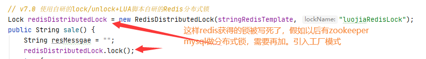

- 需要考虑扩展，本次是Redis实现分布式锁，以后zookeeper、MySQL实现呢？

- 引入工厂模式改造7.1版code

  DistributedLockFactory

  ```java
  package com.luojia.redislock.mylock;
  
  import org.springframework.beans.factory.annotation.Autowired;
  import org.springframework.data.redis.core.StringRedisTemplate;
  import org.springframework.stereotype.Component;
  
  import java.util.concurrent.locks.Lock;
  
  @Component
  public class DistributedLockFactory {
  
      @Autowired
      private StringRedisTemplate stringRedisTemplate;
  
      public Lock getDistributedLock(String lockType, String lockName) {
          if (lockType == null) {
              return null;
          }
  
          if ("REDIS".equalsIgnoreCase(lockType)) {
              return new RedisDistributedLock(stringRedisTemplate, lockName);
          } else if ("ZOOKEEPER".equalsIgnoreCase(lockType)) {
              // 后面存在就返回对应的分布式锁
          } else if ("MYSQL".equalsIgnoreCase(lockType)) {
              // 后面存在就返回对应的分布式锁
          }
  
          return null;
      }
  }
  ```

  InventoryService使用工厂模式版本

  ```java
  // v7.0 使用自研的lock/unlock+LUA脚本自研的Redis分布式锁
  @Autowired
  private DistributedLockFactory distributedLockFactory;
  public String sale() {
      String resMessgae = "";
      Lock redisLock = distributedLockFactory.getDistributedLock("REDIS", "luojiaRedisLock");
      redisLock.lock();
      try {
          // 1 抢锁成功，查询库存信息
          String result = stringRedisTemplate.opsForValue().get("inventory01");
          // 2 判断库存书否足够
          Integer inventoryNum = result == null ? 0 : Integer.parseInt(result);
          // 3 扣减库存，每次减少一个库存
          if (inventoryNum > 0) {
              stringRedisTemplate.opsForValue().set("inventory01", String.valueOf(--inventoryNum));
              resMessgae = "成功卖出一个商品，库存剩余：" + inventoryNum + "\t" + "，服务端口号：" + port;
              log.info(resMessgae);
          } else {
              resMessgae = "商品已售罄。" + "\t" + "，服务端口号：" + port;
              log.info(resMessgae);
          }
      } finally {
          redisLock.unlock();
      }
      return resMessgae;
  }
  ```

- 单机+并发通过测试


可重入测试

InventoryService类新增可重入测试方法

```java
// v7.1 使用工厂类创建锁
@Autowired
private DistributedLockFactory distributedLockFactory;
public String sale() {
    String resMessgae = "";
    Lock redisLock = distributedLockFactory.getDistributedLock("REDIS", "luojiaRedisLock");
    redisLock.lock();
    try {
        // 1 抢锁成功，查询库存信息
        String result = stringRedisTemplate.opsForValue().get("inventory01");
        // 2 判断库存书否足够
        Integer inventoryNum = result == null ? 0 : Integer.parseInt(result);
        // 3 扣减库存，每次减少一个库存
        if (inventoryNum > 0) {
            stringRedisTemplate.opsForValue().set("inventory01", String.valueOf(--inventoryNum));
            resMessgae = "成功卖出一个商品，库存剩余：" + inventoryNum + "\t" + "，服务端口号：" + port;
            log.info(resMessgae);
            testReEntry();
        } else {
            resMessgae = "商品已售罄。" + "\t" + "，服务端口号：" + port;
            log.info(resMessgae);
        }
    } finally {
        redisLock.unlock();
    }
    return resMessgae;
}

private void testReEntry() {

    Lock redisLock = distributedLockFactory.getDistributedLock("REDIS", "luojiaRedisLock");
    redisLock.lock();
    try {
        log.info("=================测试可重入锁=================");
    } finally {
        redisLock.unlock();
    }
}
```

结果：无法重入

testReEntry方法中，会创建一个新的锁Key，因为ThreadID一致了，但是UUID不OK

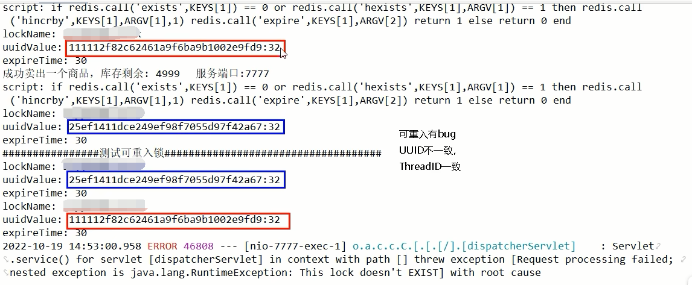

引入工厂模式改造7.2版本code

DistributedLockFactory -> 新增一个无参构造函数

```Java
package com.luojia.redislock.mylock;

import cn.hutool.core.util.IdUtil;
import org.springframework.beans.factory.annotation.Autowired;
import org.springframework.data.redis.core.StringRedisTemplate;
import org.springframework.stereotype.Component;

import java.util.concurrent.locks.Lock;

@Component
public class DistributedLockFactory {

    @Autowired
    private StringRedisTemplate stringRedisTemplate;

    private String uuid;

    public DistributedLockFactory() {
        this.uuid = IdUtil.simpleUUID();
    }

    public Lock getDistributedLock(String lockType, String lockName) {
        if (lockType == null) {
            return null;
        }

        if ("REDIS".equalsIgnoreCase(lockType)) {
            return new RedisDistributedLock(stringRedisTemplate, lockName, uuid);
        } else if ("ZOOKEEPER".equalsIgnoreCase(lockType)) {
            // 后面存在就返回对应的分布式锁
        } else if ("MYSQL".equalsIgnoreCase(lockType)) {
            // 后面存在就返回对应的分布式锁
        }
        return null;
    }
}
```

RedisDistributedLock -> 修改构造方法

```java
// V7.2 
public RedisDistributedLock(StringRedisTemplate stringRedisTemplate, String lockName, String uuid) {
    this.stringRedisTemplate = stringRedisTemplate;
    this.lockName = lockName;
    this.uuidValule = uuid + ":" + Thread.currentThread().getId();
    this.expireTime = 50L;
}
```

使用@Autowired创建的工厂类是一个单例的，在spring进行注入的时候已经初始化好了，所以所有线程产生的UUID都是一样的


确保RedisLock过期时间大于业务执行时间的问题

时间到了，业务没有执行完需要自动续期

CAP

- Redis集群是AP

  <font color='red'>redis异步复制造成的锁丢失</font>，比如：主节点没来的及把刚刚set进来的这条数据给从节点，master就挂了，从机上位但是从机上无数据

- Zookeeper集群是CP

  

  故障：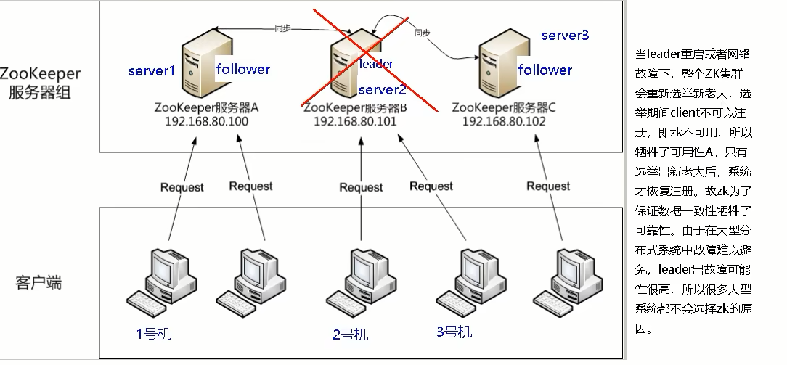

- Eureka集群是AP

  

- Nacos集群是AP

  

自动续期的LUA脚本

```lua
// 自动续期的LUA脚本
if redis.call('hexists', KEYS[1], ARGV[1]) == 1 then
    return redis.call('expire', KEYS[1], ARGV[2])
else
    return 0
end
```

测试验证

```lua
if redis.call('hexists', KEYS[1], ARGV[1]) == 1 then return redis.call('expire', KEYS[1], ARGV[2]) else return 0 end
---
hset luojiaRedisLock test 001
expire luojiaRedisLock 30
eval "if redis.call('hexists', KEYS[1], ARGV[1]) == 1 then return redis.call('expire', KEYS[1], ARGV[2]) else return 0 end" 1 luojiaRedisLock test 1
```

<font color='gree'>8.0新增自动续期功能</font>

```java
@Override
public boolean tryLock(long time, TimeUnit unit) throws InterruptedException {
    if (-1 == time) {
        String script =
            "if redis.call('exists', KEYS[1]) == 0 or redis.call('hexists', KEYS[1], ARGV[1]) == 1 then " +
            "redis.call('hincrby', KEYS[1], ARGV[1], 1) " +
            "redis.call('expire', KEYS[1], ARGV[2]) " +
            "return 1 " +
            "else " +
            "return 0 " +
            "end";
        System.out.println("lock() lockName:" + lockName + "\t" + "uuidValue:" + uuidValule);

        // 加锁失败需要自旋一直获取锁
        while (!stringRedisTemplate.execute(
            new DefaultRedisScript<>(script, Boolean.class),
            Arrays.asList(lockName),
            uuidValule,
            String.valueOf(expireTime))) {
            // 休眠60毫秒再来重试
            try {TimeUnit.MILLISECONDS.sleep(60);} catch (InterruptedException e) {e.printStackTrace();}
        }
        // 新建一个后台扫描程序，来检查Key目前的ttl，是否到我们规定的剩余时间来实现锁续期
        resetExpire();
        return true;
    }
    return false;
}

// 自动续期
private void resetExpire() {
    String script =
        "if redis.call('hexists', KEYS[1], ARGV[1]) == 1 then " +
        "return redis.call('expire', KEYS[1], ARGV[2]) " +
        "else " +
        "return 0 " +
        "end";
    new Timer().schedule(new TimerTask() {
        @Override
        public void run() {
            if (stringRedisTemplate.execute(
                new DefaultRedisScript<>(script, Boolean.class),
                Arrays.asList(lockName),
                uuidValule,
                String.valueOf(expireTime))) {
                // 续期成功，继续监听
                System.out.println("resetExpire() lockName:" + lockName + "\t" + "uuidValue:" + uuidValule);
                resetExpire();
            }
        }
    }, (this.expireTime * 1000 / 3));
}
```


总结

synchronized单机版OK； -> v1.0

Nginx分布式微服务，轮询多台服务器，单机锁不行；-> v2.0

取消单机锁，上redis分布式锁setnx，中小企业使用没问题；-> v3.1

​	只是加锁了，没有释放锁，出异常的话，可能无法释放锁，必须要在代码层面finally释放锁 -> v3.2

​	如果服务宕机，部署了微服务代码层面根本就没有走到finally这块，没办法保证解锁，这个Key没有被删除，需要对锁设置过期时间 -> v3.2

​	为redis的分布式锁key增加过期时间，还必须要保证setnx+过期时间在同一行，保证原子性 -> v4.1

​	程序由于执行超过锁的过期时间，所以在finally中必须规定只能自己删除自己的锁，不能把别人的锁删除了，防止张冠李戴 -> v5.0

将Lock、unlock变成LUA脚本保证原子性； -> v6.0

保证锁的可重入性，hset替代setnx+Lock变成LUA脚本，保障可重入性； -> v7.0

锁的自动续期 -> v8.0


