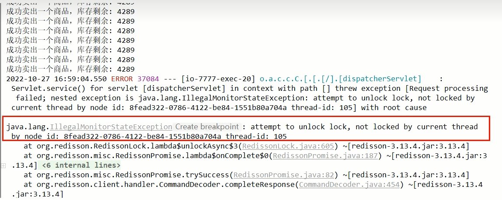

# 第9章-Redlock算法和底层源码分析
## 9.1 当前代码为8.0版接上一步

### 9.1.1 自研一把分布式锁，面试回答的主要考点

1. 按照JUC里面java.util.concurrent.locks.Lock接口规范编写

2. lock()加锁关键逻辑

   - 加锁：加锁实际上就是在redis中，给key设置一个值，为了避免死锁，并给定一个过期时间

   - 可重入：加锁的LUA脚本，通过redis里面的hash数据模型，加锁和可重入性都要保证

   - 自旋：加锁不成，需要while进行重试并自旋，AQS

   - 续期：在过期时间内，一定时间内业务还未完成，自动给锁续期

     

3. unlock()解锁关键逻辑

   - 将redis的key删除，但是也不能乱删，不能说客户端1的请求将客户端2的锁给删除掉了，只能自己删自己的锁

   - 考虑可重入性的递减，加锁几次就需要删除几次

   - 最后到零了，直接del删除

     

### 9.1.2 上面自研的redis锁对于一般中小公司，不是特别高并发场景足够用了，单机redis小业务也撑得住


## 9.2 Redis分布式锁-Redlock红锁算法 Distributed locks with Redis

### 9.2.1 官网说明

https://redis.io/docs/latest/develop/clients/patterns/distributed-locks/

主页说明


### 9.2.2 为什么学习这个？怎么产生的？

之前手写的分布式锁有什么缺点：单集群故障问题

官网说明：

翻译：

有时在特殊情况下，例如在故障期间，多个客户端可以同时持有锁是完全没问题的。如果是这种情况，您可以使用基于复制的解决方案。否则，我们建议实施本文档中描述的解决方案。

线程1首先获取锁成功，将键值对写入redis 的 master节点，在 redis将该键值对同步到slave 节点之前，master发生了故障；

redis触发故障转移，其中一个slave升级为新的 master，此时新上位的master并不包含线程1写入的键值对，因此线程⒉尝试获取锁也可以成功拿到锁，此时相当于有两个线程获取到了锁，可能会导致各种预期之外的情况发生，例如最常见的脏数据。

我们加的是排它独占锁，同一时间只能有一个建redis锁成功并持有锁，严禁出现2个以上的请求线程拿到锁。

### 9.2.3 RedLock算法设计理念

- Redis之父提出了RedLock算法解决上面这个一锁被多建的问题

  **Redis**也提供了**Redlock**算法，用来实现<font color = 'red'>基于多个实例的</font>分布式锁。
  锁变量由多个实例维护，即使有实例发生了故障，锁变量仍然是存在的，客户端还是可以完成锁操作。Redlock算法是实现高可靠分布式锁的一种有效解决方案，可以在实际开发中使用。

  Redlock算法官网：

  翻译：

- 设计理念

  该方案也是基于(set加锁、Lua脚本解锁）进行改良的，所以redis之父antirez只描述了差异的地方，大致方案如下：假设我们有N个Redis主节点，例如N= 5这些节点是完全独立的，我们不使用复制或任何其他隐式协调系统，为了取到锁客户端执行以下操作：

  1. 获取当前时间，以毫秒为单位;

  2. 依次尝试从5个实例，使用相同的 key和随机值（例如 UUID）获取锁。当向Redis 请求获取锁时，客户端应该设置一个超时时间，这个超时时间应该小于锁的失效时间。例如你的锁自动失效时间为10秒，则超时时间应该在5-50毫秒之间。这样可以防止客户端在试图与一个宕机的 Redis 节点对话时长时间处于阻塞状态。如果一个实例不可用，客户端应该尽快尝试去另外一个Redis实例请求获取锁;

  3. 客户端通过当前时间减去步骤1记录的时间来计算获取锁使用的时间。当且仅当从大多数(N/2+1，这里是3个节点)的Redis节点都取到锁，并且获取锁使用的时间小于锁失效时间时，锁才算获取成功;

  4. 如果取到了锁，其真正有效时间等于初始有效时间减去获取锁所使用的时间（步骤3计算的结果）。

  5. 如果由于某些原因未能获得锁（无法在至少N/2＋1个Redis实例获取锁、或获取锁的时间超过了有效时间)，客户端应该在所有的Redis 实例上进行解锁（即便某些Redis实例根本就没有加锁成功，防止某些节点获取到锁但是客户端没有得到响应而导致接下来的一段时间不能被重新获取锁）。

     该方案为了解决数据不一致的问题，<font color = 'red'>直接舍弃了异步复制只使用master节点</font>，同时由于舍弃了slave，为了保证可用性，引入了N个节点

     <font color = 'blue'>客户端只有在满足下面的这两个条件时，才能认为是加锁成功。</font>

     <font color = 'blue'>条件1:客户端从超过半数（大于等于N/2+1）的Redis实例上成功获取到了锁;</font>

     <font color = 'blue'>条件2:客户端获取锁的总耗时没有超过锁的有效时间。</font>

- 解决方案

  

  为什么是奇数：N = 2X + 1 （N是最终部署机器数，X是容错机器数）

### 9.2.4 Redisson实现

Redisson是Java的Redis客户端之一，提供了一些API方便操作Redis

Redisson之官网：[https://redisson.pro](https://redisson.pro/)

Redisson之github：https://github.com/redisson/redisson/wiki

Redisson之解决分布式锁：https://github.com/redisson/redisson/wiki/8.-distributed-locks-and-synchronizers


## 9.3 使用Redisson进行编码改造V9.0版本修改

改pom：加上Redisson相关代码

```xml
<!-- redisson -->
<dependency>
    <groupId>org.redisson</groupId>
    <artifactId>redisson</artifactId>
    <version>3.13.4</version>
</dependency>
```

配置类：RedisConfig

```java
@Bean
public Redisson redisson() {
    Config config = new Config();
    config.useSingleServer()
        .setAddress("redis://127.0.0.1:6379")
        .setDatabase(0)
        .setPassword("123456");
    return (Redisson) Redisson.create(config);
}
```

修改服务方法：InventoryService

```java
// V9.0, 引入Redisson对应的官网推荐RedLock算法实现类
@Autowired
private Redisson redisson;
public String saleByRedisson() {
    String resMessgae = "";
    RLock redissonLock = redisson.getLock("luojiaRedisLock");
    redissonLock.lock();
    try {
        // 1 抢锁成功，查询库存信息
        String result = stringRedisTemplate.opsForValue().get("inventory01");
        // 2 判断库存书否足够
        Integer inventoryNum = result == null ? 0 : Integer.parseInt(result);
        // 3 扣减库存，每次减少一个库存
        if (inventoryNum > 0) {
            stringRedisTemplate.opsForValue().set("inventory01", String.valueOf(--inventoryNum));
            resMessgae = "成功卖出一个商品，库存剩余：" + inventoryNum + "\t" + "，服务端口号：" + port;
            log.info(resMessgae);
        } else {
            resMessgae = "商品已售罄。" + "\t" + "，服务端口号：" + port;
            log.info(resMessgae);
        }
    } finally {
        redissonLock.unlock();
    }
    return resMessgae;
}
```

**测试**

jmeter压测

- 发现Bug

  

- 解决

  业务代码修改为V9.1版本，保证删除时候，删除的是自己，修改删除代码的finally部分即可

  ```java
  finally {
      // 改进点，只能删除属于自己的key，不能删除别人的
      if(redissonLock.isLocked() && redissonLock.isHeldByCurrentThread()) {
          redissonLock.unlock();
      }
  }
  ```

## 9.4 Redisson编码解析

### 9.4.1 加锁、可重入、续命、解锁

分标题四个步骤分析

### 9.4.2 分析步骤

- Redis分布式锁过期了，但是业务逻辑还没有处理完怎么办

  需要给对应的key续期

- 守护线程“续命”

  <font color = 'red'>额外起一个线程，定期检查线程是否还持有锁，如果有则延长过期时间</font>；

  Redisson里面就实现了这个方案，使用“看门狗”定期检查（每1/3的锁时间检查1次），如果线程还持有锁，则刷新过期时间。

- 在获取锁成功后，给锁加一个watchdog，watchdog会起一个定时任务，在锁没有被释放且快要过期的时候会续期

  

  

- 上述源码分析1

  通过Redisson新建出来的锁key，默认是30秒

  

- 上述源码分析2：lock -> tryAcquire -> tryAcquireAsync -> scheduleExpirationRenewal 缓存续期

  

- 上述源码分析3：lock -> tryAcquire -> tryAcquireAsync，锁的可重入性

  通过exists判断，如果锁不存在，则设置值和过期时间，加锁成功

  通过hexists判断，如果锁已存在，并且锁的是当前线程，则证明是重入锁，加锁成功

  如果锁已存在，但锁的不是当前线程，则证明有其他线程持有锁。返回当前锁的过期时间(代表了锁key的剩余生存时间)，加锁失败

  

- 上述源码分析4

  **watch dog自动延期机制：**

  源码中初始化了一个定时器，dely的时间是 internalLockLeaseTime / 3。

  在Redisson中，internalLockLeaseTime 是获取配置的看门狗的时间，默认是30s，也就是每隔10s续期一次，每次重新设置过期时间为30s。

  Redisson看门狗续期源码：

  ```java
  private void renewExpiration() {
      ExpirationEntry ee = EXPIRATION_RENEWAL_MAP.get(getEntryName());
      if (ee == null) {
          return;
      }
  
      Timeout task = commandExecutor.getConnectionManager().newTimeout(new TimerTask() {
          @Override
          public void run(Timeout timeout) throws Exception {
              ExpirationEntry ent = EXPIRATION_RENEWAL_MAP.get(getEntryName());
              if (ent == null) {
                  return;
              }
              Long threadId = ent.getFirstThreadId();
              if (threadId == null) {
                  return;
              }
  
              RFuture<Boolean> future = renewExpirationAsync(threadId);
              future.onComplete((res, e) -> {
                  if (e != null) {
                      log.error("Can't update lock " + getName() + " expiration", e);
                      return;
                  }
  
                  if (res) {
                      // reschedule itself
                      renewExpiration();
                  }
              });
          }
      }, internalLockLeaseTime / 3, TimeUnit.MILLISECONDS);
  
      ee.setTimeout(task);
  }
  ```

  如果直接调用lock方法，客户端A加锁成功，就会启动一个watch dog看门狗，他是一个后台线程，默认是每隔10s检查一下，如果客户端A还持有锁，就会不断的延长锁的时间。当然，如果不想使用看门狗，可以使用其他的lock带参数方法，有锁过期时间，不会有看门狗续期

  **自动续期Lua脚本源码：**

  ```java
  protected RFuture<Boolean> renewExpirationAsync(long threadId) {
      return evalWriteAsync(getName(), LongCodec.INSTANCE, RedisCommands.EVAL_BOOLEAN,
                            "if (redis.call('hexists', KEYS[1], ARGV[2]) == 1) then " +
                            "redis.call('pexpire', KEYS[1], ARGV[1]); " +
                            "return 1; " +
                            "end; " +
                            "return 0;",
                            Collections.singletonList(getName()),
                            internalLockLeaseTime, getLockName(threadId));
  }
  ```

  

- 解锁

  

## 9.5 多机案例

### 9.5.1 理论参考来源

* Redis之父提出了Redlock算法解决这个问题

* 这个锁的算法实现了多redis实例的情况，相对于单redis节点来说，<font color='red'>优点在于防止了单节点故障造成整个服务停止运行</font>的情况且在多节点中锁的设计，及多节点同时崩溃等各种意处情况有自己独特的设计方法。

* Redisson 分布式锁支持 MultiLock 机制可以将多个锁合并为一个大锁，对一个大锁进行统一的申请加锁以及释放锁。

<font color='gren'>最低保证分布式锁的有效性及安全性的要求如下:</font>

1.互斥：任何时刻只能有一个client获取锁

2.释放死锁：即使锁定资源的服务崩溃或者分区，仍然能释放锁

3.容错性：只要多数redis节点(一半以上) 在使用，client就可以获取和释放锁

<font color='gren'>网上讲的基于故障转移实现的redis主从无法真正实现Redlock：</font>

因为redis在进行主从复制时是异步完成的，比如在clientA获取锁后，主redis复制数据到从redis过程中崩溃了，导致没有复制到从redis中，然后从redis选举出一个升级为主redis，造成新的主redis没有clientA 设置的锁，这时clientB尝试获取锁，并且能够成功获取锁，导致互斥失效；

### 9.5.2 代码参考来源

https://github.com/redisson/redisson/wiki/8.-distributed-locks-and-synchronizers

最新推荐使用MultiLock多重锁，详见官网案例

* RedLock 已经被弃用了，使用RLock
  * This object is deprecated. Refer to this [article](https://martin.kleppmann.com/2016/02/08/how-to-do-distributed-locking.html) for more details. Superseded by [RLock](https://redisson.pro/docs/data-and-services/locks-and-synchronizers/#lock) and [RFencedLock](https://redisson.pro/docs/data-and-services/locks-and-synchronizers/#fair-lock) objects.

使用Redisson分布式锁，需要单独的Redis master多节点，不能是哨兵模式的master或者集群模式的master；


加入现在有三台Redis 服务器，并且是master：

```java
RLock lock1 = redisson1.getLock("lock1");
RLock lock2 = redisson2.getLock("lock2");
RLock lock3 = redisson3.getLock("lock3");

RLock multiLock = anyRedisson.getMultiLock(lock1, lock2, lock3);

// traditional lock method
multiLock.lock();
```

这样三台Redis都会有加锁信息，当其中某一台宕机后，不会影响整个加锁信息，其他客户端过来依旧会拿到锁信息，不能成功获取到锁(可重入锁除外)，次数如果宕机服务器重新上线，它会自动同步其他Redis上的锁信息，并且同步锁过期时间


