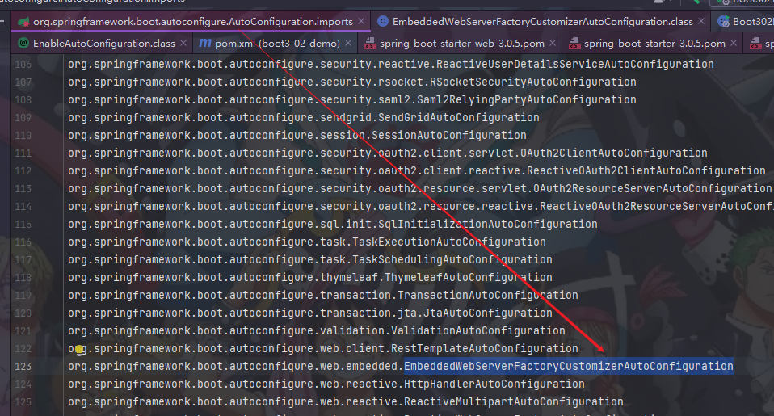
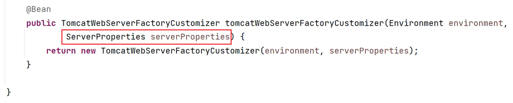
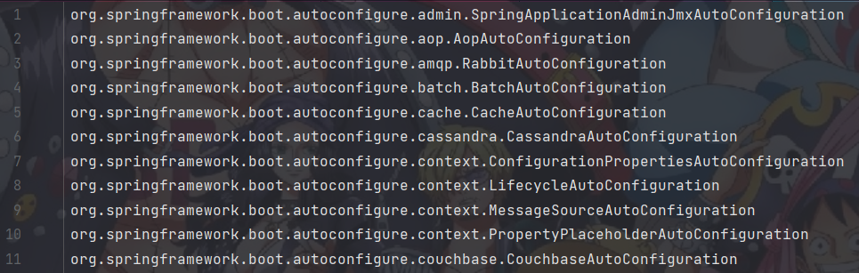
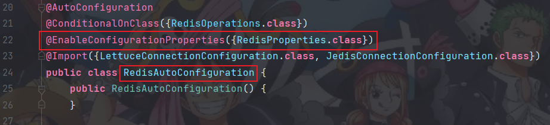
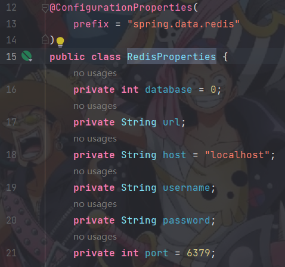
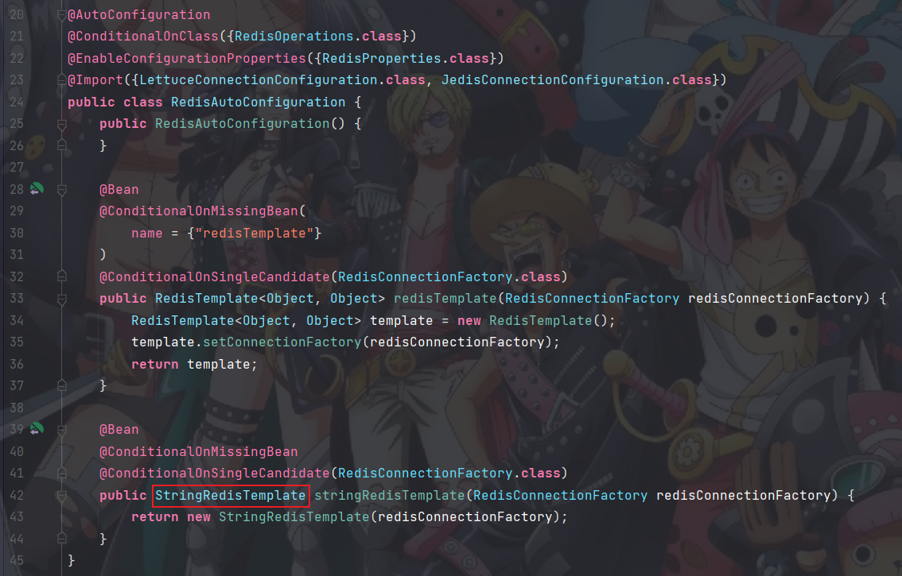
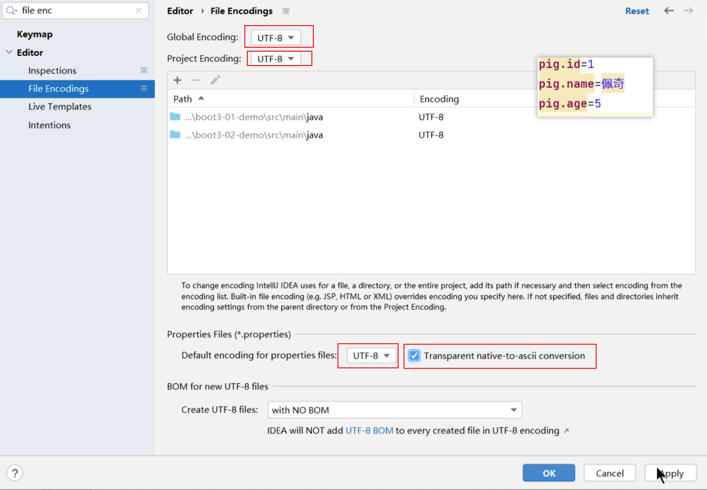

# SpringBoot全套

## SpringBoot核心特性

1. SpringBoot-快速⼊⻔
2. SpringBoot-Web开发
3. SpringBoot-数据访问
4. SpringBoot-基础特性
5. SpringBoot-核⼼原理
6. 附录：SpringBoot改变&新特性

## SpringBoot_场景整合

1. NoSQL
2. 接⼝⽂档远
3. 程调⽤
4. 消息服务Web安全
5. 可观测性
6. AOT

## SpringBoot响应式编程

1. Reactor核⼼
2. SpringWebflux
3. RDBC
4. SpringSecurityReactive

## SpringBoot分流

### Reactive Stack（响应式技术栈）

* Netty,Servlet3.1+ Containers
* Reactive Streams Adapters
* Spring Securitry Reactive
* Spring WebFlux
* Spring Data Reactive Repositories(Mongo,Cassandra,Redis,Couchbase,R2DBC)

### Servlet Stack（Servlet 技术栈）

* Servlet Containers
* Servlet API
* Spring Securitry 
* Spring MVC
* Spring Data Repositories(JDBC,JPA,NoSQL)

# 第1章 SpringBoot-快速⼊⻔

## 1.1 简介

项⽬源码： https://gitee.com/leifengyang/spring-boot-3

### 1.1.1 前置知识 

- Java17（最低要求）
- Spring、SpringMVC、MyBatis（相关框架）
- Maven、IDEA （工具）

### 1.1.2 环境要求

| 环境&⼯具          | 版本（or later |
| ------------------ | -------------- |
| SpringBoot         | 3.0.5+         |
| IDEA               | 2021.2.1+      |
| Java               | 17+            |
| Maven              | 3.5+           |
| Tomcat             | 10.0+          |
| Servlet            | 5.0+           |
| GraalVM Community  | 22.3+          |
| Native Build Tools | 0.9.19         |

### 1.1.3 SpringBoot是什么 

SpringBoot 帮我们简单、快速地创建⼀个独立的、生产级别的 Spring 应用（说明：SpringBoot 底层是Spring）

大多数 SpringBoot 应用只需要编写少量配置即可快速整合 Spring 平台以及第三方技术 **特性：**

* 快速创建独立 Spring 应用 
  *  SSM：导包-->写配置-->启动运行
* 直接嵌⼊Tomcat、Jetty or Undertow（无需部署 war 包）【Servlet容器】
  * linux  java tomcat mysql： war 放到 tomcat 的 webapps下
  *  jar: java环境；  java -jar 
* 重点：提供可选的 starter，简化应用整合 
  * 场景启动器（starter）：web、json、邮件、oss（对象存储）、异步、定时任务、缓存... 
  * 导包一堆，控制好版本。 
  * 为每⼀种场景准备了一个依赖； web-starter。mybatis-starter 
* 重点： 按需自动配置 Spring 以及 第三方库
  *  如果这些场景我要使用（生效）。这个场景的所有配置都会自动配置好。
  *  约定⼤于配置：每个场景都有很多默认配置。 
  * 自定义：配置⽂件中修改几项就可以 
* 提供生产级特性：如 监控指标、健康检查、外部化配置等 
  * 监控指标、健康检查（k8s）、外部化配置 
* 无代码生成、 无xml 

总结：简化开发，简化配置，简化整合，简化部署，简化监控，简化运维

## 1.2 快速体验

场景：浏览器发送/hello请求，返回"Hello,Spring Boot 3!

### 1.2.1 开发流程

#### 1.2.1.1 创建项目

```xml
<!--    所有springboot项⽬都必须继承⾃ spring-boot-starter-parent -->
 <parent>
 	<groupId>org.springframework.boot</groupId>
 	<artifactId>spring-boot-starter-parent</artifactId>
 	<version>3.0.5</version>
 </parent>
```

#### 1.2.1.2 导入场景

```xml
<dependencies>
 <!--   web开发的场景启动器 -->
 	<dependency>
 		<groupId>org.springframework.boot</groupId>
 		<artifactId>spring-boot-starter-web</artifactId>
 	</dependency>
</dependencies>
```

#### 1.2.1.3 写主程序

```java
@SpringBootApplication //这是⼀个SpringBoot应⽤
public class MainApplication {
 	public static void main(String[] args) {
 		SpringApplication.run(MainApplication.class,args);
 	}
}
```

#### 1.2.1.4 写业务

```java
@RestController
public class HelloController {
	@GetMapping("/hello")
	public String hello(){
		return "Hello,Spring Boot 3!";
	}
}
```

#### 1.2.1.5 测试

默认启动访问：localhost:8080

#### 1.2.1.6 打包

```xml
<!--    SpringBoot应⽤打包插件-->
<build>
	<plugins>
		<plugin>
		<groupId>org.springframework.boot</groupId>
		<artifactId>spring-boot-maven-plugin</artifactId>
	</plugin>
	</plugins>
</build>
```

mvn clean package 把项目打成可执行的jar包

java -jar demo.jar 启动项目


### 1.2.2 特性小结

**1. 简化整合**

导入相关的场景，拥有相关的功能——场景启动器

默认支持的所有场景：https://docs.spring.io/spring-boot/docs/current/reference/html/using.html#using.build-systems.starters

- 官方提供的场景：命名为：`spring-boot-starter-*`
- 第三方提供场景：命名为：`*-spring-boot-starter`

场景一导入，万物皆就绪

**2. 简化开发**

无需编写任何配置，直接开发业务

**3. 简化配置**

`application.properties`：

- 集中式管理配置。只需要修改这个文件就行 。
- 配置基本都有默认值
- 能写的所有配置都在： https://docs.spring.io/spring-boot/docs/current/reference/html/application-properties.html#appendix.application-properties

**4. 简化部署**

打包为可执行的jar包。

只需linux服务器上有java环境。

**5. 简化运维**

修改配置（外部放一个application.properties文件，外部有，项目内部也有，以外部优先）、监控、健康检查。

.....

### 1.2.3 Spring Initializr 创建向导

一键创建好整个项目结构


## 1.3 应用分析

### 1.3.1 依赖管理机制

思考：

1、为什么导入`starter-web`所有相关依赖都导入进来？

- 开发什么场景，就导入什么场景启动器。
- **maven依赖传递原则。A-B-C： A就拥有B和C**
- 导入 场景启动器。 场景启动器 自动把这个场景的所有核心依赖全部导入进来

2、为什么版本号都不用写？

- 每个boot项目都有一个父项目`spring-boot-starter-parent`
- parent的父项目是`spring-boot-dependencies`
- 父项目 **版本仲裁中心**，把所有常见的jar的依赖版本都声明好了。
- 比如：`mysql-connector-j`

3、自定义版本号

* 利用maven的就近原则
  * 第一种：直接在当前项目`properties`标签中声明父项目用的版本属性的key
  * 第二种：直接在**导入依赖的时候声明版本**

4、第三方的jar包

- boot父项目没有管理的需要自行声明好


### 1.3.2 自动配置机制

#### 1.3.2.1 初步理解

- **自动配置**的 Tomcat、SpringMVC 等
  - 导入场景，容器中就会自动配置好这个场景的核心组件。
  - 以前：DispatcherServlet、ViewResolver、CharacterEncodingFilter....
  - 现在：自动配置好的这些组件
  - 验证：容器中有了什么组件，就具有什么功能

- 默认的包扫描规则
  - @SpringBootApplication 标注的类就是主程序类
  - SpringBoot只会扫描主程序所在的包
  - 及其下面的子包，自动的component-scan功能
  - 自定义扫描路径（两种方式）
    - @SpringBootApplication(scanBasePackages = "com.atguigu")
    - @ComponentScan("com.atguigu") 直接指定扫描的路径

- 配置默认值
  - 配置文件的所有配置项是和某个类的对象值进行一一绑定的。
  - 绑定了配置文件中每一项值的类： 属性类。
  - 比如：
    - ServerProperties 绑定了所有Tomcat服务器有关的配置
    - MultipartProperties 绑定了所有文件上传相关的配置
    - ....参照[官方文档](https://docs.spring.io/spring-boot/docs/current/reference/html/application-properties.html#appendix.application-properties.server)：或者参照 绑定的 属性类。

- **按需加载自动配置★★★**
  - 导入场景spring-boot-starter-web
  - 场景启动器除了会导入相关功能依赖，还会导入一个spring-boot-starter（也是一个依赖），是所有starter的starter，基础核心starter
  - spring-boot-starter导入了一个包 spring-boot-autoconfigure。包里面都是各种场景的AutoConfiguration **自动配置类**
  - 虽然全场景的自动配置都在 spring-boot-autoconfigure这个包，但是不是全都开启的。
    - 导入哪个场景就开启哪个自动配置

总结： 导入场景启动器、触发 spring-boot-autoconfigure这个包的自动配置生效、容器中就会具有相关场景的功能

#### 1.3.2.2 完整流程

思考：

1、SpringBoot怎么实现导一个`starter`、写一些简单配置，应用就能跑起来，我们无需关心整合

2、为什么Tomcat的端口号可以配置在`application.properties`中，并且`Tomcat`能启动成功？

3、导入场景后哪些自动配置能生效？

**以下原理图要完全理解★★★★★**


**自动配置流程细节梳理：**

**1、**导入场景启动器spring-boot-starter-web：导入了web开发场景

- 1、场景启动器导入了相关场景的所有依赖：spring-boot-starter-json、spring-boot-starter-tomcat、springmvc
- 2、每个场景启动器都引入了一个spring-boot-starter，核心场景启动器。
- 3、核心场景启动器引入了spring-boot-autoconfigure包。
- 4、spring-boot-autoconfigure里面囊括了所有场景的所有配置。
- 5、只要这个包下的所有类都能生效，那么相当于SpringBoot官方写好的整合功能就生效了。
- 6、SpringBoot默认却扫描不到 spring-boot-autoconfigure下写好的所有**配置类**。（这些**配置类**给我们做了整合操作），**默认只扫描主程序所在的包**。（却利用主程序的**@EnableAutoConfiguration**注解，批量地将142个配置类全部导入进来）

**2、主程序**：@SpringBootApplication

- 1、@SpringBootApplication由三个注解组成@SpringBootConfiguration、@EnableAutoConfiguration、@ComponentScan

- 2、SpringBoot默认只能扫描自己主程序所在的包及其下面的子包，扫描不到 spring-boot-autoconfigure包中官方写好的**配置类**

- 3、@EnableAutoConfiguration：SpringBoot开启自动配置的核心
  - 1. 是由@Import(AutoConfigurationImportSelector.class)提供功能：批量给容器中导入组件。
  - 2. SpringBoot启动会默认加载 142个配置类。
  - 3. 这**142个配置类**来自于spring-boot-autoconfigure下 META-INF/spring/**org.springframework.boot.autoconfigure.AutoConfiguration**.imports文件指定的
  - 项目启动的时候利用 @Import 批量导入组件机制把 spring-boot-autoconfigure 包下的142 xxxxAutoConfiguration类导入进来（**自动配置类**）
  - 虽然导入了142个自动配置类
- 4、但是按需生效：
  - 并不是这142个自动配置类都能生效
  - 每一个自动配置类，都有条件注解@ConditionalOnxxx，只有条件成立，才能生效

**3、xxxxAutoConfiguration自动配置类**

- **1、给容器中使用@Bean 放一堆组件。**
- 2、每个自动配置类都可能有这个注解@EnableConfigurationProperties(ServerProperties.class)，用来把配置文件中配的指定前缀的属性值封装（绑定）到 xxxProperties中，并且将xxxProperties属性类注入容器
- 3、以Tomcat为例：把服务器的所有配置都是以server开头的。配置都封装到了属性类中。给容器中放Tomcat自定义工厂组件的时候，要求传入ServerProperties。（ServerProperties在上一步中已经完成属性绑定和注入容器；@Bean标注的方法上有参数，而参数在容器中有，则自动从容器中拿）
- 4、给容器中放的所有组件的一些核心参数（如端口号port），都来自于xxxProperties。xxxProperties都是和配置文件绑定。
- 最终实现一个效果：只需要改配置文件的值，核心组件的底层参数都能修改

4、写业务，全程无需关心各种整合（底层这些整合写好了，而且也生效了）


**★★★★★核心流程总结★★★★★：**

1、导入starter，就会导入autoconfigure包。

2、autoconfigure 包里面 有一个文件 META-INF/spring/**org.springframework.boot.autoconfigure.AutoConfiguration**.imports,里面指定了所有启动要加载的自动配置类，共142个，都是以**xxxAutoConfiguration**命名的



3、@EnableAutoConfiguration 会自动的把上面文件里面写的所有自动配置类都导入进来。xxxAutoConfiguration 是有条件注解进行按需加载

4、xxxAutoConfiguration给容器中导入一堆组件，组件都是从 xxxProperties中提取属性值

5、xxxProperties又是和配置文件进行了绑定

效果：导入starter、修改配置文件，就能修改底层行为。


#### 1.3.2.3 如何学好SpringBoot

* SpringBoot是框架的框架、底层基于Spring。学好SpringBoot的体现是能调整每一个场景的底层行为。成功的开发工程师，100%项目一定会用到底层自定义。

* 学习SpringBoot和生活中的摄影差不多：
  * 傻瓜相机：自动配置好。
  * 高手使用单反：需要配置焦距、光圈、快门、感光度....
  * 傻瓜+单反：SpringBoot就类似这种（SpringBoot可以自动配置，也可以自己调节）

##### 1.3.2.3.1 理解自动配置原理

* 导入starter --> 生效xxxxAutoConfiguration --> 组件 --> xxxProperties --> 配置文件

##### 1.3.2.3.2 理解其他框架底层

* 拦截器

##### 1.3.2.3.3 可以随时定制化任何组件

* 改配置文件，修改参数

* 不满意组件，自定义组件


1、普通开发流程：导入starter，Controller、Service、Mapper、偶尔修改配置文件

2、高级开发流程：自定义组件、自定义配置、自定义starter

核心思想：

- 这个场景自动配置导入了哪些组件，我们能不能使用Autowired注入进来使用
- 能不能通过修改配置改变组件的一些默认参数
- 需不需要自己完全定义这个组件
- 场景定制化

最佳实战：

- 选场景，导入到项目

  - 官方项目：去找官方的starter
  - 第三方项目：去仓库搜项目

- 写配置，改配置文件关键项

  - 比如数据库参数（连接地址、账号密码...）

- 分析这个场景给我们导入了哪些能用的组件
  - 自动装配这些组件进行后续使用
  - 不满意boot提供的自动配好的默认组件
    - 定制化
      - 改配置
      - 自定义组件

**示例：整合redis：**

- 选场景：spring-boot-starter-data-redis

  - 场景名+AutoConfiguration 拼一下（搜索类RedisAutoConfiguration），一般就是这个场景的自动配置类

- 写配置：
  - 分析到这个场景的自动配置类开启了哪些属性绑定关系
  - @EnableConfigurationProperties(RedisProperties.class)
  - 修改redis相关的配置

- 分析组件：
  - 分析到 RedisAutoConfiguration 给容器中放了 StringRedisTemplate
  - 给业务代码中自动装配 StringRedisTemplate

- 定制化
  - 修改配置文件
  - 自定义组件，自己给容器中放一个 StringRedisTemplate（因为StringRedisTemplate被@ConditionalOnMissingBean注解标注，表示当容器中没有这个组件时，SpringBoot才给我们配置；如果容器中有这个组件，SpringBoot就不装配了）

## 1.4 核心技能

### 1.4.1 常用注解

> SpringBoot摒弃XML配置方式，改为全注解驱动
>

#### 1.4.1.1 组件注册

@Configuration、@SpringBootConfiguration

@Bean、@Scope

@Controller、 @Service、@Repository、@Component

@Import

@ComponentScan

步骤：

1、@Configuration 编写一个配置类

2、在配置类中，自定义方法给容器中注册组件。配合@Bean

3、或使用@Import 导入第三方的组件

#### 1.4.1.2 条件注解

> 如果注解指定的条件成立，则触发指定行为
>

@ConditionalOnXxx

@ConditionalOnClass：如果类路径中存在这个类，则触发指定行为

@ConditionalOnMissingClass：如果类路径中不存在这个类，则触发指定行为

@ConditionalOnBean：如果容器中存在这个Bean（组件），则触发指定行为

@ConditionalOnMissingBean：如果容器中不存在这个Bean（组件），则触发指定行为

> 场景：
>
> - 如果存在 `FastsqlException `这个类，给容器中放一个 `Cat `组件，名cat01，
> - 否则，就给容器中放一个 `Dog`组件，名dog01
> - 如果系统中有 `dog01`这个组件，就给容器中放一个 User组件，名zhangsan
> - 否则，就放一个User，名叫lisi

@ConditionalOnBean（value=组件类型，name=组件名字）：判断容器中是否有这个类型的组件，并且名字是指定的值

@ConditionalOnRepositoryType (org.springframework.boot.autoconfigure.data)

@ConditionalOnDefaultWebSecurity (org.springframework.boot.autoconfigure.security)

@ConditionalOnSingleCandidate (org.springframework.boot.autoconfigure.conditiwon)

@ConditionalOnWebApplication(org.springframework.boot.autoconfigure.condition)

@ConditionalOnWarDeployment (org.springframework.boot.autoconfigure.condition)

@ConditionalOnJndi (org.springframework.boot.autoconfigure.condition)

@ConditionalOnResource (org.springframework.boot.autoconfigure.condition)

@ConditionalOnExpression (org.springframework.boot.autoconfigure.condition)

@ConditionalOnClass (org.springframework.boot.autoconfigure.condition)

@ConditionalOnEnabledResourceChain (org.springframework.boot.autoconfigure.web)

@ConditionalOnMissingClass (org.springframework.boot.autoconfigure.condition)

@ConditionalOnNotWebApplication (org.springframework.boot.autoconfigure.condition)

@ConditionalOnProperty (org.springframework.boot.autoconfigure.condition)

@ConditionalOnCloudPlatform (org.springframework.boot.autoconfigure.condition)

@ConditionalOnBean (org.springframework.boot.autoconfigure.condition)

@ConditionalOnMissingBean (org.springframework.boot.autoconfigure.condition)

@ConditionalOnMissingFilterBean (org.springframework.boot.autoconfigure.web.servlet)

@Profile (org.springframework.context.annotation)

@ConditionalOnInitializedRestarter(org.springframework.boot.devtools.restart)

@ConditionalOnGraphQlSchema (org.springframework.boot.autoconfigure.graphql)

@ConditionalOnJava (org.springframework.boot.autoconfigure.condition)

#### 1.4.1.3 属性绑定

@ConfigurationProperties： 声明组件的属性和配置文件哪些前缀开始项进行绑定

@EnableConfigurationProperties：快速注册注解：

- 场景：SpringBoot默认只扫描自己主程序所在的包。如果导入第三方包，即使组件上标注了 @Component、@ConfigurationProperties 注解，也没用。因为组件都扫描不进来，此时使用这个注解就可以快速进行属性绑定并把组件注册进容器

@EnableConfigurationProperties(Sheep.class)有两个功能：1、把配置文件绑定到属性类中；2、把类添加到容器中

> 将容器中任意组件（Bean）的属性值和配置文件的配置项的值进行绑定
>
> - 1、给容器中注册组件（@Component、@Bean）
> - 2、使用@ConfigurationProperties 声明组件和配置文件的哪些配置项进行绑定

属性配置文件解决中文乱码问题



第二种属性绑定方式：@EnableConfigurationProperties

### 1.4.2 YAML配置文件

> 痛点：SpringBoot 集中化管理配置，`application.properties`
>
> 问题：配置多以后难阅读和修改，层级结构辨识度不高
>
> YAML 是 "YAML Ain't a Markup Language"（YAML 不是一种标记语言）。在开发的这种语言时，YAML 的意思其实是："Yet Another Markup Language"（是另一种标记语言）。
>
> - 设计目标，就是方便人类读写
> - 层次分明，更适合做配置文件
> - 使用`.yaml`或 `.yml`作为文件后缀
>
> ### 为什么 YAML 不能用 Tab 缩进？
>
> 原因：YAML 严格要求使用空格（2 或 4 个空格）表示缩进，Tab 会导致解析错误。

#### 1.4.2.1 基本语法

- 大小写敏感

- 使用缩进表示层级关系，k: v，使用空格分割k,v

- 缩进时不允许使用Tab键，只允许使用空格。换行

- 缩进的空格数目不重要，只要相同层级的元素左侧对齐即可

- #表示注释，从这个字符一直到行尾，都会被解析器忽略。

支持的写法：

- 对象：键值对的集合，如：映射（map）/ 哈希（hash） / 字典（dictionary）
- 数组：一组按次序排列的值，如：序列（sequence） / 列表（list）
- 纯量：单个的、不可再分的值，如：字符串、数字、bool、日期

#### 1.4.2.2 示例

* 注意事项

  * 日期默认格式:2010/10/12 12:12:12不能把/换成-，无法解析

  * @ConfigurationProperties(prefix = "person")配置通过set属性方法进行设置的值，如果是在第一层，Person对象的属性没有set方法不会报错，不会设置对象值。

  * 如果是在子项中，Dog对象中没有set方法则会报错

    ```shell
    Binding to target [Bindable@e84fb85 type = java.util.List<com.chanpller.learn.springboot.springboot3.model.Dog>, value = 'provided', annotations = array<Annotation>[[empty]]] failed:
    
        Property: person.dogs[0].age
        Value: "3"
        Origin: class path resource [application.properties] - 11:20
        Reason: The elements [person.dogs[0].age,person.dogs[0].name,person.dogs[1].age,person.dogs[1].name] were left unbound.
        Property: person.dogs[0].name
    ```

  * 数组使用下表赋值，不需要自己赋值创建对象。

  * 键值对，通过建进行赋值，键和map对象都是spring帮忙你创建

```java
@Component
@ConfigurationProperties(prefix = "person") //和配置文件person前缀的所有配置进
行绑定
@Data //自动生成JavaBean属性的getter/setter
//@NoArgsConstructor //自动生成无参构造器
//@AllArgsConstructor //自动生成全参构造器
public class Person {
private String name;
private Integer age;
private Date birthDay;
private Boolean like;
private Child child; //嵌套对象
private List<Dog> dogs; //数组（里面是对象）
private Map<String,Cat> cats; //表示Map
}
@Data
public class Dog {
private String name;
private Integer age;
}
@Data
public class Child {
private String name;
private Integer age;
private Date birthDay;
private List<String> text; //数组
}
@Data
public class Cat {
private String name;
private Integer age;
}
```

properties表示法

```properties
person.name=张三
person.age=18
#日期直接写
person.birthDay=2010/10/12 12:12:12
person.like=true
person.child.name=李四
person.child.age=12
person.child.birthDay=2018/10/12
person.child.text[0]=abc
person.child.text[1]=def
person.dogs[0].name=小黑
person.dogs[0].age=3
person.dogs[1].name=小白
person.dogs[1].age=2
person.cats.c1.name=小蓝
person.cats.c1.age=3
person.cats.c2.name=小灰
person.cats.c2.age=2
```

yaml表示法 

```yaml
person:
  # 单引号不会转义
  name: '张四\n'
  age: 18
  birthDay: 2010/10/10 12:12:12
  like: true
  child:
    # 双引号会转义成换行
    name: "李四\n"
    age: 20
    # 属性是驼峰的，也可以横线-表示驼峰
    birth-day: 2018/10/10
    text: ["abc","def"]
  dogs:
    # 用-表述数据的一个元素，用空格分隔，数组元素属性，往下一行写。值可以不用引号引起来和单引号引起来是一个效果
    - name: 小黑
      age: 3
    - name: 小白\n
      age: 2
  cats:
    c1:
      # | 表示多行字符串，不会自动去除空格，换行，空格等
      name: |
        小蓝\n
        小黄
        小小可
      age: 3
    c2:
      # |- 表示多行字符串，去除尾部换行
      name: |-
        首行换行去掉
        中间换行不去掉
        尾部换行去掉
      age: 2
    c3:
      name: >
        头尾都没空格，换行符会去掉换成空格:
        尾部有空格换行符去掉:  
        name: 小红
            头部有空格换行符不会去掉
      age: 2
    c4: {name: 小绿,age: 2} #对象也可用{}表示
#--- 表示分割文档,可以多个，目的是为了方便查看，IDEA可以折叠
---
document2:
  name: 小红
  age: 4
---
document3:
  name: 小黄
```

输出结果：

```shell
Person(name=张四\n, age=18, birthDay=Sun Oct 10 12:12:12 CST 2010, like=true, child=Child(name=李四
, age=20, birthDay=Wed Oct 10 00:00:00 CST 2018, text=[abc, def]), dogs=[Dog(name=小黑, age=3), Dog(name=小白\n, age=2)], cats={c1=Cat(name=小蓝\n
小黄
小小可
, age=3), c2=Cat(name=首行换行去掉
中间换行不去掉
尾部换行去掉, age=2), c3=Cat(name=头尾都没空格，换行符会去掉换成空格: 尾部有空格换行符去掉:   name: 小红
    头部有空格换行符不会去掉
, age=2), c4=Cat(name=小绿, age=2)})
```

#### 1.4.2.3 细节

- birthDay 驼峰属性，推荐写为 birth-day，会自动转成驼峰属性的值

- 文本值：

  - 如果值用单引号不会转义【\n 就是\n不会转移】
  - 如果值用双引号会转义【\n会变成换行符】
  
- 大文本

  - |开头，大文本写在下层，保留文本格式，换行符正确显示
  - |-开头，大文本写在下层，保留文本格式，最后一个换行符去掉
  - \>开头，大文本写在下层，折叠换行符

- 多文档合并

  - 使用---可以把多个yaml文档合并在一个文档中，每个文档区依然认为内容独立

#### 1.4.2.4 小技巧：lombok

> 简化JavaBean 开发。自动生成构造器、getter/setter、自动生成Builder模式等
>

```xml
		<dependency>
			<groupId>org.projectlombok</groupId>
			<artifactId>lombok</artifactId>
			<version>${lombok.version}</version>
			<scope>compile</scope>
		</dependency>
```

使用`@Data`等注解

### 1.4.3 日志配置

> 规范：项目开发不要编写`System.out.println()`，应该用日志记录信息
>


日志门面是日志接口，相当于数据库中JDBC接口的概念

日志实现是日志接口的具体实现类，相当于数据库中导入mysql、oracle等驱动，真正实现CRUD操作数据库

SpringBoot默认采用 SLF4j + Logback（可以选择切换成其他组合）

感兴趣日志框架关系与起源可参考：[尚硅谷SpringBoot顶尖教程(springboot之idea版spring boot)_哔哩哔哩_bilibili](https://www.bilibili.com/video/BV1gW411W76m) 视频 21~27集

#### 1.4.3.1 简介

1. Spring使用commons-logging作为内部日志，但底层日志实现是开放的。可对接其他日志框架。
   * spring5及以后 commons-logging被spring直接自己写了。

2. 支持 jul，log4j2,logback。SpringBoot 提供了默认的控制台输出配置，也可以配置输出为文件。

3. logback是默认使用的。

4. 虽然日志框架很多，但是我们不用担心，使用 SpringBoot 的默认配置就能工作的很好。


SpringBoot怎么把日志默认配置好的

1、每个starter场景，都会导入一个核心场景spring-boot-starter

2、核心场景引入了日志的所用功能spring-boot-starter-logging

3、默认使用了logback + slf4j 组合作为默认底层日志

4、日志是系统一启动就要用，xxxAutoConfiguration是系统启动好了以后放好的组件，后来用的，时机不同。日志的时机更早，系统一启动，系统的一些核心行为都要被日志记录

5、日志是利用监听器机制配置好的。ApplicationListener。

6、日志所有的配置都可以通过修改配置文件实现。以logging开始的所有配置。

#### 1.4.3.2 日志格式

```shell
2023-03-31T13:56:17.511+08:00 INFO 4944 --- [ main] o.apache.cat
alina.core.StandardService : Starting service [Tomcat]
2023-03-31T13:56:17.511+08:00 INFO 4944 --- [ main] o.apache.cat
alina.core.StandardEngine : Starting Servlet engine: [Apache Tomcat/10.
1.7]
```

默认输出格式：

- 时间和日期：毫秒级精度
- 日志级别：ERROR, WARN, INFO, DEBUG, or TRACE.
- 进程 ID
- ---： 消息分割符
- 线程名： 使用[]包含
- Logger 名： 通常是产生日志的类名
- 消息： 日志记录的内容

注意： logback 没有FATAL级别，对应的是ERROR

默认值：参照：spring-boot包additional-spring-configuration-metadata.json文件

默认输出格式值：

%clr(%d{${LOG_DATEFORMAT_PATTERN:-yyyy-MM-dd'T'HH:mm:ss.SSSXXX}}){faint} %clr(${LOG_LEVEL_PATTERN:-%5p}) %clr(${PID:- }){magenta} %clr(---){faint} %clr([%15.15t]){faint} %clr(%-40.40logger{39}){cyan} %clr(:){faint} %m%n${LOG_EXCEPTION_CONVERSION_WORD:-%wEx}

可修改为：'%d{yyyy-MM-dd HH:mm:ss.SSS} %-5level [%thread] %logger{15} ===> %msg%n'

#### 1.4.3.3 记录日志

```java
Logger logger = LoggerFactory.getLogger(getClass());
//或者使用Lombok的@Slf4j注解
```

#### 1.4.3.4 日志级别

- 由低到高：ALL,TRACE, DEBUG, INFO, WARN, ERROR,FATAL,OFF；
  - 只会打印指定级别及以上级别的日志
  - ALL：打印所有日志
  - TRACE：追踪框架详细流程日志，一般不使用
  - DEBUG：开发调试细节日志
  - INFO：关键、感兴趣信息日志
  - WARN：警告但不是错误的信息日志，比如：版本过时
  - ERROR：业务错误日志，比如出现各种异常
  - FATAL：致命错误日志，比如jvm系统崩溃
  - OFF：关闭所有日志记录

- 不指定级别的所有类，都使用root指定的级别作为默认级别
- SpringBoot日志默认级别是 INFO

1. 在application.properties/yaml中配置logging.level.<logger-name>=<level>指定日志级别
2. level可取值范围：TRACE, DEBUG, INFO, WARN, ERROR, FATAL, or OFF，定义在 LogLevel类中
3. root 的logger-name叫root，可以配置logging.level.root=warn，代表所有未指定日志级别都使用 root 的 warn 级别

#### 1.4.3.5 日志分组

比较有用的技巧是：

将相关的logger分组在一起，统一配置。SpringBoot 也支持。比如：Tomcat 相关的日志统一设置

```properties
logging.group.tomcat=org.apache.catalina,org.apache.coyote,org.apache.tomat
logging.level.tomcat=trace
```

SpringBoot 预定义两个组

| Name | Loggers                                                      |
| ---- | ------------------------------------------------------------ |
| web  | org.springframework.core.codec, org.springframework.http, org.springframework.web, org.springframework.boot.actuate.endpoint.web, org.springframework.boot.web.servlet.ServletContextInitializerBeans |
| sql  | org.springframework.jdbc.core, org.hibernate.SQL, org.jooq.tools.LoggerListener |

#### 1.4.3.6 文件输出

SpringBoot 默认只把日志写在控制台，如果想额外记录到文件，可以在application.properties中添加logging.file.name or logging.file.path配置项。

| logging.file.name | logging.file.path | 示例     | 效果                             |
| ----------------- | ----------------- | -------- | -------------------------------- |
| 未指定            | 未指定            |          | 仅控制台输出                     |
| 指定              | 未指定            | my.log   | 写入指定文件。可以加路径         |
| 未指定            | 指定              | /var/log | 写入指定目录，文件名为spring.log |
| 指定              | 指定              |          | 以logging.file.name为准          |

#### 1.4.3.7 文件归档与滚动切割

> 归档：每天的日志单独存到一个文档中。
>
> 切割：每个文件10MB，超过大小切割成另外一个文件。
>

1 每天的日志应该独立分割出来存档。如果使用logback（SpringBoot 默认整合），可以通过application.properties/yaml文件指定日志滚动规则。

2 如果是其他日志系统，需要自行配置（添加log4j2.xml或log4j2-spring.xml）

3 支持的滚动规则设置如下

| 配置项                                               | 描述                                                         |
| ---------------------------------------------------- | ------------------------------------------------------------ |
| logging.logback.rollingpolicy.file-name-pattern      | 日志存档的文件名格式（默认值：${LOG_FILE}.%d{yyyy-MM-dd}.%i.gz） |
| logging.logback.rollingpolicy.clean-history-on-start | 应用启动时是否清除以前存档（默认值：false）                  |
| logging.logback.rollingpolicy.max-file-size          | 存档前，每个日志文件的最大大小（默认值：10MB）               |
| logging.logback.rollingpolicy.total-size-cap         | 日志文件被删除之前，可以容纳的最大大小（默认值：0B）。设置1GB则磁盘存储超过 1GB 日志后就会删除旧日志文件 |
| logging.logback.rollingpolicy.max-history            | 日志文件保存的最大天数(默认值：7).                           |

#### 1.4.3.8 自定义配置

通常我们配置 application.properties 就够了。当然也可以自定义。比如：

| 日志系统                | 自定义                                                       |
| ----------------------- | ------------------------------------------------------------ |
| Logback                 | logback-spring.xml, logback-spring.groovy,logback.xml, or logback.groovy |
| Log4j2                  | log4j2-spring.xml or log4j2.xml                              |
| JDK (Java Util Logging) | logging.properties                                           |

如果可能，我们建议您在日志配置中使用-spring 变量（例如，logback-spring.xml 而不是 logback.xml）。如果您使用标准配置文件，spring 无法完全控制日志初始化。

最佳实战：自己要写配置，配置文件名加上 xx-spring.xml

#### 1.4.3.9 切换日志组合

```xml
<dependency>
	<groupId>org.springframework.boot</groupId>
	<artifactId>spring-boot-starter-web</artifactId>
</dependency>
<dependency>
	<groupId>org.springframework.boot</groupId>
	<artifactId>spring-boot-starter</artifactId>
	<exclusions>
        <exclusion>
            <groupId>org.springframework.boot</groupId>
            <artifactId>spring-boot-starter-logging</artifactId>
        </exclusion>
	</exclusions>
</dependency>
<dependency>
    <groupId>org.springframework.boot</groupId>
    <artifactId>spring-boot-starter-log4j2</artifactId>
</dependency>
```

log4j2支持yaml和json格式的配置文件

| 格式 | 依赖                                                         | 文件名                   |
| ---- | ------------------------------------------------------------ | ------------------------ |
| YAML | com.fasterxml.jackson.core:jackson-databind + com.fasterxml.jackson.dataformat:jackson-dataformat-yaml | log4j2.yaml + log4j2.yml |
| JSON | com.fasterxml.jackson.core:jackson-databind                  | log4j2.json + log4j2.jsn |

#### 1.4.3.10 最佳实战

1. 导入任何第三方框架，先排除它的日志包，因为Boot底层控制好了日志

2. 修改 application.properties 配置文件，就可以调整日志的所有行为。如果不够，可以编写日志框架自己的配置文件放在类路径下就行，比如logback-spring.xml，log4j2-spring.xml

3. 如需对接专业日志系统，也只需要把 logback 记录的日志灌倒 kafka之类的中间件，这和SpringBoot没关系，都是日志框架自己的配置，修改配置文件即可

4. 业务中使用slf4j-api记录日志。不要再 sout 了

