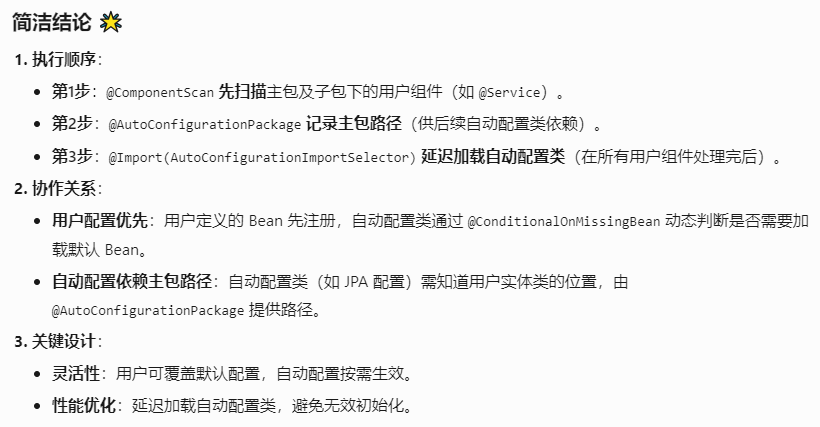
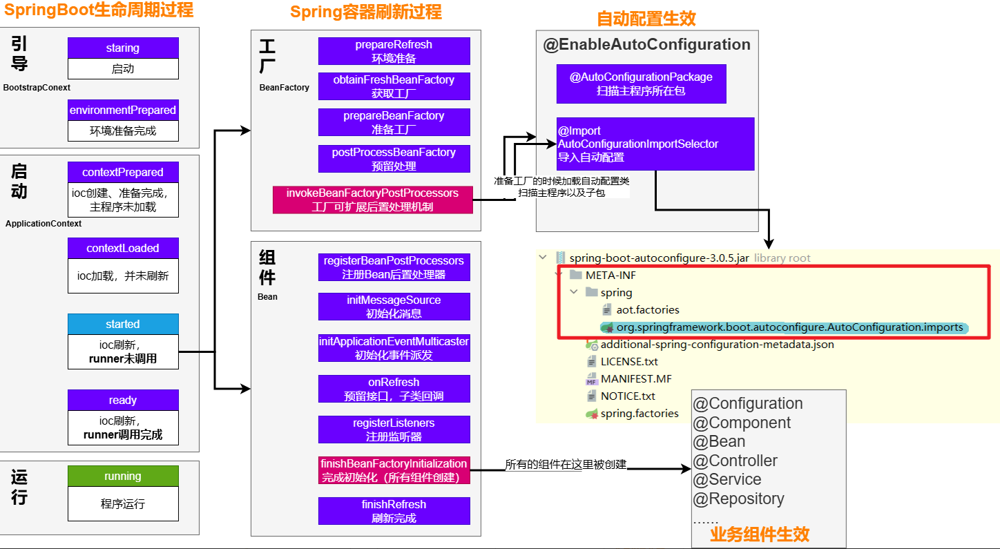
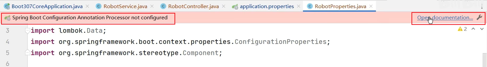
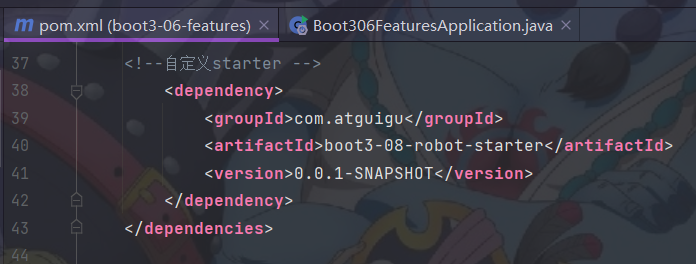
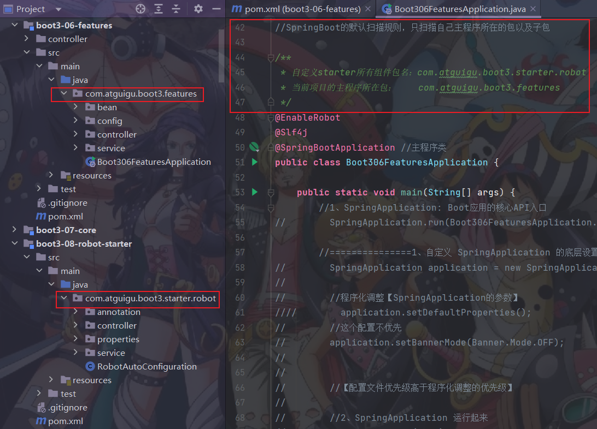
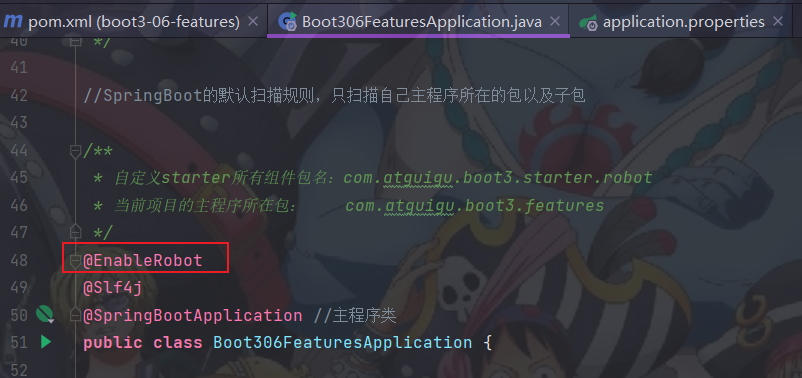

# 第5章-SpringBoot3-核心原理

## 5.1 事件和监听器

### 5.1.1 生命周期监听

场景：监听应用的生命周期

#### 5.1.1.1 监听器-SpringApplicationRunListener

1. 自定义SpringApplicationRunListener来监听事件：

   1.1.编写SpringApplicationRunListener 实现类

   1.2.在 META-INF/spring.factories 中配置org.springframework.boot.SpringApplicationRunListener=自己的Listener，还可以指定一个有参构造器，接受两个参数(SpringApplication application, String[] args)

   1.3.springboot 在spring-boot.jar中配置了默认的 Listener，如下


```java
/**
 * Listener先要从 META-INF/spring.factories 读到
 *
 * 1、引导： 利用 BootstrapContext 引导整个项目启动
 * starting： 应用开始，SpringApplication的run方法一调用，只
 要有了 BootstrapContext 就执行
 * environmentPrepared： 环境准备好（把启动参数等绑定到环境变量中），但是io
 c还没有创建；【调一次】
 * 2、启动：
 * contextPrepared： ioc容器创建并准备好，但是sources（主配置类）没加
 载。并关闭引导上下文；组件都没创建 【调一次】
 * contextLoaded： ioc容器加载。主配置类加载进去了。但是ioc容器还没
 刷新（我们的bean没创建）。
 * =======截止以前，ioc容器里面还没造bean呢=======
 * started： ioc容器刷新了（所有bean造好了），但是 runner 没
 调用。
 * ready: ioc容器刷新了（所有bean造好了），所有 runner 调
 用完了。
 * 3、运行
 * 以前步骤都正确执行，代表容器running。
 */
```

#### 5.1.1.2 生命周期全流程

****

### 5.1.2 事件触发时机

#### 5.1.2.1 各种回调监听器

- BootstrapRegistryInitializer：感知特定阶段：感知引导初始化

  - META-INF/spring.factories
- 创建引导上下文bootstrapContext的时候触发。
  - application.addBootstrapRegistryInitializer();
- 场景：进行密钥校对授权。
  
- ApplicationContextInitializer：感知特定阶段：感知ioc容器初始化

  - META-INF/spring.factories
- application.addInitializers();
  
- ApplicationListener：感知全阶段：基于事件机制，感知事件。 一旦到了哪个阶段可以做别的事

  - @Bean或@EventListener： 事件驱动
- SpringApplication.addListeners(…)或 SpringApplicationBuilder.listeners(…)
  - META-INF/spring.factories
  
- SpringApplicationRunListener：感知全阶段生命周期 + 各种阶段都能自定义操作； 功能更完善。

  - META-INF/spring.factories

- ApplicationRunner: 感知特定阶段：感知应用就绪Ready。卡死应用，就不会就绪

  - @Bean

- CommandLineRunner：感知特定阶段：感知应用就绪Ready。卡死应用，就不会就绪

  - @Bean

最佳实战：

- 如果项目启动前做事： BootstrapRegistryInitializer 和 ApplicationContextInitializer
- 如果想要在项目启动完成后做事：ApplicationRunner和CommandLineRunner
- 如果要干涉生命周期做事：SpringApplicationRunListener
- 如果想要用事件机制：ApplicationListener

#### **5.1.2.2 完整触发流程**

9大事件触发顺序&时机

1. ApplicationStartingEvent：应用启动但未做任何事情, 除过注册listeners and initializers.
2. ApplicationEnvironmentPreparedEvent： Environment 准备好，但context 未创建.
3. ApplicationContextInitializedEvent: ApplicationContext 准备好，ApplicationContextInitializers 调用，但是任何bean未加载
4. ApplicationPreparedEvent： 容器刷新之前，bean定义信息加载
5. ApplicationStartedEvent： 容器刷新完成， runner未调用

=========以下就开始插入了探针机制============

1. AvailabilityChangeEvent： LivenessState.CORRECT应用存活； 存活探针
2. ApplicationReadyEvent: 任何runner被调用
3. AvailabilityChangeEvent：ReadinessState.ACCEPTING_TRAFFIC就绪探针，可以接请求
4. ApplicationFailedEvent ：启动出错

****

应用事件发送顺序如下：

****

感知应用是否存活了：可能植物状态，虽然活着但是不能处理请求。

应用是否就绪了：能响应请求，说明确实活的比较好。

#### 5.1.2.3 SpringBoot 事件驱动开发

> 应用启动过程生命周期事件感知（9大事件）、应用运行中事件感知（无数种）。

- 事件发布：ApplicationEventPublisherAware或注入：ApplicationEventMulticaster
- 事件监听：组件 + @EventListener

****

****

举个例子

LoginController

> 事件发布者

```java
@Service
public class EventPublisher implements ApplicationEventPublisherAware {

    /**
     * 底层发送事件用的组件，SpringBoot会通过ApplicationEventPublisherAware接口
     * 自动注入给我们。事件是广播出去的，所有监听这个事件的监听器都可以收到。
     */
    private ApplicationEventPublisher applicationEventPublisher;

    /**
     * 发送事件，支持所有类型的 ApplicationEvent。
     *
     * @param event 要发布的事件对象
     */
    public void sendEvent(ApplicationEvent event) {
        // 调用底层API发送事件
        applicationEventPublisher.publishEvent(event);
    }

    /**
     * 会被 Spring 自动调用，将真正的事件发布器注入进来。
     *
     * @param applicationEventPublisher 用于发布事件的组件
     */
    @Override
    public void setApplicationEventPublisher(ApplicationEventPublisher applicationEventPublisher) {
        this.applicationEventPublisher = applicationEventPublisher;
    }
}
```

> 事件订阅者 

```java
@Service
public class CouponService {
    @Order(1)
    @EventListener
    public void onEvent(LoginSuccessEvent loginSuccessEvent){
        System.out.println("===== CouponService ====感知到事件"+loginSucces
                sEvent);
        UserEntity source = (UserEntity) loginSuccessEvent.getSource();
        sendCoupon(source.getUsername());
    }
    public void sendCoupon(String username){
        System.out.println(username + " 随机得到了一张优惠券");
    }
}
```


## **5.2 自动配置原理★★★★★**

### **5.2.1 入门理解**

> 应用关注的三大核心：场景、配置、组件

------

总结：场景导入自动配置类，自动配置类注入组件；组件绑定属性类，属性类绑定配置文件。

所以：修改配置文件，就能修改底层参数

------

#### 5.2.1.1 自动配置流程


1. 导入starter

2. 依赖导入autoconfigure包

3. 寻找类路径下 META-INF/spring/org.springframework.boot.autoconfigure.AutoConfiguration.imports文件

4. 启动，加载所有 自动配置类 xxxAutoConfiguration

   ​    a）给容器中配置功能组件

   ​    b）组件参数绑定到 属性类中。xxxProperties

   ​    c）属性类和配置文件前缀项绑定

   ​    d）@Contional派生的条件注解进行判断是否组件生效

5. 效果：

   ​    a）修改配置文件，修改底层参数

   ​    b）所有场景自动配置好直接使用

   ​    c）可以注入SpringBoot配置好的组件随时使用

#### 5.2.1.2 SPI机制

> - Java中的SPI（Service Provider Interface）是一种软件设计模式，用于在应用程序中动态地发现和加载组件。SPI的思想是，定义一个接口或抽象类，然后通过在classpath中定义实现该接口的类来实现对组件的动态发现和加载。
> - SPI的主要目的是解决在应用程序中使用可插拔组件的问题。例如，一个应用程序可能需要使用不同的日志框架或数据库连接池，但是这些组件的选择可能取决于运行时的条件。通过使用SPI，应用程序可以在运行时发现并加载适当的组件，而无需在代码中硬编码这些组件的实现类。
> - 在Java中，SPI的实现方式是通过在META-INF/services目录下创建一个以服务接口全限定名为名字的文件，文件中包含实现该服务接口的类的全限定名。当应用程序启动时，Java的SPI机制会自动扫描classpath中的这些文件，并根据文件中指定的类名来加载实现类。
> - 通过使用SPI，应用程序可以实现更灵活、可扩展的架构，同时也可以避免硬编码依赖关系和增加代码的可维护性。
>
> 以上回答来自ChatGPT-3.5

在SpringBoot中，META-INF/spring/org.springframework.boot.autoconfigure.AutoConfiguration.imports

> 写一段java的spi机制代码

SPI的例子，在《2025版DDD领域驱动设计实战天花板教程，7天学完DDD电商服务开放平台设计落地！》视频中，[使用DDD重新设计服务开放平台]章节中有涉及，可以对比查看


#### 5.2.1.3 功能开关

- 自动配置：全部都配置好，什么都不用管。自动批量导入
- 项目一启动，spi文件中指定的所有都加载。
  
- @EnableXxxx：手动控制哪些功能的开启；手动导入

  - 开启xxx功能
- 都是利用 @Import 把此功能要用的组件导入进去

### 5.2.2 进阶理解

#### 5.2.2.1 @SpringBootApplication

@SpringBootConfiguration

就是： @Configuration ，容器中的组件，配置类。spring ioc启动就会加载创建这个类对象

@EnableAutoConfiguration：开启自动配置

开启自动配置

@AutoConfigurationPackage：扫描主程序包：加载自己的组件

- 利用 `@Import(AutoConfigurationPackages.Registrar.class)` 想要给容器中导入组件。
- 把主程序所在的包的所有组件导入进来。
- 为什么SpringBoot默认只扫描主程序所在的包及其子包

@Import(AutoConfigurationImportSelector.class)：加载所有自动配置类：加载starter导入的组件

```java
List<String> configurations = ImportCandidates.load(AutoConfiguration.class, getBeanClassLoader()).getCandidates();
```

> 扫描SPI文件：
>
> META-INF/spring/org.springframework.boot.autoconfigure.AutoConfiguration.imports 

@ComponentScan

> 组件扫描：排除一些组件（哪些不要）
>
> 排除前面已经扫描进来的配置类、和自动配置类。

```java
@ComponentScan(excludeFilters = { @Filter(type = FilterType.CUSTOM, classes = TypeExcludeFilter.class),
@Filter(type = FilterType.CUSTOM, classes = AutoConfigurationExcludeFilter.class) })
```

补充说明：三个注解间的关系（修正前面）

##### 

#### 5.2.2.2 完整启动加载流程

生命周期启动加载流程

****

## 5.3 自定义starter★★★★★

> 场景：抽取聊天机器人场景，它可以打招呼。
>
> 效果：任何项目导入此`starter`都具有打招呼功能，并且问候语中的人名需要可以在配置文件中修改

1. 创建自定义starter项目，引入spring-boot-starter基础依赖

2. 编写模块功能，引入模块所有需要的依赖。

3. 编写xxxAutoConfiguration自动配置类，帮其他项目导入这个模块需要的所有组件

4. 编写配置文件META-INF/spring/org.springframework.boot.autoconfigure.AutoConfiguration.imports指定启动需要加载的自动配置

5. 其他项目引入即可使用

### 5.3.1 业务代码

> **自定义配置有提示。导入以下依赖重启项目，再写配置文件就有提示**

```java
@ConfigurationProperties(prefix = "robot") //此属性类和配置文件指定前缀绑定
@Component
@Data
public class RobotProperties {
    private String name;
    private String age;
    private String email;
}
```

```xml
<!-- 导入配置处理器，配置文件自定义的properties配置都会有提示-->
<dependency>
    <groupId>org.springframework.boot</groupId>
    <artifactId>spring-boot-configuration-processor</artifactId>
    <optional>true</optional>
</dependency>
```



### 5.3.2 基本抽取

- 创建starter项目，把公共代码需要的所有依赖导入
- 把公共代码复制进来
- 自己写一个 RobotAutoConfiguration，给容器中导入这个场景需要的所有组件
  - 为什么这些组件默认不会扫描进去？
  - starter所在的包和 引入它的项目的主程序所在的包不是父子层级★★★★★

- 别人引用这个starter，直接导入这个 RobotAutoConfiguration,就能把这个场景的组件导入进来
- 功能生效。
- 测试编写配置文件

------





RobotAutoConfiguration

#### 5.3.3 使用@EnableXxx机制

```java
@Retention(RetentionPolicy.RUNTIME)
@Target({ElementType.TYPE})
@Documented
@Import(RobotAutoConfiguration.class)
public @interface EnableRobot {
}
```

别人引入starter需要使用 @EnableRobot开启功能（使用@EnableRobot，相当于使用了@Import(RobotAutoConfiguration.class)）



#### 5.3.4 完全自动配置

* 依赖SpringBoot的SPI机制

* META-INF/spring/org.springframework.boot.autoconfigure.AutoConfiguration.imports 文件中编写好我们自动配置类的全类名即可（这样@EnableXxx都可以不用标了，导入依赖就可以使用）

* 项目启动，自动加载我们的自动配置类


## 附录：SpringBoot3改变&新特性快速总结

1、自动配置包位置变化【参照视频：07、11】

META-INF/spring/org.springframework.boot.autoconfigure.AutoConfiguration.imports

2、jakata api迁移

- druid有问题

3、新特性 - 函数式Web、ProblemDetails【参照视频：50、51】

4、GraalVM 与 AOT【参照视频：86~93】

5、响应式编程全套【第三季：预计7~8月份发布】

6、剩下变化都是版本升级，意义不大