# 第5章-SpringBoot3-核心原理

## 5.1 事件和监听器

### 5.1.1 生命周期监听

场景：监听应用的生命周期

原理：在spring-boot包中，在spring.factories中配置监听器，达到启动时加载各种监听器原理。所以要自定义监听器，编写自己的实现类，并在自己项目META-INF/spring.factories中配置。key为具体的监听器，value为自己的是眼泪

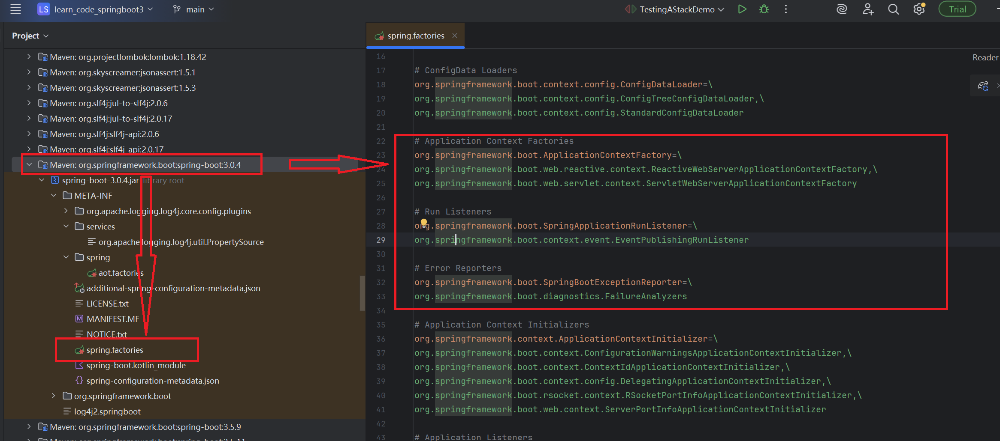

#### 5.1.1.1 监听器-SpringApplicationRunListener

1. 自定义SpringApplicationRunListener来监听事件：

   1.1.编写SpringApplicationRunListener 实现类

   1.2.在 META-INF/spring.factories 中配置org.springframework.boot.SpringApplicationRunListener=自己的Listener，还可以指定一个有参构造器，接受两个参数(SpringApplication application, String[] args)

   1.3.springboot 在spring-boot.jar中配置了默认的 Listener，如下

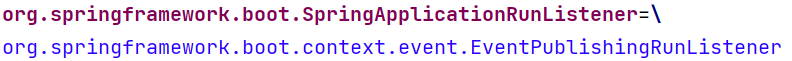

```java
/**
 * Listener先要从 META-INF/spring.factories 读到
 *
 * 1、引导： 利用 BootstrapContext 引导整个项目启动
 * 		starting： 应用开始，SpringApplication的run方法一调用，只要有了 BootstrapContext 就执行
 * 		environmentPrepared： 环境准备好（把启动参数等绑定到环境变量中），但是ioc还没有创建；【调一次】
 * 2、启动：
 * 		contextPrepared： ioc容器创建并准备好，但是sources（主配置类）没加载。并关闭引导上下文；组件都没创建 【调一次】
 * 		contextLoaded： ioc容器加载。主配置类加载进去了。但是ioc容器还没刷新（我们的bean没创建）。
 * =======截止以前，ioc容器里面还没造bean呢=======
 * 		started： ioc容器刷新了（所有bean造好了），但是 runner 没调用。
 * 		ready: ioc容器刷新了（所有bean造好了），所有 runner 调用完了。
 * 3、运行
 * 		以前步骤都正确执行，代表容器running。
 */
```

#### 5.1.1.2 生命周期全流程

**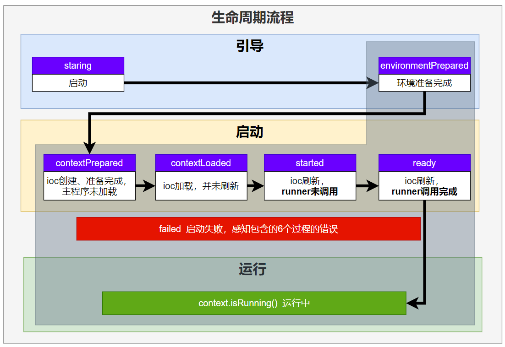**

1. 查看生命周期机制，以SpringApplicationRunListener为例

   ```java
   package com.chanpller.chapter5core.listener;
   
   import com.chanpller.chapter5core.entity.User;
   import org.jspecify.annotations.Nullable;
   import org.springframework.boot.SpringApplicationRunListener;
   import org.springframework.boot.bootstrap.ConfigurableBootstrapContext;
   import org.springframework.context.ConfigurableApplicationContext;
   import org.springframework.core.env.ConfigurableEnvironment;
   
   import java.time.Duration;
   
   public class MyApplicationListener implements SpringApplicationRunListener {
       @Override
       public void starting(ConfigurableBootstrapContext bootstrapContext) {
           System.out.println("===========boot初始化之前就执行，正在启动===========");
       }
   
       @Override
       public void environmentPrepared(ConfigurableBootstrapContext bootstrapContext, ConfigurableEnvironment environment) {
           System.out.println("===========环境准备好的之后，环境准备好了==========="+environment.getSystemEnvironment());
       }
   
       @Override
       public void contextPrepared(ConfigurableApplicationContext context) {
           System.out.println("===========容器准备好了，但是还没加载容器===========");
       }
   
       @Override
       public void contextLoaded(ConfigurableApplicationContext context) {
           System.out.println("===========容器加载了，但是还没刷新容器，还没有将实例注入进来===========");
       }
   
       @Override
       public void started(ConfigurableApplicationContext context, @Nullable Duration timeTaken) {
           System.out.println("===========类已经加载，项目启动完成==========="+context.getBean(User.class)+timeTaken);
       }
   
       @Override
       public void ready(ConfigurableApplicationContext context, @Nullable Duration timeTaken) {
           System.out.println("===========项目已经完全加载，已经准备完成==========="+context.getBean(User.class)+timeTaken);
       }
   
       @Override
       public void failed(@Nullable ConfigurableApplicationContext context, Throwable exception) {
           System.out.println("===========异常时加载，启动失败==========="+context.getBean(User.class)+exception);
       }
   }
   
   ```

   配置启动文件resources/META-INF/spring.factories

   ```properties
   org.springframework.boot.SpringApplicationRunListener=com.chanpller.chapter5core.listener.MyApplicationListener
   ```

   结果打印

   ```shell
   ===========boot初始化之前就执行，正在启动===========
   ===========环境准备好的之后，环境准备好了===========
     .   ____          _            __ _ _
    /\\ / ___'_ __ _ _(_)_ __  __ _ \ \ \ \
   ( ( )\___ | '_ | '_| | '_ \/ _` | \ \ \ \
    \\/  ___)| |_)| | | | | || (_| |  ) ) ) )
     '  |____| .__|_| |_|_| |_\__, | / / / /
    =========|_|==============|___/=/_/_/_/
   
    :: Spring Boot ::                (v4.0.3)
   
   ===========容器准备好了，但是还没加载容器===========
   2026-03-08T09:34:58.386+08:00  INFO 16992 --- [chapter-5-core] [           main] c.c.c.Chapter5CoreApplication            : Starting Chapter5CoreApplication using Java 17.0.13 with PID 16992 (D:\workspace\IdeaProjects\learn_code_springboot3\chapter-5-core\target\classes started by Administrator in D:\workspace\IdeaProjects\learn_code_springboot3)
   2026-03-08T09:34:58.388+08:00  INFO 16992 --- [chapter-5-core] [           main] c.c.c.Chapter5CoreApplication            : No active profile set, falling back to 1 default profile: "default"
   ===========容器加载了，但是还没刷新容器，还没有将实例注入进来===========
   2026-03-08T09:34:58.797+08:00  INFO 16992 --- [chapter-5-core] [           main] o.s.boot.tomcat.TomcatWebServer          : Tomcat initialized with port 8080 (http)
   2026-03-08T09:34:58.804+08:00  INFO 16992 --- [chapter-5-core] [           main] o.apache.catalina.core.StandardService   : Starting service [Tomcat]
   2026-03-08T09:34:58.804+08:00  INFO 16992 --- [chapter-5-core] [           main] o.apache.catalina.core.StandardEngine    : Starting Servlet engine: [Apache Tomcat/11.0.18]
   2026-03-08T09:34:58.830+08:00  INFO 16992 --- [chapter-5-core] [           main] b.w.c.s.WebApplicationContextInitializer : Root WebApplicationContext: initialization completed in 414 ms
   2026-03-08T09:34:58.996+08:00  INFO 16992 --- [chapter-5-core] [           main] o.s.boot.tomcat.TomcatWebServer          : Tomcat started on port 8080 (http) with context path '/'
   2026-03-08T09:34:58.999+08:00  INFO 16992 --- [chapter-5-core] [           main] c.c.c.Chapter5CoreApplication            : Started Chapter5CoreApplication in 0.841 seconds (process running for 1.141)
   ===========类已经加载，项目启动完成===========User(name=null, email=null)PT0.841S
   ===========项目已经完全加载，已经准备完成===========User(name=null, email=null)PT0.843S
   ```

2. 查看加载原理

   * 从SpringApplication.run(Chapter5CoreApplication.class, args);入口

   * 构造SpringApplication时会加载bootstrapRegistryInitializers，从META-INF/spring.factories加载类

     ```java
     public static SpringFactoriesLoader forDefaultResourceLocation(@Nullable ClassLoader classLoader) {
             return forResourceLocation("META-INF/spring.factories", classLoader);
         }
     ```

   * 调用run方法后，到SpringApplication的public ConfigurableApplicationContext run(String... args)

     ```java
     public ConfigurableApplicationContext run(String... args) {
     		Startup startup = Startup.create();
     		if (this.properties.isRegisterShutdownHook()) {
     			SpringApplication.shutdownHook.enableShutdownHookAddition();
     		}
     		DefaultBootstrapContext bootstrapContext = createBootstrapContext();
     		ConfigurableApplicationContext context = null;
     		configureHeadlessProperty();
     		SpringApplicationRunListeners listeners = getRunListeners(args);
     		listeners.starting(bootstrapContext, this.mainApplicationClass);
     		try {
     			ApplicationArguments applicationArguments = new DefaultApplicationArguments(args);
     			ConfigurableEnvironment environment = prepareEnvironment(listeners, bootstrapContext, applicationArguments);
     			Banner printedBanner = printBanner(environment);
     			context = createApplicationContext();
     			context.setApplicationStartup(this.applicationStartup);
     			prepareContext(bootstrapContext, context, environment, listeners, applicationArguments, printedBanner);
     			refreshContext(context);
     			afterRefresh(context, applicationArguments);
     			Duration timeTakenToStarted = startup.started();
     			if (this.properties.isLogStartupInfo()) {
     				new StartupInfoLogger(this.mainApplicationClass, environment).logStarted(getApplicationLog(), startup);
     			}
     			listeners.started(context, timeTakenToStarted);
     			callRunners(context, applicationArguments);
     		}
     		catch (Throwable ex) {
     			throw handleRunFailure(context, ex, listeners);
     		}
     		try {
     			if (context.isRunning()) {
     				listeners.ready(context, startup.ready());
     			}
     		}
     		catch (Throwable ex) {
     			throw handleRunFailure(context, ex, null);
     		}
     		return context;
     	}
     ```

   * 先加载SpringApplicationRunListeners，再调用starting方法

     ```java
     SpringApplicationRunListeners listeners = getRunListeners(args);
     		listeners.starting(bootstrapContext, this.mainApplicationClass);
     ```

   * 然后加载ConfigurableEnvironment environment = prepareEnvironment(listeners, bootstrapContext, applicationArguments);然后在prepareEnvironment中加载environmentPrepared方法

     ```java
     listeners.environmentPrepared(bootstrapContext, environment);
     ```

   * 然后加载ApplicationContext容器

     ```
     context = createApplicationContext();
     ```

   * 再调用prepareContext(bootstrapContext, context, environment, listeners, applicationArguments, printedBanner);prepareContext方法中调用contextPrepared方法，全部加载完成后执行contextLoaded方法

     ```java
     listeners.contextPrepared(context);
     ..
     listeners.contextLoaded(context);
     ```

   * 再执行refreshContext(context);进入到AbstractApplicationContext容器的十二大步骤

   * 再执行listeners.started(context, timeTakenToStarted);

   * 服务器执行完成后，调用listeners.ready(context, startup.ready());

### 5.1.2 事件触发时机

#### 5.1.2.1 各种回调监听器

- BootstrapRegistryInitializer：感知特定阶段：感知引导初始化，最开始就执行，在ApplicationListener及boot初始化之前就执行
- 配置方式
  - META-INF/spring.factories里面加入：org.springframework.boot.bootstrap.BootstrapRegistryInitializer=com.chanpller.chapter5core.listener.MyBootstrapRegistryInitializer
    - 创建引导上下文bootstrapContext的时候触发。
    - application.addBootstrapRegistryInitializer();
  - 使用场景：在服务器启动前，需要进行密钥校对授权。
- ApplicationContextInitializer：感知特定阶段：感知ioc容器初始化，在环境准备好，容器初始化之前执行
- 配置方式
  - META-INF/spring.factories里面加入：org.springframework.context.ApplicationContextInitializer=com.chanpller.chapter5core.listener.MyApplicationContextInitializer
    - application.addInitializers();
- ApplicationListener：感知全阶段：基于事件机制，感知事件，在每个阶段执行前都会调用一下。 与SpringApplicationRunListener不同的是，一旦到了哪个阶段可以做别的事
  - 配置方式：
    - @Bean或@EventListener： 事件驱动
    - SpringApplication.addListeners(…)或 SpringApplicationBuilder.listeners(…)
    - META-INF/spring.factories里面加入：org.springframework.context.ApplicationListener=com.chanpller.chapter5core.listener.MyApplicationListener
- SpringApplicationRunListener：感知全阶段生命周期 + 各种阶段都能自定义操作； 比ApplicationListener功能更完善。
  - 配置方式：
  - META-INF/spring.factories里面配置：org.springframework.boot.SpringApplicationRunListener=com.chanpller.chapter5core.listener.MySpringApplicationRunListener
- ApplicationRunner: 感知特定阶段：感知应用就绪Ready。卡死应用，就不会就绪
  - 配置方式
    - 注入一个ApplicationRunner，可是使用@Bean或Component
- CommandLineRunner：感知特定阶段：感知应用就绪Ready。卡死应用，就不会就绪
- 配置方式
  - 注入一个ApplicationRunner，可是使用@Bean或Component

```java
===========MyBootstrapRegistryInitializer=============
===========MyApplicationListener=============
===========boot初始化之前就执行，正在启动===========
===========MyApplicationListener=============
===========环境准备好的之后，环境准备好了==========
 :: Spring Boot ::                (v4.0.3)
===========MyApplicationContextInitializer=============
===========MyApplicationListener=============
===========容器准备好了，但是还没加载容器===========
===========MyApplicationListener=============
===========容器加载了，但是还没刷新容器，还没有将实例注入进来===========
===========MyApplicationListener=============
===========MyApplicationListener=============
===========MyApplicationListener=============
===========MyApplicationListener=============
===========类已经加载，项目启动完成===========User(name=null, email=null)PT0.81S
===========MyApplicationRunner=============
===========MyCommandLineRunner=============
===========MyApplicationListener=============
===========MyApplicationListener=============
===========项目已经完全加载，已经准备完成===========User(name=null, email=null)PT0.813S
===========MyApplicationListener=============
===========MyApplicationListener=============
```

最佳实战：

- 如果项目启动前做事： BootstrapRegistryInitializer 和 ApplicationContextInitializer
- 如果想要在项目启动完成后做事：ApplicationRunner和CommandLineRunner
- 如果要干涉生命周期做事：SpringApplicationRunListener
- 如果想要用事件机制：ApplicationListener

#### 5.1.2.2 完整触发流程

9大事件触发顺序&时机

1. ApplicationStartingEvent：应用启动但未做任何事情, 除过注册listeners and initializers.
2. ApplicationEnvironmentPreparedEvent： Environment 准备好，但context 未创建.
3. ApplicationContextInitializedEvent: ApplicationContext 准备好，ApplicationContextInitializers 调用，但是任何bean未加载
4. ApplicationPreparedEvent： 容器刷新之前，bean定义信息加载
5. ApplicationStartedEvent： 容器刷新完成， runner未调用

=========以下就开始插入了探针机制============

1. AvailabilityChangeEvent： LivenessState.CORRECT应用存活； 存活探针
2. ApplicationReadyEvent: 任何runner被调用
3. AvailabilityChangeEvent：ReadinessState.ACCEPTING_TRAFFIC就绪探针，可以接请求
4. ApplicationFailedEvent ：启动出错

**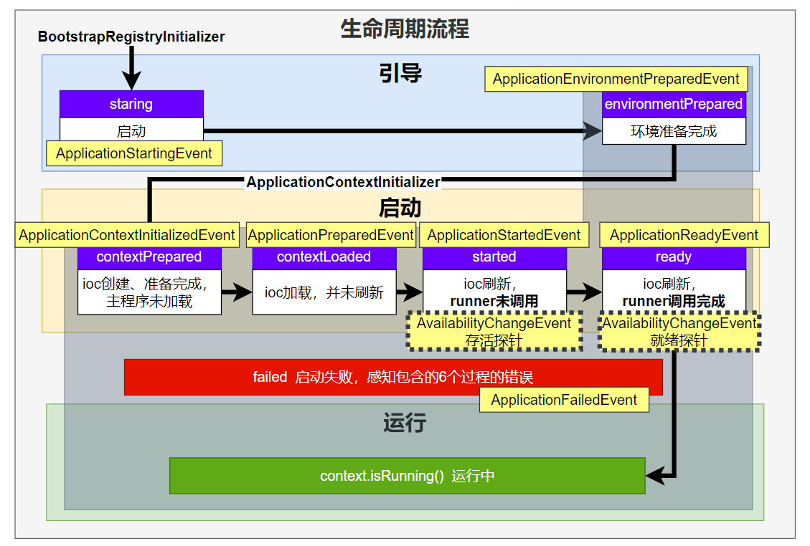**

应用事件发送顺序如下：

**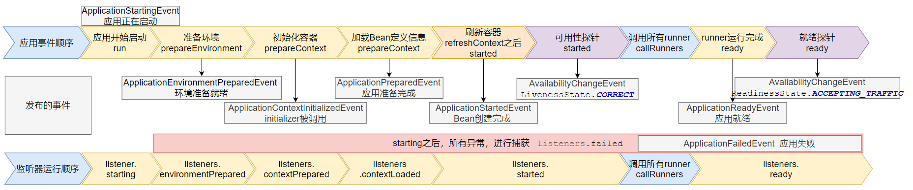**

感知应用是否存活了：可能植物状态，虽然活着但是不能处理请求。

应用是否就绪了：能响应请求，说明确实活的比较好。

#### 5.1.2.3 SpringBoot 事件驱动开发

> 应用启动过程生命周期事件感知（9大事件）、应用运行中事件感知（无数种）。

- 事件发布：ApplicationEventPublisherAware或注入：ApplicationEventMulticaster
- 事件监听：组件 + @EventListener

**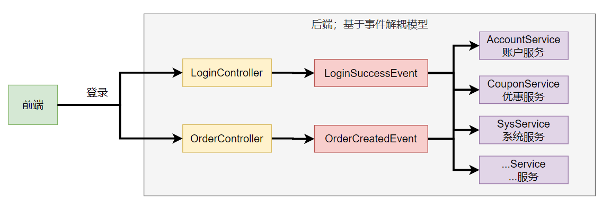**

**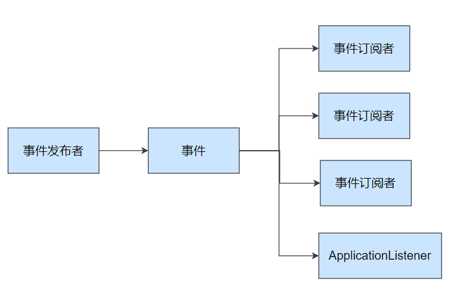**

举个例子

LoginController

> 事件发布者

```java
@Service
public class EventPublisher implements ApplicationEventPublisherAware {

    /**
     * 底层发送事件用的组件，SpringBoot会通过ApplicationEventPublisherAware接口
     * 自动注入给我们。事件是广播出去的，所有监听这个事件的监听器都可以收到。
     */
    private ApplicationEventPublisher applicationEventPublisher;

    /**
     * 发送事件，支持所有类型的 ApplicationEvent。
     *
     * @param event 要发布的事件对象
     */
    public void sendEvent(ApplicationEvent event) {
        // 调用底层API发送事件
        applicationEventPublisher.publishEvent(event);
    }

    /**
     * 会被 Spring 自动调用，将真正的事件发布器注入进来。
     *
     * @param applicationEventPublisher 用于发布事件的组件
     */
    @Override
    public void setApplicationEventPublisher(ApplicationEventPublisher applicationEventPublisher) {
        this.applicationEventPublisher = applicationEventPublisher;
    }
}
```

> 事件订阅者 

```java
@Service
public class CouponService {
    @Order(1)
    @EventListener
    public void onEvent(LoginSuccessEvent loginSuccessEvent){
        System.out.println("===== CouponService ====感知到事件"+loginSucces
                sEvent);
        UserEntity source = (UserEntity) loginSuccessEvent.getSource();
        sendCoupon(source.getUsername());
    }
    public void sendCoupon(String username){
        System.out.println(username + " 随机得到了一张优惠券");
    }
}
```


## **5.2 自动配置原理★★★★★**

### **5.2.1 入门理解**

> 应用关注的三大核心：场景、配置、组件

------

总结：场景导入自动配置类，自动配置类注入组件；组件绑定属性类，属性类绑定配置文件。

所以：修改配置文件，就能修改底层参数

------

#### 5.2.1.1 自动配置流程

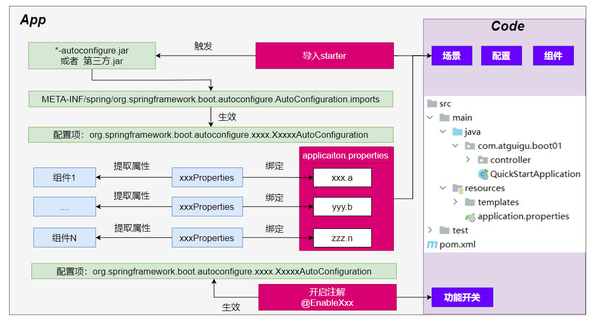

1. 导入starter

2. 依赖导入autoconfigure包

3. 寻找类路径下 META-INF/spring/org.springframework.boot.autoconfigure.AutoConfiguration.imports文件

4. 启动，加载所有 自动配置类 xxxAutoConfiguration

   ​    a）给容器中配置功能组件

   ​    b）组件参数绑定到 属性类中。xxxProperties

   ​    c）属性类和配置文件前缀项绑定

   ​    d）@Contional派生的条件注解进行判断是否组件生效

5. 效果：

   ​    a）修改配置文件，修改底层参数

   ​    b）所有场景自动配置好直接使用

   ​    c）可以注入SpringBoot配置好的组件随时使用

#### 5.2.1.2 SPI机制

> - Java中的SPI（Service Provider Interface）是一种软件设计模式，用于在应用程序中动态地发现和加载组件。SPI的思想是，定义一个接口或抽象类，然后通过在classpath中定义实现该接口的类来实现对组件的动态发现和加载。
> - SPI的主要目的是解决在应用程序中使用可插拔组件的问题。例如，一个应用程序可能需要使用不同的日志框架或数据库连接池，但是这些组件的选择可能取决于运行时的条件。通过使用SPI，应用程序可以在运行时发现并加载适当的组件，而无需在代码中硬编码这些组件的实现类。
> - 在Java中，SPI的实现方式是通过在META-INF/services目录下创建一个以服务接口全限定名为名字的文件，文件中包含实现该服务接口的类的全限定名。当应用程序启动时，Java的SPI机制会自动扫描classpath中的这些文件，并根据文件中指定的类名来加载实现类。
> - 通过使用SPI，应用程序可以实现更灵活、可扩展的架构，同时也可以避免硬编码依赖关系和增加代码的可维护性。
>
> 以上回答来自ChatGPT-3.5

在SpringBoot中，META-INF/spring/org.springframework.boot.autoconfigure.AutoConfiguration.imports

> 写一段java的spi机制代码

SPI的例子，在《2025版DDD领域驱动设计实战天花板教程，7天学完DDD电商服务开放平台设计落地！》视频中，[使用DDD重新设计服务开放平台]章节中有涉及，可以对比查看


#### 5.2.1.3 功能开关

- 自动配置：全部都配置好，什么都不用管。自动批量导入
- 项目一启动，spi文件中指定的所有都加载。
  
- @EnableXxxx：手动控制哪些功能的开启；手动导入

  - 开启xxx功能
- 都是利用 @Import 把此功能要用的组件导入进去

### 5.2.2 进阶理解

#### 5.2.2.1 @SpringBootApplication

@SpringBootConfiguration

就是： @Configuration ，容器中的组件，配置类。spring ioc启动就会加载创建这个类对象

@EnableAutoConfiguration：开启自动配置

开启自动配置

@AutoConfigurationPackage：扫描主程序包：加载自己的组件

- 利用 `@Import(AutoConfigurationPackages.Registrar.class)` 想要给容器中导入组件。
- 把主程序所在的包的所有组件导入进来。
- 为什么SpringBoot默认只扫描主程序所在的包及其子包

@Import(AutoConfigurationImportSelector.class)：加载所有自动配置类：加载starter导入的组件

```java
List<String> configurations = ImportCandidates.load(AutoConfiguration.class, getBeanClassLoader()).getCandidates();
```

> 扫描SPI文件：
>
> META-INF/spring/org.springframework.boot.autoconfigure.AutoConfiguration.imports 

@ComponentScan

> 组件扫描：排除一些组件（哪些不要）
>
> 排除前面已经扫描进来的配置类、和自动配置类。

```java
@ComponentScan(excludeFilters = { @Filter(type = FilterType.CUSTOM, classes = TypeExcludeFilter.class),
@Filter(type = FilterType.CUSTOM, classes = AutoConfigurationExcludeFilter.class) })
```

补充说明：三个注解间的关系（修正前面）

##### 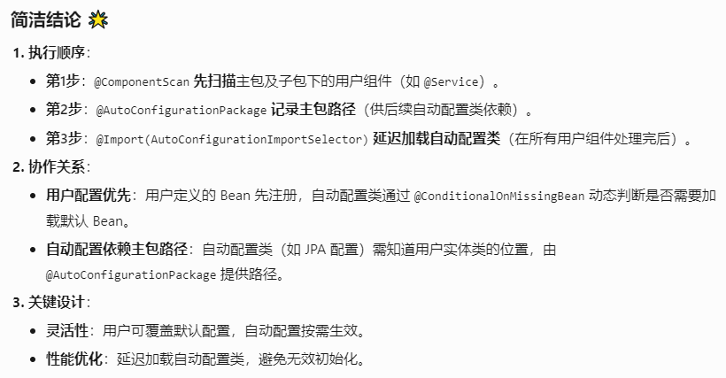

#### 5.2.2.2 完整启动加载流程

生命周期启动加载流程

**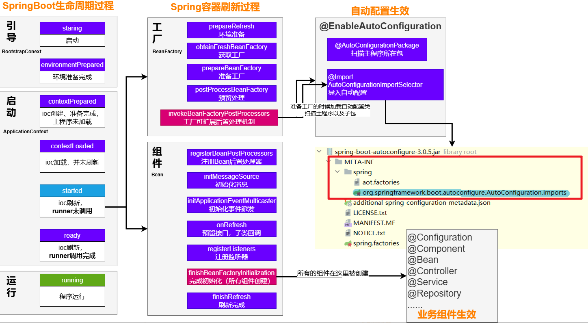**

## 5.3 自定义starter★★★★★

> 场景：抽取聊天机器人场景，它可以打招呼。
>
> 效果：任何项目导入此`starter`都具有打招呼功能，并且问候语中的人名需要可以在配置文件中修改

1. 创建自定义starter项目，引入spring-boot-starter基础依赖

2. 编写模块功能，引入模块所有需要的依赖。

3. 编写xxxAutoConfiguration自动配置类，帮其他项目导入这个模块需要的所有组件

4. 编写配置文件META-INF/spring/org.springframework.boot.autoconfigure.AutoConfiguration.imports指定启动需要加载的自动配置

5. 其他项目引入即可使用

### 5.3.1 业务代码

> **自定义配置有提示。导入以下依赖重启项目，再写配置文件就有提示**

```java
@ConfigurationProperties(prefix = "robot") //此属性类和配置文件指定前缀绑定
@Component
@Data
public class RobotProperties {
    private String name;
    private String age;
    private String email;
}
```

```xml
<!-- 导入配置处理器，配置文件自定义的properties配置都会有提示-->
<dependency>
    <groupId>org.springframework.boot</groupId>
    <artifactId>spring-boot-configuration-processor</artifactId>
    <optional>true</optional>
</dependency>
```

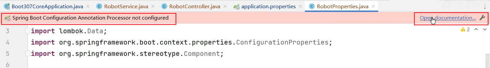

### 5.3.2 基本抽取

- 创建starter项目，把公共代码需要的所有依赖导入
- 把公共代码复制进来
- 自己写一个 RobotAutoConfiguration，给容器中导入这个场景需要的所有组件
  - 为什么这些组件默认不会扫描进去？
  - starter所在的包和 引入它的项目的主程序所在的包不是父子层级★★★★★

- 别人引用这个starter，直接导入这个 RobotAutoConfiguration,就能把这个场景的组件导入进来
- 功能生效。
- 测试编写配置文件

------

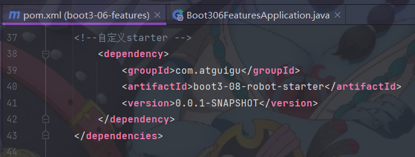

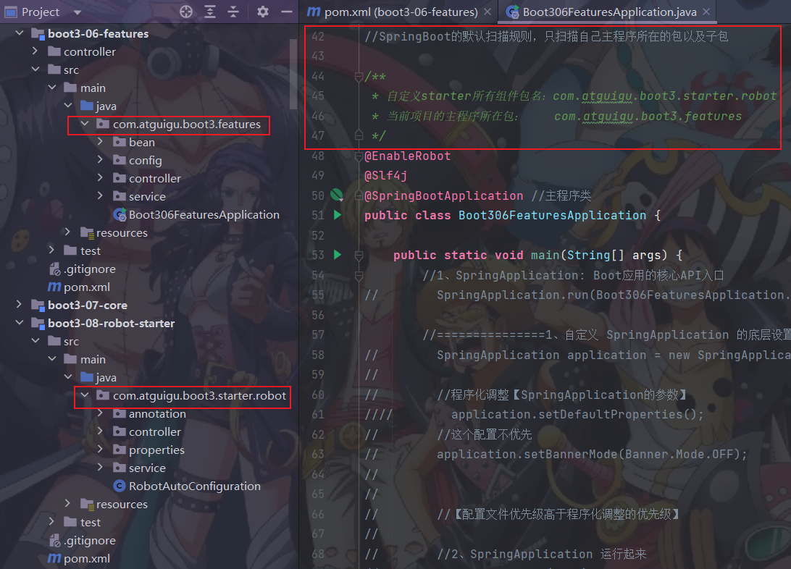

RobotAutoConfiguration

#### 5.3.3 使用@EnableXxx机制

```java
@Retention(RetentionPolicy.RUNTIME)
@Target({ElementType.TYPE})
@Documented
@Import(RobotAutoConfiguration.class)
public @interface EnableRobot {
}
```

别人引入starter需要使用 @EnableRobot开启功能（使用@EnableRobot，相当于使用了@Import(RobotAutoConfiguration.class)）

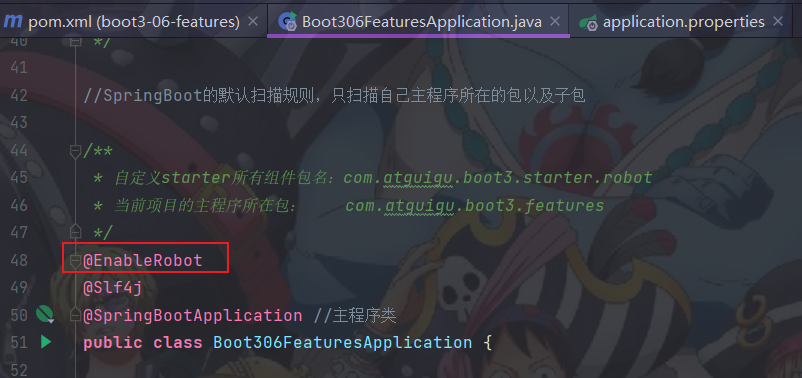

#### 5.3.4 完全自动配置

* 依赖SpringBoot的SPI机制

* META-INF/spring/org.springframework.boot.autoconfigure.AutoConfiguration.imports 文件中编写好我们自动配置类的全类名即可（这样@EnableXxx都可以不用标了，导入依赖就可以使用）

* 项目启动，自动加载我们的自动配置类

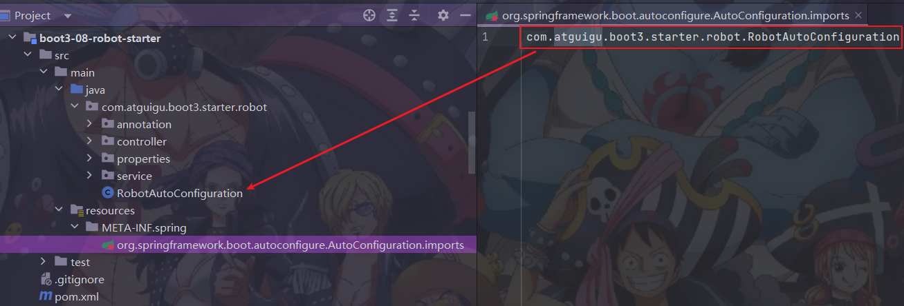

## 附录：SpringBoot3改变&新特性快速总结

1、自动配置包位置变化【参照视频：07、11】

META-INF/spring/org.springframework.boot.autoconfigure.AutoConfiguration.imports

2、jakata api迁移

- druid有问题

3、新特性 - 函数式Web、ProblemDetails【参照视频：50、51】

4、GraalVM 与 AOT【参照视频：86~93】

5、响应式编程全套【第三季：预计7~8月份发布】

6、剩下变化都是版本升级，意义不大