# 第6章-SpringBoot3-场景整合NoSQL

## 6.1环境准备

### 6.1.1 云服务器

* 阿里云、腾讯云、华为云 服务器开通； 按量付费，省钱省心
* 安装以下组件
  * docker
  * redis
  * kafka
  * prometheus
  * grafana
* https://github.com/kingToolbox/WindTerm/releases/download/2.5.0/WindTerm_2.5.0_Windows_Portable_x86_64.zip 下载windterm
* 重要：开通云服务器以后，请一定在安全组设置规则，放行端口

### 6.1.2 Docker安装

> 还不会docker的同学，参考【云原生实战（10~25集）】快速入门
>
> https://www.bilibili.com/video/BV13Q4y1C7hS?p=10

```
sudo yum install -y yum-utils
sudo yum-config-manager \
--add-repo \
https://download.docker.com/linux/centos/docker-ce.repo
sudo yum install docker-ce docker-ce-cli containerd.io docker-buildx-plugin docker-compose-plugin
sudo systemctl enable docker --now
#测试工作
docker ps
# 批量安装所有软件
docker compose
```

1. 创建 /prod文件夹，准备以下文件

2. prometheus.yml

```yaml
global:
  scrape_interval: 15s
  evaluation_interval: 15s

scrape_configs:
  - job_name: 'prometheus'
    static_configs:
      - targets: ['localhost:9090']

  - job_name: 'redis'
    static_configs:
      - targets: ['redis:6379']

  - job_name: 'kafka'
    static_configs:
      - targets: ['kafka:9092']
```

3. docker-compose.yml
   * http://poe.com/ChatGPT

```yaml
version: '3.9'

services:
  redis:
    image: redis:latest
    container_name: redis
    restart: always
    ports:
      - "6379:6379"
    networks:
      - backend

  zookeeper:
    image: bitnami/zookeeper:latest
    container_name: zookeeper
    restart: always
    environment:
      ZOOKEEPER_CLIENT_PORT: 2181
      ZOOKEEPER_TICK_TIME: 2000
    networks:
      - backend

  kafka:
    image: bitnami/kafka:3.4.0
    container_name: kafka
    restart: always
    depends_on:
      - zookeeper
    ports:
      - "9092:9092"
    environment:
      ALLOW_PLAINTEXT_LISTENER: yes
      KAFKA_CFG_ZOOKEEPER_CONNECT: zookeeper:2181
      KAFKA_OFFSETS_TOPIC_REPLICATION_FACTOR: 1
    networks:
      - backend

  kafka-ui:
    image: provectuslabs/kafka-ui:latest
    container_name: kafka-ui
    restart: always
    depends_on:
      - kafka
    ports:
      - "8080:8080"
    environment:
      KAFKA_CLUSTERS_0_NAME: dev
      KAFKA_CLUSTERS_0_BOOTSTRAPSERVERS: kafka:9092
    networks:
      - backend

  prometheus:
    image: prom/prometheus:latest
    container_name: prometheus
    restart: always
    volumes:
      - ./prometheus.yml:/etc/prometheus/prometheus.yml
    ports:
      - "9090:9090"
    networks:
      - backend

  grafana:
    image: grafana/grafana:latest
    container_name: grafana
    restart: always
    depends_on:
      - prometheus
    ports:
      - "3000:3000"
    networks:
      - backend

networks:
  backend:
    name: backend
```

4. 启动环境

   * 国内连docker可能连不过去，使用国内镜像。

   * 配置国内镜像源在/etc/docker/daemon.json 文件中添加或修改镜像源，如果没有该文件可以新建一个，将如下内容复制进去：

     ```json
     {
     	"registry-mirrors": [
     	    "https://docker.m.daocloud.io/",
     	    "https://huecker.io/",
     	    "https://dockerhub.timeweb.cloud",
     	    "https://noohub.ru/",
     	    "https://dockerproxy.com",
     	    "https://docker.mirrors.ustc.edu.cn",
     	    "https://docker.nju.edu.cn",
     	    "https://xx4bwyg2.mirror.aliyuncs.com",
     	    "http://f1361db2.m.daocloud.io",
     	    "https://registry.docker-cn.com",
     	    "http://hub-mirror.c.163.com"
     	  ]
       }
     ```

     ```json
     {
         "registry-mirrors": [
         	"https://docker-0.unsee.tech",
             "https://docker-cf.registry.cyou",
             "https://docker.1panel.live"
         ]
     }
     ```

   * 重启docker使配置生效：

     ```
     systemctl daemon-reload
     systemctl restart docker
     ```

     

```
docker compose -f docker-compose.yml up -d
```

5. 验证
   * Redis：你的ip:6379
     * 填写表单，下载官方可视化工具：
     * https://redis.com/redis-enterprise/redis-insight/#insight-form
   * Kafka：你的ip:9092
     * idea安装大数据插件
   * Prometheus：你的ip:9090
     * 直接浏览器访问
   * Grafana：你的ip:3000
     * 直接浏览器访问

## 6.2 NoSQL

Redis整合

> Redis不会的同学：参照 阳哥-《Redis7》 https://www.bilibili.com/video/BV13R4y1v7sP?p=1
> HashMap： key：value

### 6.2.1 场景整合

1. 依赖导入

```xml
<dependency>
    <groupId>org.springframework.boot</groupId>
    <artifactId>spring-boot-starter-data-redis</artifactId>
</dependency>
```

2. 配置
   * 如果redis则需要配置cluster.nodes，不需要配置HOST

```properties
spring.data.redis.host=192.168.200.100
#如果redis则需要配置cluster.nodes，不需要配置HOST
#spring.data.redis.cluster.nodes=8.130.74.183:6379
spring.data.redis.password=Lfy123!@!
```

3. 测试

```java
@Autowired
StringRedisTemplate redisTemplate;
@Test
void redisTest(){
    redisTemplate.opsForValue().set("a","1234");
    Assertions.assertEquals("1234",redisTemplate.opsForValue().get("a"));
}
```

### 6.2.2 自动配置原理

1. META-INF/spring/org.springframework.boot.autoconfigure.AutoConfiguration.imports
   中导入了RedisAutoConfiguration、RedisReactiveAutoConfiguration和RedisRepositoriesAutoConfiguration。所有属性绑定在RedisProperties中

2. RedisReactiveAutoConfiguration属于响应式编程，不用管。RedisRepositoriesAutoConfiguration属于 JPA 操作，也不用管

3. RedisAutoConfiguration配置了以下组件

   1.1. LettuceConnectionConfiguration： 给容器中注入了连接工厂LettuceConnectionFactory，和操作 redis 的客户端DefaultClientResources。
   1.2. RedisTemplate<Object, Object>： 可给 redis 中存储任意对象，会使用 jdk 默认序列化方式。
   1.3. StringRedisTemplate： 给 redis 中存储字符串，如果要存对象，需要开发人员自己进行序列化。key-value都是字符串进行操作··

6.2.3 定制化

1. 序列化机制，自定义序列化机制

   ```java
   @Configuration
   public class AppRedisConfiguration {
       /**
       * 允许Object类型的key-value，都可以被转为json进行存储。
       * @param redisConnectionFactory 自动配置好了连接工厂
       * @return
       */
       @Bean
       public RedisTemplate<Object, Object> redisTemplate(RedisConnectionFactory redisConnectionFactory) {
           RedisTemplate<Object, Object> template = new RedisTemplate<>();
           template.setConnectionFactory(redisConnectionFactory);
           //把对象转为json字符串的序列化工具
           template.setDefaultSerializer(new GenericJackson2JsonRedisSerializer());
           return template;
       }
   }
   ```

2. redis客户端

> RedisTemplate、StringRedisTemplate： 操作redis的工具类
>
> * 要从redis的连接工厂获取链接才能操作redis
> *  Redis客户端
>   *  Lettuce： 默认
>   *  Jedis：可以使用以下切换

```xml
<dependency>
    <groupId>org.springframework.boot</groupId>
    <artifactId>spring-boot-starter-data-redis</artifactId>
    <exclusions>
        <exclusion>
            <groupId>io.lettuce</groupId>
            <artifactId>lettuce-core</artifactId>
        </exclusion>
    </exclusions>
</dependency>
<!-- 切换 jedis 作为操作redis的底层客户端-->
<dependency>
    <groupId>redis.clients</groupId>
    <artifactId>jedis</artifactId>
</dependency>
```

3. 配置参考

   ```properties
   spring.data.redis.host=8.130.74.183
   #如果redis则需要配置cluster.nodes，不需要配置HOST
   #spring.data.redis.cluster.nodes=8.130.74.183:6379
   spring.data.redis.port=6379
   #spring.data.redis.client-type=lettuce
   #设置lettuce的底层参数
   #spring.data.redis.lettuce.pool.enabled=true
   #spring.data.redis.lettuce.pool.max-active=8
   spring.data.redis.client-type=jedis
   spring.data.redis.jedis.pool.enabled=true
   spring.data.redis.jedis.pool.max-active=8
   ```

   

## 6.3 接口文档

### 6.3.1 OpenAPI 3 与 Swagger

> Swagger 可以快速生成实时接口文档，方便前后开发人员进行协调沟通。遵循 OpenAPI 规范。
>
> 文档：https://springdoc.org/v2/

#### 6.3.1.1 OpenAPI 3 架构

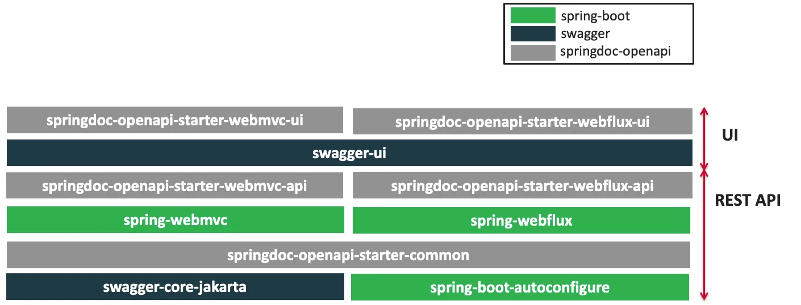

#### 6.3.1.2 整合

导入场景

```
<dependency>
    <groupId>org.springdoc</groupId>
    <artifactId>springdoc-openapi-starter-webmvc-ui</artifactId>
    <version>2.1.0</version>
</dependency>
```

配置

```
# /api-docs endpoint custom path 默认 /v3/api-docs
springdoc.api-docs.path=/api-docs
# swagger 相关配置在 springdoc.swagger-ui
# swagger-ui custom path
springdoc.swagger-ui.path=/swagger-ui.html
springdoc.show-actuator=true
```

#### 6.3.1.3 使用

| 注解         | 标注位置            | 作用                   |
| ------------ | ------------------- | ---------------------- |
| @Tag         | controller类标识    | controller 作用        |
| @Parameter   | 参数标识            | 参数作用               |
| @Parameters  | 参数                | 参数多重说明           |
| @Schema      | model 层的 JavaBean | 描述模型作用及每个属性 |
| @Operation   | 方法                | 描述方法作用           |
| @ApiResponse | 方法                | 描述响应状态码等       |

### 6.3.2 Docket配置

> 如果有多个Docket，配置如下。
>
> Docket用于文档分组

```java
@Bean
public GroupedOpenApi publicApi() {
	return GroupedOpenApi.builder()
        .group("springshop-public")
        .pathsToMatch("/public/**")
        .build();
}
@Bean
public GroupedOpenApi adminApi() {
	return GroupedOpenApi.builder()
        .group("springshop-admin")
        .pathsToMatch("/admin/**")
        .addMethodFilter(method -> method.isAnnotationPresent(Admin.class))
        .build();
}
```

如果只有一个Docket，可以配置如下

```properties
springdoc.packagesToScan=package1, package2
springdoc.pathsToMatch=/v1, /api/balance/**
```

上面代码用于控制下面区域

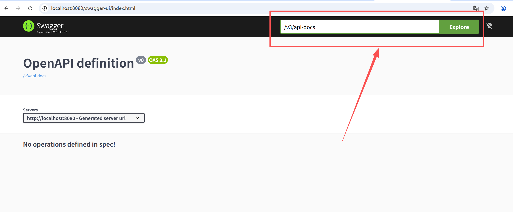

### 6.3.3 OpenAPI配置

```java
@Bean
public OpenAPI springShopOpenAPI() {
	return new OpenAPI()
        .info(new Info()
              .title("SpringShop API")
              .description("Spring shop sample application")
              .version("v0.0.1")
              .license(new License().name("Apache 2.0").url("http://springdoc.org")))
        .externalDocs(new ExternalDocumentation()
                      .description("SpringShop Wiki Documentation")
                      .url("https://springshop.wiki.github.org/docs"));
}
```

上面代码用于控制下面区域

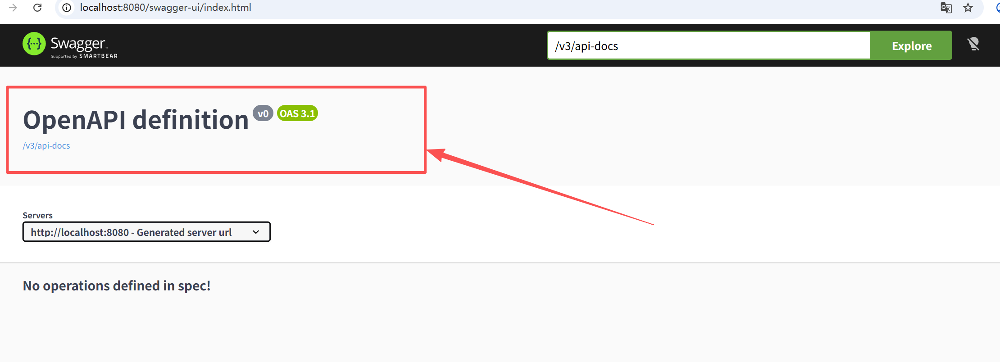

### 6.3.4 Springfox 迁移

#### 6.3.4.1 注解变化

| 原注解 | 现注解 | 作用 |
| ------ | ------ | ---- |
|@Api |@Tag |描述Controller|
|@ApiIgnore |@Parameter(hidden = true)<br/>@Operation(hidden = true)<br/>@Hidden|描述忽略操作|
|@ApiImplicitParam |@Parameter |描述参数|
|@ApiImplicitParams |@Parameters|描述参数|
|@ApiModel |@Schema|描述对象|
|@ApiModelProperty(hidden= true)|@Schema(accessMode =READ_ONLY)|描述对象属性|
|@ApiModelProperty |@Schema |描述对象属性|
|@ApiOperation(value ="foo", notes = "bar")|@Operation(summary ="foo", description = "bar")|描述方法|
|@ApiParam |@Parameter |描述参数|
|@ApiResponse(code = 404,message = "foo") |@ApiResponse(responseCode = "404", description ="foo") |描述响应|

#### 6.3.4.2 Docket配置变化

以前写法

```java
@Bean
public Docket publicApi() {
	return new Docket(DocumentationType.SWAGGER_2)
        .select()
        .apis(RequestHandlerSelectors.basePackage("org.github.springshop.web.public"))
        .paths(PathSelectors.regex("/public.*"))
        .build()
        .groupName("springshop-public")
        .apiInfo(apiInfo());
}
@Bean
public Docket adminApi() {
	return new Docket(DocumentationType.SWAGGER_2)
        .select()
        .apis(RequestHandlerSelectors.basePackage("org.github.springshop.web.admin"))
        .paths(PathSelectors.regex("/admin.*"))
        .apis(RequestHandlerSelectors.withMethodAnnotation(Admin.class))
        .build()
        .groupName("springshop-admin")
        .apiInfo(apiInfo());
}
```

新写法

```java
@Bean
public GroupedOpenApi publicApi() {
	return GroupedOpenApi
        .builder()
        .group("springshop-public")
        .pathsToMatch("/public/**")
        .build();
}
@Bean
public GroupedOpenApi adminApi() {
	return GroupedOpenApi
        .builder()
        .group("springshop-admin")
        .pathsToMatch("/admin/**")
        .addOpenApiMethodFilter(method -> method.isAnnotationPresent(Admin.class))
        .build();
}
```

添加OpenAPI组件

```java
@Bean
public OpenAPI springShopOpenAPI() {
	return new OpenAPI()
        .info(new Info()
              .title("SpringShop API")
              .description("Spring shop sample application")
              .version("v0.0.1")
              .license(new License().name("Apache 2.0").url("http://springdoc.org")))
        .externalDocs(new ExternalDocumentation()
                      .description("SpringShop Wiki Documentation")
                      .url("https://springshop.wiki.github.org/docs"));
}
```

### 6.3.5 Knife4j

Knife4j是基于SpringBoot构建的一个文档生成工具，它可以让开发者为我们的应用生成在线API文档； 目的是可以更加方便的基于API文档进行测试。 生成的文档还可以导出，然后给到前端开发团队，前端开发团队可以基于API接口写具体的调用。 是基于Swagger框架实现的。

 Knife4j的优点 Knife4j 功能强大，易于操作。 Knife4j 的UI界面非常美观，使用流畅。 Knife4j 可以高度定制化，让其符合你的项目需求

```xml
<!--添加Knife4j依赖-->
<dependency>
    <groupId>com.github.xiaoymin</groupId>
    <artifactId>knife4j-spring-boot-starter</artifactId>
    <version>2.0.9</version>
    <!--<version>4.3.0</version>-->
</dependency>
```

## 6.4 远程调用

RPC (Remote Procedure Call)：远程过程调用

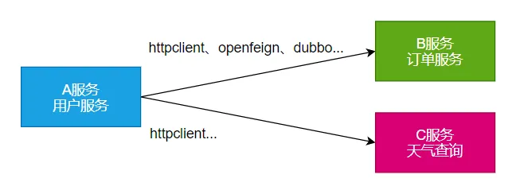

本地过程调用： a()； b()； a() { b()；}： 不同方法都在同一个JVM运行

远程过程调用：

* 服务提供者：
* 服务消费者：
* 通过连接对方服务器进行请求\响应交互，来实现调用效果

API/SDK的区别是什么？

* api：接口（Application Programming Interface）
  * 远程提供功能；

* sdk：工具包（Software Development Kit）
  * 导入jar包，直接调用功能即可

开发过程中，我们经常需要调用别人写的功能

* 如果是内部微服务，可以通过依赖cloud、注册中心、openfeign等进行调用
* 如果是外部暴露的，可以发送 http 请求、或遵循外部协议进行调用

SpringBoot 整合提供了很多方式进行远程调用

* 轻量级客户端方式
  * RestTemplate： 普通开发
  * WebClient： 响应式编程开发
  * Http Interface： 声明式编程

* Spring Cloud分布式解决方案方式
  * Spring Cloud OpenFeign
* 第三方框架
  * Dubbo
  * gRPC
  * ...

### 6.4.1 WebClient

> 非阻塞、响应式HTTP客户端

#### 6.4.1.1 创建与配置

发请求：

- 请求方式： GET\POST\DELETE\xxxx
- 请求路径： /xxx
- 请求参数：aa=bb&cc=dd&xxx
- 请求头： aa=bb,cc=ddd
- 请求体：{}

创建 WebClient 非常简单:

- WebClient.create()
- WebClient.create(String baseUrl)

还可以使用 WebClient.builder() 配置更多参数项:

- uriBuilderFactory: 自定义UriBuilderFactory ，定义 baseurl.
- defaultUriVariables: 默认 uri 变量.
- defaultHeader: 每个请求默认头.
- defaultCookie: 每个请求默认 cookie.
- defaultRequest: Consumer 自定义每个请求.
- filter: 过滤 client 发送的每个请求
- exchangeStrategies: HTTP 消息 reader/writer 自定义.
- clientConnector: HTTP client 库设置.

Mono<T>方法

* block() - 阻塞式获取结果，会等待请求完成才返回数
* subscribe() - 异步订阅，非阻塞，通过回调函数处理结果
* block(Duration timeout) - 带超时的阻塞，避免无限等待

```java
//获取响应完整信息
WebClient client = WebClient.create("https://example.org");
```

#### 6.4.1.2 获取响应

> retrieve()方法用来声明如何提取响应数据。比如

```java
//获取响应完整信息
WebClient client = WebClient.create("https://example.org");
Mono<ResponseEntity<Person>> result = client.get().uri("/persons/{id}", id).accept(MediaType.APPLICATION_JSON).retrieve().toEntity(Person.class);
//只获取body
WebClient client = WebClient.create("https://example.org");
Mono<Person> result = client.get().uri("/persons/{id}", id).accept(MediaType.APPLICATION_JSON).retrieve().bodyToMono(Person.class);
//stream数据
Flux<Quote> result = client.get().uri("/quotes").accept(MediaType.TEXT_EVENT_STREAM).retrieve().bodyToFlux(Quote.class);
//定义错误处理
Mono<Person> result = client.get().uri("/persons/{id}", id).accept(MediaType.APPLICATION_JSON).retrieve().onStatus(HttpStatus::is4xxClientError, response -> ...).onStatus(HttpStatus::is5xxServerError, response -> ...).bodyToMono(Person.class);
```

#### 6.4.1.3 定义请求体

```java
//1、响应式-单个数据
Mono<Person> personMono = ... ;
Mono<Void> result = client.post().uri("/persons/{id}", id).contentType(MediaType.APPLICATION_JSON).body(personMono, Person.class).retrieve().bodyToMono(Void.class);
//2、响应式-多个数据
Flux<Person> personFlux = ... ;
Mono<Void> result = client.post().uri("/persons/{id}", id).contentType(MediaType.APPLICATION_STREAM_JSON).body(personFlux, Person.class).retrieve().bodyToMono(Void.class);
//3、普通对象
Person person = ... ;
Mono<Void> result = client.post().uri("/persons/{id}", id).contentType(MediaType.APPLICATION_JSON).bodyValue(person).retrieve().bodyToMono(Void.class);
```

### 6.4.2 HTTP Interface

> Spring 允许我们通过定义接口的方式，给任意位置发送 http 请求，实现远程调用，可以用来简化 HTTP 远程访问。需要webflux场景才可

#### 6.4.2.1 导入依赖

```xml
<dependency>
    <groupId>org.springframework.boot</groupId>
    <artifactId>spring-boot-starter-webflux</artifactId>
</dependency>
```

#### 6.4.2.2 定义接口

```java
public interface BingService {
    @GetExchange(url = "/search")
    String search(@RequestParam("q") String keyword);
}
```

#### 6.4.2.3 创建代理&测试

```java
package com.chanpller.chapter6rpc;

import com.chanpller.chapter6rpc.service.BingService;
import org.junit.jupiter.api.Test;
import org.springframework.boot.test.context.SpringBootTest;
import org.springframework.web.reactive.function.client.WebClient;
import org.springframework.web.reactive.function.client.support.WebClientAdapter;
import org.springframework.web.service.invoker.HttpServiceProxyFactory;
import reactor.core.publisher.Mono;

@SpringBootTest
class Chapter6RpcApplicationTests {

    @Test
    public void contextLoads() throws InterruptedException {
        //1、创建客户端
        WebClient client = WebClient.builder().baseUrl("https://cn.bing.com").codecs(clientCodecConfigurer -> {
            clientCodecConfigurer.defaultCodecs().maxInMemorySize(256 * 1024 * 1024);
        //响应数据量太大有可能会超出BufferSize，所以这里设置的大一点
        }).build();
        //2、创建工厂

        //HttpServiceProxyFactory factory = HttpServiceProxyFactory.builder(WebClientAdapter.forClient(client)).build();这段代码错误，因为WebClientAdapter.forClient()方法已弃用,在3.0.5版本中可用

        HttpServiceProxyFactory factory = HttpServiceProxyFactory.builderFor(WebClientAdapter.create(client)).build();//3.5.11
        //3、获取代理对象
        BingService bingService = factory.createClient(BingService.class);


        //4、测试调用
        Mono<String> search = bingService.search("尚硅谷");
        System.out.println("==========");
        search.subscribe(str -> System.out.println(str));
        Thread.sleep(100000);
    }
}
```

还可以把通用的代理类封装成一个类，需要转换的地方，注入这个代理类

```java
package com.chanpller.chapter6rpc.config;

import org.springframework.context.annotation.Bean;
import org.springframework.context.annotation.Configuration;
import org.springframework.web.reactive.function.client.WebClient;
import org.springframework.web.reactive.function.client.support.WebClientAdapter;
import org.springframework.web.service.invoker.HttpServiceProxyFactory;

@Configuration
public class SearchConfig {
    @Bean
    public HttpServiceProxyFactory httpServiceProxyFactory() {
        //1、创建客户端
        WebClient client = WebClient.builder().baseUrl("https://cn.bing.com").codecs(clientCodecConfigurer -> {
            clientCodecConfigurer.defaultCodecs().maxInMemorySize(256 * 1024 * 1024);
            //响应数据量太大有可能会超出BufferSize，所以这里设置的大一点
        }).build();
        //2、创建工厂

        //HttpServiceProxyFactory factory = HttpServiceProxyFactory.builder(WebClientAdapter.forClient(client)).build();这段代码错误，因为WebClientAdapter.forClient()方法已弃用,在3.0.5版本中可用

        HttpServiceProxyFactory factory = HttpServiceProxyFactory.builderFor(WebClientAdapter.create(client)).build();//3.5.11
        return factory;
    }
}

```


## 6.5 消息服务

https://kafka.apache.org/documentation/

### 6.5.1 消息队列-场景

#### 6.5.1.1 异步

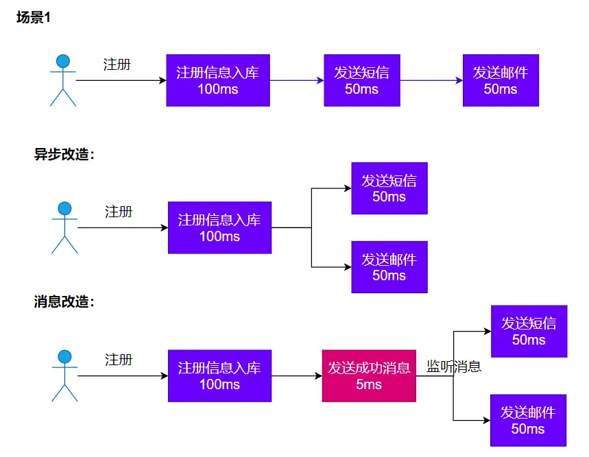

#### 6.5.1.2 解耦

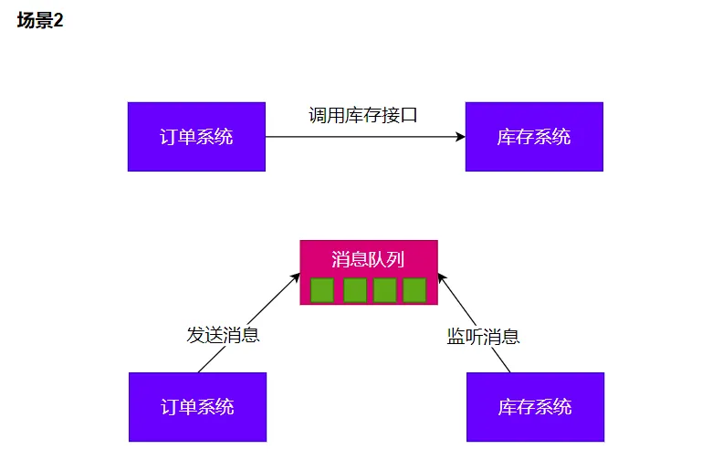

#### 6.5.1.3 削峰

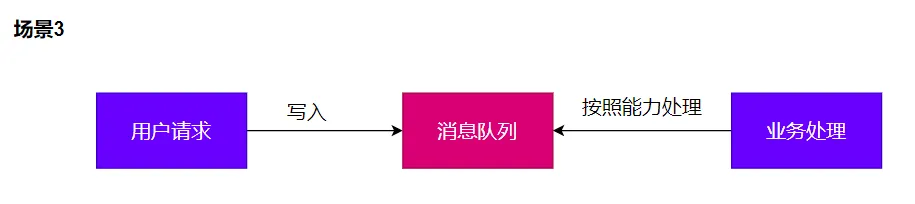

#### 6.5.1.4 缓冲

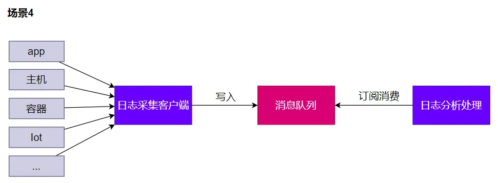

### 6.5.2 消息队列-Kafka

#### 6.5.2.1 消息模式

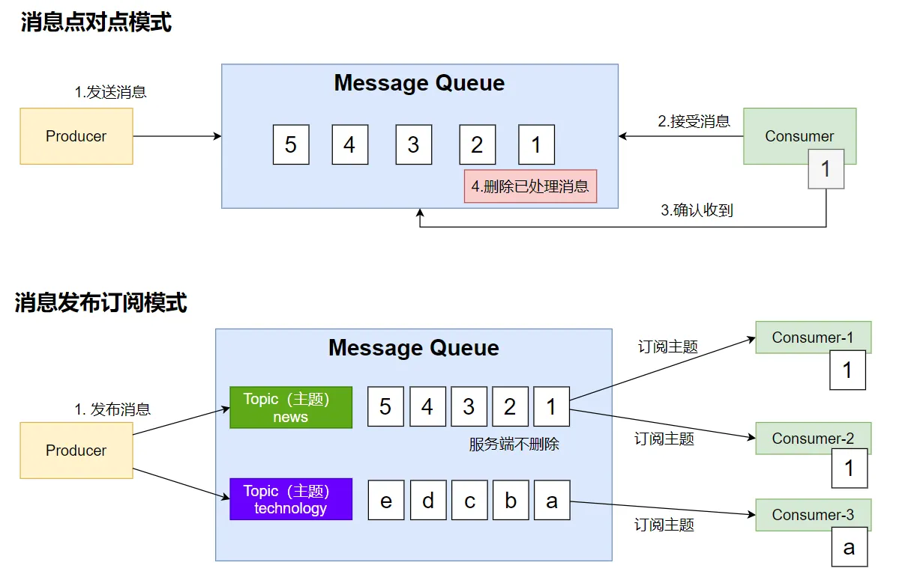

#### 6.5.2.2 Kafka工作原理

* 同一个消费者组里面的消费者是队列竞争模式，即消费者不会拿到相同的数据。
* 不同消费者组里面的消费者是发布/订阅模式，与其他消费者组不是竞争模式。
* 一个消费者可以消费多个分区数据
* 分区：数据分散存储
* 副本：每个分散存储的数据区，都有备份。备份是备份到不同的节点上。

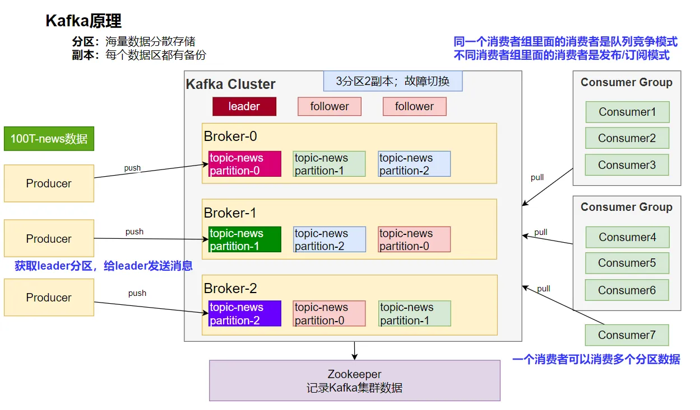

#### 6.5.2.3 SpringBoot整合

参照：https://docs.spring.io/spring-kafka/reference/

```xml
<dependency>
    <groupId>org.springframework.kafka</groupId>
    <artifactId>spring-kafka</artifactId>
</dependency>
```

配置

```properties
spring.kafka.bootstrap-servers=172.20.128.1:9092
```

修改C:\Windows\System32\drivers\etc\hosts文件，配置8.130.32.70 kafka

#### 6.5.2.4 消息发送

先通过kafka创建topic。http://192.168.154.128:8080/ui/clusters/dev/all-topics?perPage=25，只有一个节点只能创建单partition和单Replicase。否则调用时报错NOT_ENOUGH_REPLICAS 

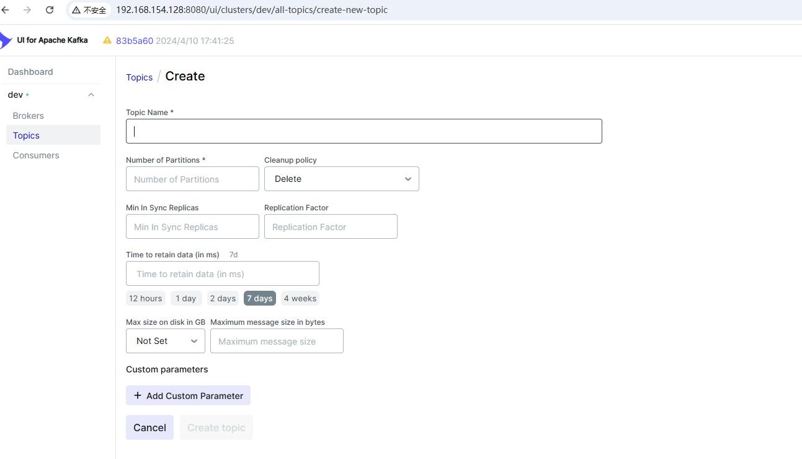

```java
package com.chanpller.chapter6kafka;

import org.junit.jupiter.api.Test;
import org.springframework.beans.factory.annotation.Autowired;
import org.springframework.boot.test.context.SpringBootTest;
import org.springframework.kafka.core.KafkaTemplate;
import org.springframework.util.StopWatch;

import java.util.concurrent.CompletableFuture;
import java.util.concurrent.ExecutionException;

@SpringBootTest
class Chapter6KafkaApplicationTests {

    @Autowired
    KafkaTemplate kafkaTemplate;
    @Test
    void contextLoads() throws ExecutionException, InterruptedException {
        StopWatch watch = new StopWatch();
        watch.start();
        CompletableFuture[] futures = new CompletableFuture[10000];
        for (int i = 0; i < 10000; i++) {
            CompletableFuture send = kafkaTemplate.send("order", "order.create."+i, "订单创建了："+i);
                    futures[i]=send;
        }
        CompletableFuture.allOf(futures).join();
        watch.stop();
        System.out.println("总耗时："+watch.getTotalTimeMillis());
    }

}
```

```java
import org.springframework.kafka.core.KafkaTemplate;
import org.springframework.stereotype.Component;
@Component
public class MyBean {
	private final KafkaTemplate<String, String> kafkaTemplate;
    public MyBean(KafkaTemplate<String, String> kafkaTemplate) {
        this.kafkaTemplate = kafkaTemplate;
    }
	public void someMethod() {
    	this.kafkaTemplate.send("someTopic", "Hello");
    }
}
```

#### 6.5.2.5 消息监听

@KafkaListener监听消息，只有实时发送的才能收到

@TopicPartition，监听消息，可以设置起始偏移量，每次启动都是从偏移量位置获取

```java
package com.chanpller.chapter6kafka.listener;

import org.apache.kafka.clients.consumer.ConsumerRecord;
import org.springframework.kafka.annotation.KafkaListener;
import org.springframework.kafka.annotation.PartitionOffset;
import org.springframework.kafka.annotation.TopicPartition;
import org.springframework.stereotype.Component;

@Component
public class OrderMsgListener {
    @KafkaListener(topics = "test_order",groupId = "order-service")
    public void listen(ConsumerRecord record){
        System.out.println("收到消息："+record); //可以监听到发给kafka的新消息，以前的拿不到
    }
    @KafkaListener(groupId = "order-service-2",topicPartitions = {
            @TopicPartition(topic = "test_order",partitionOffsets = {
                    @PartitionOffset(partition = "0",initialOffset = "0")
            })
    })
    public void listenAll(ConsumerRecord record){
        System.out.println("收到partion-0消息："+record);
    }
}
```

#### 6.5.2.6 参数配置

消费者

```properties
spring.kafka.consumer.value-deserializer=org.springframework.kafka.support.serializer.JsonDeserializer
spring.kafka.consumer.properties[spring.json.value.default.type]=com.example.Invoice
spring.kafka.consumer.properties[spring.json.trusted.packages]=com.example.main,com.example.another
```

生产者

```properties
spring.kafka.producer.value-serializer=org.springframework.kafka.support.serializer.JsonSerializer
spring.kafka.producer.properties[spring.json.add.type.headers]=false
```

#### 6.5.2.7 自动配置原理

kafka 自动配置在KafkaAutoConfiguration

1. 容器中放了 KafkaTemplate 可以进行消息收发
2. 容器中放了KafkaAdmin 可以进行 Kafka 的管理，比如创建 topic 等
3. kafka 的配置在KafkaProperties中
4. @EnableKafka可以开启基于注解的模式

KafkaAutoConfiguration提供如下功能：

* KafkaProperties:kafka的所有配置；以spring.kafka开始
  * bootstrapServers:kafka集群的所有服务器地址
  * properties:参数化设置
  * consumer:消费者
  * producer:生产者
  * ...
* @EnableKafka:开启Kafka的注解驱动功能
* KafkaTemplate:收发消息
* KafkaAdmin:维护Topic等
* @EnableKafka+@KafkaListener接受消息
  * 消费者来接受消息，需要有group-id
  * 收消息使用@KafkaListener+ConsumerRecord
  * spring.kafka 开始的所有配置

在 Spring Boot 中，@EnableKafka 默认是自动开启的，不需要手动添加。

什么时候需要手动添加 @EnableKafka？

* 如果你不小心禁用了 Kafka 自动配置：

```java
@SpringBootApplication(exclude = {
 org.springframework.boot.autoconfigure.kafka.KafkaAutoConfiguration.class
})
```

这时需要手动启用：

```java
@Configuration
@EnableKafka
public class KafkaManualConfig {
    // 手动配置
}
```

* 当你想完全控制 Kafka 的配置，不使用 Spring Boot 的默认配置时：

```java
@Configuration
@EnableKafka
public class KafkaConfig {
    
    @Bean
    public ConsumerFactory<String, String> consumerFactory() {
        // 完全自定义的消费者工厂
        return new DefaultKafkaConsumerFactory<>(customProps());
    }
    
    @Bean
    public ProducerFactory<String, String> producerFactory() {
        // 完全自定义的生产者工厂
        return new DefaultKafkaProducerFactory<>(customProps());
    }
}
```

## 6.6 Web安全

WEB安全框架有：

- Apache Shiro
- Spring Security
- 自研：Filter

### Spring Security

### 6.6.1 Spring Security是安全架构

Spring Security可以做什么：

#### 6.6.1.1 认证：Authentication

> who are you?
> 登录系统，用户系统

#### 6.6.1.2 授权：Authorization

> what are you allowed to do？
> 权限管理，用户授权

#### 6.6.1.3 攻击防护

> XSS（Cross-site scripting）
> CSRF（Cross-site request forgery）
> CORS（Cross-Origin Resource Sharing）
> SQL注入
>
> ...

#### 6.6.1.4 扩展. 权限模型

* RBAC(Role Based Access Controll)
  * 角色权限控制
  * 用户与角色挂钩，角色与权限挂钩

* ACL(Access Controll List)
  * 访问列表控制
  * 用户直接和权限挂钩

### 6.6.2 Spring Security 原理

#### 6.6.2.1 过滤器链架构

* Spring Security利用 FilterChainProxy 封装一系列拦截器链，实现各种安全拦截功能
* Servlet三大组件：Servlet、Filter、Listener

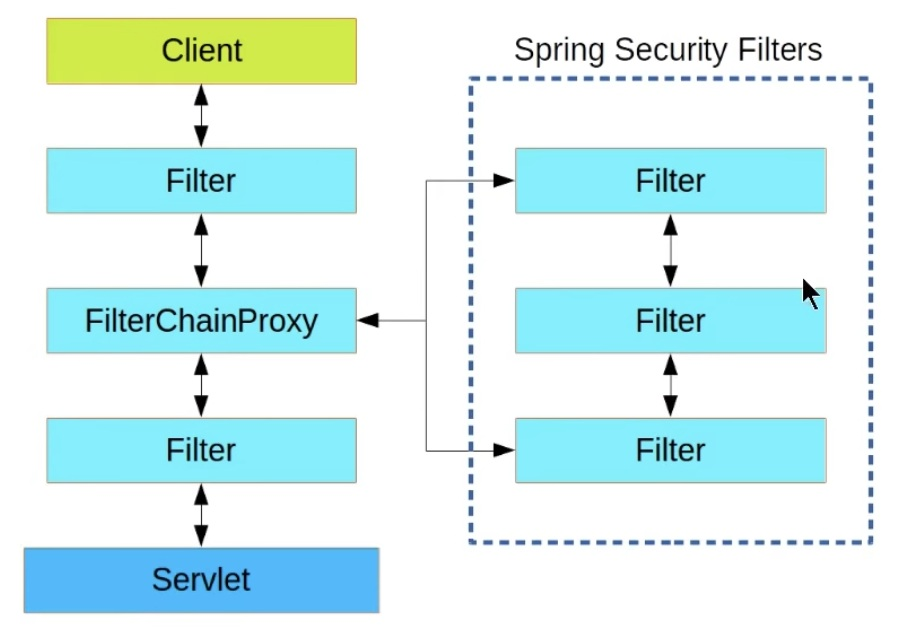

#### 6.6.2.2 FilterChainProxy

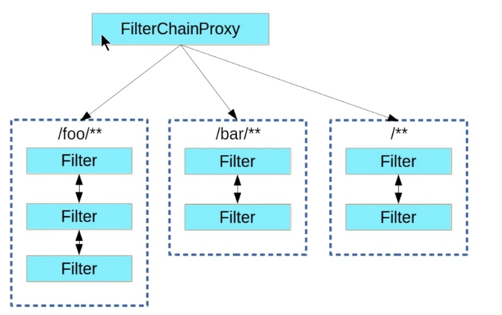

#### 6.6.2.3 SecurityFilterChain

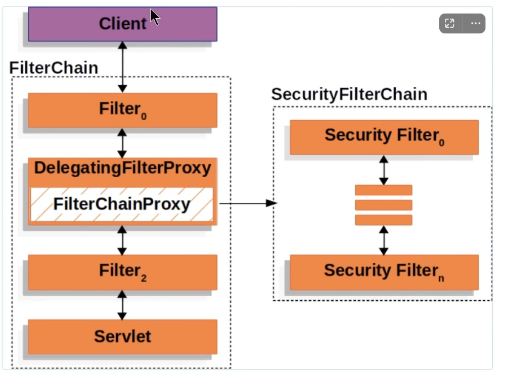

### 6.6.3 使用

#### 6.6.3.1 HttpSecurity

```java
package com.chanpller.chapter5security.config;
import org.springframework.context.annotation.Bean;
import org.springframework.context.annotation.Configuration;
import org.springframework.security.config.annotation.web.builders.HttpSecurity;
import org.springframework.security.web.SecurityFilterChain;
import static org.springframework.security.config.Customizer.withDefaults;
@Configuration
public class  AuthComponent{
    @Bean
    public SecurityFilterChain filterChain(HttpSecurity http) throws Exception {
        //authorizeHttpRequests认证配置
        http.authorizeHttpRequests(
                (registry) ->
                        registry
                                .requestMatchers("/")///是首页，不需要认证
                                .permitAll()//允许所有请求
                                .anyRequest()//其他请求需要认证
                                .authenticated()//需要认证
        );
        http.formLogin(withDefaults());//开启表单登录，默认登录页面是/login
//        http.httpBasic(withDefaults());
        return http.build();
    }
}
```

```java
//集成WebSecurityConfigurerAdapter在后续版本中被废弃了
@Configuration
@Order(SecurityProperties.BASIC_AUTH_ORDER - 10)
public class ApplicationConfigurerAdapter extends WebSecurityConfigurerAdapter {
    @Override
    protected void configure(HttpSecurity http) throws Exception {
        http.antMatcher("/match1/**")
        	.authorizeRequests()
        	.antMatchers("/match1/user").hasRole("USER")
        	.antMatchers("/match1/spam").hasRole("SPAM")
        	.anyRequest().isAuthenticated();
    }
}
```

#### 6.6.3.2 MethodSecurity

* EnableGlobalMethodSecurity(securedEnabled = true)注解开启全局方法匹配
* Secured控制访问权限
* 上面HttpSecurity是通过路径控制权限

```java
@SpringBootApplication
@EnableGlobalMethodSecurity(securedEnabled = true)
public class Application {
    public static void main(String[] args) {
        SpringApplication.run(Application.class, args);
    }
}

@RestController
public class HelloWorldController {
    @GetMapping("/hello")
    public String hello() {
        return "Hello";
    }
    @RequestMapping("/world")
    @Secured({"world"})
    public String world() {
        return "world";
    }
}
```

核心：

* WebSecurityConfigurerAdapter（已经不推荐了，使用SecurityFilterChain）
* @EnableGlobalMethodSecurity： 开启全局方法安全配置
  * @Secured
  * @PreAuthorize前置校验，执行方法前
  * @PostAuthorize后置校验，执行方法后
* UserDetailService： 去数据库查询用户详细信息的service（用户基本信息、用户角色、用户权限）

原理：

* 自动注入类：SecurityAutoConfiguration，注入了SpringBootWebSecurityConfiguration

* SpringBootWebSecurityConfiguration中注入了SecurityFilterChain

  ```java
  class SpringBootWebSecurityConfiguration {
  
  	/**
  	 * The default configuration for web security. It relies on Spring Security's
  	 * content-negotiation strategy to determine what sort of authentication to use. If
  	 * the user specifies their own {@link SecurityFilterChain} bean, this will back-off
  	 * completely and the users should specify all the bits that they want to configure as
  	 * part of the custom security configuration.
  	 */
  	@Configuration(proxyBeanMethods = false)
  	@ConditionalOnDefaultWebSecurity
  	static class SecurityFilterChainConfiguration {
  
  		@Bean
  		@Order(SecurityProperties.BASIC_AUTH_ORDER)
  		SecurityFilterChain defaultSecurityFilterChain(HttpSecurity http) throws Exception {
  			http.authorizeHttpRequests((requests) -> requests.anyRequest().authenticated());
  			http.formLogin(withDefaults());
  			http.httpBasic(withDefaults());
  			return http.build();
  		}
  
  	}
      @Configuration(proxyBeanMethods = false)
  	@ConditionalOnMissingBean(name = BeanIds.SPRING_SECURITY_FILTER_CHAIN)
  	@ConditionalOnClass(EnableWebSecurity.class)
  	@EnableWebSecurity
  	static class WebSecurityEnablerConfiguration {
  
  	}
  ```

* 默认SecurityFilterChain所有请求都需要登录，开启表单登录，httpBasic方式登录

* EnableWebSecurity生效

  * WebSecurityConfiguration生效：web安全配置
  * HttpSecurityConfiguration生效：http安全规则
  * EnableGlobalAuthentication生效：全局认真生效
    * AuthenticationConfiguration

### 6.6.4 实战

#### 6.6.4.1 引入依赖

```xml
<dependency>
    <groupId>org.springframework.boot</groupId>
    <artifactId>spring-boot-starter-data-redis</artifactId>
</dependency>
<dependency>
    <groupId>org.springframework.boot</groupId>
    <artifactId>spring-boot-starter-thymeleaf</artifactId>
</dependency>
<dependency>
    <groupId>org.springframework.boot</groupId>
    <artifactId>spring-boot-starter-security</artifactId>
</dependency>
<dependency>
    <groupId>org.springframework.boot</groupId>
    <artifactId>spring-boot-starter-web</artifactId>
</dependency>
<dependency>
    <groupId>org.mybatis.spring.boot</groupId>
    <artifactId>mybatis-spring-boot-starter</artifactId>
	<version>3.0.0</version>
</dependency>
<dependency>
    <groupId>org.springframework.boot</groupId>
    <artifactId>spring-boot-devtools</artifactId>
    <scope>runtime</scope>
    <optional>true</optional>
</dependency>
<dependency>
    <groupId>com.mysql</groupId>
    <artifactId>mysql-connector-j</artifactId>
    <scope>runtime</scope>
</dependency>
<dependency>
    <groupId>org.projectlombok</groupId>
    <artifactId>lombok</artifactId>
    <optional>true</optional>
</dependency>
<dependency>
    <groupId>org.springframework.boot</groupId>
    <artifactId>spring-boot-starter-test</artifactId>
    <scope>test</scope>
</dependency>
<dependency>
    <groupId>org.thymeleaf.extras</groupId>
    <artifactId>thymeleaf-extras-springsecurity6</artifactId>
    <!-- Temporary explicit version to fix Thymeleaf bug -->
    <version>3.1.1.RELEASE</version>
</dependency>
<dependency>
    <groupId>org.springframework.security</groupId>
    <artifactId>spring-security-test</artifactId>
    <scope>test</scope>
</dependency>
```

#### 6.6.4.2 页面

首页

```html
<p>Click <a th:href="@{/hello}">here</a> to see a greeting.</p>
```

Hello页

```html
<h1>Hello</h1>
```

登录页

```html
<!DOCTYPE html>
<html xmlns="http://www.w3.org/1999/xhtml" xmlns:th="https://www.thymelea
f.org">
<head>
<title>Spring Security Example</title>
</head>
<body>
<div th:if="${param.error}">Invalid username and password.</div>
<div th:if="${param.logout}">You have been logged out.</div>
<form th:action="@{/login}" method="post">
<div>
<label> User Name : <input type="text" name="username" /> </label>
</div>
<div>
<label> Password: <input type="password" name="password" /> </label>
</div>
<div><input type="submit" value="Sign In" /></div>
</form>
</body>
</html>
```

#### 6.6.4.3 配置类

视图控制

```java
package com.example.securingweb;
import org.springframework.context.annotation.Configuration;
import org.springframework.web.servlet.config.annotation.ViewControllerReg
istry;
import org.springframework.web.servlet.config.annotation.WebMvcConfigurer;
@Configuration
public class MvcConfig implements WebMvcConfigurer {
    public void addViewControllers(ViewControllerRegistry registry) {
    registry.addViewController("/home").setViewName("index");
    registry.addViewController("/").setViewName("index");
    registry.addViewController("/hello").setViewName("hello");
    registry.addViewController("/login").setViewName("login");
    }
}
```

Security配置

* .requestMatchers("/hello").hasAnyRole("hello","world").requestMatchers("/world").hasRole("world")  是开启路径权限匹配

```java
package com.chanpller.chapter5security.config;
import org.springframework.context.annotation.Bean;
import org.springframework.context.annotation.Configuration;
import org.springframework.security.config.annotation.web.builders.HttpSecurity;
import org.springframework.security.config.annotation.web.configuration.EnableWebSecurity;
import org.springframework.security.core.userdetails.User;
import org.springframework.security.core.userdetails.UserDetails;
import org.springframework.security.core.userdetails.UserDetailsService;
import org.springframework.security.provisioning.InMemoryUserDetailsManager;
import org.springframework.security.web.SecurityFilterChain;

import static org.springframework.security.config.Customizer.withDefaults;

/**
 * @author 
 * @Description
 * @create 2023-03-08 16:54
 */
@Configuration
@EnableWebSecurity
public class WebSecurityConfig {
    @Bean
    public SecurityFilterChain securityFilterChain(HttpSecurity http) throws Exception {
        http
                .authorizeHttpRequests((requests) -> requests
                        .requestMatchers("/", "/home").permitAll()
                        .requestMatchers("/hello").hasAnyRole("hello","world")
                        .requestMatchers("/world").hasRole("world")
                        .anyRequest().authenticated()
                )
                .formLogin(withDefaults())//开启表单登录，默认登录页面是/login
//                .formLogin((form) -> form
//                        .loginPage("/login")
//                        .permitAll()//自定义表单登录，允许所有人都能访问
//                )
                .logout((logout) -> logout.permitAll());
        return http.build();
    }
    @Bean
    public UserDetailsService userDetailsService() {
        UserDetails user =
                User.withDefaultPasswordEncoder()
                        .username("admin")
                        .password("admin")
                        .roles("hello")
                        .build();
        UserDetails test =
                User.withDefaultPasswordEncoder()
                        .username("test")
                        .password("test")
                        .roles("world")
                        .build();
        return new InMemoryUserDetailsManager(user,test);
    }
}
```

#### 6.6.4.4 改造Hello页

```html
<!DOCTYPE html>
<html
xmlns="http://www.w3.org/1999/xhtml"
xmlns:th="https://www.thymeleaf.org"
xmlns:sec="https://www.thymeleaf.org/thymeleaf-extras-springsecurity6"
>
<head>
<title>Hello World!</title>
</head>
<body>
<h1 th:inline="text">
Hello <span th:remove="tag" sec:authentication="name">thymeleaf</spa
n>!
</h1>
<form th:action="@{/logout}" method="post">
<input type="submit" value="Sign Out" />
</form>
</body>
</html>
```

### 6.6.5 小结

* 自定义授权规则：(HttpSecurity)http.authorizeHttpRequests

* 自定义登录规则：(HttpSecurity)http.formLogin

* 自定义用户信息查询规则：userDetailsService

* 开启方法级别的精确权限控制：@EnableGlobalMethodSecurity(securedEnabled = true)

  * `@EnableGlobalMethodSecurity` 注解在 Spring Security 5.7+ 版本中已被 **标记为已废弃（deprecated）**，官方推荐使用新的配置方式来替代它。
  * `@EnableGlobalMethodSecurity` 的主要作用是启用方法级别的安全控制（如 `@PreAuthorize`, `@PostAuthorize`, `@Secured` 等），但它在新版本中被 `@EnableMethodSecurity` 取代。

*  roles("world")会自动加上前缀 ROLE_→ 实际权限是 ROLE_world，@Secured("world")必须加上前缀才能匹配，所以是@Secured("ROLE_world")

* 使用 @PreAuthorize + hasRole()，并保留 ROLE_前缀，hasRole('world')在 Spring Security 中等价于 hasAuthority('ROLE_world')，所以会匹配成功。

  ```java
   @PreAuthorize("hasRole('world')")
  ```


## 6.7 可观测性

> 可观测性 Observability

可以对线上应用进行观测、监控、预警...

- 健康状况【组件状态、存活状态】Health（健康状况）
- 运行指标【cpu、内存、垃圾回收、吞吐量、响应成功率...】Metrics（指标）
- 链路追踪
- ...

### 6.7.1 SpringBoot Actuator

#### 6.7.1.1 实战

##### 6.7.1.1.1 场景引入

```xml
<dependency>
    <groupId>org.springframework.boot</groupId>
    <artifactId>spring-boot-starter-actuator</artifactId>
</dependency>
```

##### 6.7.1.1.2 暴露指标

```yaml
management:
	endpoints:
		enabled-by-default: true #暴露所有端点信息，后面版本不推荐了，暴露所有
		web:
		exposure:
			include: '*' #以web方式暴露	，暴露所有
```

##### 6.7.1.1.3 访问数据

- 访问http://localhost:8080/actuator；展示出所有可以用的监控端点
- http://localhost:8080/actuator/beans
- http://localhost:8080/actuator/configprops
- http://localhost:8080/actuator/metrics
- http://localhost:8080/actuator/metrics/jvm.gc.pause
- http://localhost:8080/actuator/endpointName/detailPath

#### 6.7.1.2 Endpoint

##### 6.7.1.2.1 常用端点

| ID               | 描述                                                         |
| ---------------- | ------------------------------------------------------------ |
| auditevents      | 暴露当前应用程序的审核事件信息。需要一个AuditEventRepository组件。 |
| bean             | 显示应用程序中所有Spring Bean的完整列表。                    |
| caches           | 暴露可用的缓存                                               |
| conditions       | 显示自动配置的所有条件信息，包括匹配或不匹配的原因。         |
| configprops      | 显示所有@ConfigurationProperties。                           |
| env              | 暴露Spring的属性ConfigurableEnvironment                      |
| flyway           | 显示已应用的所有Flyway数据库迁移。需要一个或多个Flyway组件。 |
| health           | 显示应用程序运行状况信息。                                   |
| httptrace        | 显示HTTP跟踪信息（默认情况下，最近100个HTTP请求-响应）。需要一个HttpTraceRepository组件。 |
| info             | 显示应用程序信息。                                           |
| integrationgraph | 显示Spring integrationgraph。需要依赖spring-integration-core。 |
| loggers          | 显示和修改应用程序中日志的配置。                             |
| liquibase        | 显示已应用的所有Liquibase数据库迁移。需要一个或多个Liquibase组件。 |
| metrics          | 显示当前应用程序的“指标”信息。                               |
| mappings         | 显示所有@RequestMapping路径列表。                            |
| scheduledtasks   | 显示应用程序中的计划任务。                                   |
| sessions         | 允许从Spring Session支持的会话存储中检索和删除用户会话。需要使用Spring Session的基于Servlet的Web应用程序。 |
| shutdown         | 使应用程序正常关闭。默认禁用。                               |
| startup          | 显示由ApplicationStartup收集的启动步骤数据。需要使用SpringApplication进行配置BufferingApplicationStartup。 |
| threaddump       | 执行线程转储。                                               |
| heapdump         | 返回hprof堆转储文件。                                        |
| jolokia          | 通过HTTP暴露JMX bean（需要引入Jolokia，不适用于WebFlux）。需要引入依赖jolokia-core。 |
| logfile          | 返回日志文件的内容（如果已设置logging.file.name或logging.file.path属性）。支持使用HTTPRange标头来检索部分日志文件的内容。 |
| prometheus       | 以Prometheus服务器可以抓取的格式公开指标。需要依赖micrometer-registry-prometheus。 |

常用的主要这三个threaddump、heapdump、metrics

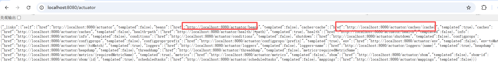

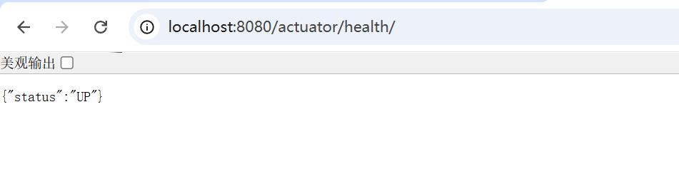

##### 6.7.1.2.2 定制端点（可以自己指自定义）

* 健康监控：返回存活、死亡
* 指标监控：次数、率

1. HealthEndpoint(健康监控)

   * 实现HealthIndicator接口

   ```java
   package com.chanpller.chapter6actuator.health;
   
   import com.chanpller.chapter6actuator.component.MyComponent;
   import org.springframework.beans.factory.annotation.Autowired;
   import org.springframework.boot.actuate.health.Health;
   import org.springframework.boot.actuate.health.HealthIndicator;
   import org.springframework.stereotype.Component;
   
   @Component
   public class MyHealthIndicator implements HealthIndicator {
       @Autowired
       private MyComponent myComponent;
       @Override
       public Health health() {
           int errorCode = myComponent.check(); // perform some specific health check
           if (errorCode != 0) {
               return Health.down().withDetail("Error Code", errorCode).build
                       ();
           }
           return Health.up().build();
       }
   }
   
   //可以自己构建Health，包括详细信息
   //Health build = Health.down()
   //        .withDetail("msg", "error service")
   //        .withDetail("code", "500")
   //        .withException(new RuntimeException())
   //        .build();
   ```

   ```properties
   management.endpoints.enabled-by-default=true
   management.endpoints.web.exposure.include=*
   management.health.eabaled=true
   management.health.show-details=always
   ```

2. MetricsEndpoint(指标监控)

   * 注入MeterRegistry

   ```java
   package com.chanpller.chapter6actuator.service;
   
   import io.micrometer.core.instrument.Counter;
   import io.micrometer.core.instrument.MeterRegistry;
   import org.springframework.stereotype.Service;
   
   @Service
   public class MyService{
       Counter counter;
       public MyService(MeterRegistry meterRegistry){
           //自动一获取一个Counter计数器
           counter = meterRegistry.counter("myservice.method.running.counter");
       }
       public void hello() {
           counter.increment();
       }
   }
   ```

   * 通过访问:http://localhost:8080/actuator/metrics/http.server.requests可以看下具体参数
   * http://localhost:8080/actuator/metrics/myservice.method.running.counter可以看到自定义的参数请求次数

### 6.7.2  监控案例落地

> 基于 Prometheus + Grafana

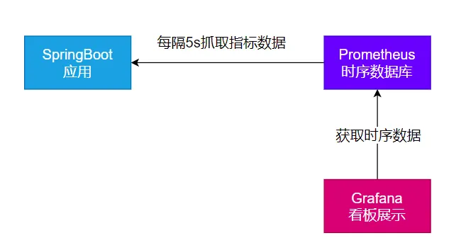

#### 6.7.2.1 安装Prometheus+Grafana

```shell
#安装prometheus:时序数据库
docker run -p 9090:9090 -d \
-v pc:/etc/prometheus \
prom/prometheus
#安装grafana；默认账号密码 admin:admin
docker run -d --name=grafana -p 3000:3000 grafana/grafana
```

#### 6.7.2.2 导入依赖

```xml
<dependency>
    <groupId>org.springframework.boot</groupId>
    <artifactId>spring-boot-starter-actuator</artifactId>
</dependency>
<dependency>
    <groupId>io.micrometer</groupId>
    <artifactId>micrometer-registry-prometheus</artifactId>
    <version>1.10.6</version>
</dependency>
<!-- springboot 3.5.11需要使用1.13.0的版本
<dependency>
    <groupId>io.micrometer</groupId>
    <artifactId>micrometer-registry-prometheus</artifactId>
    <version>1.13.0</version>
</dependency>
-->
```

```properties
#application.properties配置文件
1management.endpoints.enabled-by-default=true
management.endpoints.web.exposure.include=*
management.health.enabled=true
management.health.show-details=always
management.endpoint.prometheus.enabled=true
```

访问http://localhost:8080/actuator/prometheus进行验证，返回prometheus格式的所有指标。

> 将java应用部署到服务器
>
> 先安装JDK
>
> ```shell
> #安装openjdk
> # 下载openjdk
> wget https://download.oracle.com/java/17/latest/jdk-17_linux-x64_bin.tar.g
> z
> mkdir -p /opt/java
> tar -xzf jdk-17_linux-x64_bin.tar.gz -C /opt/java/
> sudo vi /etc/profile
> #在最后面加入以下内容
> export JAVA_HOME=/opt/java/jdk-17.0.7
> export PATH=$PATH:$JAVA_HOME/bin
> #环境变量生效
> source /etc/profile
> # 后台启动java应用
> nohup java -jar boot3-14-actuator-0.0.1-SNAPSHOT.jar > output.log 2>&1 &
> # 如果防火墙开启，需要添加端口规则
> sudo firewall-cmd --permanent --add-port=1-65533/tcp
> sudo firewall-cmd --reload
> #自己安装的java
> nohup /usr/lib/jvm/java-17-openjdk-17.0.1.0.12-2.el8_5.x86_64/bin/java -jar chapter-6-actuator-3.5.11.jar > output.log 2>&1 &
> ```
>
> 确认可以访问到： http://8.130.32.70:9999/actuator/prometheus

#### 6.7.2.3 配置Prometheus拉取数据

```yaml
## 修改 prometheus.yml 配置文件
  - job_name: 'spring-boot-actuator-exporter'
    metrics_path: '/actuator/prometheus'#指定抓取的路径
    static_configs:
      - targets: ['192.168.154.128:9000']
      labels:
        nodename: 'app-demo'
```

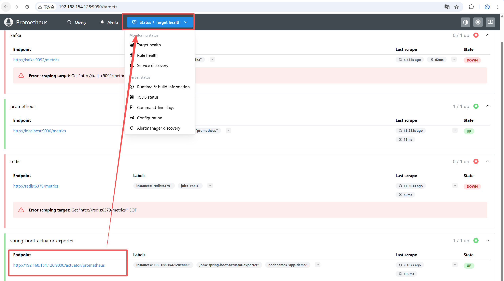

#### 6.7.2.4 配置Grafana监控面板

* 添加数据源（Prometheus）

* 添加面板。可去 dashboard 市场找一个自己喜欢的面板，也可以自己开发面板;Dashboards | Grafana Labs

  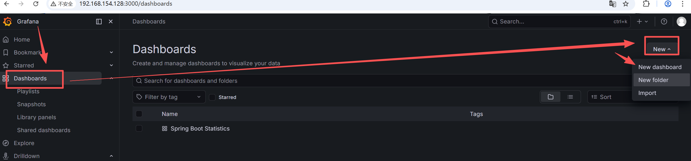

  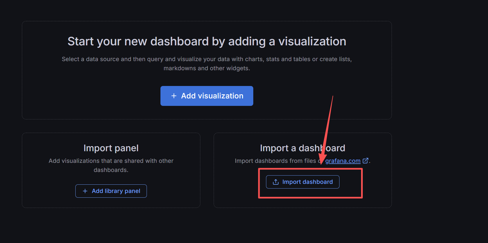

  搜索模板

  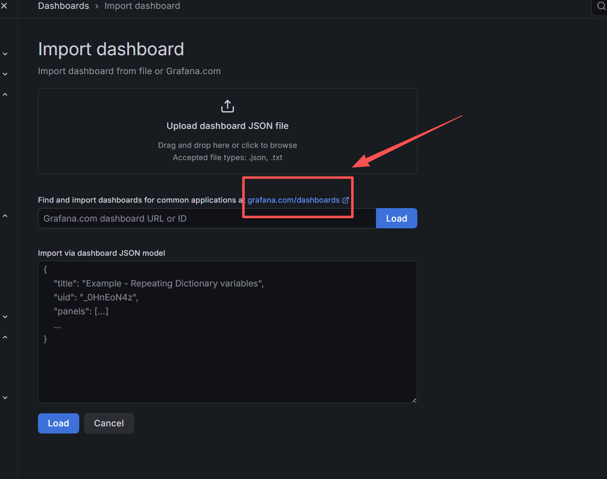

  这里我找的是JVM SpringBoot3 dashboard (for Prometheus Operator)，复制模板id

  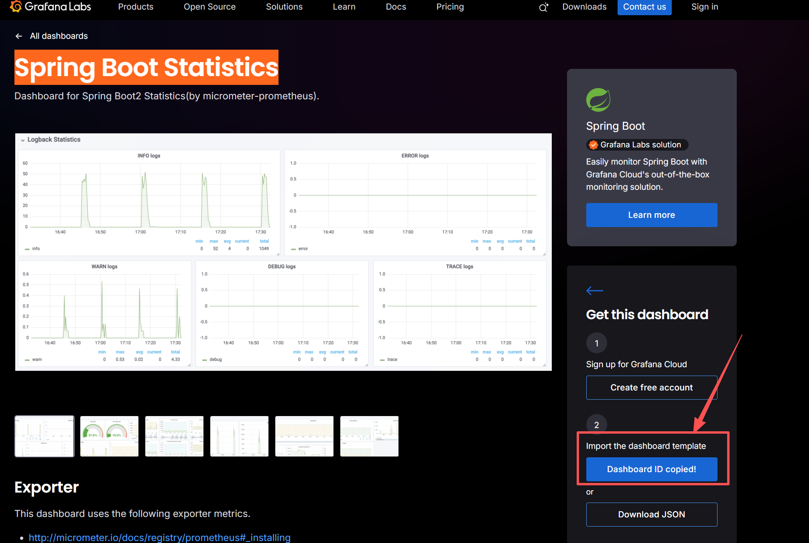

  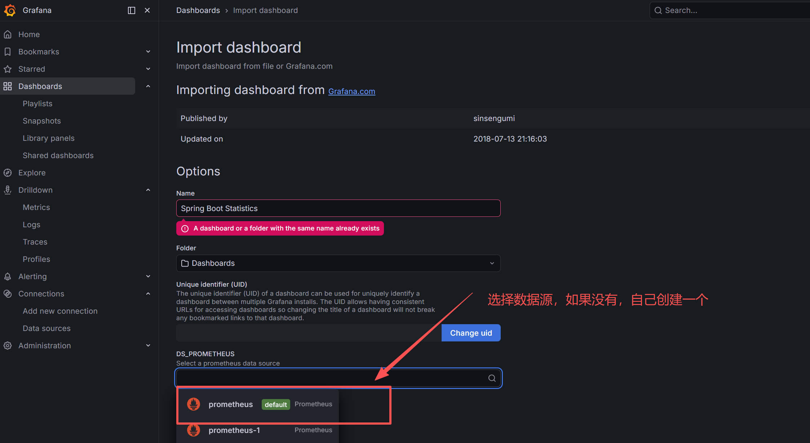
  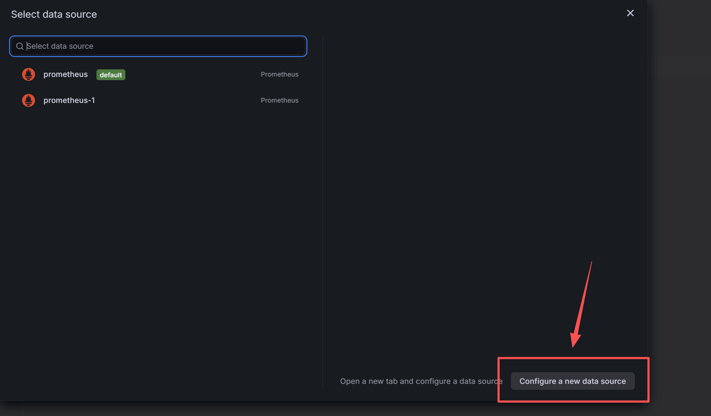

  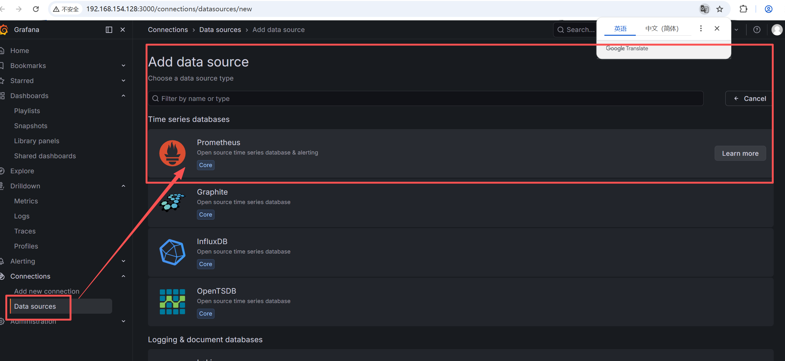

  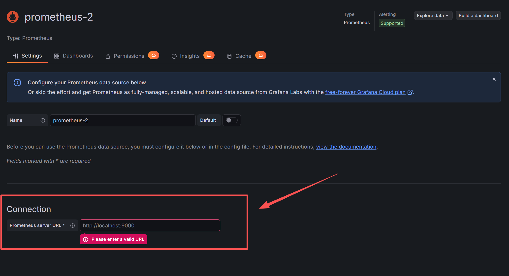

  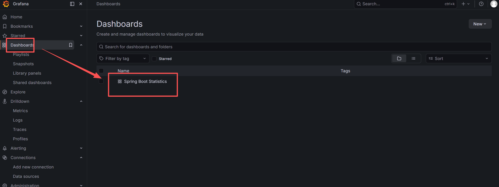

#### 6.7.2.5 效果

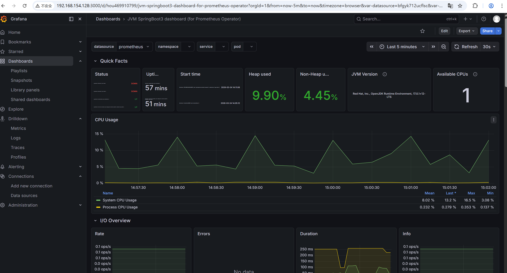

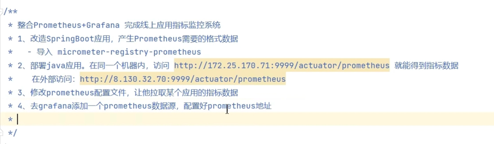

## 6.8 AOT

### 6.8.1 AOT与JIT

AOT：Ahead-of-Time（提前编译）：程序执行前，全部被编译成机器码

JIT：Just in Time（即时编译）: 程序边编译，边运行；

编译：

* 源代码（.c、.cpp、.go、.java。。。）===>编译===>机器码

语言分类：

* 编译型语言，需要编译器
* 解释型语言，需要解释器

#### 6.8.1.1 Complier 与 Interpreter

* Java是半编译半解释性语言

* 在线编译网站：https://anycodes.cn/editor

  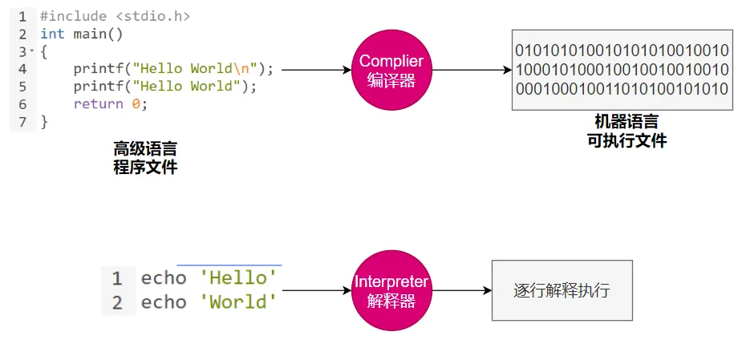

  

  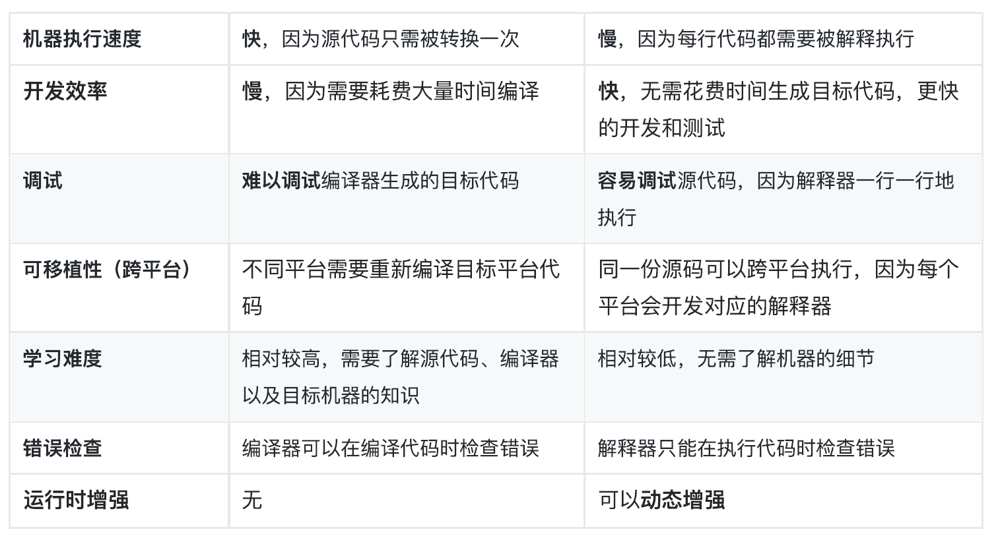

#### 6.8.1.2 AOT 与 JIT 对比

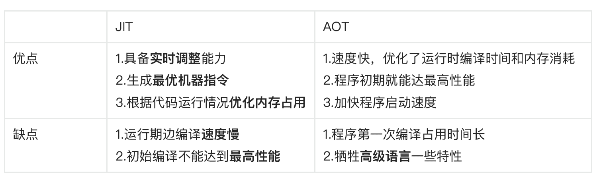

在 OpenJDK 的官方 Wiki 上，介绍了HotSpot 虚拟机一个相对比较全面的、即时编译器（JIT）中采用的优化技术列表。

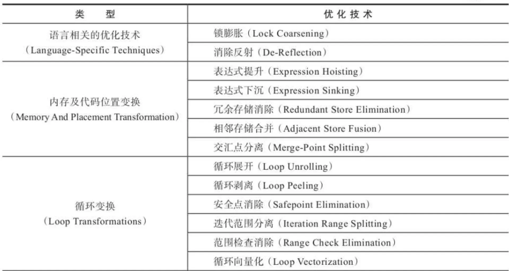

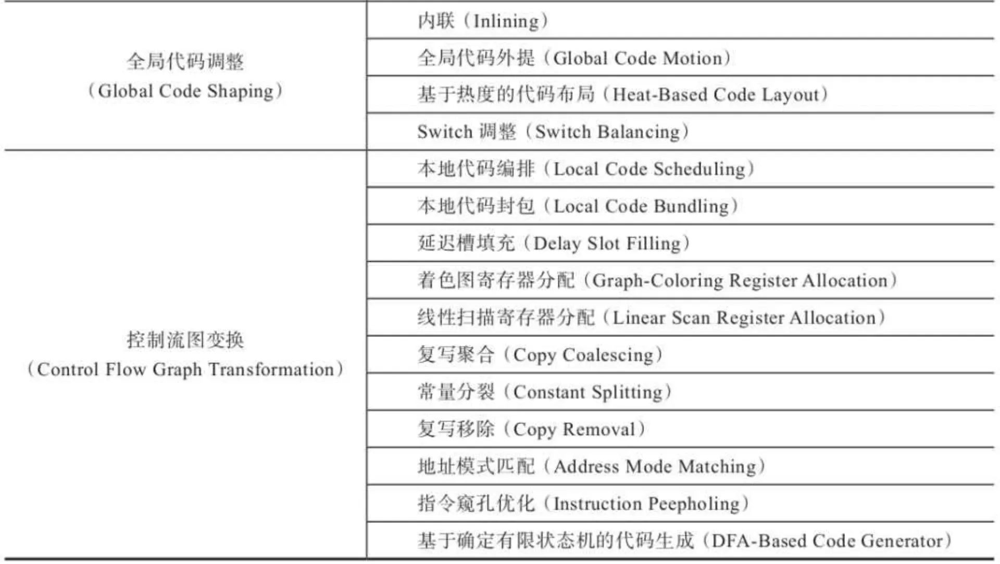

可使用：-XX:+PrintCompilation 打印JIT编译信息

#### 6.8.1.3 JVM架构

.java ==转成= >.class ==再转成=> 机器码进行执行

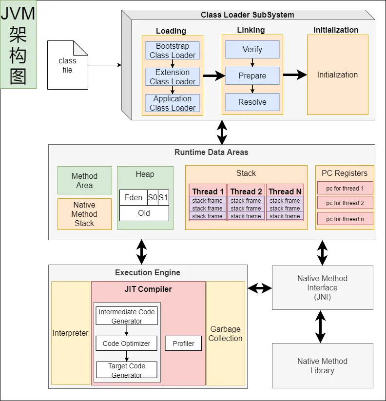

JVM: 既有解释器，又有编辑器（JIT：即时编译）；

#### 6.8.1.4 Java的执行过程

> 建议阅读：
> ● 美团技术：https://tech.meituan.com/2020/10/22/java-jit-practice-in-meituan.html
> ● openjdk官网：https://wiki.openjdk.org/display/HotSpot/Compiler

1. 流程概要

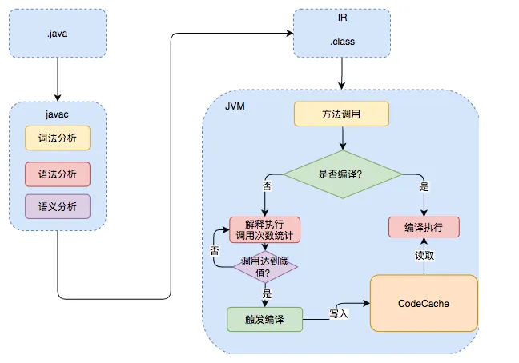

解释执行：

编译执行：

2. 详细流程

   热点代码：调用次数非常多的代码

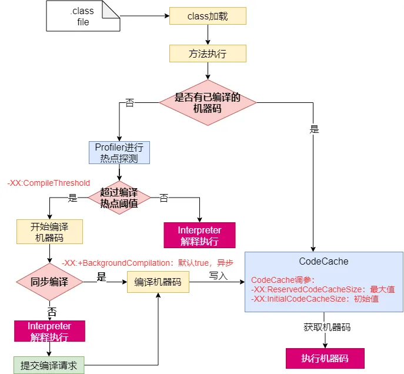


#### 6.8.1.5 JVM编译器

JVM中集成了两种编译器，Client Compiler 和 Server Compiler；

* Client Compiler注重启动速度和局部的优化
* Server Compiler更加关注全局优化，性能更好，但由于会进行更多的全局分析，所以启动速度会慢。

Client Compiler：

* HotSpot VM带有一个Client Compiler C1编译器
* 这种编译器启动速度快，但是性能比较Server Compiler来说会差一些。
* 编译后的机器码执行效率没有C2的高

Server Compiler：

* Hotspot虚拟机中使用的Server Compiler有两种：C2 和 Graal。
* 在Hotspot VM中，默认的Server Compiler是C2编译器。

#### 6.8.1.6 分层编译

Java 7开始引入了分层编译(Tiered Compiler)的概念，它结合了C1和C2的优势，追求启动速度和峰值性能的一个平衡。分层编译将JVM的执行状态分为了五个层次。五个层级分别是：

* 解释执行。
* 执行不带profiling的C1代码。
* 执行仅带方法调用次数以及循环回边执行次数profiling的C1代码。
* 执行带所有profiling的C1代码。
* 执行C2代码。

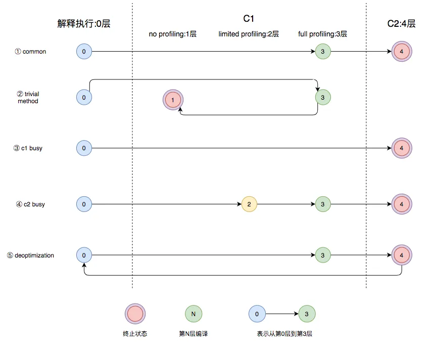

profiling就是收集能够反映程序执行状态的数据。其中最基本的统计数据就是方法的调用次数，以及循环回边的执行次数。

* 图中第①条路径，代表编译的一般情况，热点方法从解释执行到被3层的C1编译，最后被4层的C2编译。
* 如果方法比较小（比如Java服务中常见的getter/setter方法），3层的profiling没有收集到有价值的数据，JVM就会断定该方法对于C1代码和C2代码的执行效率相同，就会执行图中第②条路径。在这种情况下，JVM会在3层编译之后，放弃进入C2编译，直接选择用1层的C1编译运行。
* 在C1忙碌的情况下，执行图中第③条路径，在解释执行过程中对程序进行profiling ，根据信息直接由第4层的C2编译。
* 前文提到C1中的执行效率是1层>2层>3层，第3层一般要比第2层慢35%以上，所以在C2忙碌的情况下，执行图中第④条路径。这时方法会被2层的C1编译，然后再被3层的C1编译，以减少方法在3层的执行时间。
* 如果编译器做了一些比较激进的优化，比如分支预测，在实际运行时发现预测出错，这时就会进行反优化，重新进入解释执行，图中第⑤条执行路径代表的就是反优化。

总的来说，C1的编译速度更快，C2的编译质量更高，分层编译的不同编译路径，也就是JVM根据当前服务的运行情况来寻找当前服务的最佳平衡点的一个过程。从JDK 8开始，JVM默认开启分层编译。

为什么会发展GraalVM，因为云原生：Cloud Native，启动时 Java小改版；

最好的效果：
存在的问题：

* java应用如果用jar，解释执行，热点代码才编译成机器码；初始启动速度慢，初始处理请求数量少。
* 大型云平台，要求每一种应用都必须秒级启动。每个应用都要求效率高。

希望的效果：

* java应用也能提前被编译成机器码，随时急速启动，一启动就急速运行，最高性能
* 编译成机器码的好处：
  * 另外的服务器还需要安装Java环境
  * 编译成机器码的，可以在这个平台 Windows X64 直接运行。

原生镜像：native-image（机器码、本地镜像）

* 把应用打包成能适配本机平台 的可执行文件（机器码、本地镜像）

### 6.8.2 GraalVM

https://www.graalvm.org/

> GraalVM是一个高性能的JDK，旨在加速用Java和其他JVM语言编写的应用程序的执行，同时还提供JavaScript、Python和许多其他流行语言的运行时。
> GraalVM提供了两种运行Java应用程序的方式：
>
> 1. 在HotSpot JVM上使用Graal即时（JIT）编译器
> 2. 作为预先编译（AOT）的本机可执行文件运行（本地镜像）。
>
> GraalVM的多语言能力使得在单个应用程序中混合多种编程语言成为可能，同时消除了外部语言调用的成本。

#### 6.8.2.1 架构

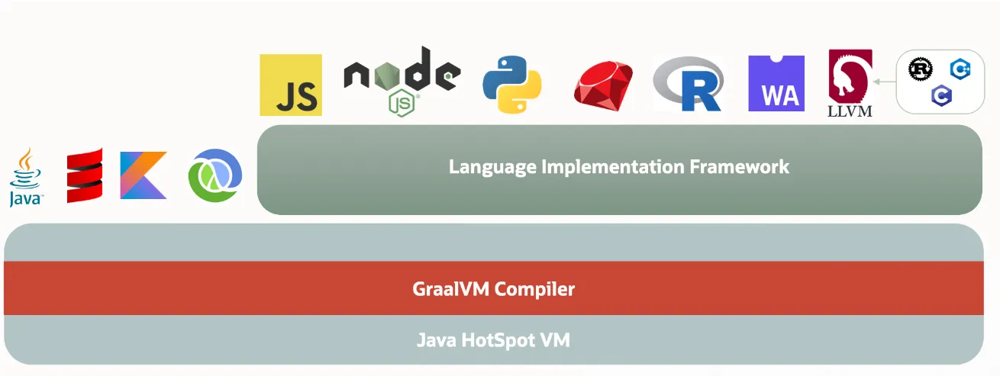

#### 6.8.2.2 安装

> 跨平台提供原生镜像原理：

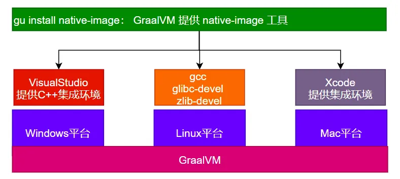

1. VisualStudio

https://visualstudio.microsoft.com/zh-hans/free-developer-offers/

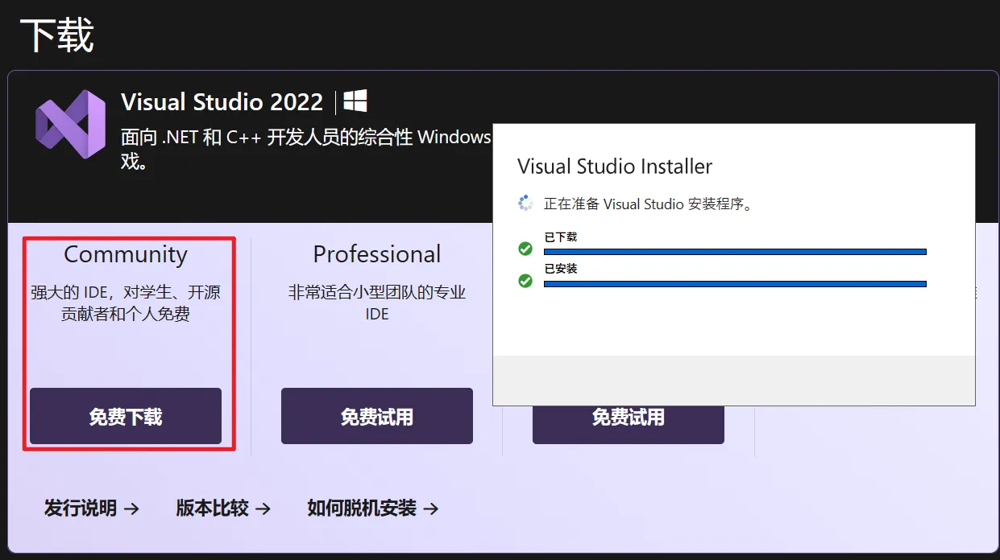

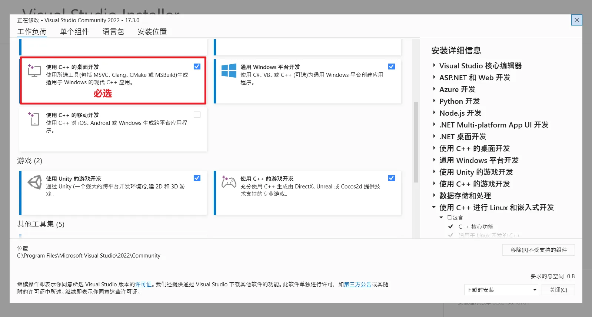

别选中文

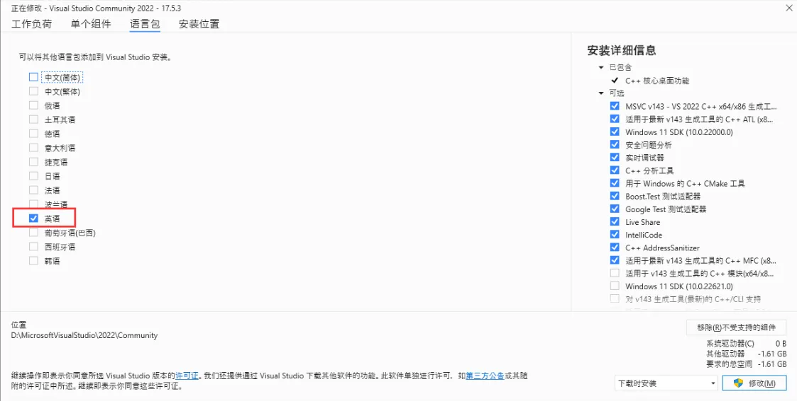

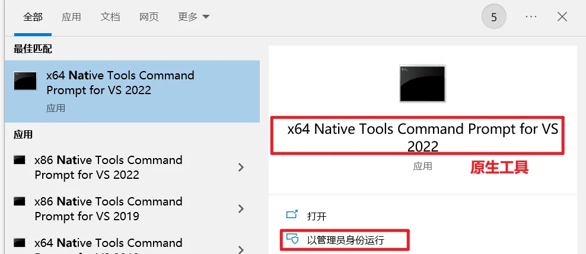

记住你安装的地址；

2. GraalVM

   1. 安装

      下载 GraalVM + native-image


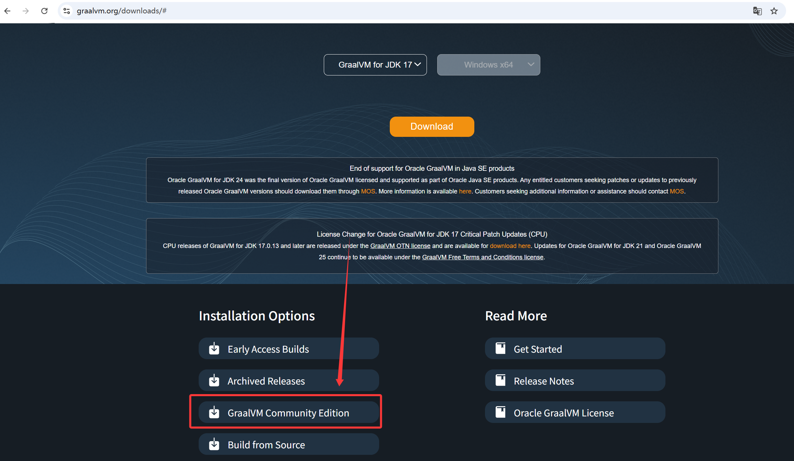

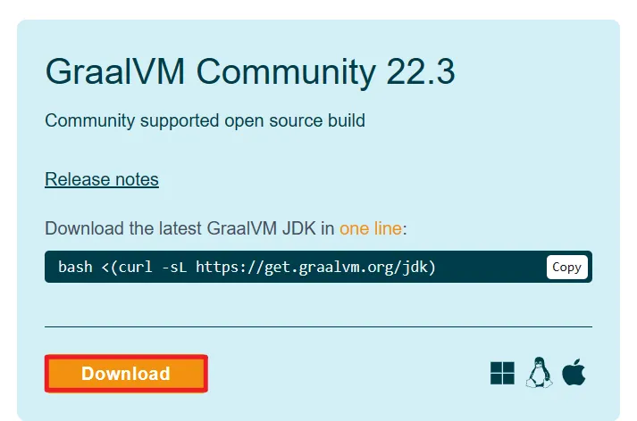

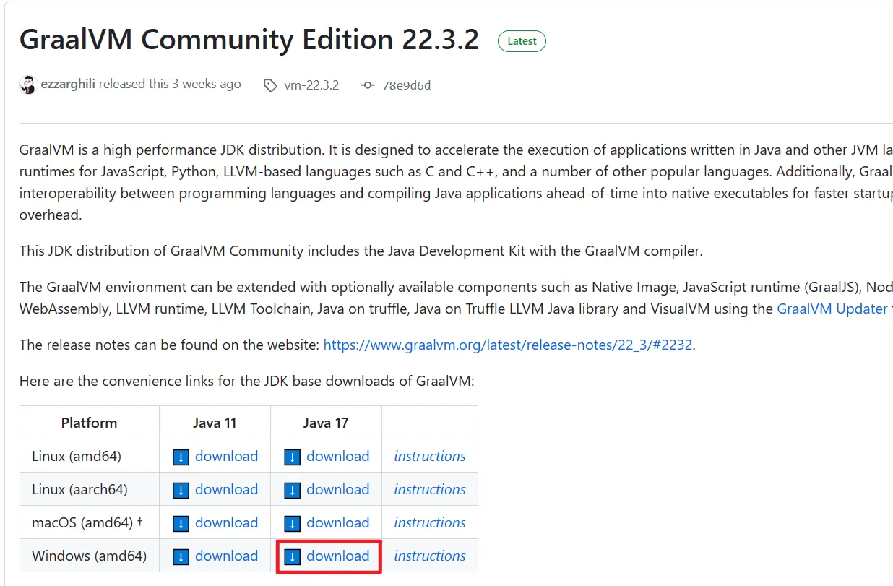

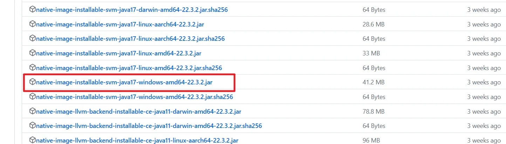


2. 配置

   修改 JAVA_HOME 与 Path，指向新bin路径

   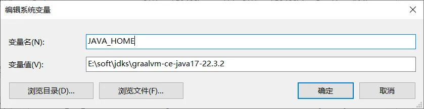

   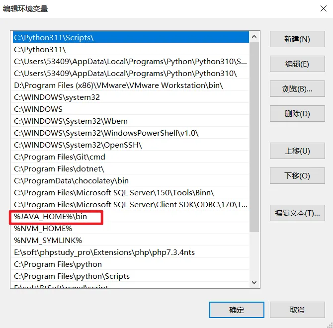

   验证JDK环境为GraalVM提供的即可：

   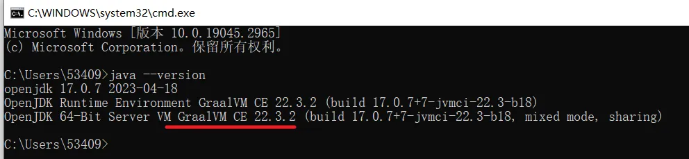

3. 依赖

   安装 native-image 依赖：

   1. 网络环境好：参考：https://www.graalvm.org/latest/reference-manual/native-image/#install-native-image

      ```shell
      gu install native-image
      ```

   2. 网络不好，使用我们下载的离线jar;native-image-xxx.jar文件

      ```shell
      gu install --file native-image-installable-svm-java17-windows-amd64-22.3.2.jar
      ```

4. 验证

   ```
   native-image
   #提示下面内容表示成功
   #Please specify options for native-image building or use --help for more info.
   ```

#### 6.8.2.3 测试

1. 创建项目
   1. 创建普通java项目。编写HelloWorld类；
      - 使用mvn clean package进行打包
      - 确认jar包是否可以执行java -jar xxx.jar
      - 可能需要给 MANIFEST.MF添加 Main-Class: 你的主类

2. 编译镜像
   * 编译为原生镜像（native-image）：使用native-tools终端(x64 Native Tools Command Prompt for VS)，不能使用cmd命令终端

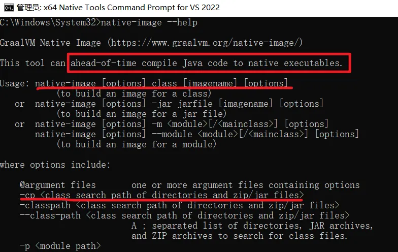

```
#从入口开始，编译整个jar
native-image -cp boot3-15-aot-common-1.0-SNAPSHOT.jar com.atguigu.MainApplication -o Haha

#编译某个类【必须有main入口方法，否则无法编译】
native-image -cp .\classes org.example.App
```

3. Linux平台测试
   1. 安装gcc等环境

   ```
   yum install lrzsz
   sudo yum install gcc glibc-devel zlib-devel
   ```

4. 下载安装配置Linux下的GraalVM、native-image

   - 下载：https://www.graalvm.org/downloads/
   - 安装：GraalVM、native-image
   - 配置：JAVA环境变量为GraalVM

   ```
   tar -zxvf graalvm-ce-java17-linux-amd64-22.3.2.tar.gz -C /opt/java/
   
   sudo vim /etc/profile
   #修改以下内容
   export JAVA_HOME=/opt/java/graalvm-ce-java17-22.3.2
   export PATH=$PATH:$JAVA_HOME/bin
   
   source /etc/profile
   
   #或者
   sudo vim /etc/profile.d/graalvm.sh
   添加以下内容 (注意：不要 export,直接赋值)
   export JAVA_HOME=/opt/java/graalvm-ce-java17-22.3.3
   export PATH=$JAVA_HOME/bin:$PATH
   source /etc/profile.d/graalvm.sh
   java -version
   ```

5. 安装native-image

   ```
   gu install --file native-image-installable-svm-java17-linux-amd64-22.3.2.jar
   ```

6. 使用native-image编译jar为原生程序

   1. 内存和CPU需要大一点，否则会卡住

   ```
   native-image -cp xxx.jar org.example.App -o xx
   # native-image -cp test_graalvm-0.0.1-SNAPSHOT.jar MainApplication -o hehe
   #编译通过后，./hehe执行
   ./hehe
   ```

### 6.8.3 SpringBoot整合

#### 6.8.3.1 依赖导入

```xml
<build>
        <plugins>
            <plugin>
                <groupId>org.graalvm.buildtools</groupId>
                <artifactId>native-maven-plugin</artifactId>
            </plugin>
            <plugin>
                <groupId>org.springframework.boot</groupId>
                <artifactId>spring-boot-maven-plugin</artifactId>
            </plugin>
        </plugins>
    </build>
```

报错：

```
native-image is not installed in your JAVA_HOME.This probably means that the JDK at 'C:\Program Files\Java\jdk-17' is not a GraalVM distribution. The GraalVM Native Maven Plugin requires GRAALVM_HOME or JAVA_HOME to be a GraalVM distribution.
```

* 添加GRAALVM_HOME和JAVA_HOME

#### 6.8.3.2 生成native-image

1. 运行process-aot提前处理命令：mvn package
2. 运行aot提前处理命令：mvn springboot:process-aot
3. 运行native打包：mvn -Pnative native:build

```
# 推荐加上 -Pnative 否则启动乱码
mvn -Pnative native:build -f pom.xml

# -X debug模式打包
mvn -Pnative -X native:build 
```

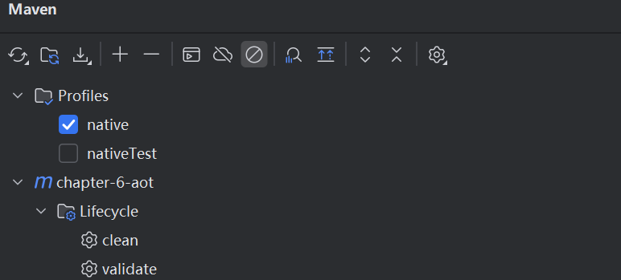

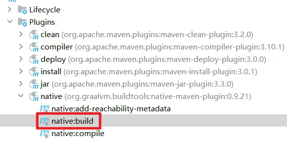

#### 6.8.3.3 常见问题

可能提示如下各种错误，无法构建原生镜像，需要配置环境变量；

* 出现cl.exe找不到错误
* 出现乱码
* 提示no include path set
* 提示fatal error LNK1104: cannot open file ‘LIBCMT.lib’
* 提示 LINK : fatal error LNK1104: cannot open file ‘kernel32.lib’
* 提示各种其他找不到

需要修改三个环境变量：Path、INCLUDE、lib

1. Path：添加如下值

   - D:\Program Files\Microsoft Visual Studio\18\Community\VC\Tools\MSVC\14.50.35717\bin\Hostx64\x64

2. 新建INCLUDE环境变量：值为

   ```
   D:\Program Files\Microsoft Visual Studio\18\Community\VC\Tools\MSVC\14.50.35717\include;C:\Program Files (x86)\Windows Kits\10\Include\10.0.26100.0\shared;C:\Program Files (x86)\Windows Kits\10\Include\10.0.26100.0\ucrt;C:\Program Files (x86)\Windows Kits\10\Include\10.0.26100.0\um;C:\Program Files (x86)\Windows Kits\10\Include\10.0.26100.0\winrt;
   ```

   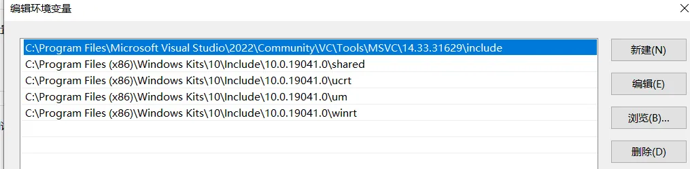

3. 新建lib环境变量：值为

   ```
   C:\Program Files (x86)\Windows Kits\10\Lib\10.0.26100.0\ucrt\x64;C:\Program Files (x86)\Windows Kits\10\Lib\10.0.26100.0\um\x64;D:\Program Files\Microsoft Visual Studio\18\Community\VC\Tools\MSVC\14.50.35717\lib\x64;
   ```

   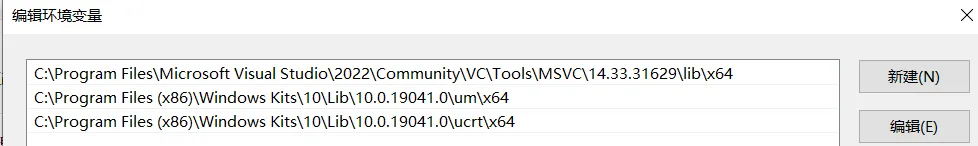

* 运行项目报错

  ```
  Logging system failed to initialize using configuration from 'null'
  java.nio.charset.UnsupportedCharsetException: x-mswin-936
  ```

  springboot3 需要配置logback-spring.xml，在项目resource目录下添加logback-spring.xml

  ```xml
  <?xml version="1.0" encoding="UTF-8"?>
  
  <configuration>
  
      <!-- 配置根日志级别，控制全局的日志级别 -->
      <root level="INFO">
          <!-- 附加输出目标（appender）的引用，可以有多个 -->
          <appender-ref ref="CONSOLE" />
          <appender-ref ref="FILE" />
      </root>
  
      <!-- 定义控制台输出 -->
      <appender name="CONSOLE" class="ch.qos.logback.core.ConsoleAppender">
          <encoder>
              <pattern>%d{HH:mm:ss.SSS} [%thread] %-5level %logger{36} - %msg%n</pattern>
          </encoder>
      </appender>
  
      <!-- 定义文件输出 -->
      <appender name="FILE" class="ch.qos.logback.core.FileAppender">
          <!--<file>myapp.log</file>-->
          <file>/log/chjb.log</file>
          <encoder>
              <pattern>%d{HH:mm:ss.SSS} [%thread] %-5level %logger{36} - %msg%n</pattern>
          </encoder>
      </appender>
  
  </configuration>
  
  ```
  
  application.properties添加
  
  ```properties
  logging.config=classpath:logback-spring.xml
  ```
  
  