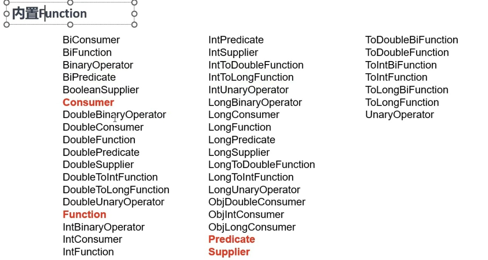
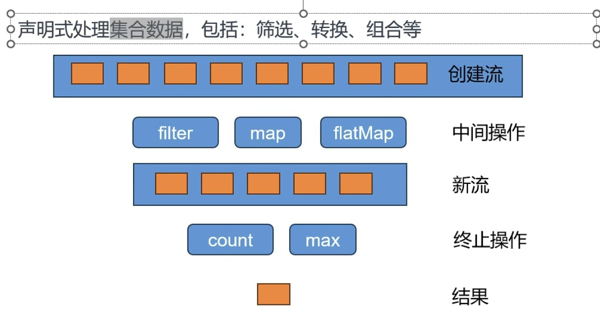
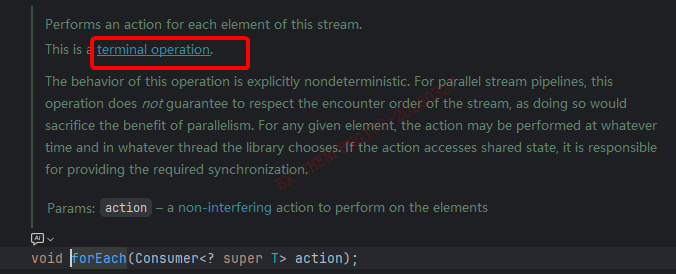

# 第7章-Springboot3-Reactor核心

## 7.1 前置知识

### 7.1.1 Lambda

* Lambda是Java8引入的特性

* Lambda表达式可以被视为匿名函数，允许在需要函数的地方以更简洁的方式定义功能。

* 格式

  ```
  (parameters)->expression
  (parameters)->{statments;}
  ```

Java8语法糖：

* 函数式接口；只要是函数式接口就可以用Lambda表达式简化
* 函数式接口： 接口中有且只有一个未实现的方法，这个接口就叫函数式接口。可以用default方法和静态方法。
* @FunctionalInterface //检查注解，帮我们快速检查我们写的接口是否函数式接口

```java
package com.chanpller.chapter7reactor.function;

@FunctionalInterface //检查注解，帮我们快速检查我们写的接口是否函数式接口
interface MyInterface {
     void test();
     default void test2(){

     }
     static void test3(){

     }
}
class MyInterfaceImpl implements MyInterface {
    @Override
    public void test() {
        System.out.println("test");
    }
}

public class TestFunction {
    public static void main(String[] args) {
        MyInterface myInterface = new MyInterfaceImpl();
        myInterface.test();

        MyInterface myInterface2 = () -> System.out.println("test2");
        myInterface2.test();

    }
}

```

### 7.1.2 Function

* 在Java中，函数式接口是只包含一个抽象方法的接口。他们是支持Lambda表达式的基础，因为Lambda表达式需要一个目标类型，这个目标类型必须是一个函数式接口。
* java.util.function包下提供了很多java自定义的函数接口
* 分类几类
  * 有入参，有返回值（比如Function，就是函数）
  * 有入参，没有返回值（比如Consumer，消费者）
  * 没有入参，有返回值（比如Supplier，生产者）
  * 没有入参，没有返回值（比如Runnable，线程方法）
* java.util.function包下的所有function定义：
  * Consumer： 消费者
  * Supplier： 提供者
  * Predicate： 断言
  * get/test/apply/accept调用的函数方法；

```java
package com.chanpller.chapter7reactor.function;

import java.util.UUID;
import java.util.function.BiConsumer;
import java.util.function.Function;
import java.util.function.Predicate;
import java.util.function.Supplier;

public class Lambda {
    public static void main(String[] args) {
//        Function<String,Integer> function = (s)-> Integer.parseInt(s);
        //一个入，一个出
        //String,Integer，前面String是入参，Inter是出餐一个参数，一个返回值，函数式接口
        Function<String,Integer> function = Integer::parseInt;
        System.out.println(function.apply("123"));

        //消费者，binary 双份，两个参数的，String,String都是入参
        //都是入，没有出
        BiConsumer<String,String> biConsumer = (s1,s2)-> System.out.println(s1+s2);

        biConsumer.accept("123","456");

        //没有入，只有出
        //生产者
        Supplier<String> stringSupplier = ()-> UUID.randomUUID().toString();
        System.out.println(stringSupplier.get());

        //没入，没出
        Runnable runnable = ()-> System.out.println("runnable");
        runnable.run();

        //Predicate断言
        Predicate<Integer> predicate = (i)-> i%2==0;
        System.out.println(predicate.test(2));
        System.out.println(predicate.negate().test(2));
    }
}

```



### 7.1.3 StreamAPI



* 概念
  * Stream Pipeline：流管道、流水线
  * Intermediate Operation：中间操作
  * Terminal Operation：终止操作
* 最佳实战：以后凡是你写for循环处理数据的统一全部用StreamAPI进行替换；
* Stream所有数据和操作被组合成流管道

* Stream所有数据和操作被组合成流管道流管道组成：

  一个数据源（可以是一个数组、集合、生成器函数、I/O管道）---->零或多个中间操作（将一个流变形成另一个流）---->一个终止操作（产生最终结果）

* Stream分三步，像流水一样：准备数据源==》0个或多个处理（中间操作，不会真正执行）==>1个终止操作(产生结果)

* 流是惰性的，只有终止操作时才会对数据进行计算，而且只有在需要时才会消耗源元素。这个很好理解，中间过程都是在定义流程和操作，就像定义一个流水线一样，会返回(创建)Stream类，当执行Terminal Operation最后的操作，才是执行方法。

中间操作：Intermediate Operations包括

* filter：过滤； 挑出我们用的元素
* map：映射： 一一映射，a 变成 b
  * mapToInt、mapToLong、mapToDouble
* flatMap：打散、散列、展开、扩维：一对多映射
* takeWhile：当满足条件，拿到这个元素，不满足直接结束流操作

```
filter、map、mapToInt、mapToLong、mapToDouble
flatMap、flatMapToInt、flatMapToLong、flatMapToDouble
mapMulti、mapMultiToInt、mapMultiToLong、mapMultiToDouble、
parallel、unordered、onClose、sequential
distinct、sorted、peek、limit、skip、takeWhile、dropWhile、
```

终止操作：Terminal Operation

```
forEach、forEachOrdered、toArray、reduce、collect、toList、min、
max、count、anyMatch、allMatch、noneMatch、findFirst、findAny、iterator
```

可以通过源代码看到方法是不是结束操作



```java
public static void main(String[] args) {
        List<Integer> list = List.of(1,2,3,4,5,6,7,8,9,10);
        list.stream().forEach(System.out::println);
        list.stream().filter(i -> i % 2 == 0).forEach(System.out::println);

        Stream<Integer> integerStream = list.stream().filter(i -> {
                    System.out.println("中间过程执行"+i);
                    return i % 2 == 0;
                }
        );
        integerStream.count();
    }
```

1. 创建流
   * Stream.of(1,2,3,4,5,6,7,8,9,10);
   * Stream.iterate(0,i->i+1);
   * Stream.generate(Math::random);
   * Stream.empty();
   * Stream.ofNullable(null);
   * Stream.Builder<Integer> builder = Stream.builder();
     builder.add(1).add(2).add(3).build();
   * 集合.stream
2. 流也是用for循环挨个处理，默认不并发，也可以并发，并发后，需要自行解决多线程问题。
3. 流的所有操作都是无状态；数据状态仅在此函数内有效，不溢出至函数外。比如在外面定义了一个是List，在并发流里面使用这个List，有安全并发问题，这个List就是有状态数据。

### 7.1.4 Reactive-Stream

早在上世纪60年代，IT领域就首次出现了“响应式编程(reactive programming,Rx)”一词 [8]。微软于2009年以.Net的一个响应式扩展的方式创造了Rx。2012年Netflix开始将.NET Rx迁移到JVM，并于2013年2月份正式向外发布了[RxJava](https://baike.baidu.com/item/RxJava/22262876?fromModule=lemma_inlink) [5]。同年，业界发起了响应式流规范(Reactive Stream Specification) [4]。2014年9月16号，反应式宣言正式发布了2.0版本 [5]。Java 9平台开始支持Reactive Stream API [4]。在2017年9月28日，Spring 5正式发布，将响应式编程技术的普及向前推进了一大步 [6]。


响应式流是由Reactive Streams API定义的规范，它定义了四种核心接口：`Publisher`、`Subscriber`、`Subscription` 和 `Processor`。这些接口允许开发者构建异步的、非阻塞的数据流处理系统。

- ‌**Publisher**‌：生产者，负责产生数据流。

- ‌**Subscriber**‌：订阅者，接收并处理数据流。

- ‌**Subscription**‌：订阅关系，管理请求和取消订阅等操作。

- ‌**Processor**‌：处理器，既是Publisher又是Subscriber，可以在数据流中添加额外的处理逻辑。

  

‌**Reactive Streams**‌ 是一套用于处理异步数据流的标准化规范，核心目标是在非阻塞、高并发场景下实现生产者（Publisher）与消费者（Subscriber）之间的高效通信，并通过 ‌**背压（Backpressure）**‌ 机制防止消费者被数据淹没。


* https://www.reactive-streams.org/
* JDK9之后提供的API
* ‌**Reactive Streams**‌是JVM面向流的库的标准和规范
  * 处理可能无限数量的元素
  * 有序
  * 在组件之间异步传递元素
  * 强制性非阻塞背压模式

#### 7.1.5.1 响应式编程的说明

命令式编程：全自定义

响应式编程/声明式编程：声明流、说清楚要干什么、最终结果是要怎么样

流模式：是推，上有有数据，自动推给下游

迭代器模式：是拉，自己遍历，自己拉取


#### 7.1.5.2 java.util.concurrent.Flow

* JVM 底层对整个发布订阅关系做好了 异步+缓存处理  = 响应式系统。
* publisher发布的所有数据在它的buffer区
* Processor既是发布者又是消费者

```java
package com.chanpller.chapter7reactor.function;

import java.util.concurrent.Flow;
import java.util.concurrent.SubmissionPublisher;


public class FlowDemo {
    //中间处理过程，既是消费者，也是发布者
    static class MyProcessor extends SubmissionPublisher<String> implements Flow.Processor<String,String> {
        private Flow.Subscription subscription;

        @Override
        public void onSubscribe(Flow.Subscription subscription) {
            System.out.println(Thread.currentThread().getName() +"==onSubscribe");
            this.subscription = subscription;
            this.subscription.request(1);
        }

        @Override
        public void onNext(String item) {
            System.out.println(Thread.currentThread().getName() +"==onNext=" + item);

            item += "处理了一次";
            this.subscription.request(1);
            submit(item);
        }

        @Override
        public void onError(Throwable throwable) {
            System.out.println(Thread.currentThread().getName() +"==onError=" + throwable);
        }

        @Override
        public void onComplete() {

            System.out.println(Thread.currentThread().getName() +"==onComplete=");
        }
    }
    public static void main(String[] args) {
//        Flow.Publisher<Integer> publisher = new Flow.Publisher<Integer>() {
//            @Override
//            public void subscribe(Flow.Subscriber<? super Integer> subscriber) {
//
//            }
//        };
        SubmissionPublisher<String> publisher1 = new SubmissionPublisher<>();


//，一旦进入 onError 或 onComplete，订阅就终止了，无法继续消费。这是响应式流的设计原则：错误是终端事件。
        Flow.Subscriber<String> subscribe = new Flow.Subscriber<>() {
            private Flow.Subscription subscription;

            @Override
            public void onSubscribe(Flow.Subscription subscription) {
                System.out.println(Thread.currentThread().getName() +"==onSubscribe");
                this.subscription = subscription;
                this.subscription.request(1);
            }

            @Override
            public void onNext(String item) {
//                System.out.println(Thread.currentThread().getName() +"==onNext=" + item);
//                this.subscription.request(1);

                System.out.println(Thread.currentThread().getName() +"==onNext=" + item);

                if(item.equals("5")){
//                    this.subscription.cancel(); // 取消订阅
                    throw new RuntimeException("处理数据时出错"); // 这会触发 onError
                }
                this.subscription.request(1);
            }

            @Override
            public void onError(Throwable throwable) {
                System.out.println(Thread.currentThread().getName() +"==onError=" + throwable);
                this.subscription.request(1);
            }

            @Override
            public void onComplete() {
                System.out.println(Thread.currentThread().getName() +"==onComplete=");
            }
        };
        //发布者和订阅则绑定关系后才能
        //加入中间过程
        MyProcessor myProcessor = new MyProcessor();
        publisher1.subscribe(myProcessor);//此时处理器是消费者
        myProcessor.subscribe(subscribe);//此时处理器是生产者
        for(int i=0;i<10;i++){

            if(i>=4) {//直接调用还没开始消费，就结束了。
                try {
                    Thread.sleep(1000);
                } catch (InterruptedException e) {
                    throw new RuntimeException(e);
                }
                publisher1.closeExceptionally(new RuntimeException("关闭流"));
            }else{
                publisher1.submit(i+"");
            }

        }


        publisher1.close();

        try {
            Thread.sleep(100000);
        } catch (InterruptedException e) {
            throw new RuntimeException(e);
        }
    }
}

```


------

### 7.1.5 核心概念

- ‌**异步非阻塞**‌：数据处理不阻塞线程，提升系统吞吐量和响应能力。
- ‌**背压机制**‌：消费者按自身处理能力向生产者请求数据量，避免过载。
- ‌**事件驱动**‌：基于“推”模型（onNext、onError、onComplete）触发处理。
- ‌**跨框架兼容**‌：不同响应式库（如 Reactor、RxJava）可互操作。


## 7.2 响应式编程

响应式编程是一种关注于数据流（data streams）和变化传递（propagation of change）的异步编程
方式。 这意味着它可以用既有的编程语言表达静态（如数组）或动态（如事件源）的数据流。

响应式编程：

* 底层：基于数据缓冲队列+消息驱动模型+异步回调机制

* 编码：流式编程+链式调用+声明式API

* 效果：优雅全异步+消息实时处理+高吞吐量+占用少量资源

  痛点

了解历史：

* 在响应式编程方面，微软跨出了第一步，它在 .NET 生态中创建了响应式扩展库（Reactive
  Extensions library, Rx）。接着 RxJava 在JVM上实现了响应式编程。后来，在 JVM 平台出现了一
  套标准的响应式 编程规范，它定义了一系列标准接口和交互规范。并整合到 Java 9 中（使用 Flow
  类）。
* 响应式编程通常作为面向对象编程中的“观察者模式”（Observer design pattern）的一种扩展。 响
  应式流（reactive streams）与“迭代子模式”（Iterator design pattern）也有相通之处， 因为其中
  也有 Iterable-Iterator 这样的对应关系。主要的区别在于，Iterator 是基于 “拉取”（pull）方式的，而
  响应式流是基于“推送”（push）方式的。
* 使用 iterator 是一种“命令式”（imperative）编程范式，即使访问元素的方法是 Iterable 的唯一职
  责。关键在于，什么时候执行 next() 获取元素取决于开发者。在响应式流中，相对应的 角色是
  Publisher-Subscriber，但是 当有新的值到来的时候 ，却反过来由发布者（Publisher） 通知订阅者
  （Subscriber），这种“推送”模式是响应式的关键。此外，对推送来的数据的操作 是通过一种声明式（declaratively）而不是命令式（imperatively）的方式表达的：开发者通过 描述“控制流程”来定
  义对数据流的处理逻辑。
* 除了数据推送，对错误处理（error handling）和完成（completion）信号的定义也很完善。 一个
  Publisher 可以推送新的值到它的 Subscriber（调用 onNext 方法）， 同样也可以推送错误（调用
  onError 方法）和完成（调用 onComplete 方法）信号。 错误和完成信号都可以终止响应式流。可以用
  下边的表达式描述：

```
onNext x 0..N [onError | onComplete]
```

### 7.2.1 阻塞是对资源的浪费

现代应用需要应对大量的并发用户，而且即使现代硬件的处理能力飞速发展，软件性能仍然是关键因
素。
广义来说我们有两种思路来提升程序性能：
1. 并行化（parallelize） ：使用更多的线程和硬件资源。[异步]
2. 基于现有的资源来 提高执行效率 。

通常，Java开发者使用阻塞式（blocking）编写代码。这没有问题，在出现性能瓶颈后， 我们可以增加
处理线程，线程中同样是阻塞的代码。但是这种使用资源的方式会迅速面临 资源竞争和并发问题。
更糟糕的是，阻塞会浪费资源。具体来说，比如当一个程序面临延迟（通常是I/O方面， 比如数据库读写
请求或网络调用），所在线程需要进入 idle 状态等待数据，从而浪费资源。
所以，并行化方式并非银弹。这是挖掘硬件潜力的方式，但是却带来了复杂性，而且容易造成浪费。

### 7.2.2 异步可以解决问题吗

第二种思路——提高执行效率——可以解决资源浪费问题。通过编写 异步非阻塞 的代码， （任务发起
异步调用后）执行过程会切换到另一个 使用同样底层资源 的活跃任务，然后等 异步调用返回结果再去
处理。
但是在 JVM 上如何编写异步代码呢？Java 提供了两种异步编程方式：

* 回调（Callbacks）：异步方法没有返回值，而是采用一个callback作为参数（lambda 或匿名类），当结果出来后回调这个callback。常见的例子比如 Swings 的EventListener。
* Futures：异步方法立即返回一个Future<T>，该异步方法要返回结果的是T类型，通过Future封装。这个结果并不是立刻可以拿到，而是等实际处理结束才可用。比如，ExecutorService执行Callable<T>任务时会返回Future对象。

这些技术够用吗？并非对于每个用例都是如此，两种方式都有局限性。

调很难组合起来，因为很快就会导致代码难以理解和维护（即所谓的“回调地狱（callback hell）”）。

考虑这样一种情景：

* 在用户界面上显示用户的5个收藏，或者如果没有任何收藏提供5个建议。
* 这需要3个 服务（一个提供收藏的ID列表，第二个服务获取收藏内容，第三个提供建议内容）：
  回调地狱（Callback Hell）的例子：


### 7.2.3 从命令式编程到响应式编程

类似 Reactor 这样的响应式库的目标就是要弥补上述“经典”的 JVM 异步方式所带来的不足， 此外还会
关注一下几个方面：

* 可编排性（Composability） 以及 可读性（Readability）
* 使用丰富的操作符来处理形如流的数据
* 在订阅（subscribe）之前什么都不会发生
* 背压（backpressure）具体来说即消费者能够反向告知生产者生产内容的速度的能力
* 高层次（同时也是有高价值的）的抽象，从而达到并发无关的效果

#### 7.2.3.1 可编排性与可读性

可编排性，指的是编排多个异步任务的能力。比如我们将前一个任务的结果传递给后一个任务作为输入， 或者将多个任务以分解再汇总（fork-join）的形式执行，或者将异步的任务作为离散的组件在系统中 进行重用。

这种编排任务的能力与代码的可读性和可维护性是紧密相关的。随着异步处理任务数量和复杂度 的提高，编写和阅读代码都变得越来越困难。就像我们刚才看到的，回调模式是简单的，但是缺点 是在复杂的处理逻辑中，回调中会层层嵌入回调，导致回调地狱（Callback Hell）。你能猜到 （或有过这种痛苦经历），这样的代码是难以阅读和分析的。

Reactor 提供了丰富的编排操作，从而代码直观反映了处理流程，并且所有的操作保持在同一层次 （尽量避免了嵌套）。

#### 7.2.3.2 就像装配流水线

你可以想象数据在响应式应用中的处理，就像流过一条装配流水线。Reactor 既是传送带， 又是一个个的装配工或机器人。原材料从源头（最初的Publisher）流出，最终被加工为成品， 等待被推送到消费者（或者Subscriber）。

原材料会经过不同的中间处理过程，或者作为半成品与其他半成品进行组装。如果某处有齿轮卡住， 或者某件产品的包装过程花费了太久时间，相应的工位就可以向上游发出信号来限制或停止发出原材料。

#### 7.2.3.3  操作符（Operators）

在 Reactor 中，操作符（operator）就像装配线中的工位（操作员或装配机器人）。每一个操作符 对 Publisher 进行相应的处理，然后将 Publisher 包装为一个新的 Publisher。就像一个链条， 数据源自第一个 Publisher，然后顺链条而下，在每个环节进行相应的处理。最终，一个订阅者 (Subscriber）终结这个过程。请记住，在订阅者（Subscriber）订阅（subscribe）到一个 发布者（Publisher）之前，什么都不会发生。

理解了操作符会创建新的 Publisher 实例这一点，能够帮助你避免一个常见的问题， 这种问题会让你觉得处理链上的某个操作符没有起作用。

虽然响应式流规范（Reactive Streams specification）没有规定任何操作符， 类似 Reactor 这样的响应式库所带来的最大附加价值之一就是提供丰富的操作符。包括基础的转换操作， 到过滤操作，甚至复杂的编排和错误处理操作。

#### 7.2.3.4 subscribe() 之前什么都不会发生

在 Reactor 中，当你创建了一条 Publisher 处理链，数据还不会开始生成。事实上，你是创建了 一种抽象的对于异步处理流程的描述（从而方便重用和组装）。

当真正“订阅（subscrib）”的时候，你需要将 Publisher 关联到一个 Subscriber 上，然后 才会触发整个链的流动。这时候，Subscriber 会向上游发送一个 request 信号，一直到达源头 的 Publisher。

#### 7.2.3.5 背压

向上游传递信号这一点也被用于实现 背压 ，就像在装配线上，某个工位的处理速度如果慢于流水线 速度，会对上游发送反馈信号一样。

在响应式流规范中实际定义的机制同刚才的类比非常接近：订阅者可以无限接受数据并让它的源头 “满负荷”推送所有的数据，也可以通过使用 request 机制来告知源头它一次最多能够处理 n 个元素。

中间环节的操作也可以影响 request。想象一个能够将每10个元素分批打包的缓存（buffer）操作。 如果订阅者请求一个元素，那么对于源头来说可以生成10个元素。此外预取策略也可以使用了， 比如在订阅前预先生成元素。

这样能够将“推送”模式转换为“推送+拉取”混合的模式，如果下游准备好了，可以从上游拉取 n 个元素；但是如果上游元素还没有准备好，下游还是要等待上游的推送。

#### 7.2.3.6 热（Hot） vs 冷（Cold）

在 Rx 家族的响应式库中，响应式流分为“热”和“冷”两种类型，区别主要在于响应式流如何 对订阅者进行响应：

* 一个“冷”的序列，指对于每一个 Subscriber，都会收到从头开始所有的数据。如果源头 生成了一个HTTP 请求，对于每一个订阅都会创建一个新的 HTTP 请求。
* 一个“热”的序列，指对于一个 Subscriber，只能获取从它开始 订阅 之后 发出的数据。不过注意，有些“热”的响应式流可以缓存部分或全部历史数据。 通常意义上来说，一个“热”的响应式流，甚至在即使没有订阅者接收数据的情况下，也可以 发出数据（这一点同 “Subscribe() 之前什么都不会发生”的规则有冲突）。

## 7.3 核心特性

Reactor是基于Reactive Streams的第四代响应式库规范，用于在JVM上构建非阻塞应用程序；https://projectreactor.io

* 完全非阻塞的，并提供高效的需求管理。它直接与Java的功能API、CompletableFuture、Stream和Duration交互。
* Reactor提供了两个响应式和可组合的API，Flux[N]和Mono[0][1]
* 适合微服务，提供基于netty被压机制的网络引擎（HTTP、TCP、UDP）
* 高并发有三宝：缓存、异步、队排好
* 高可用有三宝：分片、复制、选领导

* 在Reactor中万物皆为数据：零个或单个用Mono、多个用Flux

* 非阻塞的原理：缓冲+回调。少量线程一直运行大于大量线程切换等待

* 响应式编程是一种与数据流和变化传播相关的异步编程规范，可以通过所采用的编程语言轻松表达静态（例如数组）或动态（例如事件发射器）数据流


* Flux数据流是：元素（0~N）+ 信号（正常/结束）。上图表示的是3个元素+1个信号（正常），操作后变成了2个元素+1个信号（异常）
* 官网文档出处：https://projectreactor.io/docs/core/release/reference/coreFeatures/flux.html

### 7.3.1 Mono和Flux

* Mono: 表示0|1 数据流
* Flux: 表示N数据流
* 响应式流：元素（内容） + 信号（完成/异常）；

### 7.3.1 Flux的相关操作

#### 7.3.1.1 创建Flux流

##### 1. 基础创建方法
- `Flux.empty()` - 创建一个空的 Flux 流
- `Flux.just(T... data)` - 从指定元素创建 Flux 流
  ```java
  Flux<Integer> just = Flux.just(1, 2, 3, 4, 5);
  ```


##### 2. 范围生成
- `Flux.range(int start, int count)` - 创建指定范围和数量的数字流
  
  ```java
  Flux<Integer> range = Flux.range(1, 10); // 从1开始，共10个数字
  ```


##### 3. 时间间隔
- `Flux.interval(Duration duration)` - 创建按固定时间间隔递增的长整型流
  ```java
  Flux<Long> interval = Flux.interval(Duration.ofSeconds(1));
  ```


##### 4. **迭代生成**
- `Flux.iterate(T seed,** Function<T, T> next)` - 通过迭代函数生成流（类似 Stream.iterate）

##### 5. 生成器
- `Flux.generate(Supplier<S> stateSupplier, BiFunction<S, SynchronousSink<T>, S> generator)` - 同步生成流
- `Flux.create(Consumer<FluxSink<T>> emitter)` - 异步创建流，支持多线程推送数据

##### 6. 其他创建方式
- `Flux.fromIterable(Iterable<? extends T> it)` - 从集合创建
- `Flux.fromArray(T[] array)` - 从数组创建
- `Flux.fromStream(Stream<? extends T> stream)` - 从 Stream 创建
- `Flux.fromPublisher(Publisher<? extends T> publisher)` - 从 Publisher 创建
- `Flux.never()` - 创建一个永不发射数据的流
- `Flux.error(Throwable error)` - 创建一个只包含错误的流
- `Flux.defer(Supplier<? extends Publisher<T>> supplier)` - 延迟创建流

我们下载Flux的源码后，Flux源码文档会给出每个方法的圆珠图，可以清晰看到每个方法如何操作。


#### 7.3.1.2 doOnXXXX事件感知方法（Hook/钩子函数）

* doOnXXXX,表示事件感知，当订阅者完成时，会触发，就像hook函数,钩子一样。

##### 1. 数据相关
- `doOnNext(Consumer<? super T> consumer)` - 每次发射数据时触发
  
  ```java
  flux.doOnNext(item -> System.out.println("收到数据: " + item))
  ```


- `doOnEach(Consumer<? super Signal<T>> consumer)` - 每个信号（数据、完成、错误）都触发

##### 2. 订阅相关
- `doOnSubscribe(Consumer<? super Subscription> consumer)` - 订阅时触发
  
  ```java
  flux.doOnSubscribe(subscription -> System.out.println("开始订阅"))
  ```


- **`doFirst(Runnable onFirst)`** - 在订阅之前最先执行（优先级最高）

##### 3.完成相关
- `doOnComplete(Runnable onComplete)` - 流正常完成时触发（你代码中已使用）
  
  ```java
  Flux.empty().doOnComplete(() -> System.out.println("完成"));
  ```


##### 4. 错误相关
- `doOnError(Consumer<? super Throwable> onError)` - 发生错误时触发
  
  ```java
  flux.doOnError(error -> System.err.println("发生错误: " + error.getMessage()))
  ```


- `doOnError(Class<E> exceptionType, Consumer<? super E> onError)` - 指定异常类型时触发
  
  ```java
  flux.doOnError(RuntimeException.class, e -> System.out.println("运行时异常"))
  ```


##### 5. 取消相关
- `doOnCancel(Runnable onCancel)` - 订阅被取消时触发
  
  ```java
  flux.doOnCancel(() -> System.out.println("订阅已取消"))
  ```


##### 6. 请求相关
- `doOnRequest(LongConsumer onRequest)` - 当有数据请求时触发
  
  ```java
  flux.doOnRequest(n -> System.out.println("请求了 " + n + " 个数据"))
  ```


##### 7. 终止相关
- `doOnTerminate(Runnable onTerminate)` - 流终止时触发（无论正常完成还是错误）
  
- `doFinally(Consumer<SignalType> onFinally)` - 最终清理操作，在所有情况（完成、错误、取消）下都会执行
  
  ```java
  flux.doFinally(signalType -> {
      System.out.println("最终清理，信号类型: " + signalType);
  })
  ```


##### 8. 其他
- `doOnDiscard(Class<T> type, Consumer<? super T> discardHandler)` - 元素被丢弃时触发

---

##### 完整示例

```java
 Flux.range(1, 5)
                .doFirst(() -> System.out.println("1. doFirst - 最先执行"))
                .doOnSubscribe(subscription -> System.out.println("2. 订阅开始"))
                .doOnRequest(n -> System.out.println("3. 请求数量: " + n))
                .doOnNext(item -> System.out.println("4. 收到数据: " + item))
                .doOnComplete(() -> System.out.println("5. 流完成"))
                .doOnError(throwable -> System.out.println("流错误"))
                .doOnTerminate(() -> System.out.println("6. 流终止"))
                .doFinally(signalType -> System.out.println("7. 最终清理: " + signalType))
                .map(item -> item /(item-5))
                .doFirst(() -> System.out.println("map===>1. doFirst - 最先执行"))
                .doOnSubscribe(subscription -> System.out.println("map===>2. 订阅开始"))
                .doOnError(throwable -> System.out.println("map===>流错误"))//写在那个流后面，就表示哪个流发生错误时执行。
                .doOnRequest(n -> System.out.println("map===>3. 请求数量: " + n))
                .doOnNext(item -> System.out.println("map===>4. 收到数据: " + item))
                .doOnComplete(() -> System.out.println("map===>5. 流完成"))
                .doOnTerminate(() -> System.out.println("map===>6. 流终止"))
                .doFinally(signalType -> System.out.println("map===>7. 最终清理: " + signalType))
                .subscribe();
```


这些事件感知方法非常适合用于：
- 日志记录
- 监控统计
- 资源清理
- 调试追踪
- 副作用处理

#### 7.3.1.3 消费subscribe

##### 1. 自定义消费者

可以实现reactor.core.publisher.BaseSubscriber抽象类

```java
//Mono<Integer>： 只有一个Integer
    //Flux<Integer>： 有很多Integer
    public void fluxDoOn(String[] args) throws IOException, InterruptedException {
//        Mono<Integer> just = Mono.just(1);
//
//        just.subscribe(System.out::println);

        //空流:  链式API中，下面的操作符，操作的是上面的流。
        // 事件感知API：当流发生什么事的时候，触发一个回调,系统调用提前定义好的钩子函数（Hook【钩子函数】）；doOnXxx；
        Flux<Integer> flux = Flux.range(1, 7)
                .delayElements(Duration.ofSeconds(1))
                .doOnComplete(() -> {
                    System.out.println("流正常结束...");
                })
                .doOnCancel(() -> {
                    System.out.println("流已被取消...");
                })
                .doOnError(throwable -> {
                    System.out.println("流出错..." + throwable);
                })
                .doOnNext(integer -> {
                    System.out.println("doOnNext..." + integer);
                }); //有一个信号：此时代表完成信号

        flux.subscribe(new BaseSubscriber<Integer>() {
            @Override
            protected void hookOnSubscribe(Subscription subscription) {
                System.out.println("订阅者和发布者绑定好了：" + subscription);
                request(1); //背压
            }

            @Override
            protected void hookOnNext(Integer value) {
                System.out.println("元素到达：" + value);
                if (value < 5) {
                    request(1);
                    if (value == 3) {
                        int i = 10 / 0;
                    }
                } else {
                    cancel();//取消订阅
                }
                ; //继续要元素
            }

            @Override
            protected void hookOnComplete() {
                System.out.println("数据流结束");
            }

            @Override
            protected void hookOnError(Throwable throwable) {
                System.out.println("数据流异常");
            }

            @Override
            protected void hookOnCancel() {
                System.out.println("数据流被取消");
            }

            @Override
            protected void hookFinally(SignalType type) {
                System.out.println("结束信号：" + type);
                // 正常、异常
//                try {
//                    //业务
//                }catch (Exception e){
//
//                }finally {
//                    //结束
//                }
            }
        });

        Thread.sleep(2000);


//        Flux<Integer> range = Flux.range(1, 7);


        System.in.read();
    }
```

##### 2.SignalType信号

```java
**
     * 响应式编程核心：看懂文档弹珠图；
     * 信号： 正常/异常（取消）
     * SignalType：
     *      SUBSCRIBE： 被订阅
     *      REQUEST：  请求了N个元素
     *      CANCEL： 流被取消
     *      ON_SUBSCRIBE：在订阅时候
     *      ON_NEXT： 在元素到达
     *      ON_ERROR： 在流错误
     *      ON_COMPLETE：在流正常完成时
     *      AFTER_TERMINATE：中断以后
     *      CURRENT_CONTEXT：当前上下文
     *      ON_CONTEXT：感知上下文
     * <p>
     * doOnXxx API触发时机
     *      1、doOnNext：每个数据（流的数据）到达的时候触发
     *      2、doOnEach：每个元素（流的数据和信号）到达的时候触发
     *      3、doOnRequest： 消费者请求流元素的时候
     *      4、doOnError：流发生错误
     *      5、doOnSubscribe: 流被订阅的时候
     *      6、doOnTerminate： 发送取消/异常信号中断了流
     *      7、doOnCancle： 流被取消
     *      8、doOnDiscard：流中元素被忽略的时候
     *
     * @param args
     */
```
##### 3.subscribe接收多个消费者

```java
        Flux.range(1, 5)
                .map(i -> i /(i-5))
                .subscribe(v-> System.out.println(v),
                throwable -> System.out.println("流错误"+throwable),
        ()-> System.out.println("流正常结束"));
```


#### 7.3.1.4 连接concat

* concat将两个数据流链接起来

```java
Flux.concat(Flux.just(1,2,3),Flux.just(7,8,9))
                .subscribe(System.out::println);
```

#### 7.3.1.5 日志log

* log()方法，写在哪个流后面，就是打印哪个流的日志

```java
 Flux.range(1, 7)
//                .log() //日志   onNext(1~7)
                .filter(i -> i > 3) //挑出>3的元素
                .log() //onNext(4~7)
                .map(i -> "haha-" + i)
//                .log()  // onNext(haha-4 ~ 7)
                .subscribe(System.out::println);
```

#### 7.3.1.6 onXXXX完成事件后做什么

##### 1.在错误时

onErrorComplete()错误时进行转换

```Java
   Flux.range(1, 5)
                .map(i -> i /(i-5))
                .onErrorComplete()
                .subscribe(v-> System.out.println(v),
                throwable -> System.out.println("流错误"+throwable),
        ()-> System.out.println("流正常结束"));
```

