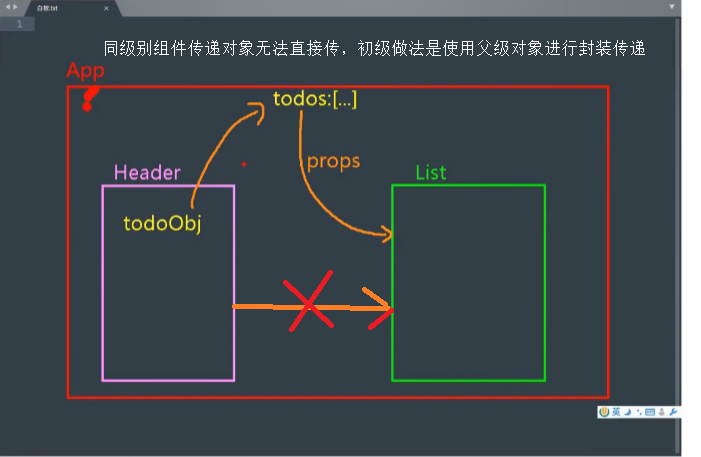

# 第3章 使用Vue脚手架  
## 3.1 初始化脚手架  
### 3.1.1 说明
- Vue脚手架是Vue官方提供的标准化开发工具（开发平台）  
- 最新版本是5.x  用最新版的更好
- 文档 https://cli.vuejs.org/zh/  
### 3.1.2 安装步骤  
第一步:全局安装@vue/cli。CLI(command line interface 命令行接口工具，叫脚手架)  
npm install -g @vue/cli  
安装后会多了vue命令。-g是全局安装，无法全局安装，去掉-g。  
第二步:切换到你创建项目的目录，然后使用命令创建项目  
vue create xxx  
npm config list 可以查看安装目录，全局安装的查看prefix，非全局安装找到目录node_modules/.bin/中有vue命令  
设置全局变量：在path中添加安装目录的\node_modules\.bin，路径中不写vue.cmd
国内镜像：npm config set registry  https://registry.npm.taobao.org  
Vue脚手架隐藏了所有的webpack相关配置，若想查看具体的webpark配置，请执行 vue inspect >output.js  

### 3.1.3 脚手架分析 
- babel.config.js 用于解析ES6的语法到ES5  
- package.json项目的配置信息等，scripts中的serve用于运行项目，build用于构建生成html、js、css文件可以直接复制到前后端不分离的项目中运行。lint用于语法检测。  
- package-lock文件用于锁定运行版本，比如compat-data的babel版本  
- src项目目录  
- assets资源目录  
- components组件目录，写vue文件  
- App.vue入口组件  
- main.js入口js  
- public公共资源路径  
- favicon.ico网站图标  
- index.html首页，页面中需要引入public资源，使用<%= BASE_URL %>即可  
### 3.1.4 render函数  
用脚手架开发vue,不能在vue实例中使用template属性，因为脚手架是运行版本的vue，不是完整的vue，去掉了模板解析器。所以需要使用render函数。  
render写法:  
脚手架生成  
```
render: h => h(App)
```
正常写法:参数是createElement，是个函数，用于创建页面元素，或者Vue组件  
```
render(createElement){
    return createElement('h1','你好呀');
} 
```
再简写:
```
render:createElement=>{
    return createElement('h1','你好呀');
}*/
```
再简写:
```
render:createElement=>createElement('h1','你好呀')
```
完整版的vue的模板解析器占用了三分之一内容，模板解析器在运行时不需要，所以有不同的vue版本。  
### 3.1.5 脚手架默认配置
脚手架将一些默认配置隐藏了，如需查看可使用vue inspect >output.js查看，只能查看修改不行。如需修改需要借助vue.config.js进行修改。  
配置项说明:https://cli.vuejs.org/zh/config/  
比如不使用main.js启动，资源路径，首页等。  
一个单词的首字母大写，运行时会报语法错误。  
Component name "school" should always be multi-word  vue/multi-word-component-names  
解决办法：  

- 将单个单词文件名命名为驼峰命名。
- 关闭语法检测，vue.config.js中加入如下代码。
```vue
module.exports = {
  lintOnSave: false
}
```
## 3.2 ref与props

### 3.2.1 ref属性

ref属性用于获取页面元素，使用在组件时获取的是组件对象。  
语法：在标签中使用ref="获取元素时的名字"，作用类似于id，vue组件中通过 this.$refs.名字  来获取dom元素或者组件实例对象。  

### 3.2.2 props配置
vc对象的props用于接收组件传递的值。  
用法：在父组件引入子组件时，子组件配置，<组件名 属性名="属性值"></组件名>,然后再子组件中写入props:['属性名'],默认都是String类型，需要数字类型属性名前面加冒号（表达式形式）  
demo  

```
<School msg="propo属性传值2" :num="18"/>
export default {
        name: 'School',
        data(){
            return {
                name:'Vue学校',
                adress:'银河路2号'
            }
        },
        props:['msg']//简单接收
    }
```
使用对象形式，进行接收类型提示,这种方式依然可以接收，但是控制台会提示接收的类型不匹配。
```
<School msg="propo属性传值2" :num="18"/>
export default {
        name: 'School',
        data(){
            return {
                name:'Vue学校',
                adress:'银河路2号'
            }
        },
        props:{
            msg:String,
            num:Number
        }
    }
```
更严格的方式。type是类型，required表示必须，default是不传时的默认值一般不与required一起使用。同样没传时，只是控制台报错误。
```javascript
<School msg="propo属性传值2" :num="18"/>
export default {
        name: 'School',
        data(){
            return {
                name:'Vue学校',
                adress:'银河路2号'
            }
        },
        props:{
            msg:{
                type:String,
                required:true
            },
            num:{
                type:Number,
                required:false,
                default:99
            }
        }
    }
```
注意事项：
- props传入的值尽量不要修改，控制台会报错，修改也是生效的。 
- 如果data中的属性与props名字冲突，props的会替换data中的属性。
- 如果需要修改值，将props传入的赋值到data中新属性。方式： data属性名:this.props的属性名 进行接收。
- props传递过来的值，如果不显示接收，数据再vc对象的$attr属性中，如果显示接收了（props属性接收了），属性就出现在vc对象上，$attr的就移除了。
## 3.3 mixins混入
用于解决相同代码的问题，比如两个组件都有相同的属性，有相同的方法，可以提取到新的文件中，使用mixins引入新的文件即可共用了。  
使用方法：在新js文件中定义一个对象，里面写Vue的内容，使用export暴露给外部。  
局部引入：组件，使用import {定义的对象名} from 'js相对路径'，然后再mixins:[定义的对象名]
```javascript
//mixin.js文件中写
export  const mixinObject={
    methods:{
        showName(){
            alert(this.name);
        }
    },
    mounted() {
        alert("挂载成功");
    }
}
export  const mixinData={
    data(){
        return{
            name:'混合',
            msg:'混合信息',
            count:1
        }
    }
}
//需要引入的写
import {mixinObject,mixinData} from '../mixin.js';
export default {
    name: 'School',
    data(){
        return {
            name:'Vue学校',
            adress:'银河路2号'
        }
    },
    mounted() {
        alert("组件挂载成功");
    },
    props:['msg'],
    mixins:[mixinObject,mixinData]
}
```
全局引入：在VM对象上引入。Vue.mixin一个一个加入
```javascript
import {mixinObject,mixinData} from './mixin.js';
Vue.mixin(mixinObject);
Vue.mixin(mixinData);
new Vue({
    render: h => h(App)
}).$mount('#app')
```
注意事项：  
- 如果混合中有的属性与组件的相同，以你组件的为准。优先级，混合<组件<props。
- 如果是mounted生命周期钩子，都要执行，不以谁的为主，先执行混入的，再执行组件的。
## 3.4 插件

### 3.4.1 vue中插件使用

vue中插件是合法的，可以增强功能。  
定义插件

```javascript
const pluginsObj={
    install(Vue){
        //插件内容
    }
}
```
使用插件   
```javascript
import pluginsObj from './plugins.js';
Vue.use(pluginsObj);
```
demo
```javascript
//plugins.js中写
const pluginsObj={
    install(Vue){
        //参数是Vue构造函数，不是实例对象
        console.log("插件使用",Vue);
        //添加过滤器
        Vue.filter('mySlice',function(value){});
        //添加自定义指令
        Vue.directive('fbind',{});
        //添加混入
        Vue.mixin({});
        //添加原型属性,vc和vm都能使用
        Vue.prototype.hellow  = ()=>{alert("添加原型属性")};
    }
}
export default pluginsObj;
//main.js添加
import pluginsObj from './plugins.js';
Vue.use(pluginsObj);
```
插件使用允许带参数，在调用Vue.use时，传入参数，install时可以接收到传入参数。  
Vue.use(插件名，参数1，参数2，参数3)  
### 3.4.2 style的scoped属性
vue组件文件中，style的样式命名可能会冲突，为了解决冲突，只在当前组件生效，在style标签上加上scoped表示只在当前组件生效。  
子组件引用的也不会生效，实现的原理是在引入的元素上加上对应标签data-v-随机数。  
style标签中还可以写 lang="css"  或 lang="less" vue脚手架不支持less,需要npm安装less-loader 版本也有要求。  
style默认是lang="css"，不能不写，lang=""这样会报错。

## 3.5 总结ItemList案列

### 3.5.1组件化流程与通信

1、组件化编码流程：

​	（1）拆分静态组件：组件按照功能点进行拆分，命令不要与html元素重名。

​	（2）实现动态组件：考虑好数据存放的位置，数据是一个组件在用，还是一些组件在用。

​				1）：一个组件在用，放在自身即可

​				2）：一些组件在用，放在他们共同的父类组件中（这个叫状态提升）

2、props适用于：

​	（1）父组件==>子组件 通信

​	（2）子组件==>父组件通信（需要父组件先提供子组件一个函数）

3、使用v-model，不能是props传递过来的，因为props本身是不可修改的。

4、props传递过来的是对象值，修改对象值不会报错，但是不推荐这样使用，因为vue无法监听传递的对象属性值修改。



### 3.5.2 webStorage本地存储

1、存储内容大小一般支持5MB左右（不同浏览器可能还不一样）

2、浏览器端通过Window.sessionStorage和Window.localStorage属性实现本地存储机制。

3、相关API

​	（1）xxxxStorage.setItem('key','value')该方法接受一个键和值作为参数，会把键值对添加到存储中，如果键存在，则更新对应值，都是字符串。

​	（2）xxxxStorage.getItem('key')该方法接受一个键名作为参数，返回键名对应的值，没有值则返回null。

​	（3）xxxxStorage.removeItem('key')该方法接受一个键名作为参数，并把该键名从存储中删除。

​	（4）xxxxStorage.clear()该方法会清空存储中的所有数据。

4、备注

- sessionStorage存储的内容会随着浏览器关闭而消失。

- localStorage存储的内容，需要手动清楚才会失效。

- xxxxStorage.getItem('key')如果对应的value获取不到，返回值是null。

- JSON.parse(null)的结果依然是null。

  Demo

  ```
  <!DOCTYPE html>
  <html lang="en">
  <head>
      <meta charset="UTF-8">
      <title>localstorage</title>
  </head>
  <body>
  <h2>localstorage</h2>
  <button onclick="saveData()">保存数据到本地浏览器</button>
  <button onclick="getData()">读取一条本地浏览器</button>
  <button onclick="deleteData()">删除一条本地浏览器</button>
  <button onclick="clearData()">清空所有本地浏览器</button>
  </body>
  <script>
      function  saveData(){
          let person = {name:'张三',age:18};
          //存储都是string字符串，如果是对象，会调用toString方法
          localStorage.setItem("保存数据到本地浏览器","value值");
          localStorage.setItem("数据2","值2");
          localStorage.setItem("person",JSON.stringify(person));
      }
      function  getData(){
  
          let value = localStorage.getItem("保存数据到本地浏览器");
          alert(value);
          let person1 = localStorage.getItem("person1");
          alert("获取的数据为空："+person1);
          alert("json转空："+JSON.parse(person1));
          let person = localStorage.getItem("person");
          alert("person："+JSON.parse(person));
      }
      function  deleteData(){
          localStorage.removeItem("保存数据到本地浏览器");
      }
      function  clearData(){
          localStorage.clear();
      }
  </script>
  </html>
  ```

## 3.6 自定义事件

1、一种组件间通信的方式，适用于：子组件===>父组件

2、使用场景：A是父组件，B是子组件，B想给A传数据，那么就要在A中给B绑定自定义事件（事件的回调在A中）

3、绑定自定义事件

​		1）、在父组件中使用@自定义事件名或v-on:自定义事件名，`<Demo @atguigu="test" />` 或 `<Demo v-on:atguigu="test" />`

​		2）、在父组件中使用  ref="组件实例名" (在标签中使用ref="获取元素时的名字"，作用类似于id，vue组件中通过 this.$refs.名字  来获取dom元素或者组件实例对象)

```
<Student ref= "组件实例名" />
...
mounted(){
  /*this.$refs.组件实例名.$on('自定义事件名',回调);
  this.$refs.组件实例名.$once('自定义事件名',回调);*/
}
```

若想让自定义事件只触发一次，可以使用once修饰符，或$once方法。

4、触发自定义事件：this.$emit('自定义事件名',参数);参数可以有多个，往后追加

5、解绑自定义事件：this.$off('自定义事件名');

6、组件上可以绑定原生DOM事件，需要使用native修饰符。否则组件认为时自定义事件

```
<Student @click.native= "干什么" />
```

7、注意this.$refs.xxx.$on('事件名',回调);绑定自定义事件时，回调要么配置在methods中，要么用箭头函数，否则this指向会出问题。

8、组件实例销毁后，自定义事件销毁，原生dom事件还在。这里可以体现。

## 3.7 全局事件总线（GlobalEventBus）

1、一种组件间通信的方式，适用于任意组件间。

2、安装全局总线，在Vue初始化创建好了对象，但是还未解析模板前绑定到原型上，一般用$bus表示，这样所有的Vue实例和VC实例都能看到$bus，同时$bus还有vue的绑定事件的功能。

```
new Vue({
  render: h => h(App),
  beforeCreate(){
    Vue.prototype.$bus = this;
  }
}).$mount('#app')
```

3、使用全局事件总线

​	1）接收数据，在挂在mounted后使用用on绑定，组件销毁时记得解绑事件，因为全局事件总线不会随VC实例销毁而销毁i。

```
export default {
    name: 'School',
    props:['getSchoolName'],
    data(){
        return {
            name:'Vue学校',
            adress:'银河路2号',
            studentName:''
        }
    },
  mounted() {
      this.$bus.$on('compentEvent',(studentName)=>{
        this.studentName = studentName;
    })
  },
  beforeDestroy() {
    this.$bus.$off('compentEvent');
  }
}
```

​	2）发送数据，在方法调用时，使用this.$bus.$emit发送数据。

```
export default {
    name: 'Student',
    data(){
        return {
            name:'张三',
            age:18
        }
    },
    methods:{
      showSendName(){
        this.$bus.$emit('compentEvent',this.name);
      }
    }
}
```

## 3.8 消息订阅与发布

### 3.8.1 pubsub消息订阅与发布

1、一种组件间通信的方式，适用于任意组件间。

2、安装消息订阅与发布库，这里安装pubsub-js 库： npm i pubsub-js 

​      需要使用的组件引入import pubsub from 'pubsub-js';

3、接收数据，在VC实例销毁时去掉订阅。msgName可以使用下划线占位

```
import pubsub from 'pubsub-js';
export default {
    name: 'School',
    props:['getSchoolName'],
    data(){
        return {
            name:'Vue学校',
            adress:'银河路2号',
            studentName:''
        }
    },
  mounted() {
    this.pubid = pubsub.subscribe('student',(msgName,studentName)=>{
      this.studentName = studentName;
    });
  },
  beforeDestroy() {
    pubsub.unsubscribe( this.pubid);
  }
}
```

4、发送数据

```
import pubsub from 'pubsub-js';
export default {
    name: 'Student',
    data(){
        return {
            name:'张三',
            age:18
        }
    },
    methods:{
      showSendName(){
        pubsub.publish('student',this.name);
      }
    }
}
```

this.$set(对象，'添加属性的属性名'，属性值)

对象.hasOwnProperty('属性名')用于判断有没有这个属性。

### 3.8.2 nextTick

1、语法：this.$nextTick(回调函数)

2、作用：下一次Dom更新结束后执行其指定的回调函数。

3、什么时候用：当数据改变后，要基于更新后的DOM进行某些操作时，要在nextTick所指定的回调函数中执行。

this.$nextTick(function(){})下一轮，会在指定的dom更新完成后执行，所以获取焦点，可以使用这个。

```
import pubsub from 'pubsub-js';
export default {
    name: 'Student',
    data(){
        return {
            name:'张三',
            age:18
        }
    },
    methods:{
      showSendName(){
        pubsub.publish('student',this.name);
        this.$nextTick(function(){
        	this.$refs.inputTitile.focus();//dom更新后获取焦点，vue是先执行代码再更新dom，所以需要用$nextTick来操作更新后的dom.
        })
      }
    }
}
```

## 3.9 过度与动画

### 3.9.1自定义实现动画效果

使用@keyframes定义一个动画，然后样式中添加动画，改变class样式实现动画效果。通过Vue管理的组件重新解析DOM动画会消失，没有了。而且第二个动画点击第一次有效，第二次就失效了。reverse取反的操作也是看起来没起效果。

```vue
<template>
    <div>
        <button   @click="changClass()">显示/隐藏</button>
        <h2 v-show="isShow" :class="h2Class">你好啊</h2>
        <h2 :class="h2Class2">第二个动画</h2>
    </div>
</template>

<script>
    export default {
        data(){
            return {
               isShow:true,
               h2Class:"come",
               h2Class2:"come"
            }
        },
        methods:{
          //改变样式重新解析dom元素时不会展示，会导致动画消失。
          changClass(){
            this.isShow = !this.isShow;
            if(this.isShow){
              this.h2Class = "come";
              this.h2Class2 = "come";
            }else{
              this.h2Class = "gogo";
              this.h2Class2 = "go";
            }
          }
        }
      }
</script>

<style scoped>
h2{
  background-color: coral;
}
.come{
  animation: moveTo 1s;
}
.go{
  animation: moveTo 6s reverse;/*取反动画只执行一次*/
}
.gogo{
  animation: removeTo 6s;
}
@keyframes moveTo {
  from{
    transform: translateX(-100%);
  }
  to{
    transform: translateX(0px);
  }
}
@keyframes removeTo {
  from{
    transform: translateX(0px);
  }
  to{
    transform: translateX(-100%);
  }
}
</style>
```

### 3.9.2transition

1、Vue中使用transition标签进行动画操作。

2、transition标签内只能使用单元素，即只能有一个根标签元素。

3、transition标签内加上appear 表示初始化的时候就加载，否则初始化的时候不加载。

4、transition的name属性可以用来区分不同的动画，实现不同标签的不同动画。

5、transition如果没有name属性，默认有6个className，分别是.v-enter-active .v-enter .v-enter-to .v-leave-active .v-leave .v-leave-to分别表示进入过程、进入起点、进入终点、离开过程、离开起点、离开终点。如果有name属性，将6个className的V换成name属性名即可。

动画Demo

```vue
<template>
    <div>
        <button   @click="isShow = !isShow">显示/隐藏</button>
        <transition>
          <h2 v-show="isShow" >默认动画，初始化时不加载</h2>
        </transition>
      <transition appear>
        <h2 v-show="isShow" >默认动画，初始化时就加载</h2>
      </transition>
      <transition name="mytransition" appear>
        <h2 v-show="isShow" >动画添加名字，初始化时就加载</h2>
      </transition>
    </div>
</template>

<script>
    export default {
        data(){
            return {
               isShow:true
            }
        }
      }
</script>

<style scoped>
h2{
  background-color: coral;
}
.v-enter-active{
  animation: moveTo 1s;
}
.v-leave-active{
  animation: moveTo 1s reverse;
}
.mytransition-enter-active{
  animation: moveTo 4s;
}
.mytransition-leave-active{
  animation: moveTo 6s reverse;
}
@keyframes moveTo {
  from{
    transform: translateX(-100%);
  }
  to{
    transform: translateX(0px);
  }
}
</style>
```

过渡Demo

```
<template>
    <div>
        <button   @click="isShow = !isShow">显示/隐藏</button>
      <transition name="mytransition" appear>
        <h2 v-show="isShow" >动画添加名字，初始化时就加载</h2>
      </transition>
    </div>
</template>

<script>
    export default {
        data(){
            return {
               isShow:true
            }
        }
      }
</script>

<style scoped>
h2{
  background-color: coral;
  transition: 1s linear;
}
/*进入的起点，离开的终点*/
.mytransition-enter,.mytransition-leave-to{
  transform: translateX(-100%);
}
/*进入的终点，离开的七点*/
.mytransition-enter-to,.mytransition-leave{
  transform: translateX(0);
}

/* 离开和进入的过程，可以动画速度添加到这里，也可以添加到h2的样式里。
.mytransition-enter-active，.mytransition-leave-active{
  transition: 1s linear;
}*/

</style>
```

### 3.9.3transition-group

1、有多个元素需要使用同一个动画时，需要使用transition-group

2、transition-group的元素标签必须使用key进行标记，否则无法解析。

Demo

```vue
<template>
    <div>
        <button   @click="isShow = !isShow">显示/隐藏</button>
      <transition-group name="mytransition" appear>
        <h2 v-show="isShow"  key="1" >第一个好h2</h2>
        <h2 v-show="!isShow"  key="2" >第二个好h2</h2>
      </transition-group>
    </div>
</template>

<script>
    export default {
        data(){
            return {
               isShow:true
            }
        }
      }
</script>

<style scoped>
h2{
  background-color: coral;
  transition: 1s linear;
}
/*进入的起点，离开的终点*/
.mytransition-enter,.mytransition-leave-to{
  transform: translateX(-100%);
}
/*进入的终点，离开的七点*/
.mytransition-enter-to,.mytransition-leave{
  transform: translateX(0);
}

/* 离开和进入的过程，可以动画速度添加到这里，也可以添加到h2的样式里。
.mytransition-enter-active，.mytransition-leave-active{
  transition: 1s linear;
}*/

</style>
```

### 3.9.4第三方动画库

1、安装animate.css    npm i animate.css

2、引入样式，只需要import地址即可，import  'animate.css'

3、transition添加样式name,enter-active-class,leave-active-class实现动画。

Demo

```vue
<template>
    <div>
        <button   @click="isShow = !isShow">显示/隐藏</button>
      <transition-group name="animate__animated animate__bounce" appear
        enter-active-class="animate__swing"
        leave-active-class="animate__backOutRight"
      >
        <h2 v-show="isShow"  key="1"> animate动画</h2>
      </transition-group>
    </div>
</template>

<script>
    import 'animate.css'
    export default {
        data(){
            return {
               isShow:true
            }
        }
      }
</script>

<style scoped>
h2{
  background-color: coral;
}
</style>
```

### 3.9.5总结

1、作用：在插入、更新或移除Dom元素时，在合适的时候给元素添加样式名。

2、写法

​		1）准备样式

进入： 第一步v-enter进入起点的样式-->第二步v-enter-active进入过程的样式-->第三步v-enter-to进入终点的样式

离开：第一步v-leave离开的样式-->第二步v-leave-active离开过程的样式-->第三步v-leave-to离开终点的样式

​		2）使用transition包裹元素，并配置name属性。

​		3）若有多个元素需要过度，使用transition-group，每个元素要指定key。


```
<link rel="stylesheel" href="<%= BASE_URL %css/xxx.css">
```
