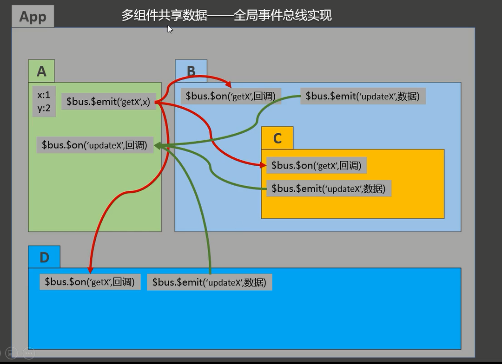
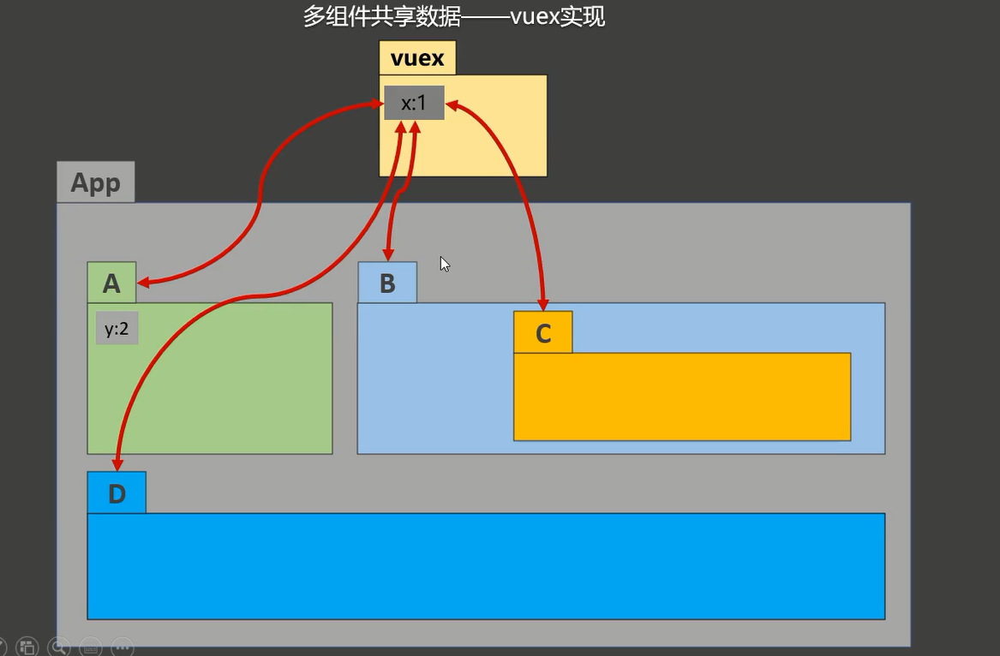
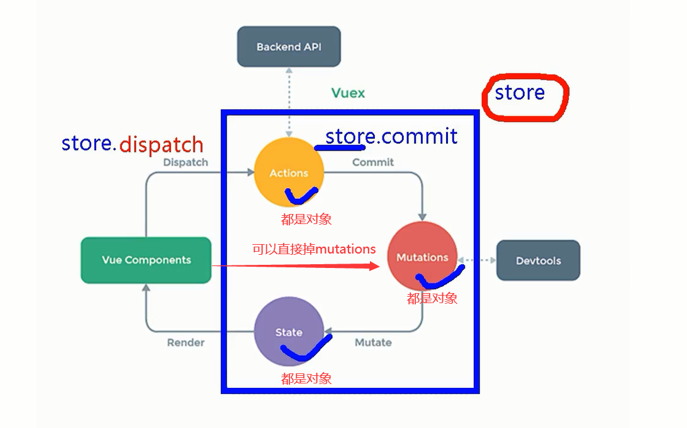
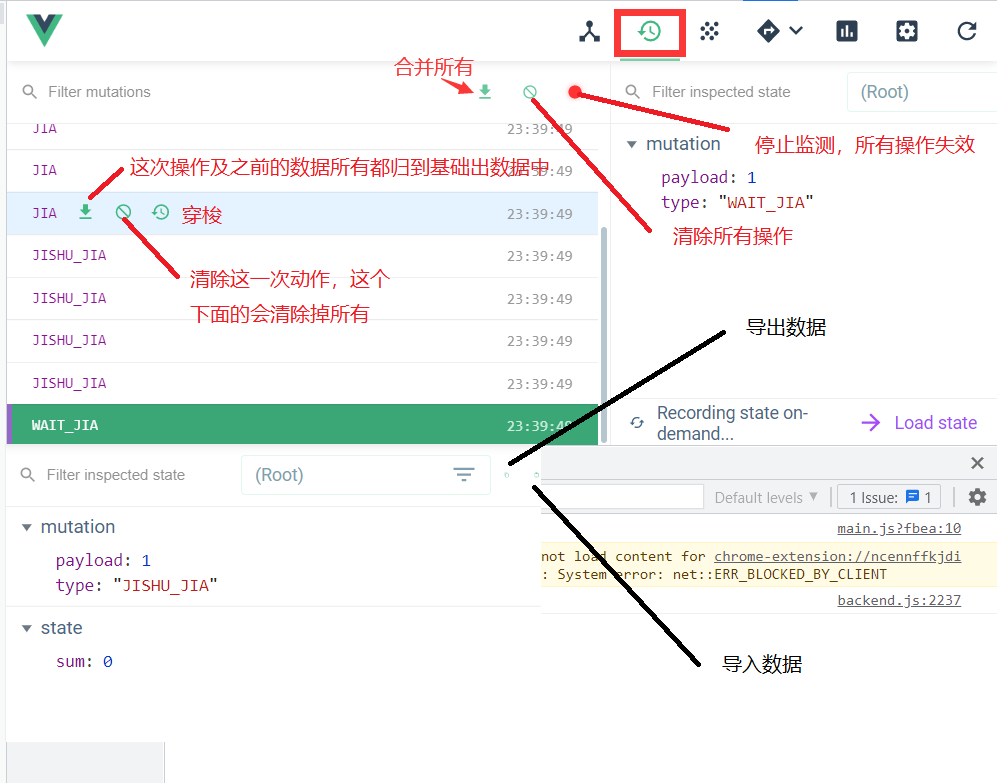
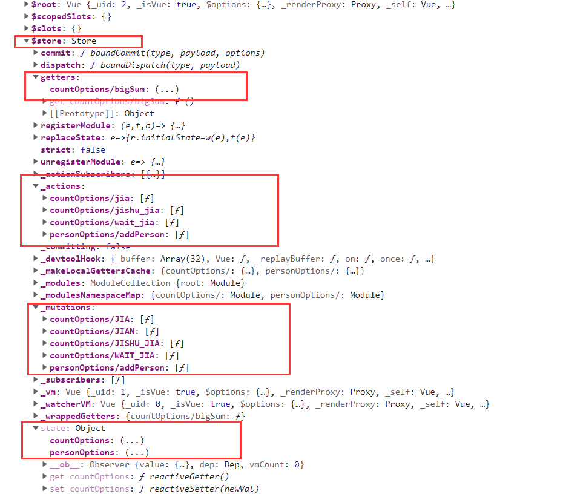

# 第5章：vuex

# 5.1理解vuex

### 5.1.1vuex是什么

1、概念：专门在Vue中实现集中式状态（数据）管理的一个Vue插件，对Vue应用中多个组件的共享状态进行集中式的管理(读/写)，也是一种组件间通信的方法，且适用于任意组件间通信。

2、Github地址：https/github.com/vuejs/vuex





### 5.1.2什么时候使用Vuex

1、多个组件依赖同一状态(数据)

2、来自不同组件的行为需要变更同一状态(数据)

# 5.2vuex核心概念和API

### 5.2.1概念

在vue中实现集中式状态(数据)管理的一个Vue插件，对vue应用中多个组件的共享状态进行集中式的管理(读/写)，也是一种组件间通信的方式，且适用于任意组件间通信。



### 5.2.2何时使用

多个组件需要共享数据时

### 5.2.3搭建vuex环境

npm i vuex安装vuex，如果报错，可以安装指定版本 npm i vuex@3

1、创建src/store/index.js文件

```vue
//创建vuex核心store

import Vue from 'vue';

//引入vuex
import Vuex from 'vuex';

Vue.use(Vuex);
//准备actions-用于响应组件动作
const  actions = {

}
//准备actions-用于操作数据(state)
const  mutations = {

}
//准备actions-用于存储数据
const  state = {

}
//创建store
const store = new Vuex.Store({
    actions,
    mutations,
    state
});
//暴露store
export  default  store;
```

2.在main.js中创建vm时传入store配置项

```Vue
import App from './App.vue'
import store from './store'
import Vue from "vue";
/*去掉生产提示*/
Vue.config.productionTip = false

const  vm = new Vue({
  render: h => h(App),
  store
}).$mount('#app')
console.log(vm);
```

3、注意事项

- 创建store 实例需要先使用Vue.use(Vuex)前，在脚手架中import比js代码先执行，不管你顺序如何放置，脚手架都优先import内容，所以Vue.use(Vuex)需要放在src/store/index.js中。
- 通过 new Vuex.Store({对象})创建store实例。
- 使用了vuex之后，vue对象可以放入store 配置项，如果不先使用vuex插件，则vue实例上没有$store 值。

### 5.2.4vuex开发者工具



### 5.2.5基本使用

1、初始化数据、配置actions、mutations、state

```vue
//创建vuex核心store

import Vue from 'vue';

//引入vuex
import Vuex from 'vuex';

Vue.use(Vuex);

//准备actions-用于响应组件动作
const  actions = {
    jia(context,value){
        context.commit('JIA',value);
    },
    jishu_jia(context,value){
            context.commit('JISHU_JIA',value);

    },
    wait_jia(context,value){
        context.commit('WAIT_JIA',value);
    }
}
//准备actions-用于操作数据(state)
const  mutations = {
    JIA(state,value){
        state.sum += value;
    },
    JIAN(state,value){
        state.sum -= value;
    },
    JISHU_JIA(state,value){
        if(state.sum % 2) {
            state.sum += value;
        }
    },
    WAIT_JIA(state,value){
        setTimeout(()=>{
            state.sum += value;
        },500)

    }
}
//准备actions-用于存储数据
const  state = {
    sum:0
}
//创建store
const store = new Vuex.Store({
    actions,
    mutations,
    state
});
//暴露store
export  default  store;
```

2、组件中读取vuex中的数据：$store.state.sum

3、组件中修改vuex中的数据：$store.dispatch('actions中的方法名'，数据)或者$store.commit('mutations中的方法名'，数据)。

4、注意事项

- 如果没有网络请求或则其他业务逻辑，组件可以直接越过actions调用mutations。
- actions中的函数接收到两个参数一个是context上下文，是一个精简版的store。一个是传递过来的参数。里面可以继续调用dispatch，
- actions中可以继续通过context调用dispatch请求actions中的其他方法，业务逻辑复杂时，有封装的好处。
- actions中调用commit，请求直接发到mutations中。
- mutations中的函数接收两个参数，一个是state的值，一个是参数。

### 5.2.6getters使用

1、概念：当state中的数据需要经过加工后再使用，可以使用getters加工。

2、在store.js或自己定义的store/index.js中追加getters配置

```vue
...
//getters-用于将state中的数据加工
const  getters = {
    bigSum(state){
        return state.sum*10;
    }
}
//准备actions-用于存储数据
const  state = {
    sum:0
}
//创建store
const store = new Vuex.Store({
    actions,
    mutations,
    state,
    getters
});
//暴露store
export  default  store;
```

3、组件中读取数据：$store.getters.bigSum

### 5.2.7四个map方法使用

1、mapState方法：用于帮助我们映射state中数据为计算属性

2、mapGetters方法：用于帮助我们映射getter中数据为计算属性

3、mapActions方法：用于帮助我们映射actions中数据为方法属性,即dispatch方法

4、mapMutations方法：用于帮助我们映射mutations中数据为方法属性，即commit方法

5、注意事项

- mapActions与mapMutations使用时，若需要传递参数，在模板中绑定事件时传递好参数，否则参数时事件对象。
- 四个map的对象写法{需要生成的属性名:对应map中属性名}   两个都是字符串，不能简写，简写会变成sum:sum 就直接找变量sum变量。
- 需要生成的属性名时字符串，但是单引号可以省略

```vue
<!--默认插槽-->
<template>
    <div>
      <h2>当前求为被：{{$store.state.sum}}</h2>
      <h2>当前求和放大10倍：{{$store.getters.bigSum}}</h2>
      <h2>我在{{$store.state.school}}学{{$store.state.subject}}</h2>
      <hr />
      <h2>通过计算属性简化插值语法：</h2>
      <h2>当前求为被：{{qiuhe}}</h2>
      <h2>当前求和放大10倍：{{fangda}}</h2>
      <h2>我在{{xuexiao}}学{{xueke}}</h2>

      <hr />
      <h2>通过mapstate计算：</h2>
      <h2>当前求为被：{{sum}}</h2>
      <h2>当前求和放大10倍：{{bigSum}}</h2>
      <h2>我在{{school}}学{{subject}}</h2>

      <hr />
      <h2>当前求和为：{{$store.state.sum}}</h2>
      <select v-model.number="num">
        <option value="1">1</option>
        <option value="2">2</option>
        <option value="3">3</option>
      </select>
      <button @click="add(num)">+</button>
      <button @click="del(num)">-</button>
      <button @click="jishujia(num)">为奇数加</button>
      <button @click="waijia(num)">等一会加</button>
    </div>
</template>

<script>
  import {mapState,mapGetters,mapMutations,mapActions} from 'vuex';
    export default {
      name: "VuexMapStateAndMapGetter",
      data(){
        return{
          num:1
        }
      },
      methods:{
        /*mapActions对象写法 数据一般可以通过插值语法传递*/
        ...mapActions({add:'jia',jishujia:'jishu_jia',waijia:'wait_jia'}),
        /*mapActions数组写法 数据一般可以通过插值语法传递*/
       /* ...mapActions({'jia','jishu_jia','wait_jia']),*/
        /*mapMutations对象写法 数据一般可以通过插值语法传递*/
        ...mapMutations({del:'JIAN'})
        /*mapMutations数组写法 数据一般可以通过插值语法传递*/
        /* ...mapMutations({'JIAN')*/
      },
      computed:{
        /*自己亲自写计算函数*/
        qiuhe(){
          return this.$store.state.sum;
        },
        fangda(){
          return this.$store.getters.bigSum;
        },
        xuexiao(){
          return this.$store.state.school;
        },
        xueke(){
          return this.$store.state.subject;
        },
        /*mapState对象写法{计算属性名:state中属性名}   两个都是字符串，不能简写，简写会变成sum:sum 就直接找变量，对象的前面属性字符串的单引号可以省略*/
        // ...mapState({sum:'sum',school:'school',subject:'subject'})
        /*数组写法*/
        ...mapState(['sum','school','subject']),

        /*mapGetters对象写法*/
        // ...mapGetters({bigSum:'bigSum'})
        /*mapGetters数组写法*/
        ...mapGetters(['bigSum'])
      }
    }
</script>

<style scoped>
</style>
```

5.2.8modules及namespaced



1、目的：让代码更好维护，让多种数据分类更加明确。

2、修改store.js

```vue
//创建vuex核心store

import Vue from 'vue';

//引入vuex
import Vuex from 'vuex';

Vue.use(Vuex);

//准备actions-用于响应组件动作
const  actions = {
    jia(context,value){
        context.commit('JIA',value);
    },
    jishu_jia(context,value){
            context.commit('JISHU_JIA',value);

    },
    wait_jia(context,value){
        context.commit('WAIT_JIA',value);
    }
}
//准备actions-用于操作数据(state)
const  mutations = {
    JIA(state,value){
        state.sum += value;
    },
    JIAN(state,value){
        state.sum -= value;
    },
    JISHU_JIA(state,value){
        if(state.sum % 2) {
            state.sum += value;
        }
    },
    WAIT_JIA(state,value){
        setTimeout(()=>{
            state.sum += value;
        },500)

    }
}
//getters-用于将state中的数据加工
const  getters = {
    bigSum(state){
        return state.sum*10;
    }
}
//准备actions-用于存储数据
const  state = {
    sum:0,
    school:'银河学校',
    subject:'前端'
}
//创建store
const store = new Vuex.Store({
    actions,
    mutations,
    state,
    getters
});
//暴露store
export  default  store;
```

3、开启命名空间后，组件中读取state数据：

```
方式一：自己直接读取
this.$store.state.personOptions.personList;
方式二：mapState读取
...mapState读取('countOptions',['sum','school','subject']),
```

4、开启命名空间后，组件中读取getters数据：

```
方式一：自己直接读取
this.$store.getters["personOptions/firstPersonName"]
方式二：.mapGetters读取
...mapGetters('countOptions',['bigSum']),
```

5、开启命名空间后，组件中调用dispatch

```
方式一：自己直接读取
this.$store.dispatch('personOptions/addPerson',person);
方式二：mapActions读取
...mapActions('countOptions',['jia','','jishu_jia','wait_jia']),
```

6、开启命名空间后，组件中调用dispatch

```
方式一：自己直接读取
this.$store.commit('personOptions/addPerson',person);
方式二：mapMutations读取
...mapMutations('countOptions',['JIAN']),
```

